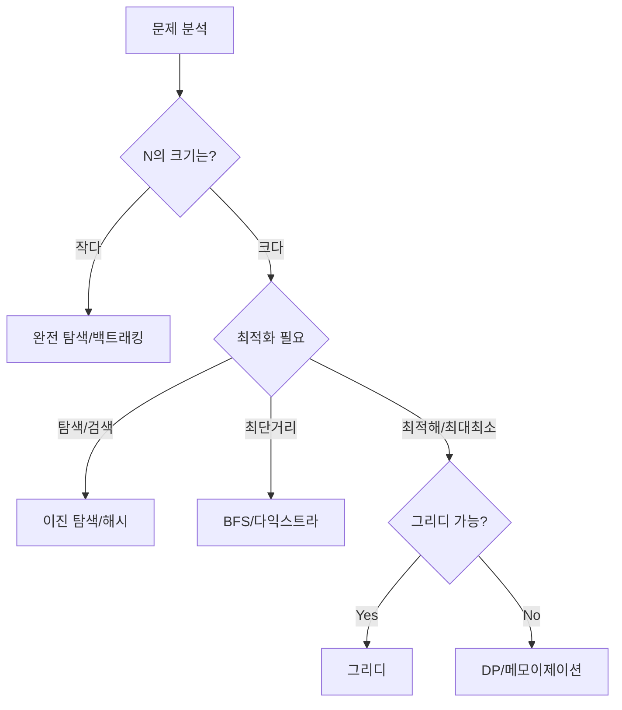

# 💡 알고리즘: “외우지 않고 이해하는” 실전 가이드

> **이 문서의 목표:** 문제를 봤을 때 “어떤 도구(알고리즘/자료구조)를 꺼낼지”를 **판단**할 수 있게 만들기. 단순 암기가 아니라, **왜 이 선택이 맞고, 언제 틀리는지** 이해한다.

---

## 0. 핵심 질문으로 시작하기

1. **왜 알고리즘을 배워야 하는가?** → 한정된 자원(시간, 메모리) 내에서 문제를 효율적으로 해결하는 도구 선택 능력을 기르기 위해.
2. **Big-O 표기법은 왜 중요한가?** → 데이터 규모가 커질 때 성능이 어떻게 변할지(확장성) 예측하는 척도이기 때문.
3. **정렬은 언제 사용하는가?** → 탐색을 빠르게 하거나(이진 탐색), 문제의 복잡도를 낮출 때(그리디, 투 포인터 전제).
4. **그리디(Greedy)는 언제 통하는가?** → "지금의 최선의 선택"이 "전체의 최적해"로 이어짐이 증명될 때.

---

## 1. [개념 정의]: 왜 효율성을 따지는가? (Why)

알고리즘은 **"컴퓨터 자원을 덜 쓰면서 원하는 결과를 얻는 절차"**입니다.
입력 크기(\(N\))가 작을 때는 아무렇게나 짜도 빠르지만, 실무나 코딩 테스트의 대규모 데이터(\(N \ge 10^5\))에서는 알고리즘의 선택이 성공과 실패(Time Limit Exceeded)를 가릅니다.

> [!NOTE]
> **핵심 통찰:** 좋은 개발자는 코드를 빨리 치는 사람이 아니라, 문제의 제약 조건을 보고 **가장 적절한 도구(알고리즘)**를 꺼내는 사람입니다.

---

## 2. [원리/구조]: 도구 선택의 기준 (How)

### 2.1 Big-O (시간 복잡도) 감각
입력 크기 \(N\)에 따라 허용되는 시간 복잡도가 정해집니다. (보통 1초에 1억 번 연산 기준)

| N의 크기 | 허용 시간 복잡도 | 추천 알고리즘 |
| :--- | :--- | :--- |
| **\(N \le 20\)** | \(O(2^N)\), \(O(N!)\) | 완전 탐색(Backtracking), 재귀 |
| **\(N \le 1,000\)** | \(O(N^2)\) | 2중 for문, 간단한 DP |
| **\(N \le 100,000\)** | \(O(N \log N)\) | **정렬**, 힙, 이진 탐색, 고급 DP |
| **\(N \le 1,000,000\)** | \(O(N)\) | 투 포인터, 그리디, 해시, DP |
| **\(N \ge 10억\)** | \(O(\log N)\), \(O(1)\) | 이진 탐색, 수학적 규칙 찾기 |

### 2.2 알고리즘 선택 순서도 (Flowchart)

---

## 3. [실전/구현]: 필수 알고리즘 핵심 요약 (What)

### 3.1 정렬 (Sorting)
*   **목적**: 탐색 전처리, 데이터를 예쁘게 줄 세우기.
*   **핵심**: 언어 내장 정렬(`Arrays.sort`, `Collections.sort`)은 보통 \(O(N \log N)\)을 보장합니다.
*   **활용**: 정렬 후 **이진 탐색**이나 **투 포인터**를 사용하는 패턴이 많습니다.

### 3.2 탐색 (Search)
*   **완전 탐색 (DFS/BFS)**: 모든 경우를 다 봄. \(N\)이 작을 때 필수.
*   **이진 탐색 (Binary Search)**: **정렬된 데이터**에서 범위를 반씩 줄임. \(O(\log N)\).
    *   *Tip:* `lower_bound`, `upper_bound`로 경계값을 찾는 문제가 많음.

### 3.3 동적 계획법 (DP)
*   **원리**: 큰 문제를 작은 문제로 쪼개고, **결과를 저장(Memoization)**해서 중복 계산을 막음.
*   **점화식**: `dp[i] = dp[i-1] + ...` 형태의 관계식을 찾는 것이 핵심.

### 3.4 그래프 (Graph)
*   **최단 거리**:
    *   가중치 없음 → **BFS**
    *   가중치 양수 → **다익스트라 (Dijkstra)**
    *   가중치 음수 → **벨만-포드**
*   **연결성**: **DFS** 또는 **Union-Find**.

### 3.5 실전 문제 풀이 루틴
1.  **입력 제약 확인**: \(N\)을 보고 시간 복잡도 목표 설정.
2.  **단순하게 생각**: 무식하게 풀면(Brute Force) 얼마나 걸릴까?
3.  **최적화 도구 선택**: 시간 초과가 난다면, 정렬? 해시? DP? 중 하나를 선택.
4.  **엣지 케이스**: \(N=0\), \(N=1\), 최대값, 중복 값 처리 확인.

> [!WARNING]
> **흔한 실수:** 
> 1. 그리디가 아닌데 그리디로 풀어서 틀림 (반례 체크 필수).
> 2. `int` 범위를 넘는 합계를 `long`으로 선언하지 않아 오버플로우 발생.

---

## 4. 🎯 1분 요약

1.  **문제 분석**: \(N\)의 크기를 보고 \(O(N)\)인지 \(O(N \log N)\)인지 목표를 정한다.
2.  **도구 매칭**:
    *   경로/탐색 → BFS/DFS
    *   최적해/숫자 → DP/그리디/이진탐색
    *   빠른 룩업 → 해시/Set
3.  **구현**: 엣지 케이스를 조심하며 코드로 옮긴다.

---

## 5. 📝 자가 점검 질문

1.  **이진 탐색을 사용하기 위한 필수 전제 조건은?**
    → 데이터가 **정렬**되어 있어야 한다.
2.  **해시 테이블(Hash Table)의 평균 조회 시간 복잡도는?**
    → \(O(1)\). (충돌이 많으면 최악 \(O(N)\))
3.  **다익스트라 알고리즘을 사용할 수 없는 경우는?**
    → 간선 가중치에 **음수**가 포함된 경우.
4.  **DP와 분할 정복(Divide and Conquer)의 차이점은?**
    → DP는 부분 문제의 **중복**을 활용(저장)하지만, 분할 정복은 문제를 독립적으로 나눈다.
5.  **스택(Stack)과 큐(Queue)의 주요 동작 차이는?**
    → 스택은 LIFO(Last-In First-Out, 후입선출), 큐는 FIFO(First-In First-Out, 선입선출).
