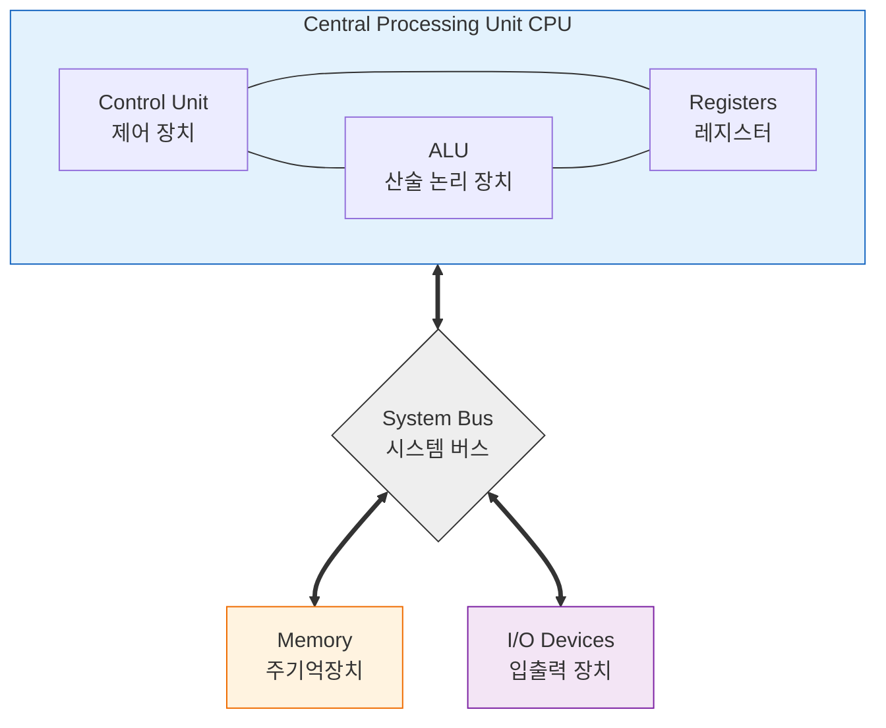
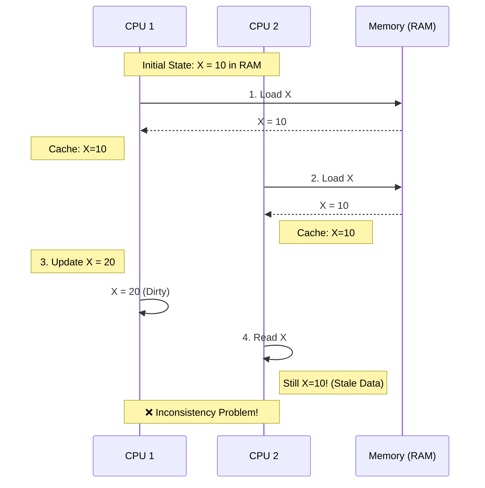
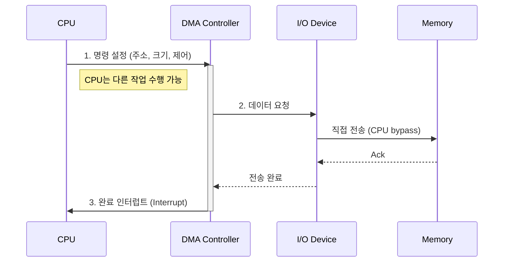

# 💻 컴퓨터 아키텍처: 왜 내 코드가 느릴까?

## 🚀 실제로 겪어본 성능 문제들

### 개발자들이 흔히 하는 고민:

**"왜 내 서버가 느릴까?"**
- CPU 사용률 10%인데 왜 응답이 느리지?
- 메모리 32GB 쓰는데 왜 OutOfMemory 날까?
- 디스크 I/O가 병목인데 왜 SSD 썼는데도 느리지?

**"캐시가 뭐길래 중요한가?"**
- 데이터베이스 쿼리가 느린데 인덱스만 만들면 될까?
- Redis를 썼는데 왜 여전히 느리지?
- CPU 캐시 미스가 왜 성능에 이렇게 큰 영향?

**"병렬처리가 왜 안 되지?"**
- 8코어 CPU인데 왜 싱글코어만 쓰는 것 같지?
- 멀티스레딩 코드 짰는데 성능이 안 오르네?
- GPU 컴퓨팅이 왜 게임에서만 중요하지?

## 🎯 1분 요약: 왜 컴퓨터 아키텍처를 알아야 하나?

**하드웨어 = 소프트웨어의 한계**

- **CPU**: 연산의 속도 제한
- **메모리**: 데이터 접근의 병목
- **캐시**: 성능의 90% 결정
- **I/O**: 외부 장치와의 속도 차이

> **결론:**
> 1. **캐시 최적화**: 메모리 접근 패턴이 성능 좌우
> 2. **병렬 처리**: CPU 코어 수에 맞게 설계
> 3. **I/O 최적화**: 디스크와 네트워크 병목 해결
> 4. **메모리 계층**: 각 레벨의 특징 이해

---

## 1. 🧭 빠른 병목 지도 (증상 → 아키텍처 관점)

아래는 실무에서 자주 겪는 “느림”을 **아키텍처 관점으로 번역**한 것입니다.

| 증상(관찰) | 아키텍처 관점에서의 후보 원인 | 다음에 볼 것 |
|---|---|---|
| CPU 사용률이 낮은데 응답이 느림 | I/O 대기, 락 경합, 네트워크 대기, 컨텍스트 스위칭 | I/O 지표, 스레드 덤프, 큐 길이 |
| CPU 사용률은 높은데 처리량이 안 나옴 | 캐시 미스, 분기 예측 실패, 메모리 대역폭 병목 | 캐시 미스율, IPC, branch-misses |
| “루프/배열 처리”가 유난히 느림 | 접근 패턴이 지역성에 불리, false sharing | 순차 접근/블로킹, 캐시 라인 정렬 |
| 멀티코어인데 스케일이 안 됨 | 공유 상태/락, false sharing, NUMA, 병렬화 오버헤드 | 락 프로파일링, NUMA 배치 |

> 핵심은 “CPU가 바빠서 느린지”가 아니라, **CPU가 무엇을 기다리는지**를 구분하는 것입니다.

---

## 2. 📚 컴퓨터가 프로그램을 실행하는 원리

### 2.1 왜 컴퓨터는 이렇게 설계되었을까?

**폰 노이만 아키텍처 = 컴퓨터의 기본 설계도**

**💡 핵심 개념:**
- **저장 프로그램**: 프로그램을 메모리에 저장해두고 하나씩 실행
- **공통 버스**: CPU ↔ 메모리 ↔ 디스크 모두 같은 길로 연결

**실제 영향:**
- **메모리와 프로그램이 같은 버스 사용** → 메모리 접근이 CPU 성능의 병목
- **순차적 실행** → 병렬 처리가 어려움
- **범용성** → 어떤 프로그램이든 실행 가능



### 2.2 하버드 아키텍처 (Harvard Architecture)

**특징:**
- 명령어와 데이터를 분리된 메모리에 저장
- DSP, GPU 등 특수 목적 프로세서에서 사용
- 명령어와 데이터 버스가 분리되어 동시 접근 가능

---

## 3. CPU 아키텍처와 명령어 처리

### 3.1 CPU의 구성 요소

#### 3.1.1 산술 논리 장치 (ALU - Arithmetic Logic Unit)
```python
class ALU:
    def execute(self, operation, operand1, operand2):
        # Conceptual ALU operations (not CPU-accurate).
        op = operation.upper()

        if op == "ADD":
            return operand1 + operand2
        if op == "SUB":
            return operand1 - operand2
        if op == "MUL":
            return operand1 * operand2
        if op == "DIV":
            if operand2 == 0:
                raise ZeroDivisionError("DIV by zero")
            return operand1 // operand2

        if op == "AND":
            return operand1 & operand2
        if op == "OR":
            return operand1 | operand2
        if op == "XOR":
            return operand1 ^ operand2

        if op == "SHL":
            return operand1 << operand2
        if op == "SHR":
            return operand1 >> operand2

        raise ValueError(f"Unsupported operation: {operation}")
```

#### 3.1.2 제어 장치 (Control Unit)
- **명령어 해석:** 기계어를 해석하여 제어 신호 생성
- **프로그램 카운터:** 다음 실행할 명령어 주소 관리
- **명령어 레지스터:** 현재 실행 중인 명령어 저장

#### 3.1.3 레지스터 (Registers)
**범용 레지스터:**
- **AX, BX, CX, DX** (x86 아키텍처)
- 데이터 임시 저장과 연산에 사용

**특수 목적 레지스터:**
- **PC (Program Counter):** 다음 명령어 주소
- **SP (Stack Pointer):** 스택 최상단 주소
- **IR (Instruction Register):** 현재 명령어 저장

### 3.2 명령어 집합 아키텍처 (ISA)

#### 3.2.1 CISC vs RISC

| 측면 | CISC (Complex Instruction Set Computer) | RISC (Reduced Instruction Set Computer) |
| --- | --- | --- | --- |
| **명령어 수** | 많음 (200-300개) | 적음 (약 100개) |
| **명령어 길이** | 가변 길이 | 고정 길이 |
| **클럭 사이클** | 가변 (1-20 사이클) | 고정 (1-2 사이클) |
| **메모리 접근** | 복잡한 모드 | 단순한 모드 |
| **예시** | x86 (Intel, AMD) | ARM, MIPS, RISC-V |

**RISC의 장점:**

```mermaid
gantt
    title RISC Pipeline Efficiency
    dateFormat  s
    axisFormat %s
    
    section Pipeline
    LOAD (Mem->R1)  :done, a1, 0, 1s
    ADD (R1+R4->R3) :done, a2, after a1, 1s
    STORE (R3->Mem) :done, a3, after a2, 1s
```


### 3.3 명령어 실행 사이클

#### 3.3.1 기본 명령어 사이클
```
1. Fetch: 메모리에서 명령어 가져오기
2. Decode: 명령어 해석
3. Execute: 명령어 실행
4. Memory: 메모리 접근 (필요시)
5. Write-back: 결과 저장
```

#### 3.3.2 파이프라이닝 (Pipelining)

**병렬 처리 기법:**

```mermaid
gantt
    title 5-Stage Pipeline Execution
    dateFormat  s
    axisFormat %s

    section Instruction 1
    Fetch       :a1, 0, 1s
    Decode      :a2, after a1, 1s
    Execute     :a3, after a2, 1s
    Memory      :a4, after a3, 1s
    Write-back  :a5, after a4, 1s

    section Instruction 2
    Fetch       :b1, after a1, 1s
    Decode      :b2, after b1, 1s
    Execute     :b3, after b2, 1s
    Memory      :b4, after b3, 1s
    Write-back  :b5, after b4, 1s

    section Instruction 3
    Fetch       :c1, after b1, 1s
    Decode      :c2, after c1, 1s
    Execute     :c3, after c2, 1s
    Memory      :c4, after c3, 1s
    Write-back  :c5, after c4, 1s
```


**파이프라인 해저드 (Hazards):**
- **데이터 해저드:** 명령어 간 데이터 의존성
- **제어 해저드:** 분기 명령어로 인한 파이프라인 플러시
- **구조적 해저드:** 하드웨어 자원 충돌

---

## 4. 🧠 메모리 계층: 왜 빠른 메모리가 중요할까?

### 4.1 메모리 속도 차이가 실제 성능에 미치는 영향

**🚨 충격적인 사실:**
- **CPU 레지스터**: 1나노초 (1ns)
- **메인 메모리**: 100나노초 (100ns) → **100배 느림!**
- **SSD**: 100마이크로초 (100μs) → **10만배 느림!**
- **HDD**: 10밀리초 (10ms) → **1천만배 느림!**

**💡 실제 영향:**
```java
// 캐시 히트: 1ns
int fast = registerValue;

// 캐시 미스: 100ns (100배 느림!)
int slow = mainMemory[1000000];

// 디스크 접근: 10ms (1천만배 느림!)
int verySlow = loadFromDisk();
```

**개발자 관점:**
- **캐시 히트율 99%**: 초고속
- **캐시 히트율 90%**: 10배 느림
- **캐시 히트율 50%**: 100배 느림

### 4.2 캐시 최적화: 코드 성능의 90%

#### 4.2.1 지역성의 원칙 (실제 코드로 이해하기)

**시간 지역성: "방금 쓴 데이터는 다시 쓸 가능성이 높다"**
```java
// 좋은 예: 같은 데이터 반복 사용
int sum = 0;
for (int i = 0; i < 1000000; i++) {
    sum += array[i];  // sum은 캐시에 계속 남아있음
}
```

**공간 지역성: "옆에 있는 데이터도 곧 쓸 가능성이 높다"**
```java
// 좋은 예: 순차적 접근
for (int i = 0; i < 1000; i++) {
    sum += array[i];  // 다음 array[i+1]은 이미 캐시에 로드됨
}

// 나쁜 예: 랜덤 접근 (캐시 미스!)
for (int i = 0; i < 1000; i++) {
    int randomIndex = (int)(Math.random() * 1000000);
    sum += array[randomIndex];  // 캐시 미스 빈번!
}
```

#### 4.2.2 캐시 매핑 방식

**직접 매핑 (Direct Mapping):**
```
메모리 주소 → 캐시 인덱스 계산
캐시 라인 수 = 2^k 이면, 주소 % 2^k = 캐시 인덱스
```

**연관 매핑 (Associative Mapping):**
```
메모리 주소 → 태그 비교로 캐시 검색
모든 캐시 라인에 대해 태그 비교 (느리지만 유연)
```

**세트 연관 매핑 (Set-Associative Mapping):**
```
직접 매핑 + 연관 매핑의 하이브리드
각 세트 내에서 연관 검색
```

### 4.3 캐시 일관성 (Cache Coherence)

**멀티코어 시스템에서의 문제:**


**해결책:**
- **MESI 프로토콜:** Modified, Exclusive, Shared, Invalid 상태
- **스누핑:** 다른 캐시의 변경사항 모니터링

---

## 5. 병렬 처리 아키텍처

### 5.1 Flynn의 분류

#### 5.1.1 SISD (Single Instruction, Single Data)
- 단일 명령어가 단일 데이터에 적용
- 전통적인 순차 컴퓨터

#### 5.1.2 SIMD (Single Instruction, Multiple Data)
- 단일 명령어가 다수의 데이터에 적용
- 벡터 프로세서, GPU

```c
// SIMD 예시 (Intel AVX)
#include <immintrin.h>

void vector_add(float *a, float *b, float *result, int n) {
    for (int i = 0; i < n; i += 8) {
        __m256 va = _mm256_load_ps(&a[i]);
        __m256 vb = _mm256_load_ps(&b[i]);
        __m256 vc = _mm256_add_ps(va, vb);
        _mm256_store_ps(&result[i], vc);
    }
}
```

#### 5.1.3 MISD (Multiple Instruction, Single Data)
- 여러 명령어가 단일 데이터에 적용
- 이론적으로는 존재하지만 실제로는 드묾

#### 5.1.4 MIMD (Multiple Instruction, Multiple Data)
- 여러 명령어가 여러 데이터에 적용
- 멀티코어 CPU, 클러스터 컴퓨터

### 5.2 현대 프로세서의 병렬화 기법

#### 5.2.1 슈퍼스칼라 (Superscalar)
- 한 클럭에 여러 명령어 실행
- 인텔 Pentium부터 도입

#### 5.2.2 아웃-오브-오더 실행 (Out-of-Order Execution)
```mermaid
graph TD
    subgraph Original [Original Sequence (Stall 발생)]
        O1[1. LOAD R1, addr]
        O2[2. ADD R2, R3, R4]
        O3[3. MUL R5, R6, R7]
        
        O1 -- "Waiting Memory..." --> O2
        O2 -- "Blocked by 1?" --> O3
    end

    subgraph Reordered [Reordered (효율적)]
        R2[2. ADD R2, R3, R4]
        R3[3. MUL R5, R6, R7]
        R1[1. LOAD R1, addr]
        
        R2 -- "Execute Immediately" --> R3
        R3 -- "Execute Immediately" --> R1
        R1 -- "Complete later" --> Done((Done))
    end

    style Original fill:#ffebee,stroke:#c62828
    style Reordered fill:#e8f5e9,stroke:#2e7d32
```

#### 5.2.3 분기 예측 (Branch Prediction)
**분기 명령어의 성능 영향:**
```text
[분기 예측의 중요성]

if (condition) {     // 분기 명령어
    do_something();
} else {
    do_other();
}

실행: 조건 평가 → 예측 → 실행 → 검증 → 수정 (필요시)
```

**분기 예측 기법:**
- **정적 예측:** 항상 taken 또는 not taken 가정
- **동적 예측:** 과거 패턴 기반 예측 (2비트 카운터)

---

## 6. I/O 시스템과 인터럽트

### 6.1 I/O 장치와 CPU의 연결

#### 6.1.1 폴링 (Polling)
```c
// 폴링 방식 I/O
while (1) {
    if (keyboard_has_data()) {
        char c = read_keyboard();
        process_character(c);
    }
    // 다른 작업 수행
}
```
**단점:** CPU 낭비, 실시간성 부족

#### 6.1.2 인터럽트 (Interrupt)
```c
// 인터럽트 방식 I/O (개념적)
void keyboard_interrupt_handler() {
    char c = read_keyboard();
    process_character(c);
    // 인터럽트 서비스 루틴 (ISR) 실행
}

// 메인 프로그램
void main() {
    setup_interrupt_handler(KEYBOARD_IRQ, keyboard_interrupt_handler);
    enable_interrupts();

    while (1) {
        do_useful_work();  // CPU가 다른 작업에 집중
    }
}
```

### 6.2 DMA (Direct Memory Access)

**CPU 개입 없이 메모리 ↔ I/O 장치 간 직접 전송:**


**장점:**
- CPU 부하 감소
- 고속 I/O 가능
- 병렬 처리 지원

---

## 7. 현대 컴퓨터 아키텍처의 트렌드

### 7.1 멀티코어와 하이퍼스레딩

**하이퍼스레딩 (Hyper-Threading):**
- 하나의 물리 코어를 두 개의 논리 코어로 표현
- 컨텍스트 스위칭 비용 없이 병렬 실행

### 7.2 메모리 기술 발전

#### 7.2.1 3D 스태킹 메모리 (3D Stacked Memory)
- 메모리 칩을 수직으로 쌓아 대역폭 증가
- HBM (High Bandwidth Memory) 기술

#### 7.2.2 인텔 옵테인 (Intel Optane)
- DRAM과 NAND의 중간 성능
- 비휘발성 메모리로 시스템 재시작 시 데이터 유지

### 7.3 특수 목적 프로세서

#### 7.3.1 GPU (Graphics Processing Unit)
- 수천 개의 코어로 병렬 연산 특화
- CUDA, OpenCL 프레임워크로 프로그래밍

#### 7.3.2 TPU (Tensor Processing Unit)
- 딥러닝 연산 최적화
- 구글의 머신러닝 가속기

#### 7.3.3 FPGA (Field Programmable Gate Array)
- 프로그래밍 가능한 하드웨어
- ASIC보다 유연하면서 GPU보다 효율적

---

## 8. 소프트웨어 개발자를 위한 아키텍처 이해

### 8.1 메모리 정렬과 캐시 라인

**캐시 라인 크기 고려:**
```c
// 비효율적인 메모리 접근
struct Data {
    char a;    // 1바이트
    int b;     // 4바이트 → 패딩으로 3바이트 낭비
    char c;    // 1바이트
}; // 총 12바이트 (패딩 포함)

// 효율적인 배치
struct OptimizedData {
    int b;     // 4바이트
    char a;    // 1바이트
    char c;    // 1바이트
    char padding[2]; // 명시적 패딩
}; // 총 8바이트
```

### 8.2 분기 예측 최적화

**조건문 최적화:**
```c
// 분기 예측에 불리한 패턴
if (rare_condition) {  // 거의 발생하지 않는 조건
    handle_rare_case(); // CPU 예측 실패로 파이프라인 플러시
}

// 개선된 패턴
bool need_rare_handling = rare_condition;
if (__builtin_expect(need_rare_handling, 0)) {  // 예측 힌트 제공
    handle_rare_case();
}
```

### 8.3 SIMD 활용

**벡터화된 연산:**
```c
// 스칼라 연산 (비효율적)
void add_arrays(float *a, float *b, float *result, int n) {
    for (int i = 0; i < n; i++) {
        result[i] = a[i] + b[i];
    }
}

// 벡터화된 연산 (SIMD)
#include <immintrin.h>
void add_arrays_simd(float *a, float *b, float *result, int n) {
    int i = 0;
    for (; i <= n - 8; i += 8) {  // 8개 float 동시 처리
        __m256 va = _mm256_load_ps(&a[i]);
        __m256 vb = _mm256_load_ps(&b[i]);
        __m256 vc = _mm256_add_ps(va, vb);
        _mm256_store_ps(&result[i], vc);
    }
    // 남은 요소 처리
    for (; i < n; i++) {
        result[i] = a[i] + b[i];
    }
}
```

---

## 9. 디버깅과 성능 분석

### 9.1 프로파일링 도구

**Linux perf:**
```bash
# CPU 캐시 미스 분석
perf stat -e cache-misses,cache-references ./program

# 함수별 성능 분석
perf record -g ./program
perf report
```

**Intel VTune:**
- 캐시 미스율 분석
- 분기 예측 실패율 측정
- 메모리 접근 패턴 분석

### 9.2 아키텍처 의존적 최적화

**CPU 특성 고려:**
```c
// CPU 캐시 라인 크기 고려
#define CACHE_LINE_SIZE 64

struct alignas(CACHE_LINE_SIZE) CacheAlignedData {
    int data;
    // 패딩으로 캐시 라인 크기 맞춤
};

// False sharing 방지
struct ThreadData {
    alignas(CACHE_LINE_SIZE) int counter1;
    alignas(CACHE_LINE_SIZE) int counter2;  // 다른 캐시 라인에 배치
};
```

---

## 10. 미래 전망

### 10.1 양자 컴퓨팅 아키텍처

**전통적 vs 양자 컴퓨터:**
- **클래식:** 비트 기반 결정적 연산
- **양자:** 큐비트 기반 확률적 연산
- **응용:** 암호화, 최적화 문제, 시뮬레이션

### 10.2 뉴로모픽 컴퓨팅

**뇌 영감 아키텍처:**
- 인간 뇌 구조 모방
- 병렬 처리와 적응 학습
- 낮은 전력 소비

### 10.3 광 컴퓨팅

**광자 기반 연산:**
- 전자 대신 빛 사용
- 극한의 병렬 처리 가능
- 전력 효율 극대화

---

## 11. 결론: 왜 아키텍처를 알아야 하는가?

### 11.1 성능 최적화의 기초

**아키텍처 지식의 실용적 가치:**
- **캐시 친화적 코드 작성:** 메모리 계층 이해
- **병렬화 전략 수립:** SIMD, MIMD 활용
- **I/O 병목 해소:** 인터럽트와 DMA 이해

### 11.2 문제 해결 능력 향상

**시스템적 사고:**
- 하드웨어 제약 이해
- 소프트웨어-하드웨어 상호작용 파악
- 성능 병목 원인 분석

### 11.3 미래 기술 적응력

**새로운 패러다임 이해:**
- 새로운 아키텍처의 등장
- 기존 지식의 확장 적용
- 혁신적 솔루션 설계

---

*"컴퓨터 아키텍처는 하드웨어와 소프트웨어의 다리다. 이 다리를 건너지 못하면 진정한 엔지니어가 될 수 없다."*

> 컴퓨터 아키텍처를 이해하면 코드 한 줄이 시스템 전체 성능에 미치는 영향을 알 수 있습니다. 효율적인 소프트웨어는 하드웨어를 존중하는 데서 시작됩니다.