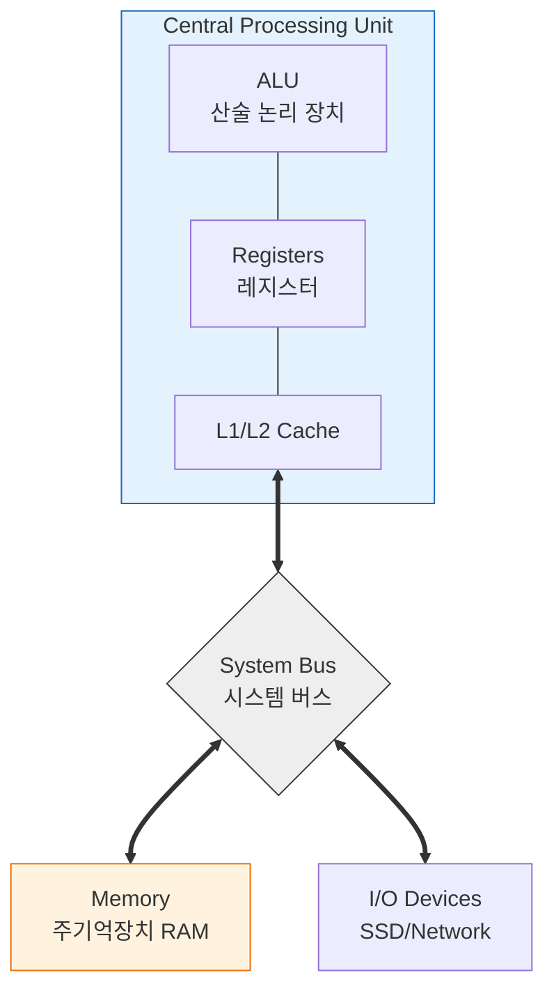

# 💻 컴퓨터 아키텍처: 하드웨어 관점에서 본 성능 최적화

> **이 문서의 목표:** "내 코드가 왜 느릴까?"라는 질문에 대해 하드웨어 관점(CPU, 메모리, 캐시)에서 원인을 분석하고, **하드웨어 친화적인 코드**를 작성하는 방법을 익힌다.

---

## 0. 핵심 질문으로 시작하기

1.  **왜 CPU 사용률이 낮은데도 프로그램이 느릴 수 있는가?** → I/O 대기(Blocking)나 메모리 접근 병목(Cache Miss) 때문일 가능성이 큼.
2.  **캐시(Cache)가 성능에 미치는 영향은 어느 정도인가?** → 메모리 접근 속도 차이가 100배 이상 나므로, 캐시 적중률(Hit Rate)이 성능의 핵심임.
3.  **데이터의 메모리 배치(구조체 등)가 왜 중요한가?** → 공간 지역성(Spatial Locality)을 활용해 캐시 효율을 높여야 하기 때문.
4.  **분기 예측(Branch Prediction) 실패는 왜 비용이 큰가?** → 파이프라인이 비워지고(Flush) 다시 명령어를 가져와야 해서 CPU 사이클을 낭비함.

---

## 1. [개념 정의]: 왜 내 코드는 느린가? (Why)

소프트웨어 개발자가 하드웨어를 알아야 하는 이유는 **소프트웨어의 성능 한계가 결국 하드웨어에서 오기 때문**입니다.

### 1.1 성능 병목의 실제 사례
개발자가 흔히 겪는 "느림"의 원인을 아키텍처 관점에서 보면 다음과 같습니다.

| 증상 (관찰) | 아키텍처 관점의 원인 | 해결 방향 |
| :--- | :--- | :--- |
| **CPU 사용률 낮음 + 응답 느림** | **I/O 병목**: 디스크/네트워크 대기, 컨텍스트 스위칭 과다 | 비동기 I/O, 스레드 풀 조정 |
| **CPU 사용률 높음 + 처리량 낮음** | **캐시 미스**, 분기 예측 실패, 락(Lock) 경합 | 데이터 구조 변경(Locality), 락-프리 알고리즘 |
| **반복문 처리가 유난히 느림** | **False Sharing**, 캐시 라인 정렬 불량 | 패딩(Padding) 추가, 데이터 정렬 최적화 |

> [!NOTE]
> **핵심 통찰:** CPU는 엄청나게 빠르지만, **메모리가 느려서** CPU가 노는 시간이 많습니다. 이를 줄이는 것이 성능 최적화의 핵심입니다.

---

## 2. [원리/구조]: 컴퓨터는 어떻게 일하는가? (How)

### 2.1 폰 노이만 아키텍처와 병목
현대 컴퓨터의 기본 구조입니다. **"CPU와 메모리가 하나의 버스(Bus)를 공유한다"**는 점이 핵심 병목(폰 노이만 병목)을 만듭니다.



### 2.2 메모리 계층 구조 (Memory Hierarchy)
"빠른 것은 비싸고 작다"는 원칙에 따라 계층을 만듭니다.

| 계층 | 접근 속도 (Approx.) | 크기 | 비유 |
| :--- | :--- | :--- | :--- |
| **레지스터** | 1 cycle (~0.3ns) | 수백 Byte | 내 손에 쥐고 있는 종이 |
| **L1 캐시** | 3~4 cycles (~1ns) | 수십 KB | 책상 위 메모지 |
| **L2 캐시** | 10~20 cycles (~4ns) | 수백 KB | 책상 서랍 |
| **L3 캐시** | 40~75 cycles (~15ns) | 수 MB | 사무실 책장 |
| **메인 메모리 (RAM)** | ~100ns | 수~수십 GB | 옆 건물 도서관 (**여기부터 급격히 느려짐**) |
| **디스크 (SSD)** | ~100µs (100,000ns) | 수 TB | 지구 반대편 데이터센터 |

### 2.3 명령어 파이프라이닝 (Pipelining)
CPU는 공장 라인처럼 명령어를 겹쳐서 실행합니다.

```mermaid
gantt
    title 4-Stage Pipeline Execution
    dateFormat  s
    axisFormat %s

    section 명령 1
    Fetch       :a1, 0, 1s
    Decode      :a2, after a1, 1s
    Execute     :a3, after a2, 1s
    Write-Back  :a4, after a3, 1s

    section 명령 2 (병렬 시작)
    Fetch       :b1, after a1, 1s
    Decode      :b2, after b1, 1s
    Execute     :b3, after b2, 1s
    Write-Back  :b4, after b3, 1s
```



> [!WARNING]
> **해저드(Hazard):** 데이터 의존성이나 분기문(if) 때문에 파이프라인이 멈추거나 깨지는 현상. 이를 막기 위해 **분기 예측**이 중요합니다.

---

## 3. [실전/구현]: 하드웨어를 고려한 코딩 (What)

### 3.1 캐시 친화적 코드 (Data Locality)

**지역성(Locality)** 원칙: "한 번 쓴 데이터 근처의 데이터도 곧 쓴다."

```java
// ❌ 나쁜 예: 행렬을 세로로 읽기 (Column-major 접근 in Row-major memory)
// 메모리는 가로줄 단위로 연속되어 있는데 세로로 점프하며 읽음 → 캐시 미스 폭발
for (int j = 0; j < N; j++) {
    for (int i = 0; i < N; i++) {
        sum += matrix[i][j]; 
    }
}

// ✅ 좋은 예: 행렬을 가로로 읽기 (Row-major)
// 연속된 메모리를 순차적으로 읽음 → 캐시 적중률 극대화
for (int i = 0; i < N; i++) {
    for (int j = 0; j < N; j++) {
        sum += matrix[i][j];
    }
}
```

### 3.2 분기 예측 돕기 (Branch Prediction)

정렬된 데이터는 분기 예측 성공률을 높입니다.

```java
// ❌ 정렬 안 된 배열 처리
// if문 결과가 랜덤하게 바뀜 → 분기 예측 실패 잦음
for (int val : unsortedArray) {
    if (val > 128) sum += val;
}

// ✅ 정렬 후 처리
// 처음엔 계속 false, 나중엔 계속 true → 예측 성공률 매우 높음
Arrays.sort(sortedArray);
for (int val : sortedArray) {
    if (val > 128) sum += val;
}
```

### 3.3 False Sharing 방지 (멀티스레드)

여러 스레드가 서로 다른 변수를 쓰더라도, 그 변수들이 **같은 캐시 라인(보통 64Byte)** 에 있으면 성능이 저하됩니다.

```java
// 패딩(Padding)을 둬서 서로 다른 캐시 라인에 위치하게 함
class Counter {
    volatile long count1;
    long p1, p2, p3, p4, p5, p6, p7; // 56 bytes padding
    volatile long count2; 
}
```

---

## 4. 🎯 1분 요약

1.  **하드웨어 제약**: 소프트웨어 성능은 결국 CPU 처리 속도, 메모리 대역폭, I/O 속도에 종속된다.
2.  **캐시 최적화**: 메모리는 CPU보다 훨씬 느리므로, **지역성(Locality)**을 살려 캐시 적중률을 높이는 것이 성능 튜닝의 제1원칙이다.
3.  **파이프라인 보호**: 분기 예측 실패나 데이터 의존성을 줄여 CPU 파이프라인이 멈추지 않게 해야 한다.
4.  **병렬 처리**: 멀티코어 환경에서는 락(Lock) 경합과 데이터 공유(False Sharing) 비용을 고려해야 한다.

---

## 5. 📝 자가 점검 질문

1.  **L1 캐시와 메인 메모리의 속도 차이는 대략 어느 정도인가?**
    → 약 100배 정도 메인 메모리가 느리다.
2.  **Row-major 언어(C, Java 등)에서 2차원 배열을 `arr[j][i]`로 순회하면 느린 이유는?**
    → 메모리는 연속적으로 할당되는데 건너뛰며 접근(Stride access)하여 **공간 지역성**을 해치고 캐시 미스를 유발하기 때문.
3.  **분기 예측(Branch Prediction)이 성능에 중요한 이유는?**
    → 예측 실패 시 실행 중이던 파이프라인을 비우고(Flush) 다시 명령어를 가져와야 하는 비용이 크기 때문.
4.  **False Sharing이란 무엇인가?**
    → 멀티스레드 환경에서 서로 다른 변수를 수정하지만, 그 변수들이 **같은 캐시 라인**에 있어 불필요한 캐시 동기화 트래픽이 발생하는 현상.
