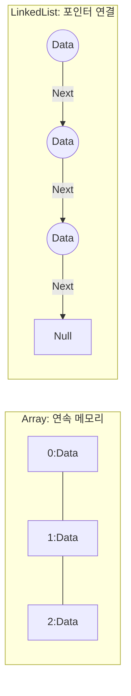

# 🏗️ 자료구조: 코딩의 기초 체력

> **이 문서의 목표:** 상황에 맞는 최적의 자료구조를 선택하여 **성능**과 **유지보수성**을 높이는 능력을 기른다. 단순히 기능을 구현하는 것을 넘어, **"왜 이 자료구조를 써야 하는가?"**에 대한 명확한 이유를 이해한다.

---

## 0. 핵심 질문으로 시작하기

1.  **자료구조가 왜 중요한가?** → 데이터의 저장 방식이 알고리즘의 성능(시간/공간 복잡도)을 결정하기 때문.
2.  **ArrayList와 LinkedList의 결정적 차이는?** → 메모리 구조(연속 vs 불연속)와 그로 인한 연산 속도(조회 유리 vs 삽입/삭제 유리).
3.  **HashMap은 어떻게 O(1) 검색을 보장하는가?** → 해시 함수를 통해 키를 인덱스로 변환하여 메모리 주소에 직접 접근.
4.  **트리(Tree) 구조는 언제 유용한가?** → 계층적 데이터 표현이나 정렬된 데이터의 효율적인 탐색(O(log N))이 필요할 때.

---

## 1. [개념 정의]: 상황에 맞는 그릇 고르기 (Why)

모든 자료구조는 특정 목적을 위해 만들어졌습니다.
*   순서대로 쌓고 싶다? → **Stack/Queue**
*   빨리 찾고 싶다? → **Hash/Tree**
*   관계를 표현하고 싶다? → **Graph**

잘못된 자료구조 선택은 프로그램의 속도를 수천 배 느리게 만들 수 있습니다.

> [!NOTE]
> **핵심 통찰:** 자료구조 선택은 **"가장 자주 하는 연산"**이 무엇인지에 따라 결정됩니다. (검색이 잦은가? 삽입이 잦은가?)

---

## 2. [원리/구조]: 핵심 자료구조 비교 (How)

### 2.1 선형 자료구조 (Linear)

| 자료구조 | 특징 | 장점 | 단점 | 시간복잡도 (조회/삽입) |
| :--- | :--- | :--- | :--- | :--- |
| **Array** | 연속된 메모리 | 인덱스 조회 O(1), 구현 쉬움 | 크기 고정, 중간 삽입/삭제 O(N) | O(1) / O(N) |
| **List (Dynamic)** | 크기 자동 조절 | 편함 (Java ArrayList) | 크기 조정 시 복사 비용 발생 | O(1) / O(N) |
| **Linked List** | 노드 연결 | 중간 삽입/삭제 O(1) (위치 알 때) | 조회 느림 O(N), 추가 메모리 | O(N) / O(1)* |

### 2.2 비선형 자료구조 (Non-Linear)

| 자료구조 | 특징 | 용도 | 시간복잡도 (검색) |
| :--- | :--- | :--- | :--- |
| **Hash Table** | Key-Value 쌍 | 빠른 검색, 캐시 | Avg O(1) |
| **Tree (BST)** | 계층/정렬 구조 | 탐색, 범위 검색 | Avg O(log N) |
| **Graph** | 정점과 간선 | 네트워크, 경로 찾기 | 탐색 방식 따름 |

### 2.3 구조도 (LinkedList vs Array)



---

## 3. [실전/구현]: 코드로 보는 선택 기준 (What)

### 3.1 HashMap vs TreeMap
*   **HashMap**: 순서 상관없이 **빠른 검색**이 필요할 때 (ID로 유저 찾기).
*   **TreeMap**: 키 기준으로 **정렬**이 필요할 때 (학번 순 명단).

```java
// 빠른 조회가 중요할 때
Map<String, User> userMap = new HashMap<>();
userMap.put("user1", new User("Kim")); // O(1)

// 순서가 중요할 때
Map<Integer, String> rankMap = new TreeMap<>();
rankMap.put(1, "Gold"); // O(log N)
```

### 3.2 Stack vs Queue
*   **Stack (LIFO)**: 뒤로 가기, 함수 호출 스택, 괄호 검사.
*   **Queue (FIFO)**: 작업 대기열, 프린터 출력, BFS 탐색.

### 3.3 실무 팁
1.  **대부분은 `ArrayList`와 `HashMap`으로 해결됩니다.** 특수한 경우에만 다른 걸 고려하세요.
2.  **LinkedList**는 실제 메모리 상에서 흩어져 있어 **캐시 효율(Locality)**이 떨어지므로, 중간 삽입이 정말 많지 않다면 ArrayList가 더 빠를 수 있습니다.

> [!WARNING]
> **흔한 실수:** `contains()` 메서드를 List에서 쓰면 O(N)입니다. 데이터가 많다면 `Set`이나 `Map`으로 변경하여 O(1)로 만들어야 합니다.

---

## 4. 🎯 1분 요약

1.  **배열(Array/List)**: 조회가 많고 데이터 개수가 변하지 않거나 끝에만 추가할 때.
2.  **연결리스트(LinkedList)**: 중간 삽입/삭제가 매우 빈번할 때 (하지만 ArrayList가 나은 경우도 많음).
3.  **해시(Hash)**: Key로 데이터를 즉시 찾아야 할 때 (가장 많이 씀).
4.  **트리/힙(Tree/Heap)**: 데이터가 정렬되어 있어야 하거나, 최대/최소값을 계속 꺼낼 때.

---

## 5. 📝 자가 점검 질문

1.  **배열의 맨 앞에 요소를 삽입할 때 시간 복잡도는?**
    → \(O(N)\). 기존 요소들을 모두 한 칸씩 뒤로 밀어야 하므로.
2.  **해시 테이블에서 충돌(Collision) 해결 방식 두 가지는?**
    → Chaining(연결 리스트 사용)과 Open Addressing(다른 빈 칸 찾기).
3.  **우선순위 큐(Priority Queue)는 내부적으로 어떤 자료구조를 쓰는가?**
    → 힙(Heap). 최댓값/최솟값을 \(O(1)\)에 확인하고 \(O(\log N)\)에 삽입/삭제하기 위해.
4.  **Java의 `ArrayList`가 꽉 찼을 때 크기를 늘리는 방식은?**
    → 더 큰 새 배열을 만들고(보통 1.5배~2배), 기존 데이터를 모두 **복사**한다. (비용 발생)
