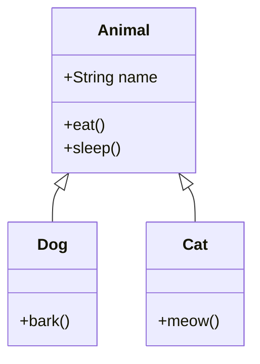

# 🧱 객체지향 프로그래밍 (OOP): 코드를 현실처럼 설계하기

> **이 문서의 목표:** 객체지향의 4대 원칙과 SOLID 원칙을 이해하여, **변경에 강하고 확장하기 쉬운** 코드를 설계하는 능력을 기른다. 단순히 클래스를 만드는 것을 넘어, **"왜 이렇게 설계해야 하는가?"**를 명확히 이해한다.

---

## 0. 핵심 질문으로 시작하기

1. **캡슐화(Encapsulation)가 왜 중요한가?** → 내부 구현을 숨겨 외부에서 잘못 사용하는 것을 막고, 변경 시 영향 범위를 최소화하기 위해.
2. **상속(Inheritance)보다 조합(Composition)을 권장하는 이유는?** → 상속은 부모-자식 간 강한 결합을 만들어 변경에 취약하기 때문.
3. **다형성(Polymorphism)이 유연한 코드의 핵심인 이유는?** → 구체적인 타입이 아닌 추상화(인터페이스)에 의존하여 구현체를 쉽게 교체할 수 있기 때문.
4. **SOLID 원칙을 지키면 뭐가 좋은가?** → 코드의 **변경 비용**이 줄고, **테스트**와 **확장**이 쉬워진다.

---

## 1. [개념 정의]: 왜 객체지향인가? (Why)

절차지향(Procedural) 방식은 "순서대로 명령을 나열"합니다.
객체지향(OOP)은 **"현실 세계처럼 역할과 책임을 가진 객체들이 협력"**하도록 설계합니다.

### 1.1 절차지향 vs 객체지향

| 구분 | 절차지향 | 객체지향 |
|:---|:---|:---|
| **관점** | 기능(함수) 중심 | 데이터(객체) 중심 |
| **코드 구조** | 순서대로 나열 | 객체 간 메시지 전달 |
| **변경 시** | 관련 함수 모두 수정 | 해당 객체만 수정 |
| **재사용** | 함수 복사 | 상속/조합으로 확장 |

> [!NOTE]
> **핵심 통찰:** OOP의 목표는 "현실 모델링"이 아니라 **"변경에 유연하게 대응하는 것"**입니다. 코드는 항상 변하기 때문입니다.

---

## 2. [원리/구조]: OOP 4대 원칙 (How)

### 2.1 캡슐화 (Encapsulation)

**데이터와 행위를 하나로 묶고, 외부에서 직접 접근하지 못하게 숨긴다.**

```java
// ❌ 나쁜 예: 외부에서 직접 상태 변경
class Account {
    public int balance; // 외부에서 마음대로 수정 가능
}
account.balance = -1000; // 잔액이 음수? 💀

// ✅ 좋은 예: 메서드를 통해서만 접근
class Account {
    private int balance;
    
    public void withdraw(int amount) {
        if (amount > balance) {
            throw new IllegalArgumentException("잔액 부족");
        }
        this.balance -= amount;
    }
    
    public int getBalance() {
        return this.balance;
    }
}
```

**핵심:** `private`으로 숨기고, 필요한 것만 `public` 메서드로 노출한다.

---

### 2.2 상속 (Inheritance)

**부모 클래스의 속성과 행위를 자식 클래스가 물려받는다.**



```java
class Animal {
    protected String name;
    public void eat() { System.out.println(name + " eats"); }
}

class Dog extends Animal {
    public void bark() { System.out.println("Woof!"); }
}
```

> [!WARNING]
> **상속의 함정:**
> - 부모 변경 시 모든 자식에 영향 (깨지기 쉬운 기반 클래스 문제)
> - 다중 상속 불가 (Java)
> - **"is-a" 관계가 아니면 상속하지 말 것!**
> 
> → **조합(Composition)을 먼저 고려하세요.**

---

### 2.3 다형성 (Polymorphism)

**같은 메시지(메서드 호출)에 대해 객체마다 다르게 응답한다.**

```java
interface Payment {
    void pay(int amount);
}

class CardPayment implements Payment {
    public void pay(int amount) {
        System.out.println("카드로 " + amount + "원 결제");
    }
}

class KakaoPayment implements Payment {
    public void pay(int amount) {
        System.out.println("카카오페이로 " + amount + "원 결제");
    }
}

// 사용하는 쪽: 구체적인 타입을 몰라도 됨!
public void checkout(Payment payment) {
    payment.pay(10000); // 어떤 결제든 동일하게 호출
}
```

**핵심:** 인터페이스에 의존하면 **구현체를 쉽게 교체**할 수 있다. (전략 패턴의 기초)

---

### 2.4 추상화 (Abstraction)

**복잡한 내부 구현을 숨기고, 핵심 개념만 노출한다.**

```java
// 운전자는 자동차의 내부 엔진 동작을 몰라도 됨
interface Car {
    void accelerate();
    void brake();
}

// 내부 구현은 숨겨져 있음
class ElectricCar implements Car {
    private Battery battery;
    private Motor motor;
    
    public void accelerate() {
        motor.increaseSpeed(battery.discharge());
    }
    // ...
}
```

**핵심:** 사용자는 **"무엇을"** 하는지만 알면 되고, **"어떻게"** 하는지는 몰라도 된다.

---

## 3. [실전/구현]: SOLID 원칙 (What)

SOLID는 **변경에 강한 코드**를 만들기 위한 5가지 설계 원칙입니다.

### 3.1 S - 단일 책임 원칙 (SRP: Single Responsibility Principle)

> **"클래스는 단 하나의 변경 이유만 가져야 한다."**

```java
// ❌ 나쁜 예: 여러 책임이 섞임
class UserService {
    public void createUser(User user) { /* 사용자 생성 */ }
    public void sendEmail(User user) { /* 이메일 발송 */ }  // 다른 책임!
    public String generateReport() { /* 리포트 생성 */ }    // 또 다른 책임!
}

// ✅ 좋은 예: 책임 분리
class UserService {
    public void createUser(User user) { /* 사용자 생성만 */ }
}

class EmailService {
    public void sendEmail(User user) { /* 이메일만 */ }
}

class ReportService {
    public String generateReport() { /* 리포트만 */ }
}
```

---

### 3.2 O - 개방-폐쇄 원칙 (OCP: Open-Closed Principle)

> **"확장에는 열려 있고, 수정에는 닫혀 있어야 한다."**

```java
// ❌ 나쁜 예: 새 할인 타입 추가 시 기존 코드 수정 필요
class DiscountService {
    public int calculate(String type, int price) {
        if (type.equals("VIP")) return price * 80 / 100;
        if (type.equals("GOLD")) return price * 90 / 100;
        // 새 타입 추가 시 여기를 수정해야 함...
        return price;
    }
}

// ✅ 좋은 예: 새 할인 정책은 클래스 추가로 해결
interface DiscountPolicy {
    int calculate(int price);
}

class VipDiscount implements DiscountPolicy {
    public int calculate(int price) { return price * 80 / 100; }
}

class GoldDiscount implements DiscountPolicy {
    public int calculate(int price) { return price * 90 / 100; }
}

// 새 정책 추가 시 기존 코드 수정 없이 클래스만 추가
class PlatinumDiscount implements DiscountPolicy {
    public int calculate(int price) { return price * 70 / 100; }
}
```

---

### 3.3 L - 리스코프 치환 원칙 (LSP: Liskov Substitution Principle)

> **"자식 클래스는 부모 클래스를 대체할 수 있어야 한다."**

```java
// ❌ 나쁜 예: 정사각형은 직사각형이 아니다!
class Rectangle {
    protected int width, height;
    public void setWidth(int w) { this.width = w; }
    public void setHeight(int h) { this.height = h; }
    public int getArea() { return width * height; }
}

class Square extends Rectangle {
    // 정사각형은 width = height여야 함
    @Override
    public void setWidth(int w) { 
        this.width = w; 
        this.height = w; // 💀 부모와 다른 동작!
    }
}

// 사용자 기대: setWidth(5), setHeight(10) → 면적 50
// 실제 결과: Square에서는 면적 100 (예상과 다름!)
```

**핵심:** 상속 관계가 **"is-a"**인지 신중히 판단하라. 아니면 조합을 쓰라.

---

### 3.4 I - 인터페이스 분리 원칙 (ISP: Interface Segregation Principle)

> **"클라이언트는 자신이 사용하지 않는 메서드에 의존하면 안 된다."**

```java
// ❌ 나쁜 예: 뚱뚱한 인터페이스
interface Worker {
    void work();
    void eat();
    void sleep();
}

class Robot implements Worker {
    public void work() { /* OK */ }
    public void eat() { /* 로봇은 안 먹는데?! */ }  // 강제 구현
    public void sleep() { /* 로봇은 안 자는데?! */ }
}

// ✅ 좋은 예: 인터페이스 분리
interface Workable { void work(); }
interface Eatable { void eat(); }
interface Sleepable { void sleep(); }

class Robot implements Workable {
    public void work() { /* OK */ }
    // 필요한 것만 구현
}

class Human implements Workable, Eatable, Sleepable {
    public void work() { /* ... */ }
    public void eat() { /* ... */ }
    public void sleep() { /* ... */ }
}
```

---

### 3.5 D - 의존성 역전 원칙 (DIP: Dependency Inversion Principle)

> **"고수준 모듈은 저수준 모듈에 의존하면 안 된다. 둘 다 추상화에 의존해야 한다."**

```java
// ❌ 나쁜 예: 구체 클래스에 직접 의존
class OrderService {
    private MySQLRepository repository = new MySQLRepository(); // 강한 결합
    
    public void createOrder(Order order) {
        repository.save(order);
    }
}
// MySQL → MongoDB 변경 시 OrderService 코드 수정 필요!

// ✅ 좋은 예: 추상화(인터페이스)에 의존
interface OrderRepository {
    void save(Order order);
}

class OrderService {
    private final OrderRepository repository; // 인터페이스에 의존
    
    public OrderService(OrderRepository repository) { // 생성자 주입
        this.repository = repository;
    }
    
    public void createOrder(Order order) {
        repository.save(order);
    }
}

// MySQL, MongoDB 등 자유롭게 교체 가능
class MySQLRepository implements OrderRepository { /* ... */ }
class MongoRepository implements OrderRepository { /* ... */ }
```

**핵심:** 이것이 바로 **Spring의 DI(의존성 주입)**의 기반 원리입니다.

---

## 4. 🎯 1분 요약

### OOP 4대 원칙
| 원칙 | 핵심 |
|:---|:---|
| **캡슐화** | 데이터 숨기고 메서드로만 접근 |
| **상속** | 코드 재사용 (but 조합 우선 고려) |
| **다형성** | 인터페이스로 구현체 교체 가능 |
| **추상화** | 복잡함 숨기고 핵심만 노출 |

### SOLID 원칙
| 원칙 | 한 줄 요약 |
|:---|:---|
| **SRP** | 클래스는 하나의 책임만 |
| **OCP** | 수정 없이 확장 가능하게 |
| **LSP** | 자식은 부모를 대체 가능해야 |
| **ISP** | 인터페이스는 작게 쪼개라 |
| **DIP** | 구체 클래스가 아닌 인터페이스에 의존 |

---

## 5. 📝 자가 점검 질문

1. **캡슐화를 지키기 위해 getter/setter를 무조건 만드는 것이 좋은가?**
   → 아니다. getter/setter도 최소화하고, **"무엇을 할 것인가"**를 표현하는 메서드(예: `withdraw()`)를 만드는 것이 좋다.

2. **상속보다 조합(Composition)을 권장하는 이유는?**
   → 상속은 부모-자식 간 강한 결합(컴파일 타임 결정)을 만들지만, 조합은 런타임에 유연하게 교체 가능하다.

3. **OCP(개방-폐쇄 원칙)를 지키기 위한 대표적인 방법은?**
   → 전략 패턴(Strategy Pattern)처럼 **인터페이스와 다형성**을 활용하여 기존 코드 수정 없이 새 기능을 추가한다.

4. **DIP(의존성 역전)와 Spring의 DI(의존성 주입)의 관계는?**
   → DIP는 "추상화에 의존하라"는 **원칙**이고, DI는 그것을 **구현하는 기법**(생성자 주입 등)이다. Spring Container가 DI를 자동으로 처리해준다.

5. **"정사각형은 직사각형이다"라는 상속이 LSP 위반인 이유는?**
   → 직사각형의 `setWidth()`와 `setHeight()`는 독립적으로 동작해야 하지만, 정사각형은 둘이 연동되어 **기대 동작이 달라지기 때문**.
