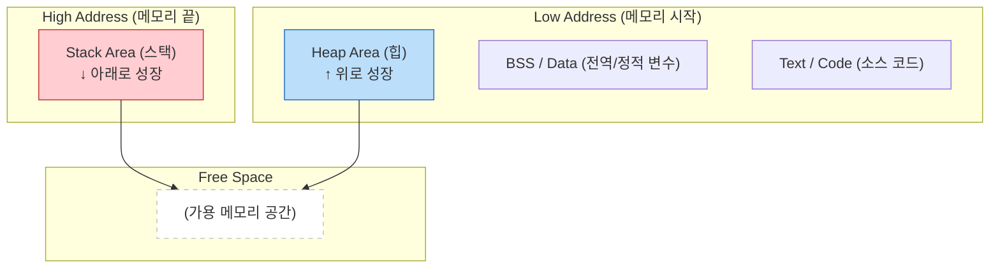

# 📚 메모리 구조 완벽 이해: Stack과 Heap의 본질

> **이 문서의 목표:** Stack/Heap을 단순 암기가 아니라, **왜 이렇게 설계됐는지**, **메모리 문제가 왜 발생하는지** 근본 원인을 이해한다.

---

## 0. 핵심 질문으로 시작하기

1. **왜 Stack과 Heap을 나누는가?** → 용도에 따른 최적화
2. **Stack Overflow는 왜 발생하는가?** → Stack의 크기 제한
3. **메모리 누수는 왜 발생하는가?** → Heap 관리의 어려움
4. **Call by Value vs Call by Reference의 원리는?** → 메모리 동작 이해

---

## 1. 왜 메모리를 나누는가: 설계 원리

### 1.1 두 가지 다른 요구사항

```
[상황 1: 함수 호출]
- 지역 변수는 함수 끝나면 필요 없음
- 빠르게 할당/해제 필요
- 크기가 컴파일 타임에 결정됨
→ Stack이 적합

[상황 2: 동적 데이터]
- 언제 해제될지 모름
- 크기가 런타임에 결정됨
- 여러 함수에서 공유할 수 있어야 함
→ Heap이 적합
```

### 1.2 Stack의 설계 원리

```
[Stack의 특성]
"접시 쌓기" - Last In First Out (LIFO)

함수 호출:  접시 쌓기 (push)
함수 종료:  접시 꺼내기 (pop)

[왜 빠른가?]
할당: 스택 포인터만 이동 (한 번의 연산)
해제: 스택 포인터만 되돌림 (한 번의 연산)
→ 메모리 관리자 호출 불필요

[왜 제한적인가?]
크기가 고정됨 (보통 1-8MB)
→ 무한히 쌓으면 넘침 (Stack Overflow)
```

### 1.3 Heap의 설계 원리

```
[Heap의 특성]
"창고" - 아무 데나 저장, 필요할 때 꺼냄

[왜 유연한가?]
크기: 프로세스 메모리 한도까지 사용 가능
수명: 명시적으로 해제할 때까지 유지
접근: 어디서든 주소만 알면 접근 가능

[왜 느린가?]
할당: 메모리 관리자가 빈 공간 찾아야 함
해제: 조각(fragmentation) 관리 필요
→ 복잡한 알고리즘 필요
```

---

## 2. 메모리 레이아웃: 실제 구조

```
높은 주소 (0xFFFFFFFF)
┌─────────────────────────────────────┐
│          Stack                       │ ← 함수 호출마다 성장 (↓)
│          ↓                           │
├─────────────────────────────────────┤
│                                      │
│      (빈 공간 - Stack/Heap 충돌 방지)│
│                                      │
├─────────────────────────────────────┤
│          ↑                           │
│          Heap                        │ ← 동적 할당마다 성장 (↑)
├─────────────────────────────────────┤
│          BSS (초기화 안 된 전역)      │
├─────────────────────────────────────┤
│          Data (초기화된 전역)         │
├─────────────────────────────────────┤
│          Text (코드)                 │
└─────────────────────────────────────┘
낮은 주소 (0x00000000)
```

---

## 3. 코드로 이해하기: 어디에 저장되는가?

```java
public class MemoryExample {
    // 1. Data 영역: 전역/정적 변수
    static int globalCounter = 0;
    
    public void method() {
        // 2. Stack 영역: 기본형 지역 변수
        int localNum = 42;
        
        // 3. Stack + Heap: 참조형 변수
        //    user (참조/주소) → Stack
        //    User 객체 (실제 데이터) → Heap
        User user = new User("Kim");
        
        // 4. Stack: 배열 참조
        //    numbers (참조) → Stack
        //    int[] 배열 데이터 → Heap
        int[] numbers = new int[100];
    }
}
```

### 3.1 시각화

```
[Stack]                     [Heap]
┌─────────────────┐         ┌─────────────────────┐
│ localNum: 42    │         │ 0x1000: User Object │
│ user: 0x1000 ───┼────────→│   name: "Kim"       │
│ numbers: 0x2000─┼────┐    │   age: 25           │
└─────────────────┘    │    ├─────────────────────┤
                       └───→│ 0x2000: int[100]    │
                            │   [0, 0, 0, 0, 0]   │
                            │   (총 100개 요소)    │
                            └─────────────────────┘
```

---

## 4. 실제로 겪어본 메모리 문제들

### 개발자들이 흔히 마주치는 고민:

**"왜 메모리가 부족하지? 16GB RAM인데?"**
- 간단한 프로그램인데 OutOfMemoryError
- 서버가 갑자기 죽으면서 메모리 누수 의심
- GC가 너무 자주 일어나서 성능 저하

**"왜 루프에서 객체 생성이 성능을 죽이나?"**
- for문 안에서 String concatenation 할 때마다 느려짐
- 게임에서 매 프레임 객체 생성으로 GC 멈춤
- Android 앱에서 메모리 부족으로 크래시

**"Stack Overflow는 왜 발생하지?"**
- 재귀 함수에서 갑자기 StackOverflowError
- 스택 크기가 왜 1MB밖에 안 되지?
- 무한 재귀를 어떻게 방지하지?

## 🎯 1분 요약: 메모리 구조의 핵심

**메모리 = 임시 작업대(Stack) + 자유 창고(Heap)**

- **Stack**: 함수 호출을 위한 빠른 임시 공간 (자동 정리)
- **Heap**: 객체 저장을 위한 유연한 공간 (수동/GC 정리)
- **문제**: Heap 관리를 잘못하면 메모리 누수, Stack을 잘못쓰면 오버플로우

> **결론:**
> 1. **성능-critical**: Stack 사용, 객체 최소화
> 2. **데이터 저장**: Heap 사용, GC 고려
> 3. **디버깅**: 메모리 누수 분석 도구 활용
> 
> 

---

## 2. 구조 및 특징 비교 (Comparison)

**💡 실제 사용 예시:**

| 상황 | Stack 사용 | Heap 사용 |
|------|------------|----------|
| **빠른 계산** | `int sum = a + b;` | `BigInteger bigNum = new BigInteger("123456789");` |
| **임시 데이터** | `String name = "홍길동";` | `List<User> users = new ArrayList<>();` |
| **함수 호출** | `calculateScore(score);` | `User user = new User("홍길동", 25);` |

**🚨 실제 문제 사례:**

**문제 1: String concatenation 메모리 누수**
```java
// ❌ 나쁜 예: 루프에서 String 더하기
String result = "";
for (int i = 0; i < 100000; i++) {
    result += "item" + i;  // 매번 새 String 객체 생성!
}
// 결과: 100,000개 String 객체 생성, OutOfMemory
```

```java
// ✅ 좋은 예: StringBuilder 사용
StringBuilder sb = new StringBuilder();
for (int i = 0; i < 100000; i++) {
    sb.append("item").append(i);
}
String result = sb.toString();
// 결과: 1개 객체만 생성
```

**문제 2: 재귀 호출 Stack Overflow**
```java
// ❌ 위험한 재귀: Stack Overflow 발생 가능
public int factorial(int n) {
    return n * factorial(n - 1);  // 스택 프레임 계속 쌓임
}
factorial(10000);  // StackOverflowError!
```

**문제 3: Heap 메모리 누수**
```java
// ❌ 메모리 누수: HashMap에 객체 계속 추가
Map<String, byte[]> cache = new HashMap<>();
while (true) {
    cache.put("key" + count++, new byte[1024 * 1024]);  // 1MB씩 누수
}
```

---

## 3. 메모리 레이아웃 시각화 (Memory Layout)

일반적인 프로세스의 메모리 구조입니다. Stack과 Heap은 서로를 향해 자라나는 구조를 가집니다.



---

## 4. 코드로 보는 저장 위치 (Code vs Memory)

코드를 작성할 때 변수가 어디에 박히는지 알아야 합니다. (Java/C++ 기준 일반론)

```java
public void method() {
    // 1. Stack에 저장
    // 함수 실행 중에만 잠깐 필요한 정수값
    int age = 30; 

    // 2. Heap & Stack 동시 사용
    // 'user' 변수(참조값/주소)는 Stack에 생성됨.
    // 실제 'User' 객체(데이터 덩어리)는 Heap에 생성됨.
    // Stack의 'user'가 Heap의 객체를 가리킴(Point).
    User user = new User("Gemini"); 
}
// 3. 함수 종료 시:
// Stack에 있는 'age'와 'user'(주소)는 즉시 팝(Pop)되어 사라짐.
// Heap에 있는 'User 객체'는 덩그러니 남았다가 나중에 GC가 청소함.

```

### 4.1 시각적 상세 분석 (The Pointer)

```text
[ Stack Frame: method() ]             [ Heap Memory ]
+---------------------+               +--------------------------+
| age : 30            |               |                          |
+---------------------+               |  Address: 0x5F3A         |
| user: 0x5F3A  --------------------> |  [ User Object ]         |
+---------------------+               |  name: "Gemini"          |
                                      |  age: 30                 |
                                      |  email: "g@example.com"  |
                                      +--------------------------+

```

---

## 5. 발생하는 문제들과 원인

### 5.1 스택 오버플로우 (Stack Overflow)

Stack은 크기가 고정되어 있습니다(예: 1MB). 함수가 끝나지 않고 계속 호출되면(무한 재귀), Stack 영역을 꽉 채워 터져버립니다.

* **원인:** 탈출 조건 없는 재귀 함수(Recursion), 너무 큰 지역 변수 배열 선언.
* **시각화:** 컵에 물을 계속 따르는 것과 같음.

### 5.2 메모리 누수 (Memory Leak)

Heap에 객체를 만들었는데, 더 이상 쓰지 않음에도 불구하고 지우지 않거나(C/C++), 참조를 끊지 않아 GC가 수거하지 못하는(Java/Python) 상황입니다.

* **현상:** 프로그램이 오래 켜져 있으면 점점 느려지다가 멈춤(Out of Memory).
* **시각화:** 도서관에서 책(Heap)을 꺼내고 반납(Free)하지 않아, 나중에는 더 이상 책을 빌릴 수 없는 상태.

---

### 6.1 성능 최적화: 지역 변수의 힘

Stack은 메모리 할당/해제 속도가 Heap보다 월등히 빠릅니다(단순히 포인터만 위아래로 움직임).

* **Tip:** 함수의 파라미터나 내부 연산 변수는 가능한 객체(Heap)보다는 원시 타입(Primitive Type - Stack)을 사용하는 것이 성능상 유리합니다.

### 6.2 참조(Reference)의 이해

"변수를 복사해서 넘겼는데 원본이 바뀌었어요!"라는 초보적인 실수는 Stack과 Heap의 관계를 몰라서 발생합니다.

* **Call by Value:** 값을 복사해서 Stack에 새로 만듦. (원본 영향 X)
* **Call by Reference:** Heap에 있는 주소값만 복사해서 Stack에 만듦. (주소를 따라가면 같은 객체이므로 원본 영향 O)

### 6.3 재귀(Recursion) 대신 반복문(Iteration)

실무(Production) 환경, 특히 임베디드나 고가용성 서버에서는 깊은 재귀 호출을 피해야 합니다. Stack 크기는 예측하기 어렵기 때문입니다. 가능하면 `for`나 `while` 반복문으로 대체하거나, **꼬리 재귀 최적화(Tail Call Optimization)**를 지원하는지 확인해야 합니다.

---

## 7. 실무 디버깅: 메모리 문제 해결

### 7.1 Java 힙 분석

```bash
# 힙 덤프 생성
jmap -dump:format=b,file=heap.hprof <pid>

# OutOfMemoryError 시 자동 덤프
java -XX:+HeapDumpOnOutOfMemoryError \
     -XX:HeapDumpPath=/var/log/heap.hprof \
     -jar app.jar

# 힙 사용량 실시간 모니터링
jstat -gc <pid> 1000  # 1초마다 GC 상태

# 메모리 누수 분석
# Eclipse MAT, VisualVM 등으로 heap.hprof 분석
```

### 7.2 흔한 메모리 누수 패턴

```java
// 1. 컬렉션에 계속 추가 (제거 안 함)
Map<String, Object> cache = new HashMap<>();
while (true) {
    cache.put(key, data);  // 계속 쌓임!
}

// 2. 리스너/콜백 등록 후 해제 안 함
eventBus.register(this);  // 등록
// eventBus.unregister(this);  // 해제 누락!

// 3. 스트림/커넥션 닫지 않음
InputStream is = new FileInputStream(file);
// is.close();  // 누락!
// → try-with-resources 사용할 것
```

### 7.3 Stack 크기 조정

```bash
# Java: 스레드당 스택 크기 설정
java -Xss512k -jar app.jar  # 512KB로 설정

# Linux: 스택 크기 확인/설정
ulimit -s          # 현재 스택 크기 (KB)
ulimit -s 16384    # 16MB로 설정
```

---

## 8. 자가 점검 질문

### 원리 이해

1. **Stack과 Heap을 나누는 이유는?**
   → 용도에 따른 최적화. Stack은 빠른 할당/해제(함수 지역변수), Heap은 유연한 수명 관리(동적 객체).

2. **Stack이 Heap보다 빠른 이유는?**
   → Stack은 포인터만 이동(O(1)), Heap은 빈 공간 찾기+관리 필요(느림).

3. **Stack Overflow가 발생하는 이유는?**
   → Stack 크기가 고정되어 있음. 무한 재귀나 큰 지역 배열로 넘침.

4. **메모리 누수(Memory Leak)의 원인은?**
   → Heap에 할당 후 참조를 잃거나 해제 안 함. GC 언어에서도 컬렉션에 계속 추가하면 발생.

5. **Call by Value vs Call by Reference의 동작 원리는?**
   → Value: 값 복사(Stack에 새로 생성). Reference: 주소 복사(같은 Heap 객체 가리킴).

### 실무

6. **`new`로 생성한 객체가 어디에 저장되는가?**
   → 객체 데이터는 Heap, 참조 변수는 Stack.

7. **Java에서 OutOfMemoryError를 디버깅하는 방법은?**
   → 힙 덤프 생성(jmap), MAT/VisualVM으로 분석, 어떤 객체가 메모리를 많이 차지하는지 확인.

---

**💡 핵심:** Stack은 "자동 관리되는 빠른 임시 공간", Heap은 "수동 관리가 필요한 유연한 저장소". 메모리 문제는 대부분 Heap 관리 실수에서 발생한다.
