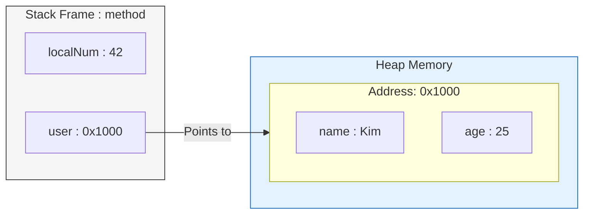

# 📚 메모리 구조: Stack과 Heap의 본질

> **이 문서의 목표:** Stack/Heap을 단순 암기가 아니라, **왜 이렇게 설계됐는지**, **메모리 문제가 왜 발생하는지** 근본 원인을 이해한다.

---

## 0. 핵심 질문으로 시작하기

1.  **왜 Stack과 Heap을 나누는가?** → 용도(정적/빠름 vs 동적/유연함)에 따른 최적화를 위해.
2.  **Stack Overflow는 왜 발생하는가?** → Stack의 크기(보통 1MB)가 고정되어 있는데, 재귀나 큰 변수로 이를 초과했기 때문.
3.  **메모리 누수(Memory Leak)는 왜 발생하는가?** → Heap은 수동(또는 GC) 관리 영역인데, 더 이상 쓰지 않는 객체의 참조를 남겨둬서 해제되지 않기 때문.
4.  **Call by Value vs Call by Reference의 원리는?** → Stack에 "값"을 복사하느냐, Heap을 가리키는 "주소"를 복사하느냐의 차이.

---

## 1. [개념 정의]: 왜 메모리를 나누는가? (Why)

프로그램이 실행되려면 두 가지 상반된 종류의 데이터 저장소가 필요합니다.

1.  **"지금 당장 쓰고 버릴 것" (Stack)**: 함수 호출, 매개변수, 리턴값. 빠르고 관리가 편해야 함.
2.  **"오래 두고 계속 쓸 것" (Heap)**: 사용자 데이터, DB 결과, 전역 설정. 크기를 미리 알 수 없고 유연해야 함.

이 두 요구사항을 만족시키기 위해 메모리 공간을 **Stack(빠른 임시 작업대)**과 **Heap(거대한 자유 창고)**으로 분리했습니다.

> [!NOTE]
> **핵심 통찰:** Stack은 **"함수의 실행 흐름"**을 기록하고, Heap은 **"데이터"**를 저장합니다.

---

## 2. [원리/구조]: 메모리 레이아웃 (How)

### 2.1 메모리 구조도

```mermaid
graph TD
    subgraph Memory_Layout [메모리 레이아웃]
        direction BT
        Text[Text Code Segment<br/>기계어 코드 / Read-Only]
        Data[Data Segment<br/>전역/정적 변수]
        Heap[Heap Area<br/>동적 할당 (new, malloc)<br/>↑ 위로 성장]
        Free[Free Space<br/>여유 공간]
        Stack[Stack Area<br/>지역변수, 매개변수<br/>↓ 아래로 성장]
        
        Text --> Data
        Data --> Heap
        Heap --> Free
        Free --> Stack
    end
    
    style Stack fill:#ffcdd2,stroke:#c62828,color:black
    style Heap fill:#bbdefb,stroke:#1565c0,color:black
```

### 2.2 Stack vs Heap 상세 비교

| 특성 | Stack (스택) | Heap (힙) |
| :--- | :--- | :--- |
| **자료구조** | LIFO (Last In First Out) | 자유 저장소 (Free Store) |
| **할당 속도** | 매우 빠름 (포인터 이동만 함) | 느림 (빈 공간 탐색 필요) |
| **관리 주체** | 컴파일러/OS (자동) | 개발자/GC (수동) |
| **크기 제한** | 작음 (1~8MB) | 큼 (RAM 크기만큼) |
| **주요 에러** | StackOverflowError | OutOfMemoryError |

---

## 3. [실전/구현]: 코드로 보는 저장 위치 (What)

### 3.1 변수는 어디에 저장되는가?

```java
public class MemoryExample {
    // 1. Data 영역: 전역/정적 변수
    static int globalCounter = 0;
    
    public void method() {
        // 2. Stack 영역: 기본형 지역 변수 (값 자체가 Stack에 저장)
        int localNum = 42;
        
        // 3. Stack + Heap: 참조형 변수
        //    'user' (참조/주소) → Stack
        //    'User 객체' (실제 데이터) → Heap
        User user = new User("Kim");
        
        // 4. Stack + Heap: 배열
        //    'numbers' (참조) → Stack
        //    'int[] 배열 내용' → Heap
        int[] numbers = new int[100];
    }
}
```

### 3.2 참조 관계 시각화



> [!WARNING]
> **흔한 실수:**
> 1.  **재귀 함수 무한 루프**: 종료 조건이 없으면 Stack Frame이 계속 쌓여 `StackOverflowError` 발생.
> 2.  **문자열 덧셈**: 루프 안에서 `String + String`을 하면 Heap에 쓰레기 객체가 계속 생성됨 (`StringBuilder` 사용 필수).

---

## 4. 🎯 1분 요약

1.  **Stack**: 함수 호출을 위한 **빠르고 작은** 임시 공간. 컴파일 타임에 크기가 결정되거나 예측 가능해야 함.
2.  **Heap**: 데이터 저장을 위한 **크고 유연한** 공간. 런타임에 크기가 결정됨.
3.  **참조(Reference)**: Java/C#의 객체 변수는 Stack에 주소(참조)만 저장하고, 실제 데이터는 Heap에 있음.
4.  **최적화**: 성능이 중요하다면 Stack(기본형)을 활용하고, Heap 할당(객체 생성)을 줄여야 함.

---

## 5. 📝 자가 점검 질문

1.  **함수의 지역 변수가 함수 종료 후에도 살아있을 수 있는가?**
    → 아니오. Stack Frame이 pop되면서 즉시 사라짐. (단, Heap에 생성된 객체는 참조가 남아있다면 살아있음)
2.  **`new` 키워드를 사용하면 무조건 Heap에 저장되는가?**
    → Java에서는 그렇다. (최신 JVM의 Escape Analysis 최적화 예외 제외)
3.  **재귀 함수(Recursion)가 반복문(Iteration)보다 위험한 이유는?**
    → Stack 메모리는 한정적이어서 깊은 재귀는 `StackOverflow`를 유발할 수 있기 때문.
4.  **메모리 누수를 방지하기 위한 가장 기본적인 습관은?**
    → 사용하지 않는 객체의 참조(Reference)를 끊거나(null 처리), 컬렉션(List, Map)에서 제거하는 것.
