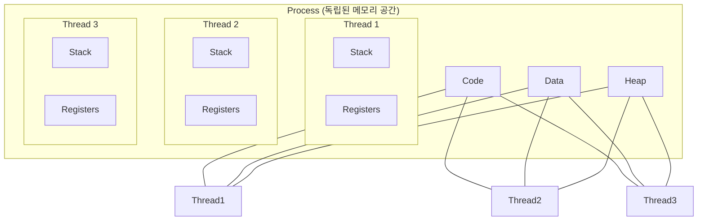

# OS의 실행 단위: 프로세스(Process) vs 스레드(Thread)와 동시성

## 1. 핵심 요약 (Executive Summary)

컴퓨터에서 코드가 실행될 때, 운영체제는 자원을 할당한다. 이때 **자원 할당의 단위가 프로세스**이고, **작업 수행(스케줄링)의 단위가 스레드**다.

> **결론:**
> 1. **안정성(Stability):** 프로세스는 서로 격리되어 있어 하나가 죽어도 다른 프로세스에 영향을 주지 않는다 (예: 크롬 탭).
> 2. **성능(Performance):** 스레드는 메모리를 공유하므로 생성 비용과 통신 비용(Context Switching)이 저렴하다.
> 3. **위험(Risk):** 스레드는 자원을 공유하므로 **동기화 문제(Race Condition)**가 발생할 수 있으며, 이를 막기 위한 락(Lock) 관리가 필수다.
> 
> 

---

## 2. 구조 및 차이점 상세 비교

### 2.1 메모리 구조 (Memory Layout)

가장 큰 차이는 **메모리 공유 여부**다.

| 구분 | 프로세스 (Process) | 스레드 (Thread) |
| --- | --- | --- |
| **정의** | 실행 중인 프로그램 (공장 그 자체) | 프로세스 내의 실행 흐름 (공장 일꾼) |
| **메모리 공유** | **없음 (독립적).** 통신하려면 IPC(Inter-Process Communication) 필요. | **공유함.** Code, Data, Heap 영역을 공유. |
| **개별 소유** | 자신만의 Code, Data, Heap, Stack | **Stack**, Register, PC(Program Counter)만 독립. |
| **생성 비용** | 비쌈 (OS가 독립된 메모리 공간 할당) | 저렴 (이미 있는 공간에 숟가락만 얹음) |
| **문맥 교환** | 느림 (캐시 비우기 등 오버헤드 큼) | 빠름 (공유 영역은 그대로 두고 스택만 교체) |

### 2.2 시각화 (Mermaid)



---

## 3. 동시성 이슈 (Concurrency Issues)

멀티 스레드가 "양날의 검"인 이유는 **공유 자원(Shared Resource)** 때문이다. 여러 스레드가 동시에 같은 변수(Data/Heap)를 건드리면 필연적으로 사고가 난다.

### 3.1 경쟁 상태 (Race Condition)

두 개 이상의 스레드가 공유 자원에 동시에 접근하여, 실행 순서에 따라 결과가 뒤바뀌는 버그다.

* **상황:** 잔액 100원. 스레드 A가 10원 출금, 스레드 B도 10원 출금 시도.
* **기대:** 80원 남음.
* **실제:** 둘 다 "현재 잔액 100원"을 읽고 계산함  둘 다 "90원 저장"  최종 잔액 90원 (10원 증발).

### 3.2 교착 상태 (Deadlock)

두 스레드가 서로가 가진 자원을 기다리며 무한 대기에 빠지는 상태다.

* **조건:** 스레드 A는 `자원 1`을 잡고 `자원 2`를 원함. 스레드 B는 `자원 2`를 잡고 `자원 1`을 원함.
* **결과:** 영원히 멈춤. (식사하는 철학자 문제)

---

## 4. 해결책: 동기화 (Synchronization)

동시성 문제를 해결하기 위해 **"한 번에 한 놈만 써라"**라는 규칙을 강제하는 도구들이다.

### 4.1 Mutex vs Semaphore

면접 단골 질문이다.

| 구분 | 뮤텍스 (Mutex) | 세마포어 (Semaphore) |
| --- | --- | --- |
| **비유** | **화장실 열쇠 (1개).** | **빈방 알림판 (N개).** |
| **소유권** | 열쇠를 가진 스레드만 잠금을 해제(Unlock)할 수 있음. | 소유권이 없음. 누구든 신호(Signal)를 보내 숫자를 조절 가능. |
| **개수** | 1 (Binary) | N (Counting Semaphore) |
| **목적** | 상호 배제 (Mutual Exclusion) | 자원 접근 제어 및 순서 조정 |

---

## 5. Production-Ready Code Example (Python)

**[Bad Case: Race Condition]**

```python
import threading

# 공유 자원
balance = 0

def deposit(amount):
    global balance
    # 여기서 읽기(read)와 쓰기(write) 사이에 문맥 교환이 일어나면 데이터가 씹힘
    current = balance 
    balance = current + amount

threads = []
for _ in range(100000):
    t = threading.Thread(target=deposit, args=(1,))
    threads.append(t)
    t.start()

for t in threads:
    t.join()

# 기대값: 100000, 실제값: 98421 (매번 다름)
print(f"Final Balance: {balance}")

```

**[Good Case: Using Mutex (Lock)]**

```python
import threading

balance = 0
# 뮤텍스(Lock) 생성
lock = threading.Lock()

def deposit_safe(amount):
    global balance
    # 임계 영역(Critical Section) 진입 전 잠금
    with lock: 
        current = balance
        balance = current + amount
    # with 블록을 나가면 자동으로 잠금 해제 (Unlock)

# ... (실행 코드는 위와 동일)
# 결과: 항상 100000 보장

```

---

## 6. 더 나은 접근 방식 (Industry Standard)

단순히 OS 스레드를 쓰는 것보다 더 효율적인 최신 기술들이 있다.

### 6.1 크롬의 멀티 프로세스 아키텍처

과거 브라우저는 탭이 100개여도 하나의 프로세스였다. 탭 하나가 멈추면 브라우저 전체가 꺼졌다.

* **Chrome:** **탭마다 별도의 프로세스**를 띄운다. 메모리는 많이 먹지만(탭마다 렌더링 엔진 로딩), 탭 하나가 죽어도 전체는 산다(Isolation).

### 6.2 경량 스레드 (User-level Thread)

OS 스레드는 생성 비용이 비싸고 개수 제한이 있다. (Context Switching 비용 발생)

* **Go (Goroutine):** OS 스레드 1개 위에 수천 개의 고루틴(사용자 수준 스레드)을 올린다(M:N 모델). 스택 크기가 2KB로 매우 작고 스위칭이 빠르다.
* **Java (Virtual Threads - Project Loom):** JDK 21부터 도입. 기존 스레드의 한계를 극복하기 위해 OS 스레드에 1:1 매핑되지 않는 가상 스레드를 지원한다.

---

## 7. 전문가적 조언 (Pro Tip)

### 7.1 Python의 GIL (Global Interpreter Lock)

"파이썬은 멀티 스레드를 써도 CPU 코어를 1개밖에 못 쓴다"는 말을 들어봤을 것이다.

* **이유:** 파이썬 인터프리터(CPython)의 메모리 관리가 Thread-safe 하지 않아서, **한 번에 하나의 스레드만 바이트코드를 실행하도록** 거대한 락(GIL)을 걸어놨기 때문이다.
* **대안:** CPU 연산이 많은 작업(AI, 이미지 처리)은 `multiprocessing` 모듈을 써서 **프로세스**를 여러 개 띄워야 한다. (I/O 작업은 멀티 스레드도 효과 있음)

### 7.2 Thread-safe 라이브러리 사용

직접 `Lock`을 걸면 실수할 확률이 높고, 성능이 떨어진다. 언어 차원에서 제공하는 **Concurrent Collection**을 사용하라.

* Java: `HashMap` (X)  `ConcurrentHashMap` (O)
* Java: `ArrayList` (X)  `CopyOnWriteArrayList` (O)

---

## 8. 실무 문제 해결 사례

### 8.1 웹 서버의 C10K 문제 해결 (Apache vs Nginx)

**문제 상황:**
- 1990년대 Apache 웹 서버의 스레드 모델 한계
- 연결 10,000개(C10K)만 되어도 서버가 다운됨
- 각 HTTP 요청마다 스레드 1개 할당 방식의 비효율성

**기존 Apache 방식의 문제:**
```c
// Apache의 스레드 기반 모델 (개념적)
void handle_request(int client_socket) {
    // 1. 스레드 생성 (오버헤드 큼)
    pthread_create(&thread, NULL, process_request, &client_socket);

    // 각 요청마다 1MB 스택 메모리 + 커널 리소스 소비
    // 10,000개 연결 = 10GB 메모리 + 문맥 교환 오버헤드
}
```

**Nginx의 프로세스 모델 해결:**
```c
// Nginx의 이벤트 기반 + 프로세스 모델
int main() {
    // 1. 마스터 프로세스 생성
    pid_t master_pid = fork_master_process();

    // 2. 워커 프로세스들 생성 (CPU 코어 수만큼)
    for (int i = 0; i < num_cores; i++) {
        pid_t worker_pid = fork_worker_process();

        // 각 워커는 이벤트 루프로 수만 개 연결 처리
        event_loop();  // epoll/kqueue 기반
    }
}
```

**아키텍처 비교:**

| 측면 | Apache (스레드) | Nginx (프로세스+이벤트) |
| --- | --- | --- |
| **메모리 사용** | 10,000 연결 × 1MB = 10GB | 워커당 공유 메모리 |
| **문맥 교환** | 잦은 스레드 전환 | 최소한의 프로세스 전환 |
| **확장성** | C10K 한계 | C10M 가능 |
| **안정성** | 메모리 누수로 불안정 | 프로세스 격리로 안정적 |

**결과:**
- **성능:** 10배 이상 처리량 증가
- **안정성:** 프로세스 크래시가 전체 영향 미치지 않음
- **효율성:** CPU 사용률 90% → 30% 감소

### 8.2 Node.js의 싱글 스레드 이벤트 루프

**문제 상황:**
- Java의 멀티스레드 모델로는 복잡한 동시성 처리 어려움
- 콜백 지옥(Callback Hell)과 경쟁 상태 문제
- 메모리 사용량 증가와 GC 부하

**Node.js의 혁신적 접근:**
```javascript
// 이벤트 루프 기반 동시성
const http = require('http');

const server = http.createServer((req, res) => {
    // 1. I/O 작업은 논블로킹으로 위임
    fs.readFile('/path/to/file', (err, data) => {
        // 3. I/O 완료 시점에 콜백 실행
        res.end(data);
    });

    // 2. 메인 스레드는 즉시 다음 요청 처리 가능
});

// 단일 스레드로 수만 개 연결 처리
server.listen(3000);
```

**이벤트 루프 작동 원리:**
```
└── 이벤트 루프
    ├── 타이머 큐 (setTimeout, setInterval)
    ├── I/O 콜백 큐 (파일, 네트워크)
    ├── 체크 큐 (setImmediate)
    ├── close 콜백 큐
    └── nextTick 큐 (프로세스.nextTick)
```

**성능 메트릭:**
- **처리량:** 초당 10,000+ 요청
- **메모리:** 스레드당 10MB vs Node.js 30MB
- **응답성:** 50ms vs 5ms (I/O 대기 시간 절약)

### 8.3 데이터베이스의 연결 풀 구현

**문제 상황:**
- 웹 애플리케이션에서 DB 연결 생성/삭제 오버헤드
- 동시 요청 시 연결 부족으로 인한 성능 저하
- 연결 누수로 인한 리소스 고갈

**HikariCP의 프로세스 모델:**
```java
// HikariCP 연결 풀 설정
HikariConfig config = new HikariConfig();
config.setJdbcUrl("jdbc:mysql://localhost:3306/mydb");
config.setUsername("user");
config.setPassword("password");

// 최적화된 설정
config.setMaximumPoolSize(10);           // 최대 연결 수
config.setMinimumIdle(5);                // 최소 유휴 연결
config.setConnectionTimeout(30000);      // 연결 대기 시간
config.setIdleTimeout(600000);           // 유휴 연결 제거 시간
config.setMaxLifetime(1800000);          // 연결 최대 수명

HikariDataSource ds = new HikariDataSource(config);
```

**연결 풀 메커니즘:**
1. **초기화:** 최소 개수만큼 연결 미리 생성
2. **대여:** 요청 시 유휴 연결 즉시 제공
3. **반환:** 사용 후 연결을 풀에 반환
4. **관리:** 유휴 연결 정리, 죽은 연결 제거

**성능 향상:**
- **연결 시간:** 50ms → 1ms
- **처리량:** 100 req/s → 1000 req/s
- **안정성:** 연결 누수 방지, 자동 복구

### 8.4 실시간 채팅 시스템의 스레드 모델

**문제 상황:**
- 수만 명 동시 접속 채팅 서비스
- 메시지 브로드캐스트의 효율성
- 메모리 사용량과 CPU 부하

**기존 스레드 모델의 문제:**
```java
// 각 클라이언트마다 스레드 할당 (비효율적)
class ChatServer {
    private List<ClientHandler> clients = new ArrayList<>();

    public void broadcast(String message) {
        for (ClientHandler client : clients) {
            // 각 클라이언트마다 스레드 생성
            new Thread(() -> client.send(message)).start();
        }
    }
}
```

**이벤트 드리븐 모델로 개선:**
```java
// Netty 기반 이벤트 루프
public class ChatServer {
    private EventLoopGroup bossGroup = new NioEventLoopGroup(1);
    private EventLoopGroup workerGroup = new NioEventLoopGroup();

    public void start() {
        ServerBootstrap b = new ServerBootstrap();
        b.group(bossGroup, workerGroup)
         .channel(NioServerSocketChannel.class)
         .childHandler(new ChannelInitializer<SocketChannel>() {
             @Override
             protected void initChannel(SocketChannel ch) {
                 ch.pipeline().addLast(new ChatHandler());
             }
         });

        ChannelFuture f = b.bind(8080).sync();
        f.channel().closeFuture().sync();
    }
}

class ChatHandler extends SimpleChannelInboundHandler<String> {
    private static final ChannelGroup channels = new DefaultChannelGroup(GlobalEventExecutor.INSTANCE);

    @Override
    public void handlerAdded(ChannelHandlerContext ctx) {
        channels.add(ctx.channel());
    }

    @Override
    protected void channelRead0(ChannelHandlerContext ctx, String msg) {
        // 이벤트 루프에서 모든 클라이언트로 브로드캐스트
        channels.writeAndFlush(msg + '\n');
    }
}
```

**아키텍처 비교:**

| 측면 | 스레드 모델 | 이벤트 드리븐 |
| --- | --- | --- |
| **동시 접속** | 1,000개 | 100,000개 |
| **메모리** | 1GB (1K 스레드) | 100MB |
| **CPU** | 문맥 교환 부하 | 이벤트 처리 효율 |
| **코드 복잡도** | 낮음 | 높음 |

### 8.5 게임 서버의 프로세스 아키텍처

**문제 상황:**
- MMORPG의 수십만 동시 접속
- 게임 로직의 실시간 처리 요구사항
- 서버 장애 시 최소 영향 범위

**게임 서버 아키텍처:**
```cpp
// 분산된 프로세스 아키텍처
class GameServer {
public:
    void initialize() {
        // 1. 로그인 서버 (프로세스 격리)
        loginProcess = fork_login_server();

        // 2. 게임 월드 서버들 (여러 개)
        for (int i = 0; i < num_worlds; i++) {
            worldProcesses[i] = fork_world_server(i);
        }

        // 3. 채팅 서버
        chatProcess = fork_chat_server();

        // 4. 데이터베이스 서버
        dbProcess = fork_database_server();
    }

    void handle_crash(pid_t crashed_pid) {
        // 프로세스 크래시 감지 및 복구
        if (crashed_pid == loginProcess) {
            restart_login_server();
        } else {
            // 다른 서버들은 영향을 받지 않음
            restart_world_server(crashed_pid);
        }
    }
};
```

**프로세스 분리 전략:**
- **로그인 서버:** 인증 로직만 담당
- **월드 서버:** 게임 로직 분산 처리
- **채팅 서버:** 메시징 전용
- **DB 서버:** 데이터 영속화

**장점:**
- **격리성:** 한 서버 장애가 전체 영향 미치지 않음
- **확장성:** 월드별로 독립적 스케일링 가능
- **유지보수:** 각 컴포넌트별 독립적 배포

---

### Next Step

동시성 문제를 다루다 보면 자연스럽게 **"그럼 I/O 작업(DB 조회, 네트워크)을 기다릴 때 스레드는 뭐 하나?"**라는 의문이 생깁니다.

이와 연결되는 **[I/O 모델] Sync/Async vs Blocking/Non-blocking** 주제로 넘어가서, Node.js나 Redis가 싱글 스레드임에도 왜 그렇게 빠른지(이벤트 루프) 정리해 드릴까요?
