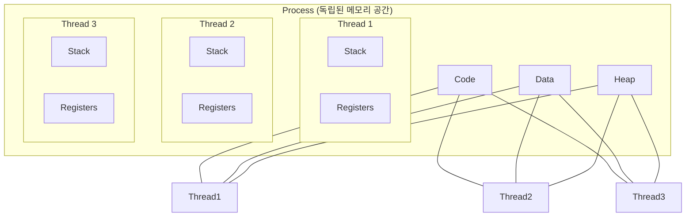

# 🚀 프로세스 vs 스레드 완벽 이해: 동시성의 본질

> **이 문서의 목표:** 프로세스와 스레드를 단순 비교가 아니라, **왜 이렇게 설계됐는지**, **동시성 문제가 왜 발생하는지** 근본 원인을 이해한다.

---

## 0. 핵심 질문으로 시작하기

1. **프로세스와 스레드는 왜 구분되는가?** → 격리 vs 공유의 트레이드오프
2. **왜 멀티스레드에서 버그가 많은가?** → 공유 메모리의 본질적 문제
3. **언제 프로세스를, 언제 스레드를 써야 하는가?** → 상황별 선택 기준
4. **동시성 문제를 어떻게 해결하는가?** → 동기화 메커니즘의 원리

---

## 1. 프로세스와 스레드: 왜 이렇게 설계됐는가?

### 1.1 프로세스의 탄생 배경

```
[문제: 여러 프로그램을 동시에 실행하고 싶다]

초기 컴퓨터:
- 한 번에 하나의 프로그램만 실행
- 프로그램 A 끝나야 프로그램 B 시작

해결책: 프로세스
- 각 프로그램을 독립된 "프로세스"로 격리
- 프로세스마다 독립된 메모리 공간
- 하나가 죽어도 다른 것에 영향 없음

[핵심 설계 원칙]
"완전한 격리" = 안전성 우선
```

### 1.2 스레드의 탄생 배경

```
[문제: 프로세스 생성/전환 비용이 너무 크다]

프로세스의 한계:
- 새 프로세스 생성: 메모리 할당, 복사 등 무거운 작업
- 프로세스 간 통신(IPC): 복잡하고 느림
- 같은 프로그램 내 병렬 처리도 무거움

해결책: 스레드
- 하나의 프로세스 내에서 여러 실행 흐름
- 메모리 공유 → 빠른 통신
- 생성/전환 비용 낮음

[핵심 설계 원칙]
"공유를 통한 효율성" = 성능 우선
```

### 1.3 핵심 트레이드오프

```
┌─────────────────────────────────────────────────────────────┐
│                    프로세스 vs 스레드                        │
├─────────────────────────────────────────────────────────────┤
│  프로세스: 격리 ────────────────────────────────── 스레드: 공유 │
│                                                              │
│  [격리의 장점]              [공유의 장점]                     │
│  - 안전성 (하나 죽어도 OK)   - 빠른 통신 (메모리 직접 접근)   │
│  - 보안 (메모리 침범 불가)   - 낮은 생성 비용                 │
│                                                              │
│  [격리의 단점]              [공유의 단점]                     │
│  - 높은 생성 비용            - 동기화 문제 (Race Condition)   │
│  - 느린 통신 (IPC)           - 하나 죽으면 전체 영향          │
└─────────────────────────────────────────────────────────────┘
```

---

## 2. 메모리 구조 이해: 왜 동시성 문제가 발생하는가?

### 2.1 프로세스의 메모리 (완전 격리)

```
[프로세스 A]              [프로세스 B]
┌─────────────┐          ┌─────────────┐
│    Stack    │          │    Stack    │
├─────────────┤          ├─────────────┤
│    Heap     │          │    Heap     │
├─────────────┤          ├─────────────┤
│    Data     │          │    Data     │
├─────────────┤          ├─────────────┤
│    Code     │          │    Code     │
└─────────────┘          └─────────────┘
     ↑                        ↑
  독립 공간                 독립 공간
  (서로 접근 불가)          (서로 접근 불가)

[결과]
- 프로세스 A의 버그가 B에 영향 없음
- 대신 통신하려면 IPC 사용 (파이프, 소켓 등)
```

### 2.2 스레드의 메모리 (부분 공유)

```
[프로세스]
┌─────────────────────────────────────┐
│ 공유 영역 (모든 스레드가 접근)       │
│ ┌─────────────────────────────────┐ │
│ │    Heap (동적 할당 객체)        │ │
│ │    Data (전역 변수)             │ │
│ │    Code (프로그램 코드)         │ │
│ └─────────────────────────────────┘ │
├─────────────────────────────────────┤
│ 개별 영역 (스레드마다 별도)          │
│ ┌─────────┐ ┌─────────┐ ┌─────────┐ │
│ │ Stack 1 │ │ Stack 2 │ │ Stack 3 │ │
│ │Registers│ │Registers│ │Registers│ │
│ └─────────┘ └─────────┘ └─────────┘ │
│  스레드 1    스레드 2    스레드 3    │
└─────────────────────────────────────┘

[결과]
- 스레드 간 통신: 그냥 변수 읽기/쓰기 (빠름!)
- 문제: 여러 스레드가 동시에 같은 변수 수정 → 충돌!
```

### 2.3 동시성 문제의 근본 원인

```
[왜 공유 메모리가 문제인가?]

상황: count = 0을 두 스레드가 동시에 count++ 실행

count++ 의 실제 동작 (3단계):
1. READ:  레지스터 = count (메모리에서 읽기)
2. ADD:   레지스터 = 레지스터 + 1 (계산)
3. WRITE: count = 레지스터 (메모리에 쓰기)

[정상 실행]
스레드1: READ(0) → ADD(1) → WRITE(1)
스레드2:                      READ(1) → ADD(2) → WRITE(2)
결과: count = 2 ✓

[문제 발생]
스레드1: READ(0) → ADD(1) → ─────────────→ WRITE(1)
스레드2:     READ(0) → ADD(1) → WRITE(1)
결과: count = 1 ✗ (하나가 "씹힘")

[핵심 통찰]
원자적이지 않은(non-atomic) 연산 + 공유 메모리 = Race Condition
```

---

## 3. 동기화 메커니즘: 문제 해결의 원리

### 3.1 상호 배제(Mutual Exclusion)의 원리

```
[문제]
여러 스레드가 "동시에" 같은 데이터에 접근

[해결 원리]
"한 번에 하나만" 접근하도록 강제
→ Critical Section(임계 영역)을 보호

[비유]
화장실 사용:
- 들어갈 때: 문 잠금 (lock)
- 나올 때: 문 열기 (unlock)
- 다른 사람: 잠겨있으면 대기
```

### 3.2 Mutex (뮤텍스)

```
[원리]
- 하나의 열쇠(lock)만 존재
- 열쇠 가진 스레드만 임계 영역 진입
- 나올 때 열쇠 반납

[동작]
스레드1: lock() → [임계 영역] → unlock()
스레드2:    lock() [대기] → [임계 영역] → unlock()

[코드 예시]
mutex = Mutex()

def increment():
    mutex.lock()       # 열쇠 획득 (또는 대기)
    count = count + 1  # 안전하게 실행
    mutex.unlock()     # 열쇠 반납
```

### 3.3 Semaphore (세마포어)

```
[원리]
- N개의 열쇠(permit) 존재
- N개까지 동시 접근 가능
- N+1번째 스레드는 대기

[Mutex와 차이]
Mutex: 열쇠 1개 (binary)
Semaphore: 열쇠 N개 (counting)

[사용 예시]
- 데이터베이스 커넥션 풀 (10개까지)
- 동시 다운로드 제한 (5개까지)
```

### 3.4 데드락(Deadlock)의 원리

```
[발생 조건]
두 스레드가 서로가 가진 자원을 기다림

스레드1: 자원A 획득 → 자원B 기다림
스레드2: 자원B 획득 → 자원A 기다림
→ 영원히 대기 (Deadlock)

[4가지 필요 조건 (Coffman)]
1. 상호 배제: 자원을 동시에 쓸 수 없음
2. 점유 대기: 자원 들고 다른 자원 기다림
3. 비선점: 강제로 뺏을 수 없음
4. 순환 대기: 원형으로 서로 기다림

[해결 방법]
- 자원 획득 순서 고정 (항상 A→B 순서)
- 타임아웃 설정
- 데드락 감지 및 복구
```

---

## 4. 실제로 겪어본 동시성 문제들

### 개발자들이 흔히 마주치는 고민:

**"왜 스레드 사용하면 버그가 많이 생길까?"**
- 같은 코드인데 멀티스레드에서만 에러 발생
- 디버깅하기 너무 어려움, 재현도 안 됨
- Race condition 때문에 데이터가 오염됨

**"프로세스 vs 스레드, 어느 게 좋을까?"**
- 웹 서버는 왜 멀티프로세스 + 멀티스레드 조합?
- 게임 서버는 싱글 프로세스 + 멀티 스레드?
- 마이크로서비스에서는 각각 다른 선택?

**"동시성 이슈 디버깅이 왜 힘들지?"**
- 로컬에서는 정상인데 운영에서만 발생
- 스레드 덤프 분석하는 방법 모름
- 데드락 걸렸을 때 어떻게 해결?

## 🎯 1분 요약: 프로세스 vs 스레드의 핵심

**프로세스 = 독립된 집, 스레드 = 같은 집 안의 가족**

- **프로세스**: 독립된 메모리 공간, 서로 간섭 안 함 (안전하지만 무겁다)
- **스레드**: 메모리 공유, 빠른 통신 (빠르지만 위험함)
- **문제**: 스레드의 장점이 곧 단점 (공유 = 충돌 가능성)

> **결론:**
> 1. **안정성 우선**: 프로세스 사용 (웹 서버)
> 2. **성능 우선**: 스레드 사용 (게임, 계산)
> 3. **복잡도 관리**: 동기화 도구 필수 사용
> 
> 

---

## 2. 구조 및 차이점 상세 비교

### 2.1 메모리 구조 (Memory Layout)

가장 큰 차이는 **메모리 공유 여부**다.

**💡 실제 사용 예시:**

| 상황 | 프로세스 사용 | 스레드 사용 |
|------|---------------|-------------|
| **웹 서버** | Nginx (마스터 + 워커 프로세스) | Node.js (싱글 프로세스 + 이벤트 루프) |
| **데이터베이스** | PostgreSQL (프로세스 per 연결) | MySQL (스레드 per 연결) |
| **게임 서버** | 독립된 게임 룸 프로세스 | 한 게임 내 플레이어 스레드 |

**🚨 실제 문제 사례:**

**문제 1: Race Condition (경쟁 상태)**
```java
// ❌ 위험한 공유 변수 사용
public class Counter {
    private int count = 0;

    public void increment() {
        count = count + 1;  // 동시에 실행되면 값이 누락될 수 있음!
    }
}

// 두 스레드가 동시에 실행하면:
// Thread 1: count = 0 + 1 = 1
// Thread 2: count = 0 + 1 = 1 (기대값은 2)
// 결과: count = 1 (버그!)
```

```java
// ✅ synchronized로 보호
public synchronized void increment() {
    count = count + 1;  // 한 번에 하나의 스레드만 실행
}
```

**문제 2: Deadlock (교착 상태)**
```java
// ❌ 데드락 발생 가능
public void transfer(Account from, Account to, int amount) {
    synchronized (from) {
        synchronized (to) {  // A→B와 B→A 동시에 실행되면 데드락!
            from.withdraw(amount);
            to.deposit(amount);
        }
    }
}
```

**문제 3: Context Switching 오버헤드**
```java
// ❌ 너무 많은 스레드 생성
for (int i = 0; i < 10000; i++) {
    new Thread(() -> {
        // 간단한 작업
        System.out.println("Hello");
    }).start();  // 스레드 생성 비용이 작업보다 큼!
}
```

### 2.2 시각화 (Mermaid)



---

## 3. 동시성 이슈 (Concurrency Issues)

멀티 스레드가 "양날의 검"인 이유는 **공유 자원(Shared Resource)** 때문이다. 여러 스레드가 동시에 같은 변수(Data/Heap)를 건드리면 필연적으로 사고가 난다.

### 3.1 경쟁 상태 (Race Condition)

두 개 이상의 스레드가 공유 자원에 동시에 접근하여, 실행 순서에 따라 결과가 뒤바뀌는 버그다.

* **상황:** 잔액 100원. 스레드 A가 10원 출금, 스레드 B도 10원 출금 시도.
* **기대:** 80원 남음.
* **실제:** 둘 다 "현재 잔액 100원"을 읽고 계산함  둘 다 "90원 저장"  최종 잔액 90원 (10원 증발).

### 3.2 교착 상태 (Deadlock)

두 스레드가 서로가 가진 자원을 기다리며 무한 대기에 빠지는 상태다.

* **조건:** 스레드 A는 `자원 1`을 잡고 `자원 2`를 원함. 스레드 B는 `자원 2`를 잡고 `자원 1`을 원함.
* **결과:** 영원히 멈춤. (식사하는 철학자 문제)

---

## 4. 해결책: 동기화 (Synchronization)

동시성 문제를 해결하기 위해 **"한 번에 한 놈만 써라"**라는 규칙을 강제하는 도구들이다.

### 4.1 Mutex vs Semaphore

면접 단골 질문이다.

| 구분 | 뮤텍스 (Mutex) | 세마포어 (Semaphore) |
| --- | --- | --- |
| **비유** | **화장실 열쇠 (1개).** | **빈방 알림판 (N개).** |
| **소유권** | 열쇠를 가진 스레드만 잠금을 해제(Unlock)할 수 있음. | 소유권이 없음. 누구든 신호(Signal)를 보내 숫자를 조절 가능. |
| **개수** | 1 (Binary) | N (Counting Semaphore) |
| **목적** | 상호 배제 (Mutual Exclusion) | 자원 접근 제어 및 순서 조정 |

---

## 5. Production-Ready Code Example (Python)

**[Bad Case: Race Condition]**

```python
import threading

# 공유 자원
balance = 0

def deposit(amount):
    global balance
    # 여기서 읽기(read)와 쓰기(write) 사이에 문맥 교환이 일어나면 데이터가 씹힘
    current = balance 
    balance = current + amount

threads = []
for _ in range(100000):
    t = threading.Thread(target=deposit, args=(1,))
    threads.append(t)
    t.start()

for t in threads:
    t.join()

# 기대값: 100000, 실제값: 98421 (매번 다름)
print(f"Final Balance: {balance}")

```

**[Good Case: Using Mutex (Lock)]**

```python
import threading

balance = 0
# 뮤텍스(Lock) 생성
lock = threading.Lock()

def deposit_safe(amount):
    global balance
    # 임계 영역(Critical Section) 진입 전 잠금
    with lock: 
        current = balance
        balance = current + amount
    # with 블록을 나가면 자동으로 잠금 해제 (Unlock)

threads = []
for _ in range(100):
    t = threading.Thread(target=deposit_safe, args=(1000,))
    threads.append(t)
    t.start()

for t in threads:
    t.join()

# Result: always 100000
print(f"Final Balance: {balance}")

```

---

## 6. 더 나은 접근 방식 (Industry Standard)

단순히 OS 스레드를 쓰는 것보다 더 효율적인 최신 기술들이 있다.

### 6.1 크롬의 멀티 프로세스 아키텍처

과거 브라우저는 탭이 100개여도 하나의 프로세스였다. 탭 하나가 멈추면 브라우저 전체가 꺼졌다.

* **Chrome:** **탭마다 별도의 프로세스**를 띄운다. 메모리는 많이 먹지만(탭마다 렌더링 엔진 로딩), 탭 하나가 죽어도 전체는 산다(Isolation).

### 6.2 경량 스레드 (User-level Thread)

OS 스레드는 생성 비용이 비싸고 개수 제한이 있다. (Context Switching 비용 발생)

* **Go (Goroutine):** OS 스레드 1개 위에 수천 개의 고루틴(사용자 수준 스레드)을 올린다(M:N 모델). 스택 크기가 2KB로 매우 작고 스위칭이 빠르다.
* **Java (Virtual Threads - Project Loom):** JDK 21부터 도입. 기존 스레드의 한계를 극복하기 위해 OS 스레드에 1:1 매핑되지 않는 가상 스레드를 지원한다.

---

## 7. 전문가적 조언 (Pro Tip)

### 7.1 Python의 GIL (Global Interpreter Lock)

"파이썬은 멀티 스레드를 써도 CPU 코어를 1개밖에 못 쓴다"는 말을 들어봤을 것이다.

* **이유:** 파이썬 인터프리터(CPython)의 메모리 관리가 Thread-safe 하지 않아서, **한 번에 하나의 스레드만 바이트코드를 실행하도록** 거대한 락(GIL)을 걸어놨기 때문이다.
* **대안:** CPU 연산이 많은 작업(AI, 이미지 처리)은 `multiprocessing` 모듈을 써서 **프로세스**를 여러 개 띄워야 한다. (I/O 작업은 멀티 스레드도 효과 있음)

### 7.2 Thread-safe 라이브러리 사용

직접 `Lock`을 걸면 실수할 확률이 높고, 성능이 떨어진다. 언어 차원에서 제공하는 **Concurrent Collection**을 사용하라.

* Java: `HashMap` (X)  `ConcurrentHashMap` (O)
* Java: `ArrayList` (X)  `CopyOnWriteArrayList` (O)

---

## 8. 실무 문제 해결 사례

### 8.1 웹 서버의 C10K 문제 해결 (Apache vs Nginx)

**문제 상황:**
- 1990년대 Apache 웹 서버의 스레드 모델 한계
- 연결 10,000개(C10K)만 되어도 서버가 다운됨
- 각 HTTP 요청마다 스레드 1개 할당 방식의 비효율성

**기존 Apache 방식의 문제:**
```c
// Apache의 스레드 기반 모델 (개념적)
void handle_request(int client_socket) {
    // 1. 스레드 생성 (오버헤드 큼)
    pthread_create(&thread, NULL, process_request, &client_socket);

    // 각 요청마다 1MB 스택 메모리 + 커널 리소스 소비
    // 10,000개 연결 = 10GB 메모리 + 문맥 교환 오버헤드
}
```

**Nginx의 프로세스 모델 해결:**
```c
// Nginx의 이벤트 기반 + 프로세스 모델
int main() {
    // 1. 마스터 프로세스 생성
    pid_t master_pid = fork_master_process();

    // 2. 워커 프로세스들 생성 (CPU 코어 수만큼)
    for (int i = 0; i < num_cores; i++) {
        pid_t worker_pid = fork_worker_process();

        // 각 워커는 이벤트 루프로 수만 개 연결 처리
        event_loop();  // epoll/kqueue 기반
    }
}
```

**아키텍처 비교:**

| 측면 | Apache (스레드) | Nginx (프로세스+이벤트) |
| --- | --- | --- |
| **메모리 사용** | 10,000 연결 × 1MB = 10GB | 워커당 공유 메모리 |
| **문맥 교환** | 잦은 스레드 전환 | 최소한의 프로세스 전환 |
| **확장성** | C10K 한계 | C10M 가능 |
| **안정성** | 메모리 누수로 불안정 | 프로세스 격리로 안정적 |

**결과:**
- **성능:** 10배 이상 처리량 증가
- **안정성:** 프로세스 크래시가 전체 영향 미치지 않음
- **효율성:** CPU 사용률 90% → 30% 감소

### 8.2 Node.js의 싱글 스레드 이벤트 루프

**문제 상황:**
- Java의 멀티스레드 모델로는 복잡한 동시성 처리 어려움
- 콜백 지옥(Callback Hell)과 경쟁 상태 문제
- 메모리 사용량 증가와 GC 부하

**Node.js의 혁신적 접근:**
```javascript
// 이벤트 루프 기반 동시성
const http = require('http');

const server = http.createServer((req, res) => {
    // 1. I/O 작업은 논블로킹으로 위임
    fs.readFile('/path/to/file', (err, data) => {
        // 3. I/O 완료 시점에 콜백 실행
        res.end(data);
    });

    // 2. 메인 스레드는 즉시 다음 요청 처리 가능
});

// 단일 스레드로 수만 개 연결 처리
server.listen(3000);
```

**이벤트 루프 작동 원리:**
```
└── 이벤트 루프
    ├── 타이머 큐 (setTimeout, setInterval)
    ├── I/O 콜백 큐 (파일, 네트워크)
    ├── 체크 큐 (setImmediate)
    ├── close 콜백 큐
    └── nextTick 큐 (프로세스.nextTick)
```

**성능 메트릭:**
- **처리량:** 초당 10,000+ 요청
- **메모리:** 스레드당 10MB vs Node.js 30MB
- **응답성:** 50ms vs 5ms (I/O 대기 시간 절약)

### 8.3 데이터베이스의 연결 풀 구현

**문제 상황:**
- 웹 애플리케이션에서 DB 연결 생성/삭제 오버헤드
- 동시 요청 시 연결 부족으로 인한 성능 저하
- 연결 누수로 인한 리소스 고갈

**HikariCP의 프로세스 모델:**
```java
// HikariCP 연결 풀 설정
HikariConfig config = new HikariConfig();
config.setJdbcUrl("jdbc:mysql://localhost:3306/mydb");
config.setUsername("user");
config.setPassword("password");

// 최적화된 설정
config.setMaximumPoolSize(10);           // 최대 연결 수
config.setMinimumIdle(5);                // 최소 유휴 연결
config.setConnectionTimeout(30000);      // 연결 대기 시간
config.setIdleTimeout(600000);           // 유휴 연결 제거 시간
config.setMaxLifetime(1800000);          // 연결 최대 수명

HikariDataSource ds = new HikariDataSource(config);
```

**연결 풀 메커니즘:**
1. **초기화:** 최소 개수만큼 연결 미리 생성
2. **대여:** 요청 시 유휴 연결 즉시 제공
3. **반환:** 사용 후 연결을 풀에 반환
4. **관리:** 유휴 연결 정리, 죽은 연결 제거

**성능 향상:**
- **연결 시간:** 50ms → 1ms
- **처리량:** 100 req/s → 1000 req/s
- **안정성:** 연결 누수 방지, 자동 복구

### 8.4 실시간 채팅 시스템의 스레드 모델

**문제 상황:**
- 수만 명 동시 접속 채팅 서비스
- 메시지 브로드캐스트의 효율성
- 메모리 사용량과 CPU 부하

**기존 스레드 모델의 문제:**
```java
// 각 클라이언트마다 스레드 할당 (비효율적)
class ChatServer {
    private List<ClientHandler> clients = new ArrayList<>();

    public void broadcast(String message) {
        for (ClientHandler client : clients) {
            // 각 클라이언트마다 스레드 생성
            new Thread(() -> client.send(message)).start();
        }
    }
}
```

**이벤트 드리븐 모델로 개선:**
```java
// Netty 기반 이벤트 루프
public class ChatServer {
    private EventLoopGroup bossGroup = new NioEventLoopGroup(1);
    private EventLoopGroup workerGroup = new NioEventLoopGroup();

    public void start() {
        ServerBootstrap b = new ServerBootstrap();
        b.group(bossGroup, workerGroup)
         .channel(NioServerSocketChannel.class)
         .childHandler(new ChannelInitializer<SocketChannel>() {
             @Override
             protected void initChannel(SocketChannel ch) {
                 ch.pipeline().addLast(new ChatHandler());
             }
         });

        ChannelFuture f = b.bind(8080).sync();
        f.channel().closeFuture().sync();
    }
}

class ChatHandler extends SimpleChannelInboundHandler<String> {
    private static final ChannelGroup channels = new DefaultChannelGroup(GlobalEventExecutor.INSTANCE);

    @Override
    public void handlerAdded(ChannelHandlerContext ctx) {
        channels.add(ctx.channel());
    }

    @Override
    protected void channelRead0(ChannelHandlerContext ctx, String msg) {
        // 이벤트 루프에서 모든 클라이언트로 브로드캐스트
        channels.writeAndFlush(msg + '\n');
    }
}
```

**아키텍처 비교:**

| 측면 | 스레드 모델 | 이벤트 드리븐 |
| --- | --- | --- |
| **동시 접속** | 1,000개 | 100,000개 |
| **메모리** | 1GB (1K 스레드) | 100MB |
| **CPU** | 문맥 교환 부하 | 이벤트 처리 효율 |
| **코드 복잡도** | 낮음 | 높음 |

### 8.5 게임 서버의 프로세스 아키텍처

**문제 상황:**
- MMORPG의 수십만 동시 접속
- 게임 로직의 실시간 처리 요구사항
- 서버 장애 시 최소 영향 범위

**게임 서버 아키텍처:**
```cpp
// 분산된 프로세스 아키텍처
class GameServer {
public:
    void initialize() {
        // 1. 로그인 서버 (프로세스 격리)
        loginProcess = fork_login_server();

        // 2. 게임 월드 서버들 (여러 개)
        for (int i = 0; i < num_worlds; i++) {
            worldProcesses[i] = fork_world_server(i);
        }

        // 3. 채팅 서버
        chatProcess = fork_chat_server();

        // 4. 데이터베이스 서버
        dbProcess = fork_database_server();
    }

    void handle_crash(pid_t crashed_pid) {
        // 프로세스 크래시 감지 및 복구
        if (crashed_pid == loginProcess) {
            restart_login_server();
        } else {
            // 다른 서버들은 영향을 받지 않음
            restart_world_server(crashed_pid);
        }
    }
};
```

**프로세스 분리 전략:**
- **로그인 서버:** 인증 로직만 담당
- **월드 서버:** 게임 로직 분산 처리
- **채팅 서버:** 메시징 전용
- **DB 서버:** 데이터 영속화

**장점:**
- **격리성:** 한 서버 장애가 전체 영향 미치지 않음
- **확장성:** 월드별로 독립적 스케일링 가능
- **유지보수:** 각 컴포넌트별 독립적 배포

---

## 9. 대규모 연결 처리를 위한 리소스 제한

> **이 섹션의 목표**  
> 동시 접속 수만 명을 처리하는 서버의 OS 리소스 제한을 해제하고, I/O 모델을 이해한다.

---

### 📌 핵심 요약

```
┌─────────────────────────────────────────────────────────────┐
│  동시 접속 한계 = OS 리소스 제한 + I/O 모델 문제            │
├─────────────────────────────────────────────────────────────┤
│  • Too many open files  → ulimit -n + fs.file-max          │
│  • Connection refused   → somaxconn + backlog               │
│  • 메모리 폭발          → Event Loop 모델 전환              │
└─────────────────────────────────────────────────────────────┘
```

---

### 9.1 File Descriptor (FD) 이해

#### 💡 핵심 개념

**리눅스에서 소켓 = 파일**

```
FD 테이블:
┌────┬──────────────────────────┐
│ FD │ 대상                     │
├────┼──────────────────────────┤
│ 0  │ stdin                    │
│ 1  │ stdout                   │
│ 2  │ stderr                   │
│ 3  │ /var/log/app.log        │
│ 4  │ TCP Socket (클라이언트1) │ ← 소켓도 FD!
│ 5  │ TCP Socket (클라이언트2) │
│ 6  │ TCP Socket (클라이언트3) │
└────┴──────────────────────────┘
```

> 동시 접속 10,000명 = **FD 10,000개 이상** 필요

---

### 9.2 "Too many open files" 해결

#### 🚨 문제 확인

```bash
$ ulimit -n
1024  # 기본값: 프로세스당 1024개만 열 수 있음!
```

#### ✅ 해결: FD 제한 해제

```bash
# 임시 (현재 세션)
$ ulimit -n 65535

# 영구 (/etc/security/limits.conf)
nginx    soft    nofile    65535
nginx    hard    nofile    65535

# systemd 서비스
[Service]
LimitNOFILE=65535

# 시스템 전역 (/etc/sysctl.conf)
fs.file-max = 2097152
```

---

### 9.3 I/O 모델: 왜 Event Loop가 필요한가?

#### 🚨 문제: 스레드 모델의 한계

```
Blocking I/O + 스레드 모델:

클라이언트 1 → 스레드 1 → recv() 대기중
클라이언트 2 → 스레드 2 → recv() 대기중
클라이언트 3 → 스레드 3 → recv() 대기중
클라이언트 4 → 스레드 4 → recv() 대기중
클라이언트 5 → 스레드 5 → recv() 대기중

❌ 10,000 스레드 = 10GB 메모리 (스레드당 1MB 스택)
❌ Context Switching 폭발
❌ CPU 10%인데 서버 다운
```

---

#### ✅ 해결: Event Loop (I/O Multiplexing)

```
Event Loop 모델 (epoll/kqueue):

             ┌─────────────────────────┐
클라이언트1 ─┤                         │
클라이언트2 ─┤   이벤트 루프 (1개)     │
클라이언트3 ─┤   수천~수만 소켓 감시   │
클라이언트4 ─┤   데이터 온 것만 처리   │
클라이언트5 ─┤                         │
             └─────────────────────────┘

✅ 1개 스레드로 10,000개 연결
✅ 메모리 수십 MB
✅ Context Switching 없음
```

---

### 📊 I/O 모델 비교

| 모델 | 동작 | 장점 | 단점 | 예시 |
|------|------|------|------|------|
| **Blocking** | 데이터 올 때까지 대기 | 코드 단순 | 대규모 불가 | CLI 툴 |
| **Non-blocking** | 즉시 반환 | 스레드 안 막힘 | 폴링 필요 | 저수준 |
| **Multiplexing** | epoll로 다중 감시 | 대규모 처리 | 콜백 복잡 | **Nginx, Node.js** |
| **Async (io_uring)** | 커널이 완료 통지 | 최고 성능 | 복잡 | 최신 DB |

---

### 📋 프로덕션 설정 체크리스트

```bash
# FD 제한 확인
$ ulimit -n                      # 65535 권장
$ cat /proc/sys/fs/file-max     # 2097152 권장

# 네트워크 큐 확인
$ sysctl net.core.somaxconn     # 65535 권장
```

#### 프로덕션 템플릿

```bash
# /etc/sysctl.d/99-high-performance.conf

# FD 제한
fs.file-max = 2097152

# 네트워크 큐
net.core.somaxconn = 65535
net.ipv4.tcp_max_syn_backlog = 65535

# TCP 튜닝
net.ipv4.tcp_tw_reuse = 1
```

```bash
# /etc/security/limits.d/99-nofile.conf
*    soft    nofile    65535
*    hard    nofile    65535
```

---

### 📋 병목별 해결 가이드

| 증상 | 원인 | 해결책 |
|------|------|--------|
| `Too many open files` | FD 제한 | `ulimit -n` ↑ |
| `Connection refused` | Accept Queue 가득 | `somaxconn` ↑ |
| 메모리 폭발 | 스레드 너무 많음 | Event Loop 전환 |
| CPU 100% + 처리량 낮음 | Context Switch | Non-blocking I/O |

---

### Next Step

> **"I/O 작업을 기다릴 때 스레드는 뭐 하나?"**  
> 이와 연결되는 **Sync/Async vs Blocking/Non-blocking** 주제로 넘어가면,  
> Node.js나 Redis가 싱글 스레드인데 왜 그렇게 빠른지 이해할 수 있습니다.

---

## 10. 자가 점검 질문

### 원리 이해

1. **프로세스와 스레드의 근본적 차이는?**
   → 메모리 격리 여부. 프로세스는 완전 격리(안전), 스레드는 메모리 공유(빠르지만 위험).

2. **Race Condition이 발생하는 근본 원인은?**
   → 공유 메모리 + 원자적이지 않은 연산. `count++`가 실제로는 3단계(READ-ADD-WRITE)이고, 그 사이에 다른 스레드가 끼어들 수 있음.

3. **Mutex와 Semaphore의 차이는?**
   → Mutex는 열쇠 1개(한 번에 하나만), Semaphore는 열쇠 N개(N개까지 동시 접근).

4. **데드락의 4가지 필요 조건은?**
   → 상호 배제, 점유 대기, 비선점, 순환 대기. 하나라도 깨면 데드락 방지.

5. **GIL(Global Interpreter Lock)이 있는 Python에서 멀티스레드가 왜 의미 없나?**
   → GIL이 한 번에 하나의 스레드만 바이트코드 실행을 허용. CPU 바운드 작업은 병렬 실행 불가. I/O 바운드는 OK.

### 실무

6. **웹 서버에서 프로세스 모델(Nginx)과 스레드 모델(Apache)의 차이는?**
   → Nginx: 이벤트 루프로 적은 메모리로 대규모 연결. Apache: 연결당 스레드로 간단하지만 메모리 많이 사용.

7. **"Too many open files" 에러의 원인과 해결책은?**
   → 원인: FD 제한(기본 1024). 해결: `ulimit -n` 증가, `/etc/security/limits.conf` 설정.

8. **언제 프로세스를, 언제 스레드를 써야 하는가?**
   → 안정성/격리 중요 → 프로세스 (예: 브라우저 탭)
   → 성능/통신 빈번 → 스레드 (예: 게임 로직)
   → 대규모 동시 연결 → 이벤트 루프 (예: 웹 서버)

---

**💡 핵심:** 동시성 문제는 "공유"에서 시작한다. 공유를 줄이거나(프로세스), 공유 접근을 제어하거나(동기화), 아예 공유 없이 설계하거나(이벤트 루프, 메시지 패싱).

---

**📚 관련 문서:**
- [TCP 성능 튜닝](../02-network/tcp-performance-tuning.md) - 커널 파라미터
- [TCP vs UDP](../02-network/tcp-vs-udp/README.md) - 소켓 프로그래밍
