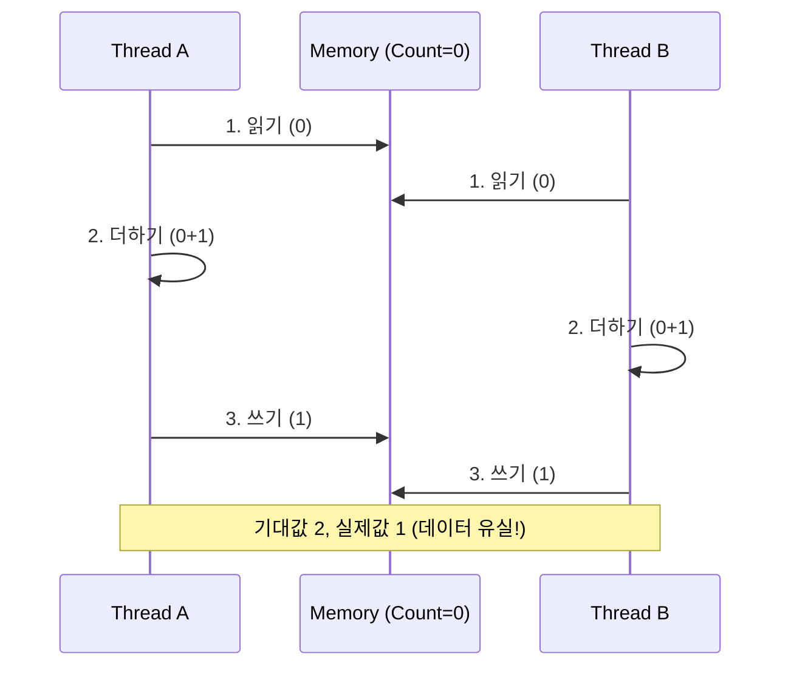

# 🚀 프로세스 vs 스레드: 동시성의 본질

> **이 문서의 목표:** 프로세스와 스레드를 단순 비교가 아니라, **왜 이렇게 설계됐는지**, **동시성 문제가 왜 발생하는지** 근본 원인을 이해하고 상황에 맞는 아키텍처를 선택한다.

---

## 0. 핵심 질문으로 시작하기

1.  **프로세스와 스레드의 결정적 차이는?** → "메모리 공유" 여부. 프로세스는 격리(Isolation), 스레드는 공유(Sharing).
2.  **왜 멀티스레드에서 버그가 많은가?** → 공유 자원에 대한 동시 접근(Race Condition)을 제어하기 어렵기 때문.
3.  **언제 프로세스를, 언제 스레드를 써야 하는가?** → 안전성/격리가 필요하면 프로세스(예: 크롬 탭), 빠른 성능/통신이 필요하면 스레드(예: 게임 로직).
4.  **동시성 문제(Race Condition, Deadlock)의 해결책은?** → Mutex, Semaphore 등을 이용한 동기화(Synchronization).

---

## 1. [개념 정의]: 격리할 것인가, 공유할 것인가? (Why)

컴퓨터가 여러 일을 동시에 처리하는 방법은 크게 두 가지입니다.

1.  **프로세스 (Process)**: "벽으로 막힌 독립된 방". 서로의 소리를 들을 수 없음. 안전하지만 소통하려면 전화(IPC)를 써야 함.
2.  **스레드 (Thread)**: "같은 방에 있는 사람들". 말하면 바로 들림(메모리 공유). 빠르지만 한 명이 사고 치면 다 같이 망함.

> [!NOTE]
> **핵심 통찰:** 프로세스는 **안정성(격리)**을 위해, 스레드는 **효율성(공유)**을 위해 설계되었습니다.

---

## 2. [원리/구조]: 메모리 관점의 차이 (How)

### 2.1 메모리 구조 비교

*   **프로세스**: Code, Data, Heap, Stack을 **모두 독립적**으로 가짐.
*   **스레드**: Code, Data, Heap은 **공유**하고, Stack(함수 실행 흐름)만 **독립적**으로 가짐.

```mermaid
graph TB
    subgraph Process_Memory [프로세스 메모리 구조]
        Code[Code (공유)]
        Data[Data (공유)]
        Heap[Heap (공유)]
        
        subgraph Thread_1 [Thread 1]
            Stack1[Stack]
            Reg1[Registers]
        end
        
        subgraph Thread_2 [Thread 2]
            Stack2[Stack]
            Reg2[Registers]
        end
    end
    
    Code --- Thread_1
    Code --- Thread_2
    Data --- Thread_1
    Data --- Thread_2
    Heap --- Thread_1
    Heap --- Thread_2
    
    style Process_Memory fill:#e3f2fd,stroke:#1565c0
    style Thread_1 fill:#fff9c4,stroke:#fbc02d
    style Thread_2 fill:#fff9c4,stroke:#fbc02d
```

### 2.2 동시성 문제의 근본 원인 (Race Condition)

스레드들이 Heap(공유 메모리)을 같이 쓰기 때문에 발생합니다.



---

## 3. [실전/구현]: 동기화와 아키텍처 선택 (What)

### 3.1 동기화 도구 (Synchronization)

공유 자원을 보호하기 위해 "한 번에 한 명만 들어오게" 하는 장치입니다.

| 도구 | 비유 | 특징 |
| :--- | :--- | :--- |
| **Mutex** | 화장실 열쇠 (1개) | 오직 1개의 스레드만 접근 가능 (Lock/Unlock). |
| **Semaphore** | 빈 방 알림판 (N개) | N개의 스레드까지 동시 접근 허용. |

### 3.2 코드 예시: Thread-Safe 카운터

```java
// ❌ Bad: 동기화 없음 (값이 씹힘)
public void increment() {
    count++; 
}

// ✅ Good: Mutex(Lock) 사용
public synchronized void increment() {
    count++;
}
```

### 3.3 아키텍처 선택 가이드

*   **Chrome 브라우저**: **멀티 프로세스**. 탭 하나가 멈춰도(Crash) 브라우저 전체가 안 꺼지게 하기 위함.
*   **Web Server (Nginx)**: **이벤트 루프(싱글 스레드) + 멀티 프로세스**. 적은 메모리로 대량 접속 처리.
*   **Game Server**: **멀티 스레드**. 빠른 데이터 공유와 실시간 처리가 중요함.

> [!WARNING]
> **데드락(Deadlock) 주의:** 스레드 A가 자원 1을 잡고 2를 기다리고, 스레드 B가 자원 2를 잡고 1을 기다리면 영원히 멈춥니다. 자원 획득 순서를 통일해야 합니다.

---

## 4. 🎯 1분 요약

1.  **프로세스**: 독립된 실행 단위. 메모리 격리. 안전하지만 생성/전환 비용이 비쌈.
2.  **스레드**: 프로세스 내의 실행 흐름. 메모리 공유. 빠르고 가볍지만 동기화 문제 발생.
3.  **동시성 이슈**: 공유 자원(Heap/Data) 동시 접근 시 **Race Condition** 발생 → **Lock(Mutex)**으로 해결.
4.  **선택 기준**: 안정성/격리가 중요하면 프로세스, 성능/공유가 중요하면 스레드.

---

## 5. 📝 자가 점검 질문

1.  **스택(Stack) 영역을 스레드끼리 공유하지 않는 이유는?**
    → 스택은 함수 호출과 실행 흐름을 저장하는 곳이므로, 독립적인 실행을 위해 각자 가져야 한다.
2.  **데드락(Deadlock)의 4가지 필요 조건 중 하나만 설명한다면?**
    → 순환 대기(Circular Wait): 꼬리에 꼬리를 물고 서로의 자원을 기다리는 상황.
3.  **Context Switching 비용은 프로세스와 스레드 중 누가 더 큰가?**
    → 프로세스. 메모리 주소 공간(TLB, 캐시 등)을 전부 갈아엎어야 하기 때문.
4.  **Python의 GIL(Global Interpreter Lock)은 무엇인가?**
    → 파이썬 인터프리터가 한 번에 하나의 스레드만 바이트코드를 실행하게 제한하는 락. (멀티스레드여도 CPU 1개만 씀)
