# 🚀 프로세스 vs 스레드: 왜 동시성이 어려운가?

## 🥺 실제로 겪어본 동시성 문제들

### 개발자들이 흔히 마주치는 고민:

**"왜 스레드 사용하면 버그가 많이 생길까?"**
- 같은 코드인데 멀티스레드에서만 에러 발생
- 디버깅하기 너무 어려움, 재현도 안 됨
- Race condition 때문에 데이터가 오염됨

**"프로세스 vs 스레드, 어느 게 좋을까?"**
- 웹 서버는 왜 멀티프로세스 + 멀티스레드 조합?
- 게임 서버는 싱글 프로세스 + 멀티 스레드?
- 마이크로서비스에서는 각각 다른 선택?

**"동시성 이슈 디버깅이 왜 힘들지?"**
- 로컬에서는 정상인데 운영에서만 발생
- 스레드 덤프 분석하는 방법 모름
- 데드락 걸렸을 때 어떻게 해결?

## 🎯 1분 요약: 프로세스 vs 스레드의 핵심

**프로세스 = 독립된 집, 스레드 = 같은 집 안의 가족**

- **프로세스**: 독립된 메모리 공간, 서로 간섭 안 함 (안전하지만 무겁다)
- **스레드**: 메모리 공유, 빠른 통신 (빠르지만 위험함)
- **문제**: 스레드의 장점이 곧 단점 (공유 = 충돌 가능성)

> **결론:**
> 1. **안정성 우선**: 프로세스 사용 (웹 서버)
> 2. **성능 우선**: 스레드 사용 (게임, 계산)
> 3. **복잡도 관리**: 동기화 도구 필수 사용
> 
> 

---

## 2. 구조 및 차이점 상세 비교

### 2.1 메모리 구조 (Memory Layout)

가장 큰 차이는 **메모리 공유 여부**다.

**💡 실제 사용 예시:**

| 상황 | 프로세스 사용 | 스레드 사용 |
|------|---------------|-------------|
| **웹 서버** | Nginx (마스터 + 워커 프로세스) | Node.js (싱글 프로세스 + 이벤트 루프) |
| **데이터베이스** | PostgreSQL (프로세스 per 연결) | MySQL (스레드 per 연결) |
| **게임 서버** | 독립된 게임 룸 프로세스 | 한 게임 내 플레이어 스레드 |

**🚨 실제 문제 사례:**

**문제 1: Race Condition (경쟁 상태)**
```java
// ❌ 위험한 공유 변수 사용
public class Counter {
    private int count = 0;

    public void increment() {
        count = count + 1;  // 동시에 실행되면 값이 누락될 수 있음!
    }
}

// 두 스레드가 동시에 실행하면:
// Thread 1: count = 0 + 1 = 1
// Thread 2: count = 0 + 1 = 1 (기대값은 2)
// 결과: count = 1 (버그!)
```

```java
// ✅ synchronized로 보호
public synchronized void increment() {
    count = count + 1;  // 한 번에 하나의 스레드만 실행
}
```

**문제 2: Deadlock (교착 상태)**
```java
// ❌ 데드락 발생 가능
public void transfer(Account from, Account to, int amount) {
    synchronized (from) {
        synchronized (to) {  // A→B와 B→A 동시에 실행되면 데드락!
            from.withdraw(amount);
            to.deposit(amount);
        }
    }
}
```

**문제 3: Context Switching 오버헤드**
```java
// ❌ 너무 많은 스레드 생성
for (int i = 0; i < 10000; i++) {
    new Thread(() -> {
        // 간단한 작업
        System.out.println("Hello");
    }).start();  // 스레드 생성 비용이 작업보다 큼!
}
```

### 2.2 시각화 (Mermaid)

```mermaid
graph TD
    subgraph "Process (독립된 메모리 공간)"
        Code[Code]
        Data[Data]
        Heap[Heap]
        
        subgraph "Thread 1"
            Stack1[Stack]
            Reg1[Registers]
        end
        
        subgraph "Thread 2"
            Stack2[Stack]
            Reg2[Registers]
        end
        
        subgraph "Thread 3"
            Stack3[Stack]
            Reg3[Registers]
        end
    end
    
    Code --- Thread1
    Code --- Thread2
    Code --- Thread3
    Data --- Thread1
    Data --- Thread2
    Data --- Thread3
    Heap --- Thread1
    Heap --- Thread2
    Heap --- Thread3

```



---

## 3. 동시성 이슈 (Concurrency Issues)

멀티 스레드가 "양날의 검"인 이유는 **공유 자원(Shared Resource)** 때문이다. 여러 스레드가 동시에 같은 변수(Data/Heap)를 건드리면 필연적으로 사고가 난다.

### 3.1 경쟁 상태 (Race Condition)

두 개 이상의 스레드가 공유 자원에 동시에 접근하여, 실행 순서에 따라 결과가 뒤바뀌는 버그다.

* **상황:** 잔액 100원. 스레드 A가 10원 출금, 스레드 B도 10원 출금 시도.
* **기대:** 80원 남음.
* **실제:** 둘 다 "현재 잔액 100원"을 읽고 계산함  둘 다 "90원 저장"  최종 잔액 90원 (10원 증발).

### 3.2 교착 상태 (Deadlock)

두 스레드가 서로가 가진 자원을 기다리며 무한 대기에 빠지는 상태다.

* **조건:** 스레드 A는 `자원 1`을 잡고 `자원 2`를 원함. 스레드 B는 `자원 2`를 잡고 `자원 1`을 원함.
* **결과:** 영원히 멈춤. (식사하는 철학자 문제)

---

## 4. 해결책: 동기화 (Synchronization)

동시성 문제를 해결하기 위해 **"한 번에 한 놈만 써라"**라는 규칙을 강제하는 도구들이다.

### 4.1 Mutex vs Semaphore

면접 단골 질문이다.

| 구분 | 뮤텍스 (Mutex) | 세마포어 (Semaphore) |
| --- | --- | --- |
| **비유** | **화장실 열쇠 (1개).** | **빈방 알림판 (N개).** |
| **소유권** | 열쇠를 가진 스레드만 잠금을 해제(Unlock)할 수 있음. | 소유권이 없음. 누구든 신호(Signal)를 보내 숫자를 조절 가능. |
| **개수** | 1 (Binary) | N (Counting Semaphore) |
| **목적** | 상호 배제 (Mutual Exclusion) | 자원 접근 제어 및 순서 조정 |

---

## 5. Production-Ready Code Example (Python)

**[Bad Case: Race Condition]**

```python
import threading

# 공유 자원
balance = 0

def deposit(amount):
    global balance
    # 여기서 읽기(read)와 쓰기(write) 사이에 문맥 교환이 일어나면 데이터가 씹힘
    current = balance 
    balance = current + amount

threads = []
for _ in range(100000):
    t = threading.Thread(target=deposit, args=(1,))
    threads.append(t)
    t.start()

for t in threads:
    t.join()

# 기대값: 100000, 실제값: 98421 (매번 다름)
print(f"Final Balance: {balance}")

```

**[Good Case: Using Mutex (Lock)]**

```python
import threading

balance = 0
# 뮤텍스(Lock) 생성
lock = threading.Lock()

def deposit_safe(amount):
    global balance
    # 임계 영역(Critical Section) 진입 전 잠금
    with lock: 
        current = balance
        balance = current + amount
    # with 블록을 나가면 자동으로 잠금 해제 (Unlock)

# ... (실행 코드는 위와 동일)
# 결과: 항상 100000 보장

```

---

## 6. 더 나은 접근 방식 (Industry Standard)

단순히 OS 스레드를 쓰는 것보다 더 효율적인 최신 기술들이 있다.

### 6.1 크롬의 멀티 프로세스 아키텍처

과거 브라우저는 탭이 100개여도 하나의 프로세스였다. 탭 하나가 멈추면 브라우저 전체가 꺼졌다.

* **Chrome:** **탭마다 별도의 프로세스**를 띄운다. 메모리는 많이 먹지만(탭마다 렌더링 엔진 로딩), 탭 하나가 죽어도 전체는 산다(Isolation).

### 6.2 경량 스레드 (User-level Thread)

OS 스레드는 생성 비용이 비싸고 개수 제한이 있다. (Context Switching 비용 발생)

* **Go (Goroutine):** OS 스레드 1개 위에 수천 개의 고루틴(사용자 수준 스레드)을 올린다(M:N 모델). 스택 크기가 2KB로 매우 작고 스위칭이 빠르다.
* **Java (Virtual Threads - Project Loom):** JDK 21부터 도입. 기존 스레드의 한계를 극복하기 위해 OS 스레드에 1:1 매핑되지 않는 가상 스레드를 지원한다.

---

## 7. 전문가적 조언 (Pro Tip)

### 7.1 Python의 GIL (Global Interpreter Lock)

"파이썬은 멀티 스레드를 써도 CPU 코어를 1개밖에 못 쓴다"는 말을 들어봤을 것이다.

* **이유:** 파이썬 인터프리터(CPython)의 메모리 관리가 Thread-safe 하지 않아서, **한 번에 하나의 스레드만 바이트코드를 실행하도록** 거대한 락(GIL)을 걸어놨기 때문이다.
* **대안:** CPU 연산이 많은 작업(AI, 이미지 처리)은 `multiprocessing` 모듈을 써서 **프로세스**를 여러 개 띄워야 한다. (I/O 작업은 멀티 스레드도 효과 있음)

### 7.2 Thread-safe 라이브러리 사용

직접 `Lock`을 걸면 실수할 확률이 높고, 성능이 떨어진다. 언어 차원에서 제공하는 **Concurrent Collection**을 사용하라.

* Java: `HashMap` (X)  `ConcurrentHashMap` (O)
* Java: `ArrayList` (X)  `CopyOnWriteArrayList` (O)

---

## 8. 실무 문제 해결 사례

### 8.1 웹 서버의 C10K 문제 해결 (Apache vs Nginx)

**문제 상황:**
- 1990년대 Apache 웹 서버의 스레드 모델 한계
- 연결 10,000개(C10K)만 되어도 서버가 다운됨
- 각 HTTP 요청마다 스레드 1개 할당 방식의 비효율성

**기존 Apache 방식의 문제:**
```c
// Apache의 스레드 기반 모델 (개념적)
void handle_request(int client_socket) {
    // 1. 스레드 생성 (오버헤드 큼)
    pthread_create(&thread, NULL, process_request, &client_socket);

    // 각 요청마다 1MB 스택 메모리 + 커널 리소스 소비
    // 10,000개 연결 = 10GB 메모리 + 문맥 교환 오버헤드
}
```

**Nginx의 프로세스 모델 해결:**
```c
// Nginx의 이벤트 기반 + 프로세스 모델
int main() {
    // 1. 마스터 프로세스 생성
    pid_t master_pid = fork_master_process();

    // 2. 워커 프로세스들 생성 (CPU 코어 수만큼)
    for (int i = 0; i < num_cores; i++) {
        pid_t worker_pid = fork_worker_process();

        // 각 워커는 이벤트 루프로 수만 개 연결 처리
        event_loop();  // epoll/kqueue 기반
    }
}
```

**아키텍처 비교:**

| 측면 | Apache (스레드) | Nginx (프로세스+이벤트) |
| --- | --- | --- |
| **메모리 사용** | 10,000 연결 × 1MB = 10GB | 워커당 공유 메모리 |
| **문맥 교환** | 잦은 스레드 전환 | 최소한의 프로세스 전환 |
| **확장성** | C10K 한계 | C10M 가능 |
| **안정성** | 메모리 누수로 불안정 | 프로세스 격리로 안정적 |

**결과:**
- **성능:** 10배 이상 처리량 증가
- **안정성:** 프로세스 크래시가 전체 영향 미치지 않음
- **효율성:** CPU 사용률 90% → 30% 감소

### 8.2 Node.js의 싱글 스레드 이벤트 루프

**문제 상황:**
- Java의 멀티스레드 모델로는 복잡한 동시성 처리 어려움
- 콜백 지옥(Callback Hell)과 경쟁 상태 문제
- 메모리 사용량 증가와 GC 부하

**Node.js의 혁신적 접근:**
```javascript
// 이벤트 루프 기반 동시성
const http = require('http');

const server = http.createServer((req, res) => {
    // 1. I/O 작업은 논블로킹으로 위임
    fs.readFile('/path/to/file', (err, data) => {
        // 3. I/O 완료 시점에 콜백 실행
        res.end(data);
    });

    // 2. 메인 스레드는 즉시 다음 요청 처리 가능
});

// 단일 스레드로 수만 개 연결 처리
server.listen(3000);
```

**이벤트 루프 작동 원리:**
```
└── 이벤트 루프
    ├── 타이머 큐 (setTimeout, setInterval)
    ├── I/O 콜백 큐 (파일, 네트워크)
    ├── 체크 큐 (setImmediate)
    ├── close 콜백 큐
    └── nextTick 큐 (프로세스.nextTick)
```

**성능 메트릭:**
- **처리량:** 초당 10,000+ 요청
- **메모리:** 스레드당 10MB vs Node.js 30MB
- **응답성:** 50ms vs 5ms (I/O 대기 시간 절약)

### 8.3 데이터베이스의 연결 풀 구현

**문제 상황:**
- 웹 애플리케이션에서 DB 연결 생성/삭제 오버헤드
- 동시 요청 시 연결 부족으로 인한 성능 저하
- 연결 누수로 인한 리소스 고갈

**HikariCP의 프로세스 모델:**
```java
// HikariCP 연결 풀 설정
HikariConfig config = new HikariConfig();
config.setJdbcUrl("jdbc:mysql://localhost:3306/mydb");
config.setUsername("user");
config.setPassword("password");

// 최적화된 설정
config.setMaximumPoolSize(10);           // 최대 연결 수
config.setMinimumIdle(5);                // 최소 유휴 연결
config.setConnectionTimeout(30000);      // 연결 대기 시간
config.setIdleTimeout(600000);           // 유휴 연결 제거 시간
config.setMaxLifetime(1800000);          // 연결 최대 수명

HikariDataSource ds = new HikariDataSource(config);
```

**연결 풀 메커니즘:**
1. **초기화:** 최소 개수만큼 연결 미리 생성
2. **대여:** 요청 시 유휴 연결 즉시 제공
3. **반환:** 사용 후 연결을 풀에 반환
4. **관리:** 유휴 연결 정리, 죽은 연결 제거

**성능 향상:**
- **연결 시간:** 50ms → 1ms
- **처리량:** 100 req/s → 1000 req/s
- **안정성:** 연결 누수 방지, 자동 복구

### 8.4 실시간 채팅 시스템의 스레드 모델

**문제 상황:**
- 수만 명 동시 접속 채팅 서비스
- 메시지 브로드캐스트의 효율성
- 메모리 사용량과 CPU 부하

**기존 스레드 모델의 문제:**
```java
// 각 클라이언트마다 스레드 할당 (비효율적)
class ChatServer {
    private List<ClientHandler> clients = new ArrayList<>();

    public void broadcast(String message) {
        for (ClientHandler client : clients) {
            // 각 클라이언트마다 스레드 생성
            new Thread(() -> client.send(message)).start();
        }
    }
}
```

**이벤트 드리븐 모델로 개선:**
```java
// Netty 기반 이벤트 루프
public class ChatServer {
    private EventLoopGroup bossGroup = new NioEventLoopGroup(1);
    private EventLoopGroup workerGroup = new NioEventLoopGroup();

    public void start() {
        ServerBootstrap b = new ServerBootstrap();
        b.group(bossGroup, workerGroup)
         .channel(NioServerSocketChannel.class)
         .childHandler(new ChannelInitializer<SocketChannel>() {
             @Override
             protected void initChannel(SocketChannel ch) {
                 ch.pipeline().addLast(new ChatHandler());
             }
         });

        ChannelFuture f = b.bind(8080).sync();
        f.channel().closeFuture().sync();
    }
}

class ChatHandler extends SimpleChannelInboundHandler<String> {
    private static final ChannelGroup channels = new DefaultChannelGroup(GlobalEventExecutor.INSTANCE);

    @Override
    public void handlerAdded(ChannelHandlerContext ctx) {
        channels.add(ctx.channel());
    }

    @Override
    protected void channelRead0(ChannelHandlerContext ctx, String msg) {
        // 이벤트 루프에서 모든 클라이언트로 브로드캐스트
        channels.writeAndFlush(msg + '\n');
    }
}
```

**아키텍처 비교:**

| 측면 | 스레드 모델 | 이벤트 드리븐 |
| --- | --- | --- |
| **동시 접속** | 1,000개 | 100,000개 |
| **메모리** | 1GB (1K 스레드) | 100MB |
| **CPU** | 문맥 교환 부하 | 이벤트 처리 효율 |
| **코드 복잡도** | 낮음 | 높음 |

### 8.5 게임 서버의 프로세스 아키텍처

**문제 상황:**
- MMORPG의 수십만 동시 접속
- 게임 로직의 실시간 처리 요구사항
- 서버 장애 시 최소 영향 범위

**게임 서버 아키텍처:**
```cpp
// 분산된 프로세스 아키텍처
class GameServer {
public:
    void initialize() {
        // 1. 로그인 서버 (프로세스 격리)
        loginProcess = fork_login_server();

        // 2. 게임 월드 서버들 (여러 개)
        for (int i = 0; i < num_worlds; i++) {
            worldProcesses[i] = fork_world_server(i);
        }

        // 3. 채팅 서버
        chatProcess = fork_chat_server();

        // 4. 데이터베이스 서버
        dbProcess = fork_database_server();
    }

    void handle_crash(pid_t crashed_pid) {
        // 프로세스 크래시 감지 및 복구
        if (crashed_pid == loginProcess) {
            restart_login_server();
        } else {
            // 다른 서버들은 영향을 받지 않음
            restart_world_server(crashed_pid);
        }
    }
};
```

**프로세스 분리 전략:**
- **로그인 서버:** 인증 로직만 담당
- **월드 서버:** 게임 로직 분산 처리
- **채팅 서버:** 메시징 전용
- **DB 서버:** 데이터 영속화

**장점:**
- **격리성:** 한 서버 장애가 전체 영향 미치지 않음
- **확장성:** 월드별로 독립적 스케일링 가능
- **유지보수:** 각 컴포넌트별 독립적 배포

---

## 9. 대규모 연결 처리를 위한 리소스 제한 해제

동시 접속이 많은 서버(웹 서버, 게임 서버, 채팅 서버)를 운영할 때 가장 먼저 부딪히는 벽이 **OS 리소스 제한**이다.

### 9.1 File Descriptor (FD)란?

**리눅스에서는 "모든 것이 파일"이다** - 소켓도 파일로 취급된다.

```
[File Descriptor 개념]

┌─────────────────────────────────────────────────────────┐
│                    프로세스                              │
│                                                         │
│   FD 테이블:                                            │
│   ┌─────┬─────────────────────────────────┐             │
│   │ FD  │ 가리키는 대상                   │             │
│   ├─────┼─────────────────────────────────┤             │
│   │  0  │ stdin (표준 입력)               │             │
│   │  1  │ stdout (표준 출력)              │             │
│   │  2  │ stderr (표준 에러)              │             │
│   │  3  │ /var/log/app.log (파일)         │             │
│   │  4  │ TCP Socket (192.168.1.1:8080)   │ ← 소켓도 FD │
│   │  5  │ TCP Socket (192.168.1.2:8080)   │             │
│   │ ... │ ...                             │             │
│   └─────┴─────────────────────────────────┘             │
└─────────────────────────────────────────────────────────┘

동시 접속 10,000명 = FD 10,000개 이상 필요!
```

### 9.2 "Too many open files" 에러

```bash
# 문제 상황: 동시 접속 2000명 이상 시 에러 발생
$ tail -f /var/log/app.log
[ERROR] accept() failed: Too many open files
[ERROR] socket() failed: Too many open files
```

**원인: FD 제한에 걸림**

```bash
# 현재 제한 확인
$ ulimit -n
1024  # 기본값: 프로세스당 1024개 파일만 열 수 있음

# 시스템 전체 FD 사용량 확인
$ cat /proc/sys/fs/file-nr
3200    0    6815744
# 현재 사용 중 / 할당됐지만 미사용 / 최대값
```

### 9.3 ulimit 설정 (Soft/Hard Limit)

```bash
# === 임시 설정 (현재 세션만) ===
$ ulimit -n 65535

# === 영구 설정 ===
# /etc/security/limits.conf

# 형식: <유저>  <soft/hard>  <항목>  <값>

# 특정 유저
nginx    soft    nofile    65535
nginx    hard    nofile    65535

# 모든 유저 (권장하지 않음)
*        soft    nofile    65535
*        hard    nofile    65535

# systemd 서비스의 경우 별도 설정 필요
# /etc/systemd/system/myapp.service
[Service]
LimitNOFILE=65535
```

**Soft Limit vs Hard Limit:**

| 구분 | 설명 | 누가 변경 가능? |
|------|------|----------------|
| **Soft Limit** | 현재 적용되는 제한 | 일반 유저 (Hard까지) |
| **Hard Limit** | Soft의 최대 상한선 | root만 변경 가능 |

### 9.4 시스템 전역 FD 제한

프로세스별 제한 외에, **시스템 전체**에도 제한이 있다.

```bash
# /etc/sysctl.conf 또는 /etc/sysctl.d/99-file-limits.conf

# 시스템 전체 최대 FD 수
fs.file-max = 2097152

# 단일 프로세스가 열 수 있는 FD 최대 수
fs.nr_open = 2097152

# 적용
$ sysctl -p
```

### 9.5 I/O 모델과 대규모 트래픽 처리

**문제: Blocking I/O + 스레드 모델의 한계**

```
[Blocking I/O 모델]

클라이언트 1 ─────→ 스레드 1 ───→ recv() ─── 대기중... ───→ 처리
클라이언트 2 ─────→ 스레드 2 ───→ recv() ─── 대기중... ───→ 처리
클라이언트 3 ─────→ 스레드 3 ───→ recv() ─── 대기중... ───→ 처리
...
클라이언트 10000 → 스레드 10000 → recv() ─ 대기중... ─→ 처리

⚠️ 문제:
- 10,000개 스레드 = 10GB 메모리 (스레드당 1MB 스택)
- Context Switching 오버헤드 폭발
- CPU는 10% 밖에 안 쓰는데 서버가 터짐
```

**해결책: Non-blocking I/O + Event Loop (멀티플렉싱)**

```
[Event Loop 모델 (epoll/kqueue)]

                    ┌───────────────────────────────────────┐
                    │         이벤트 루프 (1개 스레드)       │
                    │                                       │
클라이언트 1 ───────┤   epoll_wait()로 10,000개 소켓 감시   │
클라이언트 2 ───────┤                                       │
클라이언트 3 ───────┤   → 데이터 온 소켓만 처리             │
...                 │   → 나머지는 대기 (CPU 안 씀)         │
클라이언트 10000 ───┤                                       │
                    └───────────────────────────────────────┘

✅ 장점:
- 1개 스레드로 10,000개 연결 처리
- 메모리 사용량 극소 (수십 MB)
- Context Switching 없음
```

### 9.6 I/O 모델 비교

| 모델 | 동작 방식 | 장점 | 단점 | 사용 예 |
|------|----------|------|------|--------|
| **Blocking I/O** | read()가 데이터 올 때까지 대기 | 코드 단순 | 대규모 연결 불가 | 간단한 CLI 툴 |
| **Non-blocking I/O** | read()가 즉시 반환 (EAGAIN) | 스레드 점유 안 함 | 폴링 필요 | 저수준 라이브러리 |
| **I/O Multiplexing** | select/poll/epoll로 다중 FD 감시 | 대규모 연결 처리 | 콜백 복잡 | Nginx, Node.js |
| **Async I/O (io_uring)** | 커널이 완료 통지 | 최고 성능 | 복잡함 | 최신 DB 엔진 |

### 9.7 epoll 기반 서버 예시

```c
// Linux epoll을 사용한 대규모 연결 처리

#include <sys/epoll.h>
#include <fcntl.h>

#define MAX_EVENTS 10000

int main() {
    int server_fd = socket(AF_INET, SOCK_STREAM, 0);
    
    // Non-blocking 모드 설정
    fcntl(server_fd, F_SETFL, O_NONBLOCK);
    
    // 소켓 옵션
    int opt = 1;
    setsockopt(server_fd, SOL_SOCKET, SO_REUSEADDR, &opt, sizeof(opt));
    
    // 바인드 & 리슨
    bind(server_fd, ...);
    listen(server_fd, 65535);  // 큰 backlog
    
    // epoll 인스턴스 생성
    int epoll_fd = epoll_create1(0);
    
    // 서버 소켓을 epoll에 등록
    struct epoll_event ev;
    ev.events = EPOLLIN | EPOLLET;  // Edge Triggered
    ev.data.fd = server_fd;
    epoll_ctl(epoll_fd, EPOLL_CTL_ADD, server_fd, &ev);
    
    struct epoll_event events[MAX_EVENTS];
    
    while (1) {
        // 이벤트 대기 (최대 10,000개 동시 처리)
        int nfds = epoll_wait(epoll_fd, events, MAX_EVENTS, -1);
        
        for (int i = 0; i < nfds; i++) {
            if (events[i].data.fd == server_fd) {
                // 새 연결 수락
                while (1) {
                    int client_fd = accept(server_fd, NULL, NULL);
                    if (client_fd == -1) break;  // EAGAIN
                    
                    fcntl(client_fd, F_SETFL, O_NONBLOCK);
                    
                    ev.events = EPOLLIN | EPOLLET;
                    ev.data.fd = client_fd;
                    epoll_ctl(epoll_fd, EPOLL_CTL_ADD, client_fd, &ev);
                }
            } else {
                // 클라이언트 데이터 처리
                handle_client(events[i].data.fd);
            }
        }
    }
}
```

### 9.8 프로덕션 서버 리소스 설정 체크리스트

```bash
# === 1. FD 제한 확인 ===
$ ulimit -n                    # 프로세스 제한 (65535 권장)
$ cat /proc/sys/fs/file-max   # 시스템 제한 (2097152 권장)

# === 2. 현재 FD 사용량 모니터링 ===
$ ls /proc/$(pidof nginx)/fd | wc -l   # 특정 프로세스의 FD 수
$ cat /proc/sys/fs/file-nr             # 시스템 전체 FD 현황

# === 3. 네트워크 관련 제한 ===
$ sysctl net.core.somaxconn           # Accept Queue (65535 권장)
$ sysctl net.ipv4.tcp_max_syn_backlog # SYN Queue (65535 권장)

# === 4. 메모리 관련 ===
$ sysctl vm.max_map_count             # mmap 제한 (65535+ 권장)
```

**프로덕션 설정 템플릿:**

```bash
# /etc/sysctl.d/99-high-performance.conf

# FD 제한
fs.file-max = 2097152
fs.nr_open = 2097152

# 네트워크 큐
net.core.somaxconn = 65535
net.ipv4.tcp_max_syn_backlog = 65535

# 메모리
vm.max_map_count = 262144

# TCP 튜닝
net.ipv4.tcp_tw_reuse = 1
net.ipv4.ip_local_port_range = 10000 65535
```

```bash
# /etc/security/limits.d/99-nofile.conf
*    soft    nofile    65535
*    hard    nofile    65535
root soft    nofile    65535
root hard    nofile    65535
```

### 9.9 정리: C10K → C10M 문제 해결

| 병목 | 증상 | 해결책 |
|------|------|--------|
| **FD 제한** | Too many open files | `ulimit -n`, `fs.file-max` |
| **Accept Queue** | Connection refused | `somaxconn`, `backlog` |
| **메모리** | OOM Killer | Event Loop 모델 전환 |
| **Context Switch** | CPU 100% 인데 처리량 낮음 | Non-blocking I/O |
| **포트 고갈** | Cannot assign address | `tcp_tw_reuse`, 커넥션 풀 |

---

### Next Step

동시성 문제를 다루다 보면 자연스럽게 **"그럼 I/O 작업(DB 조회, 네트워크)을 기다릴 때 스레드는 뭐 하나?"**라는 의문이 생깁니다.

이와 연결되는 **[I/O 모델] Sync/Async vs Blocking/Non-blocking** 주제로 넘어가서, Node.js나 Redis가 싱글 스레드임에도 왜 그렇게 빠른지(이벤트 루프) 정리해 드릴까요?

> **관련 문서:**
> - `../02-network/tcp-performance-tuning.md`: TCP 커널 파라미터 튜닝
> - `../02-network/tcp-vs-udp/README.md`: 소켓 프로그래밍 실무 패턴
