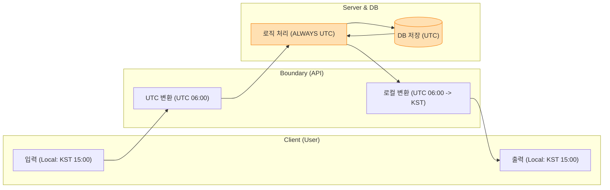

# 🕐 시간 처리: Unix Timestamp와 타임존 전략

> **이 문서의 목표:** 컴퓨터가 시간을 다루는 원리(Unix Timestamp, 타임존)를 이해하고, 글로벌 서비스에서 발생할 수 있는 **시간 관련 버그(타임존 불일치, 서머타임)**를 예방하는 아키텍처를 설계한다.

---

## 0. 핵심 질문으로 시작하기

1.  **왜 서버 시간은 항상 UTC로 설정해야 하는가?** → 로그와 데이터의 일관성을 유지하고, 서머타임(DST) 등 지역 시간의 변동성에서 벗어나기 위해.
2.  **Unix Timestamp와 날짜 문자열의 차이는?** → 절대적인 시간 값(숫자) vs 해석이 필요한 표현(문자열).
3.  **'UTC Sandwich' 전략이란?** → 입력과 출력단에서만 로컬 시간을 쓰고, 내부(DB/로직)에서는 무조건 UTC를 사용하는 패턴.
4.  **2038년 문제는 무엇인가?** → 32비트 정수형으로 시간을 저장할 때 발생하는 오버플로우 문제.

---

## 1. [개념 정의]: 시간은 상대적이다 (Why)

"내일 아침 9시에 보자"는 말은 한국에 있는 사람과 뉴욕에 있는 사람에게 전혀 다른 의미입니다.
글로벌 서비스에서 **"로컬 시간(KST, PST)"**을 기준으로 데이터를 저장하면, 썸머타임 변경이나 사용자 이동 시 데이터가 뒤죽박죽이 됩니다.

따라서 **절대적인 기준(UTC)**과 **상대적인 표현(Local Time)**을 엄격히 구분해야 합니다.

---

## 2. [원리/구조]: 컴퓨터의 시간 (How)

### 2.1 Unix Timestamp
컴퓨터는 달력을 모릅니다. **1970년 1월 1일 00:00:00 UTC**부터 흐른 **초(Seconds)**만 셉니다.

*   `1705342200` = `2024-01-15 19:30:00 (KST)`
*   이 숫자는 전 세계 어디서나 똑같습니다. (절대값)

### 2.2 UTC Sandwich 아키텍처

데이터가 시스템을 통과할 때 **양쪽 빵(입/출력)만 로컬 시간**이고, **속 재료(서버/DB)는 무조건 UTC**여야 한다는 원칙입니다.



---

## 3. [실전/구현]: 올바른 시간 처리 패턴 (What)

### 3.1 DB 저장 및 조회 (Java/SQL)

**🚨 나쁜 예 (로컬 시간 저장)**
```sql
INSERT INTO events (time) VALUES ('2024-01-01 10:00:00'); -- KST인지 UTC인지 모름
```

**✅ 좋은 예 (UTC 저장)**
```java
// 저장: 항상 UTC로 변환
OffsetDateTime now = OffsetDateTime.now(ZoneOffset.UTC);
repository.save(now);

// 조회: 꺼내서 클라이언트 타임존으로 변환
OffsetDateTime dbTime = repository.findById(id).getTime();
ZonedDateTime userTime = dbTime.atZoneSameInstant(ZoneId.of("Asia/Seoul"));
```

### 3.2 ISO 8601 포맷
API 통신 시에는 모호함이 없는 국제 표준 포맷을 사용합니다.
*   `2024-01-15T19:30:00Z` (Z = UTC)
*   `2024-01-15T19:30:00+09:00` (KST 명시)

### 3.3 2038년 문제
32비트 정수형(`int`)은 2038년 1월 19일에 오버플로우가 발생합니다.
*   **해결:** 반드시 **64비트 정수형(`long`, `bigint`)**을 사용하여 타임스탬프를 저장해야 합니다.

> [!WARNING]
> **서버 시간 설정:** 리눅스 서버의 시간(`date`)을 KST로 바꾸지 마세요. 서버는 항상 **UTC**여야 로그 분석이 꼬이지 않습니다.

---

## 4. 🎯 1분 요약

1.  **저장(DB)**: 무조건 **UTC** + **Unix Timestamp(또는 TimestampTZ)**.
2.  **통신(API)**: **ISO 8601** (`yyyy-MM-ddTHH:mm:ssZ`).
3.  **표시(UI)**: 브라우저/앱에서 사용자 **로컬 타임존**으로 변환.
4.  **금지**: 서버 로직 안에서 로컬 시간(KST 등)을 사용하여 계산하지 말 것.

---

## 5. 📝 자가 점검 질문

1.  **서버 시간을 KST로 설정했을 때 글로벌 서비스에서 생기는 문제는?**
    → 미국 사용자가 쓴 글이 "미래에 작성됨"으로 뜨거나, 로그 시간이 뒤죽박죽 섞여 디버깅이 불가능해짐.
2.  **PostgreSQL에서 권장하는 날짜 타입은?**
    → `TIMESTAMPTZ` (Timezone 정보를 포함하여 처리).
3.  **윤초(Leap Second)는 개발자가 직접 처리해야 하는가?**
    → 아니오. OS(NTP)나 클라우드 제공자가 처리하므로 신경 쓰지 않아도 됨(Smeared Time).
4.  **2038년 문제를 피하기 위해 DB 컬럼을 어떻게 잡아야 하는가?**
    → `TIMESTAMP` 타입을 쓰거나, 정수형이라면 `BIGINT` (64bit)를 써야 함.
