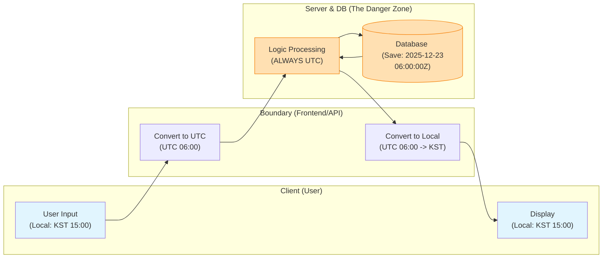

# 🕐 시간 처리: 왜 글로벌 서비스에서 시간 관리가 어려운가?

## 🌍 실제로 겪어본 시간 문제들

### 글로벌 서비스 개발자들이 흔히 마주치는 악몽:

**"왜 해외 사용자 데이터가 시간대가 틀릴까?"**
- 한국 서버인데 미국 사용자 데이터가 14시간 차이남
- 같은 이벤트인데 시간대별로 다른 시간 기록됨
- 배치 작업이 시간대 때문에 잘못 실행됨

**"서버 시간 vs DB 시간 vs 클라이언트 시간, 어느 게 맞지?"**
- 서버 로그는 KST, DB는 UTC, 클라이언트는 로컬 시간
- API 응답 시간이 일관되지 않음
- 시간 비교 로직이 나라별로 다르게 동작

**"2038년 문제는 이미 해결됐나? 다른 시간 문제는?"**
- 레거시 시스템 마이그레이션 시 시간 데이터 변환
- 윤초(Leap Second) 처리 문제
- 서머타임(DST)으로 인한 1시간 오차

## 🎯 1분 요약: 시간 처리의 핵심

**시간 = 절대값(Unix Timestamp) + 상대값(타임존)**

- **저장**: UTC 기준 Unix Timestamp (절대적)
- **전송**: ISO 8601 포맷 (`2024-01-15T10:30:00Z`)
- **표시**: 사용자의 로컬 시간으로 변환 (상대적)

> **결론:**
> 1. **내부 처리**: 항상 UTC + Unix Timestamp
> 2. **통신**: ISO 8601 표준 포맷
> 3. **UI 표시**: 마지막에만 로컬 시간 변환
> 
> 

---

## 2. 💻 컴퓨터가 시간을 세는 법: Unix Timestamp

**컴퓨터는 달력을 모르고 초만 센다!**

```java
// 현재 시간 (한국 시간으로)
LocalDateTime now = LocalDateTime.now();  // 2024-01-15T19:30:00

// Unix Timestamp로 변환
long timestamp = now.toEpochSecond(ZoneOffset.UTC);  // 1705342200

// 다시 날짜로 변환
LocalDateTime restored = LocalDateTime.ofEpochSecond(timestamp, 0, ZoneOffset.UTC);
```

**🚨 실제 문제 사례:**

**문제 1: 타임존 변환 실수**
```java
// ❌ 서버 시간 그대로 저장 (KST)
LocalDateTime eventTime = LocalDateTime.now();  // 한국 시간 2024-01-15 19:30:00
saveToDatabase(eventTime);  // DB에 KST로 저장

// 미국 사용자가 조회하면? 2024-01-15 19:30:00 (KST로 보임)
// 기대: 2024-01-15 10:30:00 (PST로 변환되어야 함)
```

```java
// ✅ UTC로 변환 후 저장
LocalDateTime utcTime = LocalDateTime.now(ZoneOffset.UTC);
saveToDatabase(utcTime);  // UTC로 저장
// 조회 시 사용자의 타임존으로 변환
```

**문제 2: 서머타임(DST) 문제**
```java
// 미국 동부 시간에서 서머타임 전환
// 2024-03-10 02:00 → 03:00 (1시간 점프)
// 데이터 분석이나 스케줄링에서 문제 발생
LocalDateTime schedule = LocalDateTime.of(2024, 3, 10, 2, 30);
ZonedDateTime zoned = schedule.atZone(ZoneId.of("America/New_York"));
// 서머타임으로 인해 03:30으로 바뀔 수 있음!
```

**문제 3: Unix Timestamp 오버플로우**
```java
// 32비트 시스템에서 2038년 문제
int timestamp32 = (int) System.currentTimeMillis() / 1000;
// 2038년 이후 음수값으로 변함!
```

---

## 3. 2038년 문제 (The Year 2038 Problem)

32비트 시스템에서 시간을 다룰 때 발생할 예정인 치명적인 버그다. (제2의 Y2K)

### 3.1 원인: 32비트 정수의 한계

과거 시스템은 시간을 `signed 32-bit integer`로 저장했다.

* **최대값:** 
* **D-Day:** **2038년 1월 19일 03:14:07 UTC**
* **현상:** 이 1초 뒤, 숫자가 오버플로우(Overflow)되어 부호 비트가 1로 바뀌며 **1901년 12월 13일**로 과거 회귀한다.

### 3.2 시각화 (Binary Overflow)

```text
[ The 2038 Apocalypse Simulation ]

Status: 2038-01-19 03:14:07 UTC
Binary: 01111111 11111111 11111111 11111111  (Max 32-bit Signed Int)
Value : 2,147,483,647

       [ +1 Second passes... ]

Status: 1901-12-13 20:45:52 UTC (CRASH!)
Binary: 10000000 00000000 00000000 00000000  (Sign bit flips to negative)
Value : -2,147,483,648

```

> **해결책:** 현대의 모든 서버와 DB는 **64-bit integer**를 사용하여 시간을 저장해야 한다. (64비트의 수명은 우주의 나이보다 길다.)

---

## 4. 타임존(Timezone)과 'UTC Sandwich' 전략

개발자가 가장 많이 겪는 버그는 **"DB에는 9시로 저장됐는데, 조회하니 18시로 나오는"** 시차 문제다. 이를 해결하는 유일한 아키텍처 패턴은 **UTC Sandwich**다.

### 4.1 UTC Sandwich 다이어그램

데이터가 시스템을 통과할 때 **양쪽 빵(입/출력)만 로컬 시간**이고, **속 재료(서버/DB)는 무조건 UTC**여야 한다는 원칙이다.



---

## 5. 표준 포맷: ISO 8601

API 통신 시 "2025/10/11" 같은 모호한 포맷(미국은 10월, 영국은 11월로 해석)을 쓰면 안 된다. 국제 표준인 **ISO 8601**을 사용하라.

### 5.1 구조 설명

* `T`: 날짜와 시간의 구분자 (Separator)
* `Z`: **Zulu Time** (UTC+0임을 명시). 이 자리에 `+09:00` 처럼 오프셋이 올 수도 있다.

---

## 6. Production-Ready Code Example (Python)

**[Bad Case]**

```python
import datetime

# 치명적 실수: 서버의 로컬 시간을 그대로 저장
# 서버가 한국에 있으면 KST, 미국에 있으면 EST로 저장됨. 데이터 꼬임의 시작.
now = datetime.datetime.now() 
print(now) # 2025-12-23 16:30:00 (KST라고 가정)

```

**[Good Case - Industry Standard]**

```python
from datetime import datetime, timezone
import json

def get_current_event():
    # 1. 생성: 무조건 UTC로 생성 (Timezone Aware 객체)
    # now() 대신 now(timezone.utc)를 사용하는 습관 필수
    utc_now = datetime.now(timezone.utc)
    
    # 2. 전송: ISO 8601 문자열 포맷팅
    # 프론트엔드가 가장 처리하기 쉬운 형태
    iso_format = utc_now.isoformat().replace("+00:00", "Z")
    
    return {
        "event_name": "Login",
        "timestamp": utc_now.timestamp(), # 내부 연산용 (float)
        "created_at": iso_format          # 외부 전송용 (string)
    }

data = get_current_event()
print(json.dumps(data, indent=2))

# Output:
# {
#   "event_name": "Login",
#   "timestamp": 1766478852.123456,
#   "created_at": "2025-12-23T07:34:12.123456Z"
# }

```

---


1. **서버 시간 설정:** 리눅스 서버의 시간(`date` 명령어)을 KST로 맞추지 마십시오. **서버의 시스템 시간은 항상 UTC**로 설정하는 것이 원칙입니다. 로그 파일의 시간대가 섞이는 재앙을 막을 수 있습니다.
2. **DB 컬럼 타입:**
* MySQL: `TIMESTAMP` (내부적으로 UTC 변환 저장) vs `DATETIME` (입력값 그대로 저장). **`TIMESTAMP`**를 쓰거나, 앱 레벨에서 UTC로 변환 후 `DATETIME`에 넣으십시오.
* PostgreSQL: 무조건 **`TIMESTAMPTZ`** (Timestamp with time zone)를 사용하십시오. 그냥 `TIMESTAMP`는 쓰지 마십시오.


3. **윤초(Leap Second):** 지구가 자전하는 속도가 미세하게 느려져서 가끔 1초를 더하는 윤초가 발생합니다. 금융권이나 정밀 과학 분야가 아니라면, OS(NTP 서버)가 알아서 처리하도록 두고 신경 쓰지 않아도 됩니다(Smeared time).

