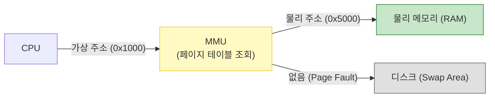

# 🧠 가상 메모리: 무한한 메모리의 환상

> **이 문서의 목표:** 운영체제가 물리적 메모리의 한계를 극복하고, 프로세스들에게 **무한하고 독립적인 메모리 환상**을 제공하는 **가상 메모리(Virtual Memory)**의 원리를 이해한다.

---

## 0. 핵심 질문으로 시작하기

1.  **가상 메모리는 왜 필요한가?** → 물리 메모리(RAM)보다 큰 프로그램을 실행하고, 프로세스 간 메모리를 침범하지 못하게 격리하기 위해.
2.  **가상 주소와 물리 주소는 어떻게 매핑되는가?** → 페이지 테이블(Page Table)을 통해 가상 주소가 물리 주소로 변환됨.
3.  **페이지 폴트(Page Fault)란 무엇인가?** → 필요한 데이터가 RAM에 없어 디스크(Swap)에서 가져와야 하는 상황(성능 저하).
4.  **스레싱(Thrashing)은 왜 치명적인가?** → CPU가 실제 일은 안 하고 페이지 교체만 하느라 시스템이 멈춘 것처럼 되기 때문.

---

## 1. [개념 정의]: 4GB 램에서 8GB 게임 돌리기 (Why)

물리적인 RAM이 4GB밖에 없어도 우리는 8GB짜리 게임을 실행하고, 브라우저 탭을 수십 개 띄울 수 있습니다.
운영체제가 **"쓰지 않는 데이터는 몰래 디스크(HDD/SSD)로 옮기고, 필요한 것만 RAM에 두는"** 사기를 치기 때문입니다. 이 기술이 가상 메모리입니다.

### 1.1 핵심 기능
1.  **용량 확장**: RAM + Disk Swap = 가상 메모리 총량.
2.  **메모리 보호(Protection)**: 내 프로세스의 100번지 주소와 옆 프로세스의 100번지 주소는 서로 다른 물리 공간을 가리킴 (침범 불가).

---

## 2. [원리/구조]: 페이지 테이블과 MMU (How)

### 2.1 주소 변환 과정

CPU는 가상 주소(Virtual Address)만 봅니다. 실제 RAM 어디에 있는지는 **MMU(Memory Management Unit)**가 통역해줍니다.



### 2.2 페이지 교체 알고리즘 (Page Replacement)
RAM이 꽉 찼을 때 누구를 쫓아낼지 결정합니다.

*   **FIFO**: 먼저 들어온 놈이 나감. (비효율적)
*   **LRU (Least Recently Used)**: **가장 오랫동안 안 쓴 놈**이 나감. (가장 많이 쓰임, "과거를 보면 미래를 안다")
*   **LFU**: 가장 적게 쓴 놈이 나감.

---

## 3. [실전/구현]: 성능 문제와 해결 (What)

### 3.1 스레싱 (Thrashing)
메모리가 너무 부족해서 **페이지 폴트가 무한 반복**되는 현상입니다.
*   **증상**: 하드디스크 불이 계속 깜빡이고 컴퓨터가 멈춤.
*   **해결**: 프로그램을 끄거나 RAM을 더 꽂아야 함 (소프트웨어적으로 해결 불가).

### 3.2 개발자가 알아야 할 것 (Java/C++)

**1. 지역성(Locality)을 살려라**
```java
// ❌ Bad: 메모리를 널뛰기하며 접근 (페이지 폴트 유발)
for (int j=0; j<10000; j++) 
    for (int i=0; i<10000; i++) 
        arr[i][j] = 0;

// ✅ Good: 순차적 접근 (페이지 적중률 높임)
for (int i=0; i<10000; i++) 
    for (int j=0; j<10000; j++) 
        arr[i][j] = 0;
```

**2. 메모리 누수 주의**
가상 메모리가 아무리 커도(64bit는 사실상 무한), 계속 할당만 하고 해제하지 않으면 결국 물리 RAM이 동나서 스레싱에 빠집니다.

---

## 4. 🎯 1분 요약

1.  **가상 메모리**: RAM의 한계를 극복하기 위해 디스크를 보조 메모리로 쓰는 기술.
2.  **페이지 테이블**: 가상 주소와 물리 주소를 매핑하는 지도.
3.  **페이지 폴트**: 찾는 데이터가 RAM에 없어서 디스크에서 가져오는 과정 (느림).
4.  **최적화**: 관련된 데이터는 모아서 저장하고 순차적으로 접근해야(Locality) 페이지 폴트를 줄일 수 있다.

---

## 5. 📝 자가 점검 질문

1.  **TLB(Translation Lookaside Buffer)의 역할은?**
    → 페이지 테이블이 메모리에 있어 조회가 느리므로, 주소 변환 결과를 캐싱하는 하드웨어.
2.  **Context Switching이 일어날 때 TLB는 어떻게 되는가?**
    → 프로세스가 바뀌면 가상 주소 체계도 바뀌므로 TLB를 비워야(Flush) 함. (성능 비용 발생)
3.  **스레싱(Thrashing)을 막기 위한 OS의 기법은?**
    → 워킹 셋(Working Set) 알고리즘. 프로세스가 자주 참조하는 페이지 집합을 메모리에 유지해줌.
4.  **페이지 크기(보통 4KB)가 너무 크거나 작으면 어떤 문제가 생기는가?**
    → 너무 작으면 페이지 테이블이 커지고, 너무 크면 내부 단편화(Internal Fragmentation)가 커짐.
