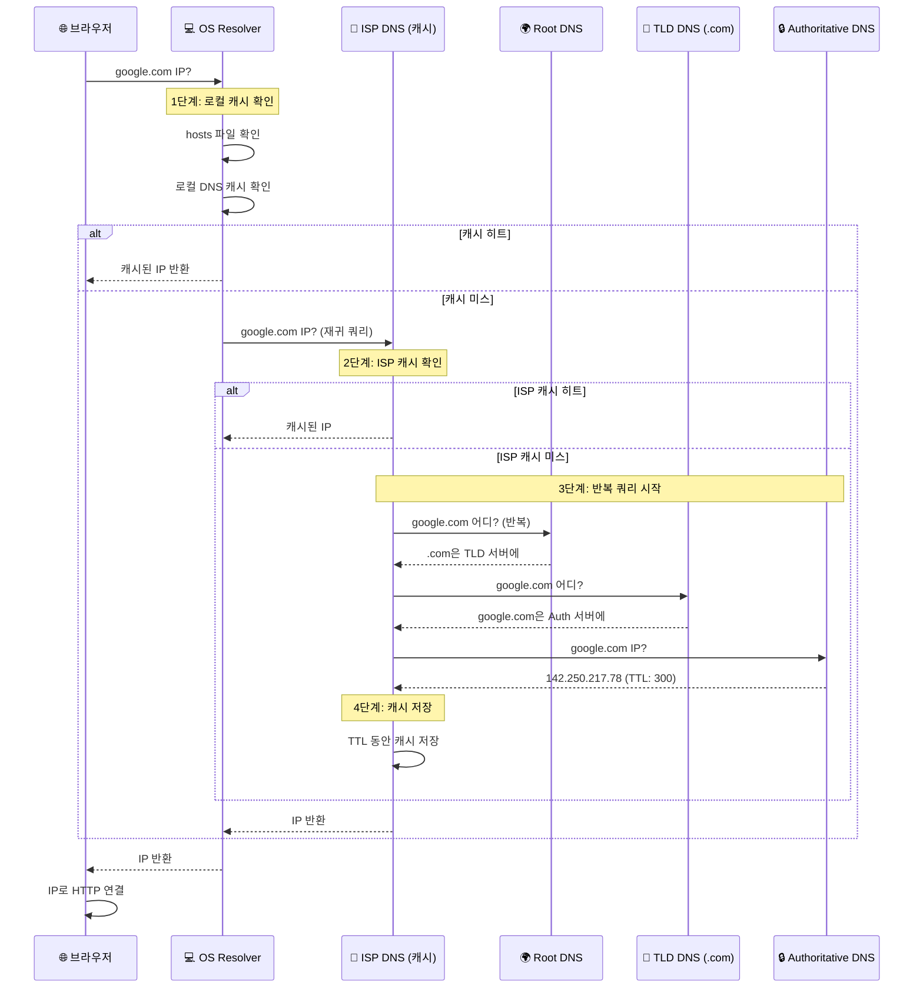

# 🌐 DNS 완벽 이해: 도메인 뒤에 숨겨진 세계

> **이 문서의 목표:** DNS를 단순히 "도메인→IP 변환"으로만 알지 말고, **왜 이런 구조인지**, **문제가 생기면 어떻게 디버깅하는지** 이해한다.

---

## 0. 핵심 질문으로 시작하기

DNS를 이해하려면 다음 질문들에 답할 수 있어야 한다:

1. **왜 IP 대신 도메인을 쓰는가?** → DNS가 해결하는 문제
2. **왜 계층 구조인가?** → 분산 시스템 설계의 핵심
3. **캐싱이 왜 필요하고, 왜 문제가 되는가?** → TTL과 전파 지연
4. **DNS 쿼리가 어떻게 동작하는가?** → 재귀 vs 반복 질의

---

## 1. DNS가 해결하는 문제: 왜 도메인이 필요한가?

### 1.1 IP 주소만 쓰면 안 되나?

```
[IP 주소의 문제점]

1. 기억하기 어렵다
   142.250.217.78 vs google.com
   
2. 서버가 바뀌면 모든 클라이언트가 알아야 한다
   서버 이전: IP 142.250.217.78 → 172.217.161.46
   → 모든 북마크, 링크가 깨짐!
   
3. 하나의 서비스가 여러 서버를 쓸 수 없다
   로드 밸런싱? IP 하나만 알려주면 어떻게?
```

### 1.2 DNS가 제공하는 해결책

```
[DNS의 추상화 계층]

사용자: "google.com 접속하고 싶어"
   ↓
DNS: "google.com은 지금 142.250.217.78야"
   ↓
브라우저: 142.250.217.78에 연결

[핵심 이점]
1. 사람이 기억하기 쉬운 이름 사용
2. 서버 IP가 바뀌어도 도메인은 그대로
3. 하나의 도메인이 여러 IP를 가질 수 있음 (로드 밸런싱)
4. 지역별로 다른 서버로 연결 가능 (CDN)
```

---

## 2. DNS의 계층 구조: 왜 이렇게 설계했나?

### 2.1 만약 DNS가 중앙 집중형이라면?

```
[문제 시나리오]
전 세계 모든 도메인 정보를 하나의 서버에 저장한다면?

1. 단일 장애점 (Single Point of Failure)
   → 서버 다운 = 전 세계 인터넷 마비
   
2. 처리량 한계
   → 초당 수십억 개 쿼리를 한 서버가 처리?
   
3. 지연 시간
   → 한국에서 미국 서버까지 왕복?
   
4. 관리 불가능
   → 3억 개 이상의 도메인을 누가 관리?
```

### 2.2 분산 계층 구조의 해결책

```
[DNS 계층 구조]

                          . (Root)
                              │
          ┌───────────────────┼───────────────────┐
          │                   │                   │
        .com                .org                .kr  (TLD)
          │                   │                   │
      ┌───┴───┐           ┌───┴───┐           ┌───┴───┐
    google  amazon     wikipedia  ...       naver   daum  (Authoritative)

[왜 이런 구조인가?]

1. 책임의 분산
   - Root: TLD 서버 위치만 알면 됨
   - TLD (.com): 해당 도메인의 네임서버만 알면 됨
   - Authoritative: 실제 IP만 관리
   
2. 부하의 분산
   - 각 계층이 자기 역할만 담당
   - Root는 아주 가볍게 유지 가능
   
3. 독립적 관리
   - google.com은 구글이 직접 관리
   - naver.com은 네이버가 직접 관리
```

### 2.3 각 계층의 역할

| 계층 | 역할 | 비유 | 예시 |
|-----|------|------|------|
| **Root DNS** | TLD 서버 위치 안내 | 안내 데스크 | 13개 루트 서버 클러스터 |
| **TLD DNS** | 해당 도메인의 네임서버 안내 | 층별 안내판 | `.com`, `.kr`, `.org` |
| **Authoritative DNS** | 실제 IP 주소 제공 | 최종 목적지 | Route53, Cloudflare |

---

## 3. DNS 쿼리 과정: 실제로 어떻게 동작하나?

### 3.1 재귀 쿼리 vs 반복 쿼리

```
[재귀 쿼리 (Recursive Query)]
클라이언트: "google.com IP 알려줘"
DNS Resolver: "기다려, 내가 다 찾아올게"
              (Root → TLD → Authoritative 순회)
DNS Resolver: "여기 142.250.217.78"

→ 클라이언트는 한 번만 물어보면 됨
→ Resolver가 모든 작업 수행

[반복 쿼리 (Iterative Query)]
Resolver: "google.com 어디야?" → Root
Root: ".com 담당은 저기야"
Resolver: "google.com 어디야?" → TLD
TLD: "google.com 담당은 저기야"
Resolver: "google.com IP 뭐야?" → Authoritative
Authoritative: "142.250.217.78이야"

→ Resolver가 여러 번 질문
→ 각 서버는 자기가 아는 것만 답변
```

### 3.2 쿼리 과정 상세 (Mermaid)



---

## 4. TTL과 캐싱: 왜 변경이 바로 반영 안 되나?

### 4.1 TTL(Time To Live)의 역할

```
[TTL이 필요한 이유]

DNS 쿼리 비용:
- 네트워크 왕복 시간 (RTT)
- Root → TLD → Auth 순회 시간
- 매 요청마다 하면 → 느림 + 서버 부하

해결책: 캐싱 + TTL
- 한 번 조회한 결과를 일정 시간 저장
- TTL: "이 정보는 N초 동안 유효해"
```

### 4.2 TTL이 만드는 문제

```
[시나리오: 서버 이전]

1. 기존 상태
   google.com → 142.250.217.78 (TTL: 3600초 = 1시간)
   
2. IP 변경
   google.com → 172.217.161.46 (새 IP)
   
3. 문제 발생!
   - 전 세계 DNS 캐시에 옛날 IP가 남아있음
   - 최대 1시간 동안 옛날 서버로 요청이 감
   - ISP마다, 지역마다 캐시 만료 시점이 다름

[전파 지연 (Propagation Delay)]
   시간 →
   ├─ 변경 직후: 대부분 캐시된 옛날 IP 사용
   ├─ 30분 후: 일부 캐시 만료, 새 IP 사용
   ├─ 1시간 후: 대부분 새 IP 사용
   └─ 24시간 후: 거의 모든 캐시 갱신 완료
```

### 4.3 실무 전략: TTL 관리

```
[TTL 설정 전략]

평상시: 높은 TTL (1시간~24시간)
  → 캐시 효율 극대화, DNS 부하 감소
  
마이그레이션 전: 낮은 TTL (1분~5분)
  → 변경 사항 빠른 반영
  
마이그레이션 후: 다시 높은 TTL
  → 안정화 확인 후 원복

[실무 예시: 서버 이전]
D-7일: TTL을 300초(5분)로 낮춤
D-Day: IP 변경
D+1일: 모니터링으로 트래픽 확인
D+3일: TTL을 3600초(1시간)로 복원
```

---

## 5. DNS 레코드 타입: 각각 왜 필요한가?

### 5.1 주요 레코드 타입

| 타입 | 역할 | 왜 필요한가? | 예시 |
|-----|------|-------------|------|
| **A** | 도메인 → IPv4 | 기본 IP 매핑 | `google.com → 142.250.217.78` |
| **AAAA** | 도메인 → IPv6 | IPv4 주소 고갈 대응 | `google.com → 2404:6800:4004:80a::200e` |
| **CNAME** | 도메인 → 도메인 | 별명 (서브도메인 관리) | `www.google.com → google.com` |
| **MX** | 메일 서버 지정 | 이메일 수신 처리 | `google.com → smtp.google.com` |
| **NS** | 네임서버 지정 | 도메인 관리 위임 | `google.com → ns1.google.com` |
| **TXT** | 텍스트 정보 | 소유권 확인, SPF | `v=spf1 include:_spf.google.com` |

### 5.2 CNAME의 제약: 왜 루트 도메인에 못 쓰나?

```
[문제 상황]
AWS ELB의 IP는 수시로 바뀜 → 도메인으로만 제공됨
예: my-elb-1234.ap-northeast-2.elb.amazonaws.com

그런데 example.com (루트 도메인)에는 CNAME을 못 씀!

[이유]
DNS 표준(RFC 1912):
"CNAME이 있는 이름에는 다른 레코드가 있으면 안 된다"

루트 도메인에는 반드시 있어야 하는 레코드:
- NS 레코드 (네임서버)
- SOA 레코드 (권한 정보)
- MX 레코드 (이메일)

→ CNAME과 충돌!

[해결책]
1. Route53 Alias (AWS 전용)
2. Cloudflare CNAME Flattening
3. ANAME/ALIAS 레코드 (일부 DNS 제공자)
```

---

## 6. 실무 디버깅: DNS 문제 해결 도구

### 6.1 기본 명령어

```bash
# nslookup: 간단한 DNS 조회
$ nslookup google.com
Server:         8.8.8.8
Address:        8.8.8.8#53

Non-authoritative answer:
Name:   google.com
Address: 142.250.217.78

# 특정 DNS 서버로 질의
$ nslookup google.com 1.1.1.1
```

### 6.2 dig: 상세 DNS 분석 (실무 필수)

```bash
# 기본 조회
$ dig google.com

;; QUESTION SECTION:
;google.com.                    IN      A

;; ANSWER SECTION:
google.com.             300     IN      A       142.250.217.78

;; Query time: 23 msec
;; SERVER: 8.8.8.8#53(8.8.8.8)

# 결과 해석:
# - 300: TTL (5분)
# - IN: Internet class
# - A: 레코드 타입
# - Query time: DNS 응답 시간
```

```bash
# 특정 레코드 타입 조회
$ dig google.com MX        # 메일 서버
$ dig google.com NS        # 네임서버
$ dig google.com TXT       # 텍스트 레코드
$ dig google.com AAAA      # IPv6

# 특정 DNS 서버로 질의 (전파 상태 확인)
$ dig @8.8.8.8 mysite.com       # Google DNS
$ dig @1.1.1.1 mysite.com       # Cloudflare DNS
$ dig @168.126.63.1 mysite.com  # KT DNS

# +trace: 전체 쿼리 과정 추적 (디버깅 필수!)
$ dig +trace google.com
; <<>> DiG 9.16.1 <<>> +trace google.com
.                       518400  IN      NS      a.root-servers.net.
com.                    172800  IN      NS      a.gtld-servers.net.
google.com.             172800  IN      NS      ns1.google.com.
google.com.             300     IN      A       142.250.217.78
```

### 6.3 흔한 DNS 문제와 디버깅

#### 문제 1: "사이트 접속이 안 돼요"

```bash
# 1단계: DNS 응답 확인
$ dig mysite.com
;; connection timed out; no servers could be reached

# 원인: DNS 서버 응답 없음
# 해결: 다른 DNS 서버 사용
$ dig @8.8.8.8 mysite.com

# 2단계: 네임서버 확인
$ dig mysite.com NS
# 네임서버가 응답하는지 확인
$ dig @ns1.mysite.com mysite.com
```

#### 문제 2: "도메인 변경했는데 반영이 안 돼요"

```bash
# 전파 상태 확인: 여러 DNS 서버에서 확인
$ dig @8.8.8.8 mysite.com +short    # Google
$ dig @1.1.1.1 mysite.com +short    # Cloudflare
$ dig @168.126.63.1 mysite.com +short  # KT

# TTL 확인
$ dig mysite.com | grep -A1 "ANSWER SECTION"
mysite.com.             3600    IN      A       1.2.3.4
                        ^
                        이 값(초)만큼 기다려야 함

# 로컬 캐시 비우기
$ sudo killall -HUP mDNSResponder  # macOS
$ ipconfig /flushdns               # Windows
$ sudo systemd-resolve --flush-caches  # Linux
```

#### 문제 3: "특정 지역에서만 접속 안 돼요"

```bash
# 해당 지역 DNS 서버로 테스트
$ dig @해당지역ISP_DNS mysite.com

# 또는 온라인 도구 사용
# - https://dnschecker.org
# - https://www.whatsmydns.net
```

---

## 7. DNS 보안: DNSSEC과 DoH

### 7.1 DNS의 보안 취약점

```
[DNS Spoofing/Cache Poisoning]

정상 상황:
사용자 → DNS → "naver.com = 223.130.195.200"

공격 상황:
해커가 DNS 응답을 위조
사용자 → DNS → "naver.com = 해커서버IP" (위조됨!)
사용자 → 해커 피싱 사이트 접속

[왜 가능한가?]
- DNS는 원래 암호화/인증 없이 설계됨
- UDP 기반이라 응답 위조가 쉬움
```

### 7.2 해결책

```
[DNSSEC]
- DNS 응답에 디지털 서명 추가
- 위조된 응답 감지 가능
- 단점: 설정 복잡, 응답 크기 증가

[DoH (DNS over HTTPS)]
- DNS 쿼리를 HTTPS로 암호화
- ISP나 중간자가 DNS 쿼리 내용을 볼 수 없음
- 브라우저에서 지원 (Firefox, Chrome)

[DoT (DNS over TLS)]
- DNS 쿼리를 TLS로 암호화
- 전용 포트 853 사용
```

---

## 8. /etc/hosts: 개발자의 비밀 무기

### 8.1 왜 필요한가?

```
[시나리오]
1. 새 서버를 세팅했는데, 도메인 DNS는 아직 옛날 서버를 가리킴
2. 내 컴퓨터에서만 새 서버로 테스트하고 싶음

[해결: hosts 파일]
DNS보다 먼저 참조되는 로컬 설정 파일
내 컴퓨터에서만 특정 도메인을 원하는 IP로 매핑
```

### 8.2 설정 방법

```bash
# 파일 위치
# macOS/Linux: /etc/hosts
# Windows: C:\Windows\System32\drivers\etc\hosts

# 편집 (관리자 권한 필요)
$ sudo nano /etc/hosts

# 형식: IP주소    도메인
127.0.0.1       localhost
192.168.1.100   dev.myapp.com
10.0.0.50       api.myapp.com staging-api.myapp.com
```

### 8.3 실무 활용 예시

```bash
# 1. 로컬 개발 환경
127.0.0.1       local.myapp.com

# 2. 스테이징 서버 테스트
10.0.1.50       api.production.com  # 프로덕션 도메인을 스테이징 IP로

# 3. 광고/추적 차단
0.0.0.0         ads.example.com
0.0.0.0         tracker.example.com

# 적용 확인
$ ping local.myapp.com
PING local.myapp.com (127.0.0.1): 56 data bytes
```

---

## 9. 실무 체크리스트

### 도메인 설정 시

```
□ 적절한 TTL 설정 (평상시 3600초 권장)
□ CNAME vs A 레코드 선택 (루트 도메인은 A)
□ 네임서버 이중화 (최소 2개)
□ MX 레코드 설정 (이메일 필요시)
□ SPF/DKIM 설정 (스팸 방지)
```

### 서버 마이그레이션 시

```
□ D-7: TTL을 300초로 낮춤
□ D-Day: IP 변경
□ D-Day: 여러 DNS 서버에서 전파 확인
□ D+1: 트래픽 모니터링
□ D+3: TTL 복원
```

### 문제 발생 시

```bash
# 1. DNS 응답 확인
dig 도메인

# 2. 전파 상태 확인
dig @8.8.8.8 도메인
dig @1.1.1.1 도메인

# 3. 쿼리 과정 추적
dig +trace 도메인

# 4. 로컬 캐시 확인/비우기
```

---

## 10. 🎯 1분 요약

1. **DNS 계층 구조**: Root → TLD → Authoritative로 이어지는 분산 데이터베이스로, 부하 분산과 관리 효율성을 위해 설계됨.
2. **TTL과 캐싱**: 성능을 위해 캐싱이 필수지만, 이로 인해 변경 사항 전파에 지연(Propagation Delay)이 발생함.
3. **디버깅**: `dig +trace`로 전체 경로를 추적하고, TTL과 캐시 상태를 확인하여 문제를 해결함.

---

## 11. 📝 자가 점검 질문

### 원리 이해

1. **왜 DNS는 계층 구조인가?**
   → 단일 서버로는 전 세계 쿼리를 감당할 수 없음. 책임과 부하를 분산하기 위해 계층 구조로 설계.

2. **TTL이 길면 좋은가, 짧으면 좋은가?**
   → 트레이드오프. 길면 캐시 효율이 좋지만 변경 반영이 느림. 짧으면 반영은 빠르지만 DNS 부하 증가.

3. **CNAME을 루트 도메인에 쓸 수 없는 이유는?**
   → DNS 표준상 CNAME이 있는 이름에는 다른 레코드(NS, MX 등)가 있으면 안 됨. 루트 도메인은 반드시 NS, SOA 레코드가 필요.

### 실무 디버깅

4. **도메인 변경이 반영 안 될 때 확인해야 할 것은?**
   → `dig` 명령으로 여러 DNS 서버에서 조회, TTL 확인, 로컬 캐시 플러시

5. **`dig +trace`로 무엇을 알 수 있는가?**
   → 전체 DNS 쿼리 과정을 추적. 어느 단계에서 문제가 발생하는지 파악 가능.
