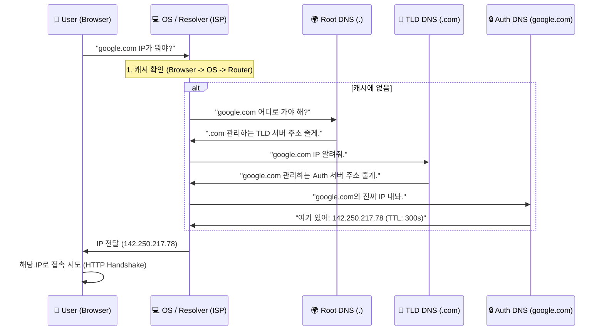

# 🌐 DNS: 도메인이 작동하지 않을 때 해결하는 방법

## 🆘 실제로 겪어본 DNS 문제들

### 개발자들이 흔히 마주치는 악몽:

**"왜 내 사이트가 접속이 안 되지?"**
- 로컬에서는 잘 되는데 서버에서는 DNS 오류
- 도메인 변경했는데 24시간 지나도 반영 안 됨
- CDN 설정했는데 DNS propagation이 느림

**"DNS가 왜 이렇게 느리지?"**
- 첫 접속은 느린데 두 번째는 빠름 (캐싱 때문)
- 글로벌 사용자 접속이 지역별로 차이남
- DNS 쿼리가 타임아웃 남

**"보안 문제 때문에 DNS가 막혔어"**
- 기업 방화벽이 외부 DNS를 막음
- DNS spoofing 공격으로 피싱 사이트로 리다이렉션
- DDoS 공격으로 DNS 서버가 다운

## 🎯 1분 요약: DNS의 핵심

**DNS = 도메인 ↔ IP 변환 시스템**

- **역할**: `google.com` → `142.250.217.78`
- **구조**: 계층적 분산 데이터베이스 (Root → TLD → Authoritative)
- **문제**: 캐싱 때문에 변경 반영이 느림, 보안 취약점 多

> **결론:**
> 1. **캐싱**: DNS 변경은 TTL만큼 시간이 걸림
> 2. **분산**: 전 세계 DNS 서버가 협력
> 3. **보안**: DNSSEC로 스푸핑 방지 필요

---

## 2. DNS의 계층 구조 (The Hierarchy)

DNS는 `.`(Root)을 최상위로 하는 역트리(Inverted Tree) 구조를 가진다. 우리가 보는 주소는 사실 뒤에서부터 해석된다.
예: `www.google.com.` (마지막의 점은 보통 생략됨)

| 계층 | 명칭 | 역할 | 예시 |
| --- | --- | --- | --- |
| **Root** | **Root DNS Server** | 전 세계에 13개(논리적)만 존재. TLD 서버의 위치를 알려줌. | `.` |
| **1단계** | **TLD (Top-Level Domain)** | 국가(.kr)나 일반(.com) 도메인을 관리하는 서버. | `.com`, `.net`, `.org` |
| **2단계** | **Authoritative (권한 있는) DNS** | 실제 도메인 소유자가 관리하는 서버. 최종 IP를 알고 있음. | AWS Route53, Gabia, GoDaddy |

---

## 3. 실제 DNS 작동: `google.com`을 찾아서

사용자가 브라우저에 주소를 입력하면 다음과 같은 **재귀적 질의(Recursive Query)**가 발생한다.

**🚨 실제 문제 사례:**

**문제 1: DNS 캐싱으로 인한 변경 반영 지연**
```bash
# 도메인 IP 변경 후
nslookup myapp.com
# 결과: 아직 옛날 IP가 나옴 (TTL 3600초 = 1시간 대기)

# 강제 캐시 비우기 (Windows)
ipconfig /flushdns

# 강제 캐시 비우기 (macOS)
sudo killall -HUP mDNSResponder
```

**문제 2: DNS 전파 시간 문제 (Propagation)**
```bash
# 도메인 설정 변경 1분 후
dig myapp.com @8.8.8.8    # 구글 DNS: 이미 반영됨
dig myapp.com @1.1.1.1    # Cloudflare: 아직 옛날 IP
dig myapp.com @168.126.63.1 # KT DNS: 2시간 후 반영
# DNS 서버마다 전파 속도가 다름!
```

**문제 3: DNS 타임아웃으로 인한 서비스 장애**
```bash
# DNS 서버 응답 없음
nslookup myapp.com
;; connection timed out; no servers could be reached

# 원인: DNS 서버 다운 or 네트워크 문제
# 영향: 전체 서비스 접속 불가 (IP로 직접 접속은 가능)
```

### 3.1 시퀀스 다이어그램 (The Flow)



### 3.2 상세 단계

1. **로컬 캐시 확인:** 브라우저 캐시  OS 캐시(`hosts` 파일)  라우터 캐시  ISP DNS 캐시 순으로 뒤진다. (여기서 90%는 해결됨)
2. **Root DNS:** 모르면 전 세계의 뿌리인 Root 서버에게 묻는다. Root는 `.com`을 관리하는 서버 목록을 던져준다.
3. **TLD DNS:** `.com` 서버에게 다시 묻는다. `.com` 서버는 `google.com`의 네임서버(Auth Server) 정보를 던져준다.
4. **Authoritative DNS:** 드디어 구글이 관리하는 네임서버에 도달한다. 여기서 최종적으로 `A 레코드`에 적힌 IP 주소를 받아온다.
5. **접속:** 받아온 IP로 서버에 연결한다.

---

## 4. 주요 DNS 레코드 타입 (Record Types)

개발자가 도메인을 설정할 때 반드시 알아야 할 레코드들이다.

| 타입 | 설명 | 용도 | 예시 |
| --- | --- | --- | --- |
| **A** | Address | 도메인을 **IPv4** 주소로 매핑 | `google.com` -> `1.2.3.4` |
| **AAAA** | Quad-A | 도메인을 **IPv6** 주소로 매핑 | `google.com` -> `2001:0db8...` |
| **CNAME** | Canonical Name | 도메인의 **별명** (도메인 -> 도메인) | `www.google.com` -> `google.com` |
| **MX** | Mail Exchanger | **이메일** 수신 서버 지정 | `google.com` -> `smtp.gmail.com` |
| **TXT** | Text | 텍스트 정보 (주로 소유권 확인, SPF 스팸 방지용) | `v=spf1 include:_spf.google.com ~all` |
| **NS** | Name Server | 해당 도메인을 관리하는 **네임서버** 지정 | `ns-123.awsdns.com` |

---

## 5. 전문가적 조언 (Pro Tip)

### 5.1 TTL (Time To Live)과 전파 시간

도메인 설정을 바꿨는데 "왜 적용이 안 되나요?"라고 묻는다면 100% **TTL** 때문이다.

* **상황:** 기존 IP가 `1.1.1.1`이었고 TTL이 `86400`(24시간)이었다면, 지금 IP를 `2.2.2.2`로 바꿔도 전 세계의 캐시 서버(ISP 등)는 최대 24시간 동안 옛날 주소를 알려준다.
* **Tip:** 중요한 마이그레이션(서버 이전) 전에는 미리 TTL을 `60`(1분)이나 `300`(5분)으로 극단적으로 줄여놓고 작업을 시작해야 한다.

### 5.2 CNAME vs A Alias (Root Domain 문제)

DNS 표준상 도메인의 뿌리(`example.com`, Naked Domain)에는 **CNAME을 설정할 수 없다.** (MX 레코드 등과 충돌하기 때문).

* **문제:** AWS ELB 같은 로드밸런서는 IP가 수시로 바뀌어서 도메인 주소만 제공한다. 근데 `example.com`에는 CNAME을 못 쓴다.
* **해결:** AWS Route53 등 최신 DNS 서비스는 **Alias(별칭) A 레코드**라는 독자 기술을 제공해, Root 도메인도 CNAME처럼 동작하게 해 준다.

### 5.3 개발자의 비밀 무기: `/etc/hosts`

도메인을 정식으로 구입하거나 설정하기 전에, 내 컴퓨터에서만 특정 도메인이 특정 IP로 가도록 속일 수 있다.

* **경로:** (Mac/Linux) `/etc/hosts`, (Windows) `C:\Windows\System32\drivers\etc\hosts`
* **활용:** 개발 서버(`dev.myapp.com`)를 내 로컬(`127.0.0.1`)로 띄워 놓고 테스트할 때 필수적이다.

```text
# /etc/hosts file example
127.0.0.1       dev.myapp.com

```
