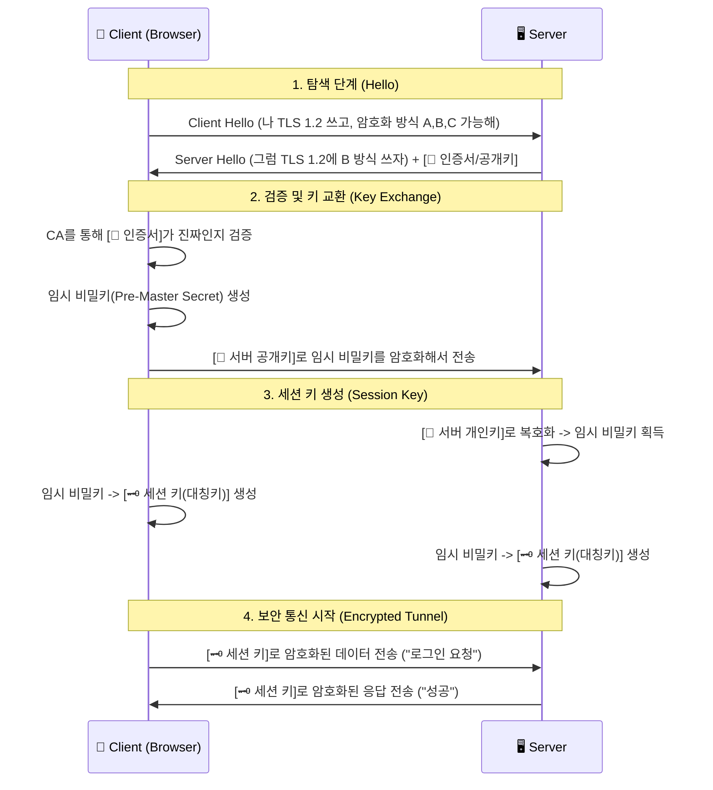

# 🔒 HTTPS: 웹 개발자를 울리는 보안의 세계

## 🚨 실제로 겪어본 문제들

### 웹 개발자가 흔히 마주치는 악몽들:

**"왜 내 사이트가 '안전하지 않음'이라고 나오지?"**
- 로컬 개발환경에서는 잘 되는데 배포 후 HTTPS 적용 실패
- API 호출이 갑자기 안 됨 (Mixed Content 에러)
- 인증서 만료로 새벽에 깨어남

**"HTTPS 적용했는데 왜 느려졌지?"**
- 첫 접속이 너무 느림 (SSL Handshake)
- 이미지 로딩이 실패함
- 서드파티 스크립트가 차단됨

**"인증서는 어떻게 발급받지?"**
- Let's Encrypt vs 유료 인증서 고민
- 도메인 검증 실패
- 갱신 자동화 실패

## 🎯 1분 요약: 왜 HTTPS가 필수인가?

**HTTP = 엽서 보내기 (누구나 읽을 수 있음)**
**HTTPS = 봉투에 넣어 보내기 (안에 내용은 비밀)**

> **결론:** HTTPS 안 쓰면 현대 웹 개발 못 함 (보안 + SEO + 최신 기능)

---

## 2. 🚫 HTTP vs ✅ HTTPS: 실제 적용 차이

**개발자의 고통 지수 비교:**

| 측면 | HTTP | HTTPS | 실제 영향 |
|------|------|-------|----------|
| **보안** | ❌ 완전 위험 | ✅ 안전 | 패킷 훔쳐보기 가능 vs 불가능 |
| **속도** | ⚡ 빠름 | 🐌 첫 접속 느림 | 0.1초 vs 1-2초 (이후 비슷) |
| **SEO** | ❌ 불이익 | ✅ 가산점 | 구글 검색 순위 하락 vs 상승 |
| **브라우저** | ❌ 경고 표시 | ✅ 안전 표시 | "안전하지 않음" vs 자물쇠 아이콘 |
| **최신 기능** | ❌ 사용 불가 | ✅ 사용 가능 | PWA, 위치정보, 카메라 등 |

**💡 실제 적용 시 겪는 문제들:**

```javascript
// ❌ HTTP에서 카메라 접근 시도
navigator.mediaDevices.getUserMedia({video: true})
  .catch(err => console.log("카메라 접근 거부됨!"));

// ✅ HTTPS에서는 정상 작동
// (브라우저 보안 정책)
```

```html
<!-- ❌ HTTP에서 위치 정보 요청 -->
<button onclick="navigator.geolocation.getCurrentPosition(showPosition)">
  내 위치 찾기
</button>
<!-- "HTTPS 필요" 에러 발생 -->
```

---

## 3. 핵심 원리: 하이브리드 암호화 시스템

HTTPS는 **비대칭키** 방식과 **대칭키** 방식을 섞어서 사용한다. **"왜 하나만 쓰지 않고 섞어 쓰는가?"**가 핵심 질문이다.

1. **비대칭키 (공개키/개인키):** 보안성은 높지만, 계산 비용이 비싸고 **느리다**.
*  **접속 초기(Handshake)**에만 사용하여 '대칭키'를 안전하게 교환하는 용도로 쓴다.


2. **대칭키:** 계산 비용이 싸고 **빠르다**.
*  **실제 데이터 통신** 시에는 이 키를 사용하여 빠르게 통신한다.


---

## 4. SSL/TLS Handshake 과정 (Deep Dive)

클라이언트(브라우저)와 서버가 보안 연결을 맺기 위해 서로를 확인하고 암호화 키를 나누는 과정이다. (TLS 1.2/1.3 기준 단순화)

### 4.1 시퀀스 다이어그램 (Mermaid)



### 4.2 단계별 상세 설명

1. **Client Hello:** 브라우저가 서버에 말을 건다. "나 이런 암호화 방식(Cipher Suite) 지원해."
2. **Server Hello & Certificate:** 서버가 응답한다. "그래, 그중 이걸로 하자." 그리고 자신의 신분증(**SSL 인증서**)을 건넨다. 이 인증서 안에 서버의 **공개키(Public Key)**가 들어있다.
3. **Certificate Verification:** 브라우저는 내장된 '신뢰할 수 있는 기관(CA) 리스트'를 확인하여 이 인증서가 유효한지 검증한다. (위조된 사이트인지 판별)
4. **Key Exchange (핵심):**
* 브라우저는 **대칭키(세션 키)**의 재료가 될 랜덤 문자열을 만든다.
* 이것을 **서버의 공개키**로 암호화해서 보낸다. (이제 이 내용은 세상에서 오직 서버만 자신의 **개인키**로 열어볼 수 있다.)


5. **Session Key Generation:** 서버는 개인키로 암호문을 열어 재료를 얻는다. 이제 양쪽 모두 동일한 **세션 키(대칭키)**를 갖게 되었다.
6. **Secure Communication:** 이후의 모든 데이터(HTML, JSON 등)는 **세션 키**로 빠르게 암호화/복호화하며 주고받는다.

---

## 5. 😱 실무에서 자주 겪는 HTTPS 문제들

### 5.1 "안전하지 않은 사이트" 경고 (실제 해결 과정)

**🚨 상황 1: 인증서 만료 (새벽 3시에 깨어나는 경험)**

**증상:** 갑자기 사이트 접속 불가, 고객 컴플레인 폭주
**원인:** Let's Encrypt 인증서가 90일 만료됨
**해결:** 자동 갱신 설정 누락

```bash
# ✅ 올바른 자동 갱신 설정
sudo certbot renew --dry-run  # 테스트
sudo certbot renew            # 실제 갱신
sudo systemctl reload nginx   # 웹서버 재시작
```

**🚨 상황 2: Mixed Content 에러 (이미지/스크립트 로딩 실패)**

**증상:** HTTPS 사이트에서 HTTP 리소스 불러오다가 차단됨
**문제 코드:**
```html
<!-- ❌ 잘못된 예: HTTP 리소스 사용 -->

<script src="http://cdn.example.com/script.js"></script>
```

**해결책:**
```html
<!-- ✅ 올바른 예: 모두 HTTPS로 -->

<script src="https://cdn.example.com/script.js"></script>

<!-- 또는 프로토콜 생략 -->

```

**🚨 상황 3: 로컬 개발환경 HTTPS 적용 실패**

**증상:** 로컬에서는 HTTP만 되는데 배포 후 HTTPS 적용
**해결:** 개발용 자체 서명 인증서 생성

```bash
# 개발용 인증서 생성
openssl req -x509 -newkey rsa:4096 -keyout key.pem -out cert.pem -days 365
# Node.js Express에서 사용
const https = require('https');
const options = {
  key: fs.readFileSync('key.pem'),
  cert: fs.readFileSync('cert.pem')
};
https.createServer(options, app).listen(443);
```

### 5.2 Mixed Content (혼합된 콘텐츠) 경고

HTTPS 사이트(`https://site.com`) 안에서 HTTP 리소스(`http://site.com/image.jpg`)를 불러오려 할 때 발생한다.

* **보안 위험:** 암호화된 페이지 안에서 암호화되지 않은 스크립트가 실행되면 보안이 뚫린 것과 같다.
* **해결:** 모든 리소스(이미지, API 호출, 스크립트) 경로를 `https://`로 변경하거나, 프로토콜 생략(`//site.com/image.jpg`)을 사용해야 한다.

---

### 6.1 무료 인증서: Let's Encrypt

과거에는 인증서가 비쌌지만, 지금은 **Let's Encrypt**를 통해 무료로 자동 발급/갱신이 가능하다. `Certbot` 같은 도구를 서버에 설치하면 만료 30일 전에 알아서 갱신해 준다. 실무에서는 Nginx/Apache 설정과 연동하여 자동화하는 것이 표준이다.

### 6.2 HSTS (HTTP Strict Transport Security)

사용자가 `http://naver.com`이라고 쳐도 강제로 `https`로 연결하고 싶다면? 서버 헤더에 **HSTS**를 설정해야 한다.

* **기능:** 브라우저에게 "내 사이트는 앞으로 무조건 HTTPS로만 접속해. HTTP로 시도하면 네가 알아서 바꿔줘"라고 명령하는 헤더다.
* **효과:** 중간자 공격(SSL Stripping)을 원천 차단하여 보안성을 극대화한다.

### 6.3 HTTP/2와 HTTP/3 (QUIC)

HTTPS는 느리지 않다. 오히려 최신 프로토콜인 HTTP/2와 HTTP/3는 **HTTPS 위에서만 동작**한다.

* **HTTP/2:** 하나의 연결로 여러 파일을 동시에 전송(Multiplexing)하여 속도 혁신.
* **HTTP/3 (QUIC):** TCP 대신 UDP를 사용하여 핸드셰이크 과정을 획기적으로 줄임.

---

## 7. QUIC 프로토콜 심층 분석

### 7.1 QUIC의 탄생 배경

TCP의 근본적 문제점을 해결하기 위해 구글이 개발한 프로토콜로, HTTP/3의 기반이 되었다.

**TCP의 한계:**
- **Slow Start:** 연결 초기에 전송 속도가 느림
- **Head-of-Line Blocking:** 하나의 패킷 손실이 전체 연결을 지연시킴
- **핸드셰이크 오버헤드:** 3-Way Handshake로 인한 지연
- **중간 장비 문제:** 방화벽, 로드 밸런서가 TCP를 이해하지 못하는 경우

### 7.2 QUIC의 핵심 혁신

#### 7.2.1 UDP 기반 전송
```text
[TCP vs QUIC 연결 비교]

TCP 연결 과정:
1. TCP 3-Way Handshake (100-200ms)
2. TLS Handshake (100-200ms)
3. HTTP 요청/응답

QUIC 연결 과정:
1. QUIC Handshake (0-RTT 가능, 0-50ms)
2. 암호화된 HTTP/3 데이터 전송
```

#### 7.2.2 내장된 보안 (TLS 1.3)
QUIC는 **TLS 1.3을 프로토콜 레벨에 내장**하여 별도의 TLS 협상이 필요 없음.

**장점:**
- **0-RTT (Zero Round Trip Time):** 이전에 연결했던 서버라면 즉시 데이터 전송 가능
- **Forward Secrecy:** 세션 키가 유출되어도 이전 통신이 안전함
- **최신 암호화:** ChaCha20-Poly1305 등 현대적 암호화 알고리즘 사용

#### 7.2.3 멀티플렉싱 + 스트림 제어
```text
[HTTP/2 vs HTTP/3 비교]

HTTP/2 (TCP 기반):
Stream 1: [데이터] [데이터] [손실!] → 전체 스트림 대기
Stream 2: [데이터] [데이터] [데이터] → 대기 중...

HTTP/3 (QUIC 기반):
Stream 1: [데이터] [데이터] [손실!] → 독립적 재전송
Stream 2: [데이터] [데이터] [데이터] → 계속 진행
```

### 7.3 QUIC 패킷 구조

#### 7.3.1 Long Header (초기 연결용)
```
 0                   1                   2                   3
  0 1 2 3 4 5 6 7 8 9 0 1 2 3 4 5 6 7 8 9 0 1 2 3 4 5 6 7 8 9 0 1
 +-+-+-+-+-+-+-+-+-+-+-+-+-+-+-+-+-+-+-+-+-+-+-+-+-+-+-+-+-+-+-+-+
 |1|   Type (7)  |         Connection ID Length         | Type-specific...
 +-+-+-+-+-+-+-+-+-+-+-+-+-+-+-+-+-+-+-+-+-+-+-+-+-+-+-+-+-+-+-+-+
 |                     Connection ID (0/64/128)                 |
 +-+-+-+-+-+-+-+-+-+-+-+-+-+-+-+-+-+-+-+-+-+-+-+-+-+-+-+-+-+-+-+-+
 |                       Packet Number                          |
 +-+-+-+-+-+-+-+-+-+-+-+-+-+-+-+-+-+-+-+-+-+-+-+-+-+-+-+-+-+-+-+-+
 |                     Protected Payload                        |
 +-+-+-+-+-+-+-+-+-+-+-+-+-+-+-+-+-+-+-+-+-+-+-+-+-+-+-+-+-+-+-+-+
```

#### 7.3.2 Short Header (데이터 전송용)
```
 0                   1                   2                   3
  0 1 2 3 4 5 6 7 8 9 0 1 2 3 4 5 6 7 8 9 0 1 2 3 4 5 6 7 8 9 0 1
 +-+-+-+-+-+-+-+-+-+-+-+-+-+-+-+-+-+-+-+-+-+-+-+-+-+-+-+-+-+-+-+-+
 |0|C|K|   Type  |         [Connection ID (opt)]               |
 +-+-+-+-+-+-+-+-+-+-+-+-+-+-+-+-+-+-+-+-+-+-+-+-+-+-+-+-+-+-+-+-+
 |                      Packet Number                           |
 +-+-+-+-+-+-+-+-+-+-+-+-+-+-+-+-+-+-+-+-+-+-+-+-+-+-+-+-+-+-+-+-+
 |                     Protected Payload                        |
 +-+-+-+-+-+-+-+-+-+-+-+-+-+-+-+-+-+-+-+-+-+-+-+-+-+-+-+-+-+-+-+-+
```

### 7.4 QUIC의 혼잡 제어

TCP의 Reno/Cubic 알고리즘 대신 **더 지능적인 혼잡 제어**를 사용.

#### 7.4.1 BBR (Bottleneck Bandwidth and RTT)
- **대역폭 기반:** 실제 네트워크 용량을 측정하여 최적 속도 유지
- **RTT 기반:** 왕복 지연시간을 고려한 정밀한 제어
- **장점:** 패킷 손실 없이도 최대 속도를 유지

```text
[BBR 작동 원리]
1. 네트워크 대역폭 측정
2. 최소 RTT 측정
3. 대역폭 × (RTT_min / RTT_current)로 전송 속도 조절
```

### 7.5 실무 적용 사례

#### 7.5.1 CDN에서의 QUIC 활용
```text
[Cloudflare의 QUIC 적용 사례]
- 기존 TCP: 100-200ms 핸드셰이크 지연
- QUIC 적용 후: 0-RTT로 즉시 연결
- 결과: 페이지 로드 시간 30-50% 개선
```

#### 7.5.2 모바일 환경에서의 이점
- **약한 신호:** TCP의 재전송으로 인한 추가 지연 제거
- **네트워크 전환:** WiFi ↔ Cellular 전환 시 연결 유지
- **배터리 절약:** 불필요한 재전송 감소

### 7.6 QUIC의 한계와 고려사항

#### 7.6.1 중간 장비 호환성
- **방화벽:** UDP 포트 443을 차단하는 경우가 있음
- **로드 밸런서:** QUIC 연결을 이해하지 못하는 구형 장비
- **솔루션:** QUIC와 TCP를 동시에 지원하는 하이브리드 접근

#### 7.6.2 메모리 사용량
- **장점:** 연결 상태를 클라이언트가 유지하므로 서버 메모리 절약
- **단점:** 클라이언트 메모리 사용량 증가

### 7.7 QUIC 디버깅과 모니터링

#### 7.7.1 Wireshark로 QUIC 패킷 분석
```bash
# QUIC 패킷 캡처
tshark -i eth0 -f "udp port 443" -w quic_traffic.pcap

# QUIC 패킷 분석
tshark -r quic_traffic.pcap -d udp.port==443,quic -T fields -e quic.version
```

#### 7.7.2 주요 메트릭 모니터링
- **연결 설정 시간 (Connection Setup Time)**
- **0-RTT 성공률 (0-RTT Success Rate)**
- **패킷 손실률 (Packet Loss Rate)**
- **혼잡 윈도우 크기 (Congestion Window Size)**

---

## 8. HTTP/3 실무 적용 가이드

### 8.1 서버 설정 (Nginx + QUIC)

```nginx
# nginx.conf에 QUIC 설정 추가
http {
    # QUIC 모듈 로드
    quic on;

    server {
        listen 443 quic reuseport;
        listen 443 ssl http2;

        # SSL 설정
        ssl_certificate /path/to/cert.pem;
        ssl_certificate_key /path/to/key.pem;

        # QUIC 전용 설정
        quic_retry on;
        quic_gso on;

        # HTTP/3 우선 사용 유도
        add_header Alt-Svc 'h3=":443"; ma=86400';
    }
}
```

### 8.2 클라이언트 지원 확인

```javascript
// 브라우저 HTTP/3 지원 확인
if ('connection' in navigator && navigator.connection.protocol === 'h3') {
    console.log('HTTP/3 연결 중');
}

// fetch API로 HTTP/3 강제 사용
fetch('/api/data', {
    method: 'GET',
    headers: {
        'Alt-Used': '443'  // HTTP/3 사용 지시
    }
});
```

### 8.3 성능 측정

```bash
# HTTP 버전별 성능 비교
curl -w "@curl-format.txt" -o /dev/null -s "https://example.com"

# curl-format.txt
     time_namelookup:  %{time_namelookup}\n
        time_connect:  %{time_connect}\n
     time_appconnect:  %{time_appconnect}\n
        time_pretransfer: %{time_pretransfer}\n
           time_redirect: %{time_redirect}\n
      time_starttransfer: %{time_starttransfer}\n
                          ----------\n
              time_total: %{time_total}\n
```

---

## 9. 미래 전망: HTTP/4와 그 너머

### 9.1 HTTP/4 가능성
- **멀티패스 전송:** 여러 경로 동시 사용
- **AI 기반 최적화:** 머신러닝으로 실시간 라우팅 최적화
- **양자 안전 암호화:** 양자 컴퓨터 시대를 대비한 암호화

### 9.2 QUIC의 확장 가능성
- **WebTransport:** 실시간 미디어 전송 표준화
- **WebRTC 통합:** P2P 통신과 HTTP 통합
- **IoT 적용:** 저전력 디바이스의 효율적 통신

---

## 🎯 결론: HTTPS 적용 체크리스트

### 📋 실무 적용을 위한 5단계 가이드

**1단계: 준비하기**
- [ ] 도메인 구매 및 DNS 설정
- [ ] 호스팅 서버 준비 (AWS, GCP 등)

**2단계: 인증서 발급**
- [ ] Let's Encrypt 무료 인증서 선택
- [ ] `certbot` 설치 및 실행
- [ ] 자동 갱신 크론잡 설정

**3단계: 서버 설정**
- [ ] Nginx/Apache HTTPS 설정
- [ ] HTTP → HTTPS 리다이렉트 설정
- [ ] SSL Labs 테스트로 A+ 등급 확인

**4단계: 코드 수정**
- [ ] 모든 리소스 URL을 HTTPS로 변경
- [ ] API 엔드포인트 HTTPS 적용
- [ ] Mixed Content 에러 해결

**5단계: 모니터링**
- [ ] 인증서 만료 알림 설정
- [ ] HTTPS 적용 상태 모니터링
- [ ] 성능 영향 측정

### 🚀 다음 단계:
- 실제 서비스에 HTTPS 적용해보기
- SSL Labs로 보안 점수 확인하기
- HTTP/3, QUIC 등 최신 프로토콜 공부하기

**보안하고 빠른 웹 서비스 만들기 화이팅! 🔒⚡**
