# 🔒 HTTPS 완벽 이해: 외우지 말고 원리를 파악하자

> **이 문서의 목표:** 암기가 아닌 **"왜?"**에 대한 답을 찾는 것. 원리를 이해하면 응용은 자연스럽게 따라온다.

---

## 0. 핵심 질문으로 시작하기

HTTPS를 이해하려면 다음 질문들에 답할 수 있어야 한다:

1. **HTTP의 무엇이 문제인가?** → 왜 HTTPS가 필요한지
2. **암호화는 어떻게 "안전함"을 보장하는가?** → 대칭키 vs 비대칭키의 본질
3. **둘 다 장단점이 있다면, 어떻게 조합하는가?** → TLS Handshake의 설계 철학
4. **TCP는 무엇이 느린가?** → QUIC이 왜 등장했는지

---

## 1. HTTP의 치명적 문제: 엽서 vs 봉투

### 1.1 비유로 이해하기

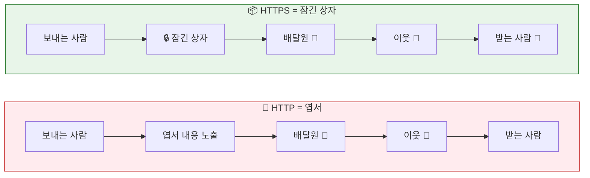

### 1.2 실제로 일어나는 일: 패킷 스니핑

> [!CAUTION]
> HTTP로 로그인하면 **비밀번호가 그대로 노출**됩니다!

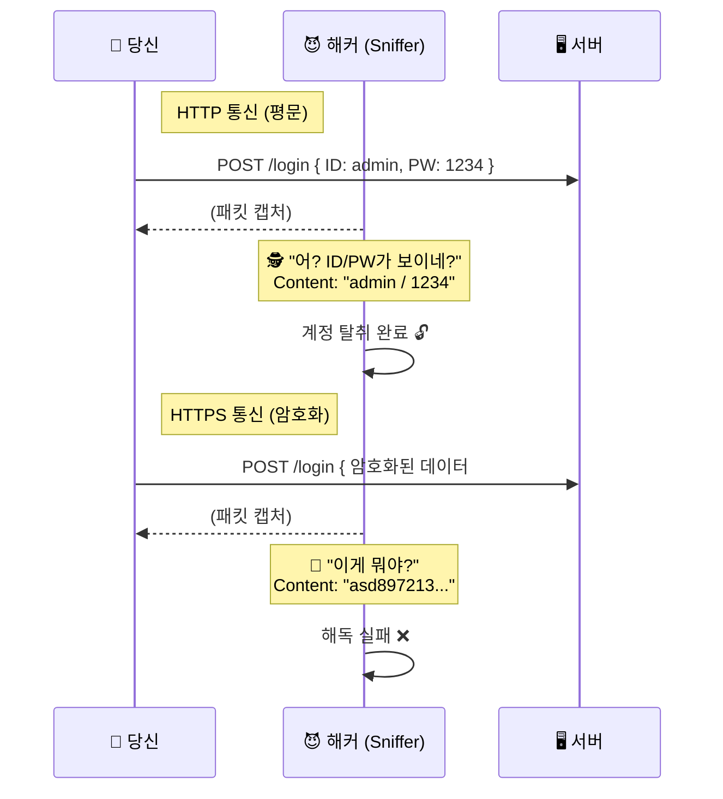

> [!IMPORTANT]
> **핵심 통찰:** HTTP는 데이터를 **평문(Plain Text)**으로 전송한다.
> 네트워크 경로 어디서든 누구나 내용을 읽을 수 있다.

### 1.3 HTTPS가 해결하는 것

| 위협 | HTTP | HTTPS |
|:---:|------|-------|
| 🔊 **도청** | ❌ 내용이 그대로 노출 | ✅ 암호화되어 해독 불가 |
| ✏️ **변조** | ❌ 중간에서 수정 가능 | ✅ 무결성 검증으로 감지 |
| 🎭 **위장** | ❌ 가짜 서버 구분 불가 | ✅ 인증서로 신원 확인 |

> [!NOTE]
> **결론:** HTTPS는 단순히 "암호화"가 아니라, **기밀성 + 무결성 + 인증**이라는 보안의 3요소를 모두 제공한다.

---

## 2. 암호화의 본질: 왜 두 가지 방식이 필요한가?

### 2.1 대칭키 암호화: 같은 열쇠로 잠그고 열기

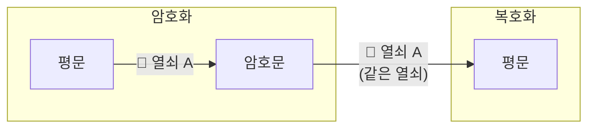

| 항목 | 설명 |
|-----|------|
| 🏠 **비유** | 집 열쇠 - 잠글 때와 열 때 같은 열쇠 |
| ✅ **장점** | 매우 빠름 (수학적으로 단순) |
| ❌ **단점** | 열쇠 전달 문제 - 보내는 순간 탈취 가능! |

> [!WARNING]
> **핵심 문제:** 처음 만나는 사람과 대칭키를 **안전하게 공유하는 방법이 없다.**

---

### 2.2 비대칭키 암호화: 공개키와 개인키의 마법

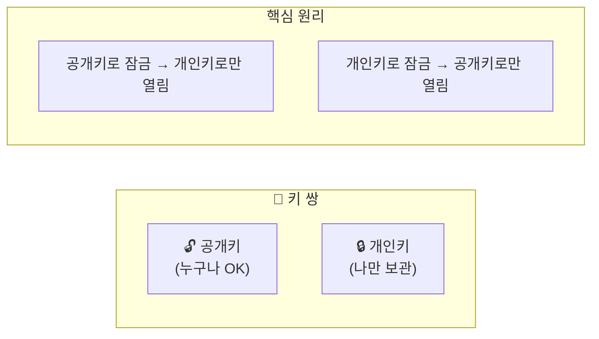

<details>
<summary>📮 비유로 이해하기: 우체통</summary>

```
┌─────────────────────────────────────────────────────────────┐
│              📮 비대칭키 = 우체통 (Public Box)                │
├─────────────────────────────────────────────────────────────┤
│                                                             │
│  1️⃣  서버가 "우체통(공개키)"을 길거리에 설치                 │
│      → 누구나 편지(데이터)를 넣을 수 있음                     │
│                                                             │
│  2️⃣  우체통을 열 수 있는 건 "열쇠(개인키)" 가진 서버뿐       │
│      → 중간 배달부는 절대 열어볼 수 없음                      │
│                                                             │
│  3️⃣  당신이 비밀 메시지를 넣으면                             │
│      → 오직 서버만 열어서 읽을 수 있다!                       │
│                                                             │
└─────────────────────────────────────────────────────────────┘
```

</details>

| 항목 | 설명 |
|-----|------|
| ✅ **장점** | 키 교환 문제 해결! 공개키는 도청당해도 OK |
| ❌ **단점** | 계산 복잡 → **대칭키보다 100~1000배 느림** |

---

### 2.3 왜 둘을 섞어 쓰는가? (하이브리드 암호화)

> [!NOTE]
> **핵심 질문:** 대칭키는 빠르지만 불안전, 비대칭키는 안전하지만 느림.
> 어떻게 **둘의 장점만** 취할 수 있을까?

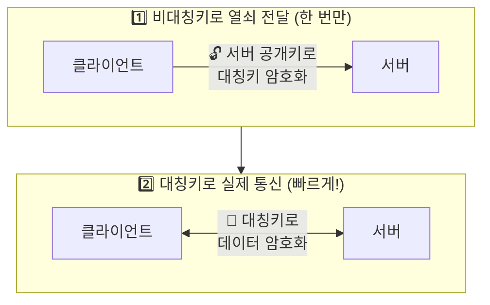

| 역할 | 용도 |
|-----|------|
| 🔐 **비대칭키** | 금고 열쇠를 안전하게 전달 (느려도 **한 번만**) |
| 🔑 **대칭키** | 실제 데이터를 빠르게 주고받기 |

> [!IMPORTANT]
> **이것이 TLS Handshake의 핵심 설계 철학이다.**

---

## 3. TLS Handshake: 단계별 "왜?"를 이해하기

### 3.1 전체 흐름 한눈에 보기

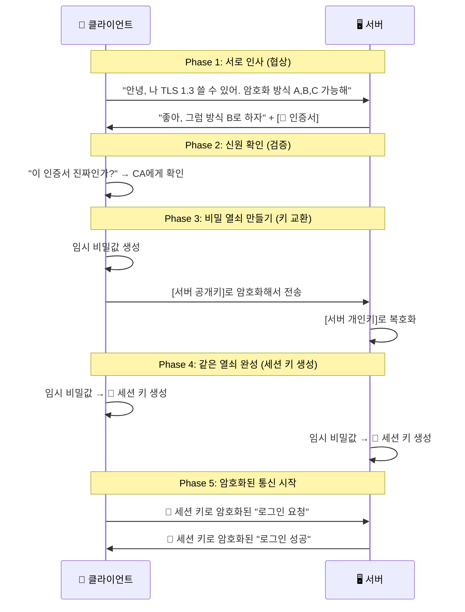

### 3.2 각 단계의 "왜?"

<details>
<summary><b>🤝 Phase 1: 왜 협상(Hello)이 필요한가?</b></summary>

> [!WARNING]
> **문제:** 클라이언트와 서버가 지원하는 암호화 방식이 다를 수 있다!

| 상황 | 지원 버전 |
|-----|----------|
| 오래된 브라우저 | TLS 1.0만 |
| 최신 서버 | TLS 1.3만 |
| **결과** | ❌ 통신 불가! |

> [!TIP]
> **해결:** 서로 "나 이런 거 할 수 있어"라고 말하고, **공통으로 가능한 것 중 가장 안전한 방식**을 선택

**비유:** 외국인과 만났을 때
```
👤 "영어 할 줄 알아?"  →  🙅 "No"
👤 "일본어는?"        →  🙅 "No"  
👤 "중국어는?"        →  🙆 "Yes!"
→ 중국어로 대화하자!
```

</details>

<details>
<summary><b>🔍 Phase 2: 왜 인증서 검증이 필요한가?</b></summary>

> [!CAUTION]
> **문제:** 내가 접속한 서버가 **진짜 네이버**인지, **가짜 피싱 사이트**인지 어떻게 알지?

**해결: 인증 기관(CA)의 역할**

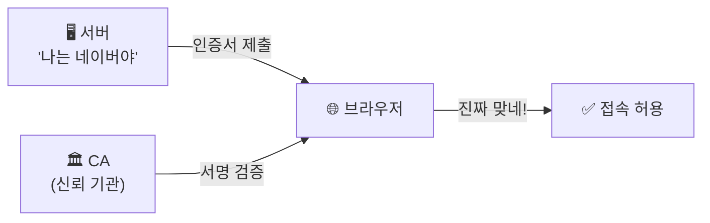

**비유: 신분증 검사**

| 비유 | 역할 |
|-----|------|
| 📜 인증서 | 여권 |
| 🏛️ CA | 정부 기관 |
| 🌐 브라우저 | 출입국 심사관 |

</details>

<details>
<summary><b>🔐 Phase 3: 왜 비대칭키로 "임시 비밀값"을 보내는가?</b></summary>

> [!IMPORTANT]
> **핵심 통찰:** 직접 세션 키를 보내면 **안 되는** 이유
> → 나중에 서버 개인키가 유출되면, **과거 통신도 모두 해독됨!**

**해결: Forward Secrecy (전방향 안전성)**

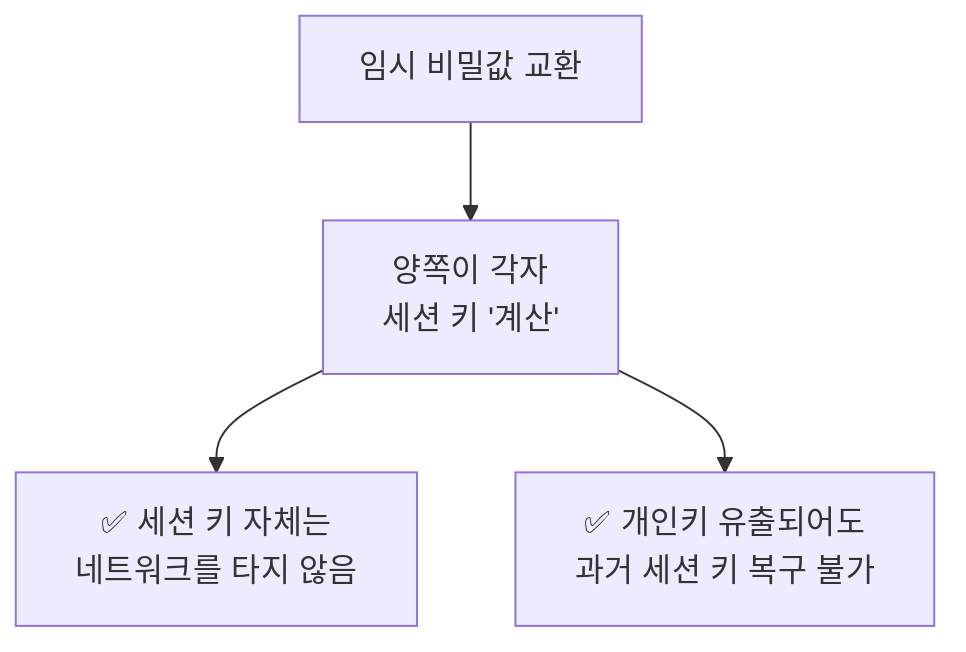

</details>

<details>
<summary><b>⚡ Phase 4-5: 왜 대칭키(세션 키)로 통신하는가?</b></summary>

> [!NOTE]
> **이유: 성능!**
> 비대칭키 암호화는 수학적으로 복잡 (큰 소수의 곱, 타원곡선 연산 등)
> → 모든 데이터를 비대칭키로 암호화하면 **너무 느림**

| 단계 | 방식 | 속도 |
|-----|------|------|
| Handshake | 비대칭키 | 🐢 느림 (한 번만) |
| 이후 통신 | 대칭키 | 🚀 빠름 (계속) |

**결과:**
- Handshake: 0.1~0.3초 (한 번만)
- 이후 통신: 거의 지연 없음 ✨

</details>

---

## 4. 인증서(Certificate)의 원리: 신뢰의 사슬

### 4.1 왜 인증서가 필요한가?

> [!CAUTION]
> **문제:** 서버가 "이게 내 공개키야"라고 하면, 그걸 믿어도 될까?

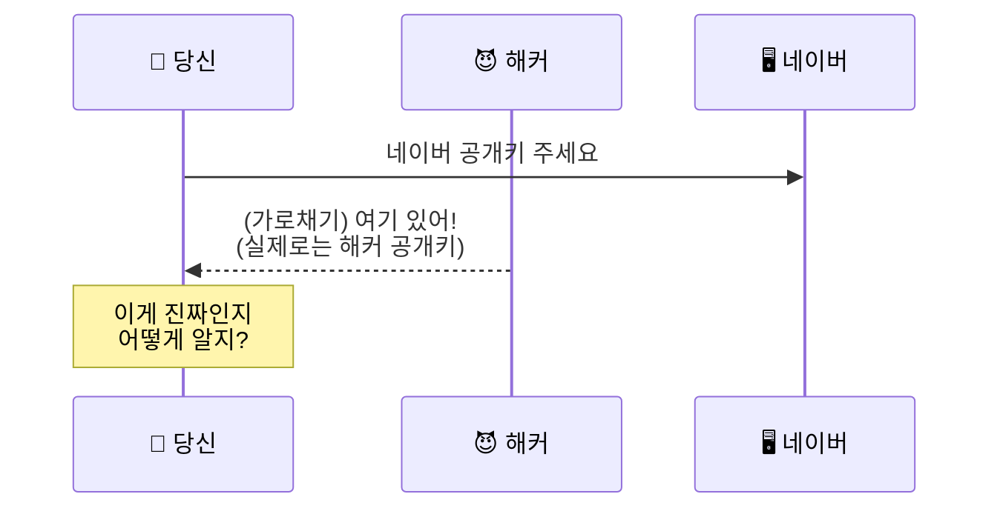

> [!TIP]
> **해결:** 신뢰할 수 있는 기관(CA)이 **"이 공개키는 진짜 네이버 것이 맞아"**라고 서명해서 보증한다.

---

### 4.2 인증서 검증 과정

#### 인증서의 구조

```
📜 인증서 (Certificate)
      ┌───────────────────────────────────────────────────┐
      │  🌐 도메인: www.naver.com                         │
      ├───────────────────────────────────────────────────┤
      │  🔑 공개키 지문(SHA-256):                          │
      │     2f:3a:6c:1b:9d:24:89:7e:12:90:4a:ff:8e:3b...  │
      ├───────────────────────────────────────────────────┤
      │  📅 유효기간: 2024-01-01 ~ 2025-01-01             │
      ├───────────────────────────────────────────────────┤
      │  🏢 발급자: DigiCert CA                           │
      ├───────────────────────────────────────────────────┤
      │  ✍️  [CA의 디지털 서명]                           │
      │      (CA의 개인키로 서명됨 → 위조 불가)            │
      └───────────────────────────────────────────────────┘
```

#### 검증 흐름

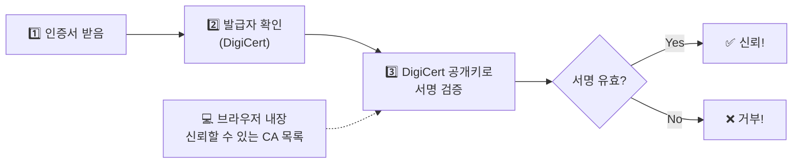

---

### 4.3 신뢰의 사슬 (Chain of Trust)

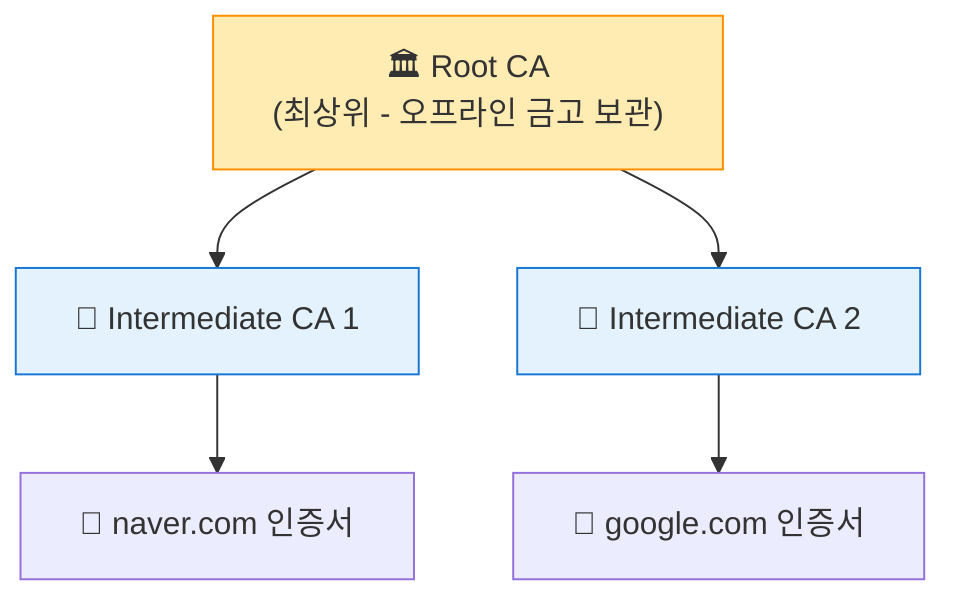

<details>
<summary>🤔 왜 이런 계층 구조인가?</summary>

| 이유 | 설명 |
|-----|------|
| 🔒 **Root 보호** | Root CA 개인키는 너무 중요 → 오프라인 금고에 보관 |
| ⚡ **운영 효율** | 일상적인 인증서 발급은 Intermediate CA가 담당 |
| 🛡️ **위험 분산** | Root가 해킹당하면 모든 인증서 무효화 → 계층화로 피해 최소화 |

</details>

---

## 5. 실무 문제 해결: 원리를 알면 답이 보인다

### 5.1 Mixed Content 에러

> [!CAUTION]
> **증상:** HTTPS 사이트에서 일부 이미지/스크립트가 안 불러와짐

#### 왜 발생하는가?

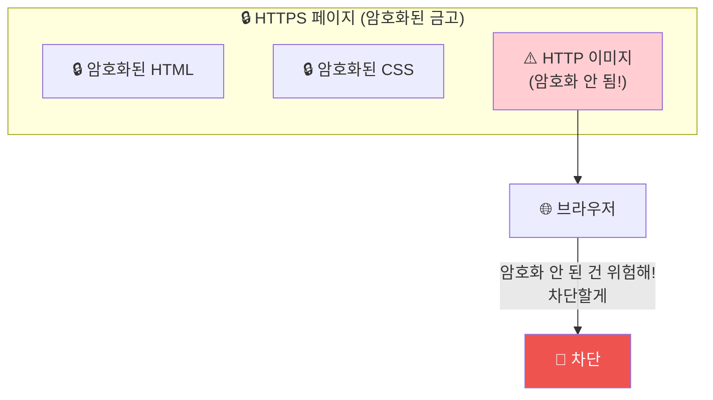

> [!NOTE]
> **원리:** 암호화된 금고 안에 암호화 안 된 문서를 넣으면, 금고의 의미가 없어집니다.
> 브라우저는 보안을 위해 Mixed Content를 차단합니다.

#### 해결 방법

| 상태 | 코드 | 설명 |
|:---:|------|------|
| ❌ | `` | HTTP 리소스 → 차단됨 |
| ✅ | `` | HTTPS로 명시 |
| ✅✅ | `` | 프로토콜 자동 선택 **(권장)** |

<details>
<summary>🔍 빠른 진단 방법</summary>

**브라우저 개발자 도구 (F12)**
- **Console 탭:** "Mixed Content" 경고 메시지 확인
- **Network 탭:** 차단된 리소스 빨간색으로 표시

```bash
# 또는 curl로 확인
curl -s https://yoursite.com | grep -i "http://"
```

</details>

---

### 5.2 인증서 만료 문제

> [!WARNING]
> **증상:** 갑자기 "이 사이트는 안전하지 않습니다" 경고 발생

#### 왜 유효기간이 있는가?

> [!IMPORTANT]
> 인증서 유효기간은 **보안을 위한 설계**입니다.

| 이유 | 설명 |
|-----|------|
| 🔄 **정기적 신원 재확인** | 회사가 아직 존재하는지, 도메인 소유권이 유효한지 확인 |
| 🔑 **키 갱신 강제** | 오래된 키는 유출 위험 증가, 새 키로 교체 기회 |

| 인증서 종류 | 유효기간 |
|-----------|---------|
| Let's Encrypt (무료) | **90일** |
| 유료 인증서 | **1년** |

#### 해결: 자동 갱신 설정

```bash
# 1. 갱신 테스트 (실제 갱신 안 함)
sudo certbot renew --dry-run

# 2. 실제 갱신
sudo certbot renew && sudo systemctl reload nginx
```

<details>
<summary>🤖 완전 자동화 (크론잡 설정)</summary>

```bash
# /etc/cron.d/certbot-renew
# 매일 새벽 3시에 갱신 체크 (만료 30일 전에만 실제 갱신)
0 3 * * * root certbot renew --quiet && systemctl reload nginx
```

> [!TIP]
> Certbot 설치 시 이메일을 등록하면, 만료 **20일, 10일, 1일** 전에 알림 메일을 받을 수 있습니다.

</details>

---

### 5.3 "안전하지 않음" 경고

> [!CAUTION]
> **증상:** 브라우저 주소창에 "안전하지 않음" 또는 🔓 빨간 자물쇠 표시

#### 원인 진단 체크리스트

| 분류 | 원인 | 확인 사항 |
|-----|------|----------|
| **1. 인증서** | 만료됨 | `openssl`로 만료일 확인 |
| | 도메인 불일치 | `www.example.com` ≠ `example.com` |
| | 자체 서명 | CA 검증 불가 |
| | 체인 불완전 | 중간 인증서 누락 |
| **2. Mixed Content** | HTTP 리소스 | 개발자 도구 Console 확인 |
| **3. 설정** | 약한 암호화 | SHA-1, MD5 사용 |
| | 오래된 TLS | TLS 1.0/1.1 (deprecated) |

<details>
<summary>🛠️ 빠른 진단 명령어</summary>

**인증서 상태 확인:**
```bash
openssl s_client -connect example.com:443 -servername example.com 2>/dev/null | \
  openssl x509 -noout -dates -subject

# 결과 예시:
# notBefore=Jan 1 00:00:00 2024 GMT
# notAfter=Apr 1 00:00:00 2024 GMT   ← 만료일 확인!
# subject=CN = example.com          ← 도메인 확인!
```

**TLS 버전 및 Cipher Suite 확인:**
```bash
nmap --script ssl-enum-ciphers -p 443 example.com
```

</details>

---

## 6. TCP의 한계와 QUIC의 등장: 왜 새 프로토콜이 필요했나?

### 6.1 TCP의 근본적 한계

> [!NOTE]
> QUIC을 이해하려면 먼저 TCP가 **왜** 느린지 알아야 한다.

| 시대 | 상황 | 설계 목표 |
|-----|------|----------|
| 🕰️ **1970년대** | 네트워크 불안정, 패킷 손실 흔함 | "확실하게 전달" 최우선 |
| 🚀 **현대** | 인터넷은 빨라짐 | TCP의 "확실하게"가 오히려 병목! |

---

#### 문제 1: 연결 설정이 너무 오래 걸림

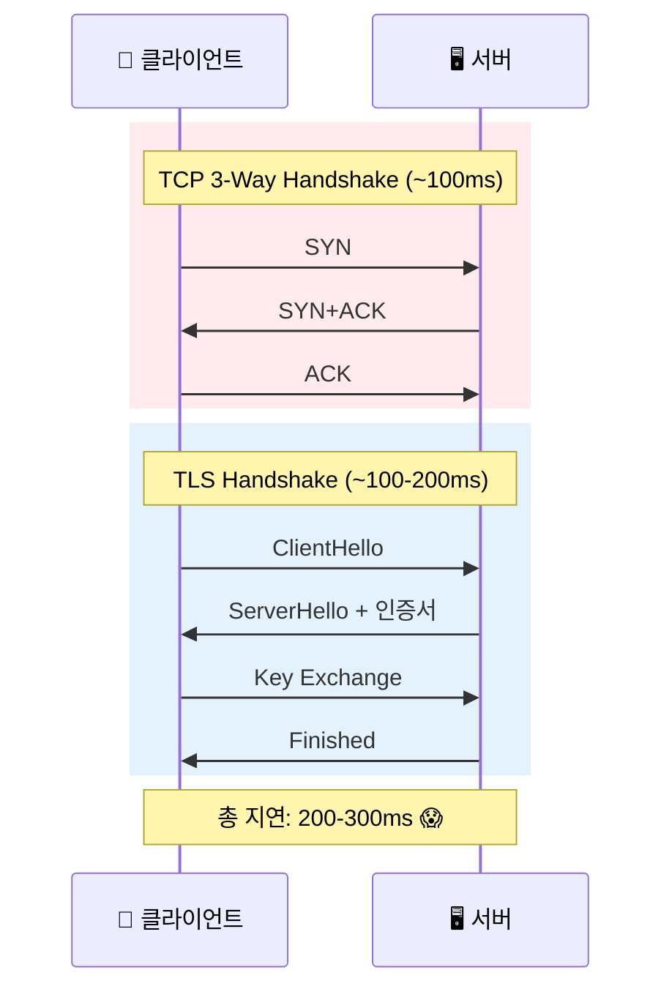

> [!WARNING]
> **매번 새 연결마다** 이 과정을 반복한다!

---

#### 문제 2: Head-of-Line Blocking

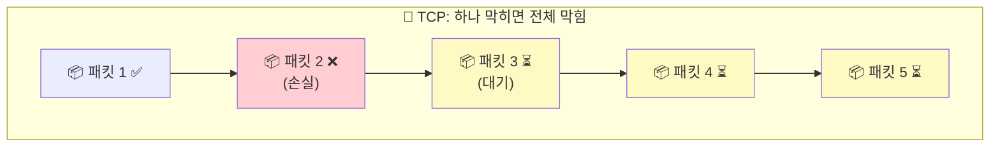

| 상황 | 결과 |
|-----|------|
| 요청 A | `[1] [2-손실] [3-대기]` ← 패킷 2 때문에 모두 지연 |
| 요청 B | `[4] [5] [6-대기]` ← **A랑 관계없는데 같이 지연!** |

> [!CAUTION]
> 서로 **독립적인 요청**인데, 하나의 문제가 전체를 멈추게 함

### 6.2 QUIC의 해결책: UDP 위에 새로 설계

> [!TIP]
> **발상의 전환:** TCP를 고치는 건 불가능 (전 세계 모든 장비 업데이트 필요)
> → **UDP 위에 새로운 프로토콜을 만들자!**

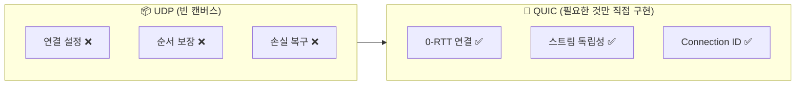

---

#### 해결책 1: 0-RTT 연결

| 프로토콜 | 연결 시간 | 재연결 시간 |
|---------|----------|------------|
| TCP+TLS | **2-3 RTT** (200-300ms) | 2-3 RTT |
| QUIC | **1 RTT** | **0 RTT** 🚀 |

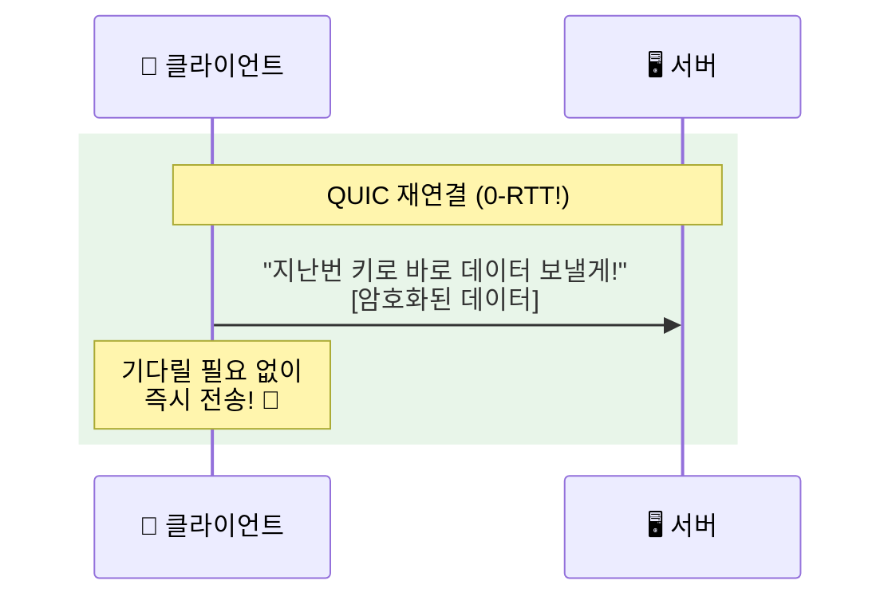

---

#### 해결책 2: 스트림 독립성

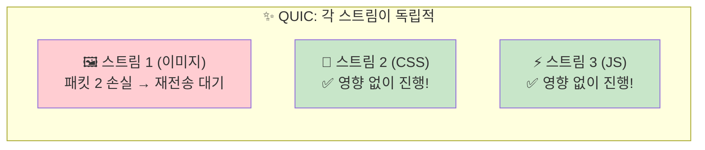

> [!NOTE]
> **결과:** 하나의 손실이 다른 요청에 영향 안 줌!

---

### 6.3 QUIC의 추가 혁신

#### 🔗 연결 ID: 네트워크 전환에도 연결 유지

| 상황 | TCP | QUIC |
|-----|-----|------|
| WiFi → 모바일 전환 | ❌ IP 바뀜 → 연결 끊김 | ✅ Connection ID로 식별 → 유지! |
| **실생활 예시** | 지하철↔버스 갈아탈 때 끊김 | 유튜브 영상 끊김 없이 재생 |

#### 🔒 내장 암호화: TLS 1.3 기본 포함

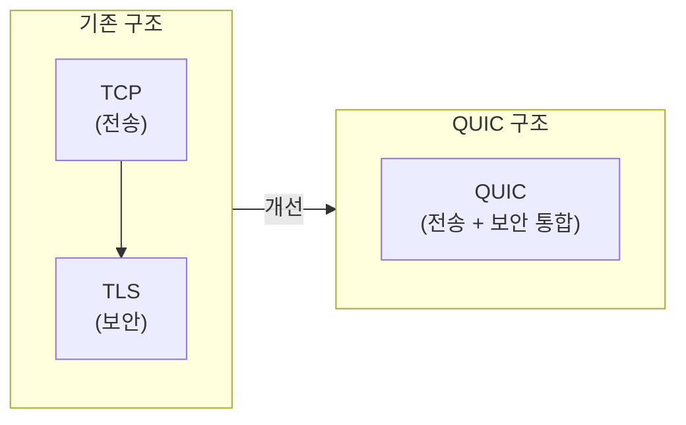

<details>
<summary>✨ QUIC 내장 암호화의 장점</summary>

| 장점 | 설명 |
|-----|------|
| ⚡ **빠른 Handshake** | 합쳐서 최적화 |
| 🔐 **헤더까지 암호화** | 더 강한 보안 |
| 🕵️ **프라이버시** | 중간 장비가 내용을 볼 수 없음 |

</details>

---

## 7. HTTP 버전별 진화: 왜 계속 바뀌는가?

### 7.1 진화의 이유

> [!NOTE]
> 각 버전은 **이전 버전의 문제를 해결**하기 위해 등장했다.

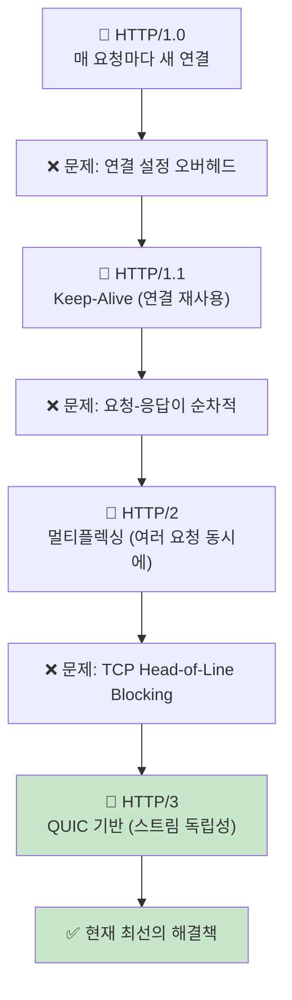

### 7.2 비교 표

| 특성 | HTTP/1.1 | HTTP/2 | HTTP/3 |
|-----|---------|--------|--------|
| **기반 프로토콜** | TCP | TCP | QUIC (UDP) |
| **연결당 요청** | 1개 | 여러 개 | 여러 개 |
| **HOL Blocking** | 있음 | TCP 레벨에서 있음 | 없음 |
| **암호화** | 선택 | 사실상 필수 | 필수 (내장) |
| **연결 설정** | 2-3 RTT | 2-3 RTT | 0-1 RTT |

---

## 8. 패킷 구조 Deep Dive: Wireshark로 디버깅하려면 알아야 한다

> [!IMPORTANT]
> **왜 패킷 구조를 알아야 하는가?**
> - 🔍 네트워크 문제 발생 시 **Wireshark**로 원인 분석
> - 🚨 "Handshake 실패"가 **어느 단계에서 왜** 실패했는지 파악
> - ⚡ 성능 병목이 **어디서** 발생하는지 진단

### 8.1 TLS Record 구조: 모든 TLS 데이터의 기본 포맷

TLS에서 주고받는 **모든 데이터**는 이 Record 형식으로 감싸진다.

```
      ┌─────────────────────────────────────────────────────────────┐
      │               TLS Record Header (5 bytes)                   │
      ├──────────────┬──────────────┬───────────────────────────────┤
      │ Content Type │   Version    │            Length             │
      │   (1 byte)   │  (2 bytes)   │           (2 bytes)           │
      ├──────────────┴──────────────┴───────────────────────────────┤
      │                                                             │
      │                   Fragment (실제 데이터)                    │
      │                 Max 16,384 bytes (16KB)                     │
      │                                                             │
      └─────────────────────────────────────────────────────────────┘
```

#### 각 필드의 존재 이유

| 필드 | 값 예시 | 왜 필요한가? |
|-----|--------|-------------|
| **Content Type** | `0x16` (Handshake) | 이 패킷이 뭔지 알아야 처리 방법 결정 |
| **Version** | `0x0303` (TLS 1.2) | 버전마다 처리 방식이 다름 |
| **Length** | `0x00 0x05` (5 bytes) | 어디까지 읽어야 하는지 알아야 파싱 가능 |

#### Content Type 값 해석

| 값 | 이름 | 의미 |
|---|------|------|
| `0x14` | ChangeCipherSpec | "이제부터 암호화할게" |
| `0x15` | **Alert** ⚠️ | "에러 발생!" 또는 "연결 종료" |
| `0x16` | Handshake | "인사/협상 중" |
| `0x17` | Application Data | "실제 암호화된 데이터" |

> [!TIP]
> **실무 팁:** Wireshark에서 `0x15 Alert`가 보이면 **Handshake 실패 원인**을 찾아야 한다!

### 8.2 TLS Handshake 메시지 구조

Handshake 중에 주고받는 메시지들의 구조:

```
┌─────────────────────────────────────────────────────────────┐
│                 Handshake Message Header                     │
├──────────────┬───────────────────────────────────────────────┤
│ Message Type │              Length (3 bytes)                 │
│   (1 byte)   │                                               │
├──────────────┴───────────────────────────────────────────────┤
│                                                              │
│              Handshake Message Body (가변)                   │
│                                                              │
└──────────────────────────────────────────────────────────────┘
```

#### Handshake Message Type

```
0x01 = ClientHello      → 클라이언트가 "안녕" (협상 시작)
0x02 = ServerHello      → 서버가 "안녕, 이 방식으로 하자"
0x0b = Certificate      → 서버의 인증서 전달
0x0c = ServerKeyExchange→ 키 교환 파라미터
0x0d = CertificateRequest→ 클라이언트 인증서 요청 (mTLS)
0x0e = ServerHelloDone  → 서버 인사 완료
0x10 = ClientKeyExchange→ 클라이언트 키 교환
0x14 = Finished         → Handshake 완료
```

### 8.3 ClientHello 상세 구조: 협상의 시작

ClientHello는 가장 먼저 보내는 메시지로, 클라이언트의 "능력치"를 알린다.

```
┌─────────────────────────────────────────────────────────────┐
│                      ClientHello                             │
├─────────────────────────────────────────────────────────────┤
│ Version: 0x0303 (TLS 1.2)                                   │
├─────────────────────────────────────────────────────────────┤
│ Random: 32 bytes (타임스탬프 4 + 랜덤 28)                    │
│         → 세션 키 생성에 사용 (재생 공격 방지)              │
├─────────────────────────────────────────────────────────────┤
│ Session ID: 가변 (0~32 bytes)                               │
│         → 이전 세션 재사용 요청 (성능 최적화)               │
├─────────────────────────────────────────────────────────────┤
│ Cipher Suites: [목록]                                        │
│   예: TLS_ECDHE_RSA_WITH_AES_256_GCM_SHA384                 │
│         → "나 이런 암호화 방식 쓸 수 있어"                  │
├─────────────────────────────────────────────────────────────┤
│ Compression Methods: [목록]                                  │
│         → 보통 0x00 (압축 없음) - 보안 이유로 비권장        │
├─────────────────────────────────────────────────────────────┤
│ Extensions: [확장 기능들]                                    │
│   - SNI (Server Name Indication): 접속할 도메인             │
│   - Supported Versions: TLS 1.3 지원 여부                   │
│   - Key Share: TLS 1.3 키 교환 파라미터                     │
└─────────────────────────────────────────────────────────────┘
```

#### Cipher Suite 읽는 법

```
TLS_ECDHE_RSA_WITH_AES_256_GCM_SHA384
│    │     │        │   │   │    │
│    │     │        │   │   │    └── MAC 알고리즘 (무결성)
│    │     │        │   │   └────── GCM 모드 (인증된 암호화)
│    │     │        │   └────────── 키 길이 256비트
│    │     │        └────────────── 대칭키 알고리즘 (실제 통신)
│    │     └─────────────────────── 인증 알고리즘 (인증서 검증)
│    └───────────────────────────── 키 교환 알고리즘
└────────────────────────────────── 프로토콜

[왜 이렇게 복잡한가?]
각 요소가 다른 목적을 담당:
- ECDHE: 안전한 키 교환 (Forward Secrecy)
- RSA: 서버 신원 확인
- AES-256-GCM: 빠른 데이터 암호화 + 무결성
```

**실무에서 자주 보는 Cipher Suite:**

| Cipher Suite | 특징 | 권장 |
|-------------|------|:----:|
| `TLS_AES_256_GCM_SHA384` | TLS 1.3 전용, 가장 안전 | ✅ |
| `TLS_ECDHE_RSA_WITH_AES_128_GCM_SHA256` | TLS 1.2, 호환성 좋음 | ✅ |
| `TLS_RSA_WITH_AES_128_CBC_SHA` | Forward Secrecy 없음 | ⚠️ |
| `TLS_RSA_WITH_3DES_EDE_CBC_SHA` | 취약한 암호화 | ❌ |

> [!WARNING]
> `RSA` 키 교환 (ECDHE 없는 것)은 **Forward Secrecy가 없어** 서버 개인키 유출 시 과거 통신도 해독됨!

### 8.4 인증서(Certificate) 구조: X.509 포맷

```
┌─────────────────────────────────────────────────────────────┐
│                    X.509 Certificate                         │
├─────────────────────────────────────────────────────────────┤
│ Version: v3 (0x02)                                          │
├─────────────────────────────────────────────────────────────┤
│ Serial Number: CA가 부여한 고유 번호                        │
│    → 인증서 폐기(revocation) 시 식별용                      │
├─────────────────────────────────────────────────────────────┤
│ Signature Algorithm: sha256WithRSAEncryption                │
│    → CA가 서명할 때 사용한 알고리즘                         │
├─────────────────────────────────────────────────────────────┤
│ Issuer: CN=DigiCert, O=DigiCert Inc, C=US                   │
│    → 발급한 CA 정보                                         │
├─────────────────────────────────────────────────────────────┤
│ Validity:                                                    │
│   Not Before: 2024-01-01 00:00:00 UTC                       │
│   Not After:  2025-01-01 23:59:59 UTC                       │
│    → 유효기간 (만료되면 브라우저 경고)                      │
├─────────────────────────────────────────────────────────────┤
│ Subject: CN=www.example.com, O=Example Inc                  │
│    → 이 인증서가 증명하는 대상 (도메인/조직)                │
├─────────────────────────────────────────────────────────────┤
│ Subject Public Key Info:                                     │
│   Algorithm: rsaEncryption                                   │
│   Public Key Fingerprint (SHA-256):                           │
│     2f3a6c1b9d24897e12904aff8e3b5daa0c6f4d193a77b82c0d6e1b278a91005f │
│    → 공개키 자체는 길어서, 실무에선 지문으로 확인하는 경우가 많음    │
├─────────────────────────────────────────────────────────────┤
│ Extensions:                                                  │
│   - Subject Alternative Name: DNS:example.com, DNS:*.example.com
│       → 이 인증서가 유효한 추가 도메인들                    │
│   - Key Usage: digitalSignature, keyEncipherment            │
│       → 이 키로 할 수 있는 작업 제한                        │
│   - Basic Constraints: CA:FALSE                             │
│       → 이 인증서로 다른 인증서 발급 불가                   │
├─────────────────────────────────────────────────────────────┤
│ Signature: CA의 개인키로 서명한 값                          │
│    → 이 서명을 CA 공개키로 검증                             │
└─────────────────────────────────────────────────────────────┘
```

**실무 디버깅:**
```bash
# 서버 인증서 확인
openssl s_client -connect example.com:443 -servername example.com

# 인증서 상세 정보 확인
openssl s_client -connect example.com:443 2>/dev/null | \
  openssl x509 -noout -text

# 인증서 체인 확인 (중간 CA 포함)
openssl s_client -connect example.com:443 -showcerts
```

### 8.5 QUIC 패킷 구조: UDP 위의 새로운 설계

QUIC은 UDP 위에서 동작하므로, 자체적인 헤더 구조를 가진다.

#### Long Header (초기 Handshake용)

```
 0                   1                   2                   3
 0 1 2 3 4 5 6 7 8 9 0 1 2 3 4 5 6 7 8 9 0 1 2 3 4 5 6 7 8 9 0 1
┌─┬─────────────┬───────────────────────────────────────────────┐
│1│   Type(7)   │              Version (32 bits)                │
├─┴─────────────┼───────────────────────────────────────────────┤
│ DCID Len (8)  │       Destination Connection ID (0-160)       │
├───────────────┼───────────────────────────────────────────────┤
│ SCID Len (8)  │         Source Connection ID (0-160)          │
├───────────────┴───────────────────────────────────────────────┤
│                  Type-Specific Payload                        │
├───────────────────────────────────────────────────────────────┤
│                  Protected Payload (암호화됨)                 │
└───────────────────────────────────────────────────────────────┘

[첫 비트 = 1] → Long Header임을 표시
```

#### Short Header (데이터 전송용, Handshake 완료 후)

```
 0                   1                   2                   3
 0 1 2 3 4 5 6 7 8 9 0 1 2 3 4 5 6 7 8 9 0 1 2 3 4 5 6 7 8 9 0 1
┌─┬─┬─┬─────────┬───────────────────────────────────────────────┐
│0│F│S│  Type   │     Destination Connection ID (가변)          │
├─┴─┴─┴─────────┼───────────────────────────────────────────────┤
│               Packet Number (1-4 bytes)                       │
├───────────────────────────────────────────────────────────────┤
│                  Protected Payload                            │
└───────────────────────────────────────────────────────────────┘

[첫 비트 = 0] → Short Header임을 표시
[F = Fixed Bit], [S = Spin Bit (RTT 측정용)]
```

#### 왜 Connection ID가 핵심인가?

```
[TCP의 연결 식별]
(출발 IP, 출발 Port, 목적 IP, 목적 Port) → 4-tuple로 식별

문제: WiFi → LTE 전환 시 IP가 바뀌면?
     → 연결 식별 불가 → 끊김!

[QUIC의 연결 식별]
Connection ID로 식별 → IP가 바뀌어도 같은 연결!

실생활 예시:
- 지하철에서 WiFi 잡다가 밖으로 나와서 LTE로 전환
- TCP: 유튜브 끊김 → 다시 버퍼링
- QUIC: 끊김 없이 계속 재생
```

### 8.6 Wireshark 실전 분석

#### 필수 필터 명령어

```
# TLS Handshake만 보기
tls.handshake

# ClientHello만 보기
tls.handshake.type == 1

# 특정 도메인 SNI 필터
tls.handshake.extensions_server_name == "example.com"

# TLS Alert (에러) 보기
tls.alert_message

# 인증서 관련만 보기
tls.handshake.type == 11

# QUIC 패킷만 보기
quic

# HTTP/3 요청 보기
http3
```

#### 흔한 TLS 에러와 Wireshark에서의 모습

| Alert 메시지 | 원인 | 해결 방법 |
|-------------|------|----------|
| 🔴 `Certificate Unknown` | 서버 인증서를 신뢰할 수 없음 | CA 인증서 설치 또는 체인 확인 |
| 🔴 `Handshake Failure` | Cipher Suite 협상 실패 | 서버/클라이언트 지원 Cipher Suite 확인 |
| 🔴 `Certificate Expired` | 인증서 만료 | 인증서 갱신 |
| 🟡 `Close Notify` | **정상** - 연결 정상 종료 | 조치 불필요 |

#### Wireshark TLS 디버깅 세팅

```
[SSLKEYLOGFILE 설정으로 복호화]

# 환경변수 설정 (브라우저 시작 전)
export SSLKEYLOGFILE=~/tls_keys.log   # Linux/Mac
set SSLKEYLOGFILE=%USERPROFILE%\tls_keys.log  # Windows

# Wireshark 설정
Edit → Preferences → Protocols → TLS
→ (Pre)-Master-Secret log filename: ~/tls_keys.log

이제 암호화된 내용도 평문으로 볼 수 있음!
(개발/디버깅 용도로만 사용)
```

### 8.7 실무 트러블슈팅 시나리오

#### 시나리오 1: "SSL Handshake 실패"

```
[증상]
curl: (35) SSL connect error

[Wireshark 분석]
1. ClientHello 전송 확인
2. ServerHello 수신 확인
3. Alert 메시지 확인 → 원인 파악

[흔한 원인]
- Cipher Suite 불일치 → 서버 설정 확인
- TLS 버전 불일치 → 양쪽 지원 버전 확인
- SNI 누락 → 클라이언트가 도메인 안 보냄
```

#### 시나리오 2: "인증서 에러"

```
[증상]
브라우저: "이 연결은 안전하지 않습니다"

[분석 순서]
1. openssl로 인증서 확인:
   openssl s_client -connect example.com:443 -servername example.com

2. 확인 항목:
   - 도메인 일치? (Subject/SAN 확인)
   - 만료? (Validity 확인)
   - 체인 완전? (Intermediate CA 포함?)
   
3. Wireshark에서 Certificate 메시지 확인
   - 인증서가 몇 개 오는가?
   - 체인이 Root까지 연결되는가?
```

#### 시나리오 3: "간헐적 타임아웃"

```
[증상]
가끔 연결이 느리거나 실패

[QUIC/TCP 비교 분석]
1. TCP 연결:
   - 재전송 많은가? (tcp.analysis.retransmission)
   - RTT가 불안정한가?

2. QUIC 연결:
   - 0-RTT 성공률은?
   - 스트림별 손실률은?

[Wireshark 필터]
tcp.analysis.retransmission  # TCP 재전송
tcp.analysis.duplicate_ack   # 중복 ACK (손실 징후)
```

---

## 9. 실무 적용 체크리스트

### 9.1 HTTPS 적용 시 고려사항

> [!IMPORTANT]
> **필수 체크리스트**

- [ ] 모든 리소스 HTTPS로 통일 (Mixed Content 방지)
- [ ] HTTP → HTTPS 리다이렉트 설정
- [ ] HSTS 헤더 설정 (강제 HTTPS)
- [ ] 인증서 자동 갱신 설정

> [!TIP]
> **권장 체크리스트**

- [ ] TLS 1.2 이상만 허용
- [ ] HTTP/2 활성화
- [ ] HTTP/3 (QUIC) 지원 고려

---

### 9.2 인증서 선택 가이드

| 종류 | 가격 | 장점 | 단점 | 적합한 경우 |
|-----|------|------|------|------------|
| 🆓 **Let's Encrypt** | 무료 | 자동 갱신 | DV만 지원 | 개인/스타트업 |
| 💰 **유료 인증서** | $50-$500+/년 | OV/EV, 보증금, 지원 | 비용 | 금융/대기업 |

<details>
<summary>📜 인증 레벨 이해하기</summary>

| 레벨 | 검증 내용 | 특징 |
|-----|----------|------|
| **DV** (Domain Validation) | 도메인 소유만 확인 | 자동화, 빠름 |
| **OV** (Organization Validation) | 조직 실재 확인 | 서류 검토 필요 |
| **EV** (Extended Validation) | 엄격한 신원 확인 | 주소창에 회사명 표시 |

</details>

### 9.3 성능 최적화

```nginx
# Nginx 최적화 설정 예시

# TLS 세션 재사용 (Handshake 생략)
ssl_session_cache shared:SSL:10m;
ssl_session_timeout 1d;

# TLS 1.3 우선 사용
ssl_protocols TLSv1.2 TLSv1.3;

# HTTP/2 활성화
listen 443 ssl http2;

# HTTP/3 (QUIC) 활성화
listen 443 quic reuseport;
add_header Alt-Svc 'h3=":443"; ma=86400';
```

---

## 10. 🎯 1분 요약

### 10.1 암호화의 조합

```
비대칭키 → "키를 안전하게 교환"하는 용도 (느리지만 안전)
대칭키   → "실제 데이터 암호화"하는 용도 (빠름)

TLS = 비대칭키로 대칭키를 교환 + 대칭키로 통신
```

### 10.2 인증서의 역할

```
인증서 = 서버의 신분증 (CA가 보증)
검증   = 브라우저 내장 CA 목록으로 서명 확인
```

### 10.3 프로토콜 진화의 핵심

```
TCP의 문제: 연결 설정 지연, Head-of-Line Blocking
QUIC의 해결: 0-RTT, 스트림 독립성, 연결 ID
```

---

## 11. 📝 자가 점검 질문

이 질문들에 답할 수 있다면 HTTPS를 이해한 것이다:

### 원리 이해

1. **왜 HTTPS에서 비대칭키와 대칭키를 섞어 쓰는가?**
   → 비대칭키는 안전하지만 느리고, 대칭키는 빠르지만 키 교환이 문제. 비대칭키로 대칭키를 안전하게 전달하고, 이후 통신은 빠른 대칭키로.

2. **인증서가 없으면 어떤 공격이 가능한가?**
   → Man-in-the-Middle. 해커가 가짜 공개키를 줘도 구분 못함.

3. **Mixed Content가 보안 문제인 이유는?**
   → 암호화된 페이지 안에서 암호화 안 된 리소스를 불러오면, 그 리소스가 변조될 수 있음.

4. **QUIC이 TCP보다 빠른 이유는?**
   → 0-RTT 연결, 스트림 독립성으로 HOL Blocking 해결, 네트워크 전환에도 연결 유지.

5. **Forward Secrecy란 무엇이고 왜 중요한가?**
   → 서버 개인키가 유출되어도 과거 통신을 해독할 수 없게 하는 것. 임시 키를 사용해서 세션 키를 생성하기 때문.

### 패킷 구조 이해 (실무 디버깅)

6. **TLS Record의 Content Type 0x15가 의미하는 것은?**
   → Alert 메시지. 에러 발생 또는 연결 종료 신호. Wireshark에서 이게 보이면 Handshake 실패 원인을 찾아야 함.

7. **Cipher Suite `TLS_ECDHE_RSA_WITH_AES_256_GCM_SHA384`에서 ECDHE의 역할은?**
   → 키 교환 알고리즘. Elliptic Curve Diffie-Hellman Ephemeral의 약자로, Forward Secrecy를 제공하는 안전한 키 교환 방식.

8. **QUIC에서 Connection ID가 필요한 이유는?**
   → TCP는 IP+Port로 연결을 식별하므로 IP가 바뀌면 연결이 끊김. QUIC은 Connection ID로 식별하므로 WiFi→LTE 전환에도 연결 유지.

9. **ClientHello의 SNI(Server Name Indication)는 왜 필요한가?**
   → 하나의 IP에 여러 도메인이 있을 때, 어떤 도메인의 인증서를 보내야 하는지 서버가 알 수 있게 함.

10. **인증서의 SAN(Subject Alternative Name) 필드의 용도는?**
    → 하나의 인증서로 여러 도메인을 커버할 수 있게 함. 예: `example.com`과 `*.example.com`을 하나의 인증서로.

---

## 💡 마지막 조언

1. **원리 먼저, 암기는 나중에:** 각 단계에서 "왜 이렇게 해야 하는가?"를 스스로 설명할 수 있어야 한다.

2. **Wireshark는 필수 도구:** 네트워크 문제가 생기면 패킷을 직접 보라. 추측하지 말고 증거를 확인하라.

3. **직접 실습하라:**
   ```bash
   # 지금 바로 해볼 수 있는 것들
   openssl s_client -connect google.com:443 -servername google.com
   curl -v https://example.com 2>&1 | grep -i "ssl\|tls"
   ```

4. **에러 메시지를 읽어라:** "Handshake Failure"가 뜨면 어느 단계에서 실패했는지 Wireshark로 확인하고, 이 문서의 해당 섹션을 다시 읽어라.

**원리를 이해하면 응용은 자연스럽게 따라온다.** 🔒
