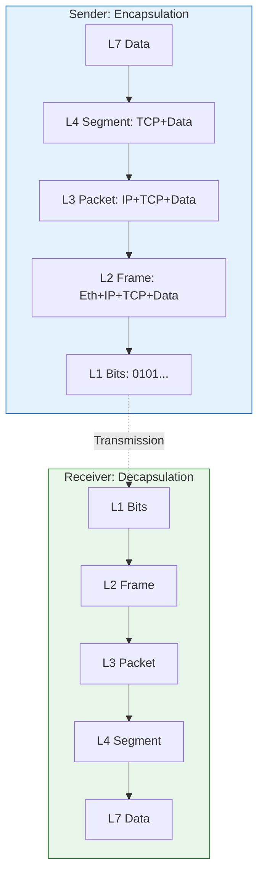
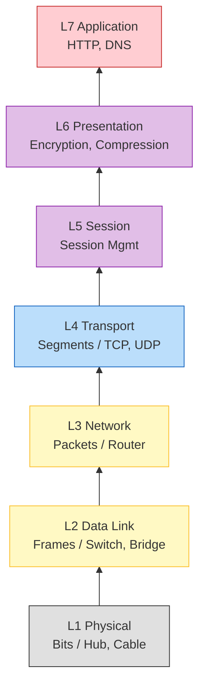
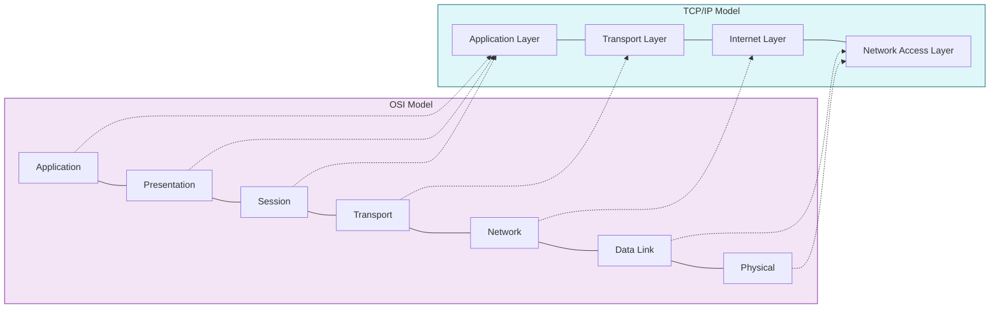

# 📡 OSI 7계층: 네트워크 문제 해결의 지도

> **이 문서의 목표:** OSI 7계층을 암기하지 말고, **왜 이렇게 나눴는지**, **각 계층이 무슨 문제를 해결하는지** 이해한다.

---

## 0. 핵심 질문으로 시작하기

1. **왜 7개로 나눴는가?** → 계층화의 본질
2. **각 계층은 무슨 문제를 해결하는가?** → 책임 분리
3. **캡슐화(Encapsulation)가 왜 필요한가?** → 독립성 유지
4. **문제가 생기면 어느 계층부터 확인해야 하는가?** → 디버깅 전략

---

## 1. 왜 계층을 나누는가: 복잡성 관리의 핵심

### 1.1 계층화가 없다면?

```
[만약 네트워크가 단일 구조라면]

애플리케이션 개발자가 알아야 할 것:
- HTTP 프로토콜 구현
- 데이터 암호화/복호화
- 연결 관리 (세션)
- 패킷 분할/조립, 재전송
- IP 라우팅
- MAC 주소 처리
- 전기 신호 변환

→ 모든 개발자가 네트워크 전문가여야 함!
→ 한 부분 변경 시 전체 영향
→ 유지보수 불가능
```

### 1.2 계층화의 핵심 원리

```
[관심사의 분리 (Separation of Concerns)]

각 계층은 자기 일만 한다:
- L7: "HTTP 요청 처리할게"
- L4: "데이터 분할하고 재전송 관리할게"
- L3: "목적지까지 경로 찾을게"
- L2: "같은 네트워크 안에서 전달할게"
- L1: "전기 신호로 바꿀게"

[핵심 이점]
1. 독립적 개발: HTTP 개발자는 TCP 몰라도 됨
2. 교체 가능: WiFi → 이더넷 바꿔도 상위 계층 영향 없음
3. 문제 격리: L3 문제면 L3만 디버깅
```

### 1.3 계층 간 인터페이스



---

## 2. 각 계층의 역할: 무슨 문제를 해결하는가?

### 2.1 전체 그림



### 2.2 각 계층 상세 설명

#### L1 Physical (물리 계층): "0과 1을 어떻게 전송할까?"

```
[해결하는 문제]
디지털 데이터(0, 1)를 물리적 매체로 어떻게 전송?

[역할]
- 비트를 전기 신호, 광 신호, 전파로 변환
- 케이블 종류, 커넥터 규격 정의
- 전송 속도, 대역폭 결정

[예시]
- 이더넷 케이블 (Cat5e, Cat6)
- 광섬유
- WiFi 무선 신호
- USB 케이블

[실무 문제]
"네트워크 연결이 안 돼요"
→ 케이블 빠짐? 신호 약함? 물리적 손상?
```

#### L2 Data Link (데이터링크 계층): "같은 네트워크 안에서 어떻게 전달할까?"

```
[해결하는 문제]
같은 네트워크(LAN) 안에서 어떤 장비에게 보낼지 어떻게 식별?

[역할]
- MAC 주소로 장비 식별
- 프레임 단위로 데이터 포장
- 오류 검출 (CRC)
- 같은 네트워크 내 전달

[핵심 개념]
MAC 주소: 48비트 하드웨어 주소
예: AA:BB:CC:DD:EE:FF (제조사 코드 + 일련번호)

[장비]
스위치: MAC 주소 테이블로 적절한 포트로 전달

[실무 문제]
"같은 WiFi인데 파일 공유가 안 돼요"
→ MAC 주소 충돌? 스위치 문제?
```

#### L3 Network (네트워크 계층): "다른 네트워크로 어떻게 갈까?"

```
[해결하는 문제]
서로 다른 네트워크 간에 어떻게 경로를 찾아서 전달?

[역할]
- IP 주소로 논리적 위치 식별
- 라우팅: 목적지까지 최적 경로 결정
- 패킷 분할/재조립

[핵심 개념]
IP 주소: 32비트(IPv4) 또는 128비트(IPv6) 논리 주소
예: 192.168.1.100 (네트워크 + 호스트)

[MAC vs IP]
MAC: "누구"인지 (변하지 않음)
IP: "어디"인지 (네트워크 위치에 따라 변함)

[장비]
라우터: IP 주소 기반으로 경로 결정

[실무 문제]
"외부 사이트 접속이 안 돼요"
→ 라우팅 테이블 문제? 게이트웨이 설정?
```

#### L4 Transport (전송 계층): "데이터를 어떻게 신뢰성 있게 전달할까?"

```
[해결하는 문제]
- 패킷이 손실되면 어떻게 재전송?
- 순서가 뒤바뀌면 어떻게 정렬?
- 여러 애플리케이션이 동시에 통신하면 어떻게 구분?

[역할]
- 포트 번호로 애플리케이션 구분
- TCP: 신뢰성 보장 (재전송, 순서 보장)
- UDP: 신뢰성 없이 빠르게 전달

[핵심 개념]
포트: 0-65535 번호로 애플리케이션 식별
예: 80(HTTP), 443(HTTPS), 22(SSH)

[TCP vs UDP]
TCP: 전화 통화 (연결 설정, 확인 응답)
UDP: 편지 투척 (보내기만, 확인 없음)

[실무 문제]
"Connection refused" 에러
→ 해당 포트에 서비스가 안 떠있음
"Connection timeout"
→ 방화벽이 막고 있거나 서버가 응답 없음
```

#### L5-L7: 상위 계층 (Application 중심)

```
[L5 Session - 세션 계층]
해결 문제: 연결을 어떻게 유지하고 관리?
역할: 세션 설정, 유지, 종료
예시: RPC, NetBIOS

[L6 Presentation - 표현 계층]
해결 문제: 데이터 형식이 다르면 어떻게 변환?
역할: 인코딩, 암호화, 압축
예시: SSL/TLS, JPEG, MPEG

[L7 Application - 응용 계층]
해결 문제: 사용자 애플리케이션이 네트워크를 어떻게 사용?
역할: 사용자 인터페이스, 프로토콜 정의
예시: HTTP, FTP, SMTP, DNS

[현실]
실제로 L5-L7은 합쳐서 구현되는 경우가 많음
예: HTTP는 L5-L7 역할을 다 포함
```

---

## 3. 캡슐화(Encapsulation): 왜 헤더를 계속 붙이나?

### 3.1 캡슐화의 원리

```
[데이터가 내려가면서 헤더가 붙음]

L7: [HTTP 데이터]
     ↓
L4: [TCP 헤더][HTTP 데이터] = 세그먼트
     ↓
L3: [IP 헤더][TCP 헤더][HTTP 데이터] = 패킷
     ↓
L2: [이더넷 헤더][IP 헤더][TCP 헤더][HTTP 데이터][FCS] = 프레임
     ↓
L1: 01010101010100101100101011000010 (비트 스트림 예시)
```

### 3.2 왜 이렇게 하는가?

```
[계층 독립성 유지]

각 계층은 자기 헤더만 읽고 처리:
- 라우터(L3): IP 헤더만 봄 → 경로 결정
- 스위치(L2): 이더넷 헤더만 봄 → 포트 결정
- 서버(L4): TCP 헤더만 봄 → 포트로 전달

[핵심 이점]
상위 계층 데이터는 "페이로드"로 취급
→ 무엇이 들었는지 알 필요 없음
→ 각 계층이 독립적으로 발전 가능
```

### 3.3 역캡슐화(Decapsulation)

```
[수신 측에서 헤더를 벗김]

L1: 비트 수신
     ↓
L2: 이더넷 헤더 확인, 벗김 → MAC 주소 확인
     ↓
L3: IP 헤더 확인, 벗김 → 목적지 IP 확인
     ↓
L4: TCP 헤더 확인, 벗김 → 포트 확인
     ↓
L7: HTTP 데이터 → 애플리케이션 처리
```

---

## 4. 실무 디버깅: 계층별 문제 해결

### 4.1 문제 해결 전략: 아래에서 위로

```
[디버깅 순서]

네트워크 문제 발생 시:
1. L1 확인: 케이블 연결됨? LED 점등?
2. L2 확인: MAC 주소 학습됨? ARP 동작?
3. L3 확인: ping 응답? 라우팅 정상?
4. L4 확인: 포트 열림? telnet 연결?
5. L7 확인: 서비스 정상? 응답 코드?

[왜 아래에서 위로?]
하위 계층이 안 되면 상위 계층도 안 됨
L3가 안 되면 L4-L7 테스트 의미 없음
```

### 4.2 계층별 진단 명령어

```bash
# L1/L2: 물리적 연결 확인
$ ip link show                    # Linux: 인터페이스 상태
$ ethtool eth0                    # Linux: 물리 링크 상태
$ arp -a                          # ARP 테이블 확인

# L3: 네트워크 연결 확인
$ ping 8.8.8.8                    # ICMP 응답 확인
$ traceroute google.com           # 경로 추적
$ ip route                        # 라우팅 테이블 확인

# L4: 포트 연결 확인
$ telnet google.com 80            # TCP 포트 연결 테스트
$ nc -zv google.com 443           # netcat으로 포트 확인
$ netstat -tlnp                   # 열린 포트 목록
$ ss -tlnp                        # 소켓 상태 확인

# L7: 애플리케이션 확인
$ curl -v https://google.com      # HTTP 요청 상세
$ openssl s_client -connect google.com:443  # TLS 연결 테스트
```

### 4.3 실제 문제 시나리오

#### 시나리오 1: "인터넷이 안 돼요"

```bash
# Step 1: L1 - 물리적 연결 확인
$ ip link show
eth0: <BROADCAST,MULTICAST,UP,LOWER_UP>  # UP이면 OK
→ LOWER_UP 없으면 케이블 문제

# Step 2: L2 - 게이트웨이 MAC 확인
$ arp -a
→ 게이트웨이 IP의 MAC이 있어야 함

# Step 3: L3 - 라우팅 확인
$ ping 192.168.1.1     # 게이트웨이 ping
$ ping 8.8.8.8         # 외부 IP ping
→ 게이트웨이 OK, 외부 X = 라우터 문제

# Step 4: DNS 확인 (L7)
$ ping google.com
→ IP는 되는데 도메인 안 되면 DNS 문제
$ nslookup google.com
```

#### 시나리오 2: "웹사이트만 안 돼요"

```bash
# L3: ping 확인
$ ping google.com
→ ping 응답 O → L3 정상

# L4: 포트 확인
$ telnet google.com 80
$ telnet google.com 443
→ Connection refused → 방화벽 문제

# L7: HTTP 확인
$ curl -v http://google.com
→ 응답 코드 확인 (200 OK, 502 Bad Gateway 등)
```

#### 시나리오 3: "특정 서버만 느려요"

```bash
# L3: 경로 추적
$ traceroute slow-server.com
→ 어느 홉에서 지연되는지 확인

# L4: TCP 연결 시간
$ curl -w "Connect: %{time_connect}s, Total: %{time_total}s" -o /dev/null -s http://slow-server.com

# 패킷 분석
$ tcpdump -i eth0 host slow-server.com
→ 재전송 많은지, RTT 긴지 확인
```

---

## 5. TCP/IP 모델 vs OSI 모델

### 5.1 왜 두 가지 모델이 있나?

```
[OSI 모델]
- 이론적, 교육용 참조 모델
- 7개 계층으로 세분화
- "이상적으로는 이렇게 나눠야 해"

[TCP/IP 모델]
- 실제 인터넷 구현 기반
- 4개 계층 (간소화)
- "현실에서는 이렇게 동작해"
```

### 5.2 비교



### 5.3 실무에서는?

```
[현실적인 사용]

"L4 로드밸런서" → TCP/UDP 기반 분산
"L7 로드밸런서" → HTTP 헤더 기반 분산

실무에서는 OSI 용어(L4, L7)를 많이 사용
하지만 실제 구현은 TCP/IP 모델 기반

[중요한 계층들]
- L2: MAC, 스위치, VLAN
- L3: IP, 라우터, 서브넷
- L4: TCP/UDP, 포트, 방화벽
- L7: HTTP, DNS, 애플리케이션
```

---

## 6. 자가 점검 질문

### 원리 이해

1. **왜 네트워크를 계층으로 나누는가?**
   → 복잡성 관리. 각 계층이 독립적으로 동작하여 개발, 유지보수, 문제 해결이 쉬워짐.

2. **MAC 주소와 IP 주소의 차이는?**
   → MAC은 "누구"(하드웨어 고유), IP는 "어디"(네트워크 위치). MAC은 같은 네트워크 내, IP는 네트워크 간 통신에 사용.

3. **캡슐화가 필요한 이유는?**
   → 계층 독립성. 각 계층은 자기 헤더만 보면 되므로, 상위 계층 내용을 몰라도 처리 가능.

4. **L4 로드밸런서와 L7 로드밸런서의 차이는?**
   → L4는 IP/Port 기반(빠름, 내용 모름), L7은 HTTP 헤더/URL 기반(지능적 라우팅 가능, 느림).

### 디버깅

5. **ping은 되는데 웹사이트 접속이 안 되면?**
   → L3(IP)는 정상, L4(포트) 또는 L7(HTTP) 문제. 방화벽이 80/443 포트를 막고 있을 가능성.

6. **네트워크 문제를 어느 계층부터 확인해야 하는가?**
   → 아래에서 위로. L1(케이블) → L2(ARP) → L3(ping) → L4(telnet) → L7(curl).

---

## 7. 계층별 요약표

| 계층 | 이름 | 해결 문제 | 프로토콜/장비 | 진단 도구 |
|-----|------|----------|--------------|----------|
| L7 | Application | 사용자 서비스 | HTTP, DNS, SMTP | curl, browser |
| L6 | Presentation | 데이터 형식 | SSL/TLS, JPEG | openssl |
| L5 | Session | 연결 관리 | NetBIOS, RPC | - |
| L4 | Transport | 신뢰성, 포트 | TCP, UDP | telnet, netstat |
| L3 | Network | 라우팅 | IP, ICMP | ping, traceroute |
| L2 | Data Link | 로컬 전달 | Ethernet, ARP | arp, tcpdump |
| L1 | Physical | 신호 전송 | 케이블, WiFi | ethtool |

---

**💡 핵심:** OSI 7계층을 암기하지 말고, **각 계층이 어떤 문제를 해결하는지** 이해하라. 문제가 생기면 **아래에서 위로** 순차적으로 확인하면 반드시 원인을 찾을 수 있다.
