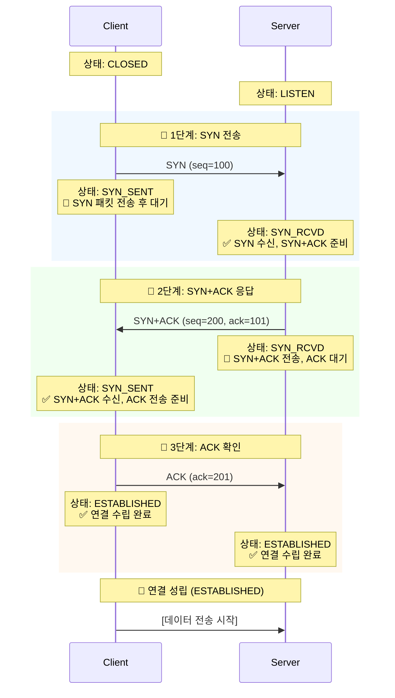

# 📡 TCP vs UDP 완벽 이해: 신뢰성과 속도의 트레이드오프

> **이 문서의 목표:** TCP와 UDP의 설계 철학과 차이점을 이해하고, **게임, 스트리밍, 금융** 등 다양한 실무 시나리오에서 **올바른 프로토콜을 선택**하는 기준을 정립한다.

---

## 0. 핵심 질문으로 시작하기

1. **TCP는 왜 3-Way Handshake를 하는가?** → 신뢰성 있는 연결을 수립하고, 서로의 통신 상태(Sequence Number 등)를 동기화하기 위해
2. **UDP는 왜 데이터 순서를 보장하지 않는가?** → 순서 재조립(Reordering) 오버헤드를 없애고 **속도**를 극대화하기 위해
3. **실시간 게임에서 TCP 대신 UDP를 쓰는 결정적 이유는?** → TCP의 재전송 대기(Head-of-Line Blocking)로 인한 **지연(Lag)**을 피하기 위해
4. **HTTP/3가 UDP 기반의 QUIC을 채택한 이유는?** → TCP의 구조적 한계(HOL Blocking, 느린 핸드셰이크)를 극복하고 성능을 높이기 위해

---

## 1. 실제로 겪어본 문제들 (Problem Context)

### 네트워크 프로그래밍 시 흔히 하는 고민:

**"TCP로 할까 UDP로 할까?"**
- 채팅 앱: 메시지 하나도 잃어버리면 안 되는데 TCP가 맞나?
- 실시간 게임: 패킷 하나 늦어도 죽는데 UDP가 맞나?
- 스트리밍 서비스: 버퍼링은 싫은데 약간 화질 저하는 괜찮나?

**"프로토콜 잘못 선택해서 생기는 문제들"**
- TCP 썼는데 지연이 너무 커서 게임이 안 됨
- UDP 썼는데 패킷 손실로 데이터가 오염됨
- WebRTC처럼 양쪽 장점을 다 쓰고 싶음

---

## 2. TCP와 UDP의 설계 철학

### 2.1 TCP의 설계 원칙: "확실하게 전달"

```
[TCP가 보장하는 것]
1. 순서 보장: 패킷 1,2,3 순서로 도착
2. 신뢰성: 손실되면 재전송
3. 흐름 제어: 받는 쪽 속도에 맞춤
4. 혼잡 제어: 네트워크 상태에 맞춤

[비용]
- 3-Way Handshake: 연결 설정 시간
- ACK 대기: 확인 응답 기다림
- 재전송: 손실 시 다시 보냄
→ 느리지만 확실함
```

### 2.2 UDP의 설계 원칙: "일단 빠르게"

```
[UDP가 하는 것]
1. 그냥 보냄 (Fire and Forget)
2. 끝

[하지 않는 것]
- 연결 설정 없음
- 순서 보장 없음
- 재전송 없음
→ 빠르지만 불확실함
```

### 2.3 핵심 트레이드오프

```
신뢰성 ←────────────────────────────→ 속도
  TCP                                   UDP
  
[TCP 선택]
- 데이터 하나라도 잃으면 안 됨
- 순서가 중요함
- 예: 파일 전송, 웹페이지, 이메일

[UDP 선택]
- 약간의 손실은 괜찮음
- 실시간성이 더 중요함
- 예: 게임, 영상 스트리밍, VoIP
```

---

## 3. TCP의 핵심: 3-Way Handshake

TCP는 통신을 시작하기 전에 "너 내 말 들려? 응 잘 들려" 과정을 반드시 거쳐야 한다.

### 3.1 연결 수립 과정 (Connection Establishment)



---

## 4. 왜 UDP를 쓰는가? (Why UDP?)

TCP가 이렇게 완벽해 보이는데, 왜 불안정한 UDP를 사용할까?

### 4.1 실시간성 (Real-time Performance)

* **상황:** 라이브 축구 중계를 보는데 10초 전 장면의 픽셀 하나가 깨졌다.
* **TCP:** 깨진 픽셀을 다시 받아오느라 영상을 멈추고(Buffering), 재전송받은 뒤 10초 전 장면을 다시 보여준다.  **방송 사고**
* **UDP:** 깨진 픽셀은 그냥 뭉개진 채로 두고, **지금 현재**의 장면을 바로 보여준다.  **원활한 시청**

### 4.2 서버 부하 감소

* UDP는 누가 받았는지 기억할 필요(State)가 없다. 따라서 서버가 더 많은 클라이언트를 감당할 수 있다. (DNS 서버가 UDP를 쓰는 주된 이유)

---

## 5. Production Code Example (Python Socket)

**[TCP Client]**
```python
import socket

# SOCK_STREAM = TCP
sock = socket.socket(socket.AF_INET, socket.SOCK_STREAM)

# 1. 연결 (3-Way Handshake 발생)
sock.connect(('127.0.0.1', 8080))

# 2. 송신 (Reliable)
sock.sendall(b'Hello TCP')

# 3. 수신
data = sock.recv(1024)
sock.close()
```

**[UDP Client]**
```python
import socket

# SOCK_DGRAM = UDP
sock = socket.socket(socket.AF_INET, socket.SOCK_DGRAM)

# 연결 과정 없음 (No connect)

# 1. 송신 (Fire and Forget)
sock.sendto(b'Hello UDP', ('127.0.0.1', 8080))

sock.close()
```

---

## 6. 전문가적 조언 (Pro Tip)

### 6.1 TCP의 치명적 약점: HOL Blocking
TCP는 데이터 순서를 보장해야 하므로, **앞선 패킷 하나가 손실되면 그 뒤에 도착한 정상 패킷들도 줄줄이 대기(Blocking)**해야 한다. 이를 **Head-of-Line Blocking**이라 한다.

### 6.2 HTTP/3와 QUIC (Game Changer)
구글과 IT 업계는 "TCP는 너무 느리고 무겁다"고 판단했다. 그래서 **UDP 기반**으로 TCP의 신뢰성 기능을 소프트웨어적으로 구현한 **QUIC** 프로토콜을 만들었고, 이것이 **HTTP/3**의 표준이 되었다.

### 6.3 헬스 체크(Health Check)와 Keep-Alive
TCP는 연결 비용(3-Way Handshake)이 비싸다. DB 연결이나 HTTP 요청 시, 매번 연결을 맺고 끊으면 성능이 급격히 떨어진다. **Keep-Alive**를 사용하여 연결을 재활용하라.

---

## 7. TCP 타임아웃(Timeout) 설정 전략

| 타임아웃 종류 | 설명 | 권장 설정 |
| --- | --- | --- |
| **Connect Timeout** | 3-Way Handshake 대기 시간 | 1~3초 |
| **Read/Write Timeout** | 데이터 송수신 대기 시간 | 3~10초 |
| **Idle Timeout** | 유휴 상태 유지 시간 | 60~300초 |

---

## 8. 실무 문제 해결 사례

### 8.1 Netflix의 TCP 혼잡 제어 최적화 (BBR)
Netflix는 기존 TCP의 혼잡 제어 알고리즘(Cubic) 대신 구글의 **BBR(Bottleneck Bandwidth and RTT)**을 도입하여 대역폭 활용률을 20-30% 높이고 지연 시간을 줄였다.

### 8.2 게임 서버의 UDP 최적화
FPS 게임(Overwatch, Valorant 등)은 UDP를 사용하되, **중요한 패킷(사격, 스킬 사용)**은 애플리케이션 레벨에서 ACK를 구현하여 신뢰성을 확보하고, **덜 중요한 패킷(이동)**은 손실을 허용하는 하이브리드 방식을 사용한다.

---

## 9. 🎯 1분 요약: TCP vs UDP의 핵심

**TCP = 신뢰성 우선, UDP = 속도 우선**

- **TCP**: 3-way 핸드셰이크, 재전송, 순서 보장 (무겁지만 안전)
- **UDP**: 그냥 보냄, 손실 감수, 순서 무관 (가볍지만 위험)
- **선택**: 데이터 중요도 vs 실시간성 트레이드오프

> **결론:**
> 1. **데이터 무결성 필수**: TCP (HTTP, FTP, 데이터베이스)
> 2. **실시간성 필수**: UDP (게임, 스트리밍, VoIP)
> 3. **하이브리드**: QUIC처럼 UDP 위에 TCP 기능 구현

---

## 10. 자가 점검 질문

1. **TCP 3-Way Handshake의 세 단계는?**
   → SYN → SYN+ACK → ACK.
2. **UDP가 DNS 서비스에 적합한 이유는?**
   → 요청/응답이 작고 단순하며, 빠른 응답 속도가 중요하기 때문.
3. **TCP의 Head-of-Line(HOL) Blocking이란?**
   → 앞선 패킷 손실 시, 뒤따르는 패킷들이 재전송을 기다리며 대기하는 현상.
4. **실시간 스트리밍에서 TCP보다 UDP를 선호하는 이유는?**
   → 패킷 손실 시 재전송을 기다리는 것보다, 손실된 프레임을 건너뛰고 최신 프레임을 보여주는 것이 사용자 경험에 유리하기 때문.
