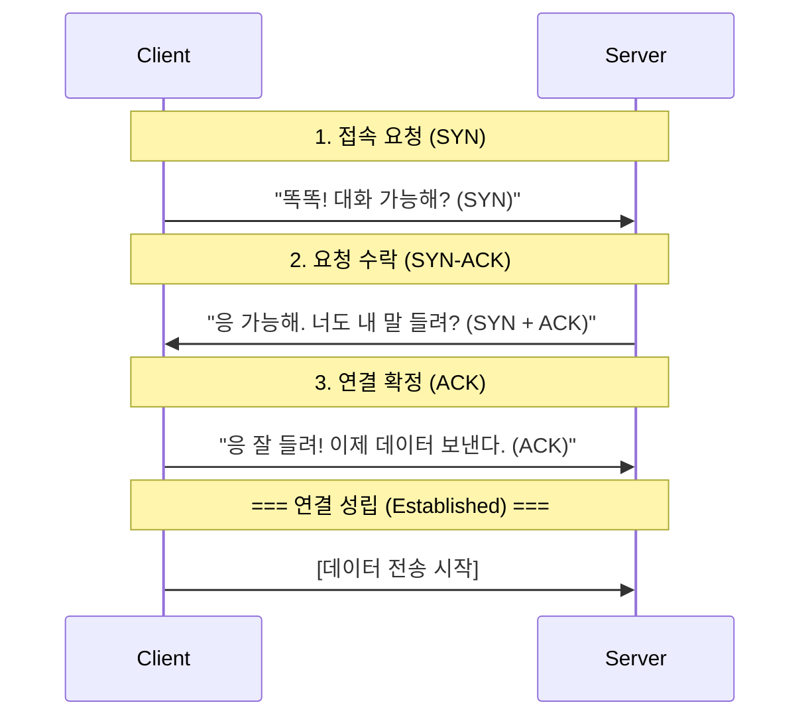

# 전송 계층의 두 거인: TCP vs UDP

## 1. 핵심 요약 (Executive Summary)

인터넷상에서 데이터를 주고받을 때 사용하는 두 가지 표준 프로토콜이다.

* **TCP (Transmission Control Protocol):** **"등기 우편(택배)"**. 받는 사람이 잘 받았는지 확인(Ack)하고, 분실되면 재발송한다. 느리지만 정확하다.
* **UDP (User Datagram Protocol):** **"일반 우편(종이비행기)"**. 그냥 던진다. 받는 사람이 받았는지 확인하지 않는다. 분실되어도 책임지지 않지만 매우 빠르다.

> **결론:**
> * **웹, 이메일, 파일 전송:** 데이터가 1비트라도 깨지면 안 되는 경우  **TCP** 필수.
> * **스트리밍, 게임, VoIP:** 렉(Lag)이 없어야 하고, 중간에 프레임 하나 정도 깨져도 되는 경우  **UDP** 필수.
> 
> 

---

## 2. 상세 비교 (Comparison)

| 특징 | TCP (신뢰성 중심) | UDP (속도 중심) |
| --- | --- | --- |
| **연결 방식** | **연결 지향형 (Connection-oriented)** <br>

<br> 3-Way Handshake로 길을 먼저 닦음. | **비연결형 (Connectionless)** <br>

<br> 사전 작업 없이 바로 데이터 쏘기 시작. |
| **신뢰성** | **높음.** <br>

<br> 순서 보장, 패킷 분실 시 재전송. | **낮음.** <br>

<br> 순서 뒤섞임 가능, 분실 시 그냥 버림. |
| **속도** | 상대적으로 느림 (확인 절차, 헤더 큼) | 매우 빠름 (확인 절차 없음, 헤더 작음) |
| **전송 단위** | Segment (스트림 방식) | Datagram (패킷 방식) |
| **헤더 크기** | 최소 **20 Bytes** (기능이 많음) | **8 Bytes** (아주 단순함) |
| **대표 서비스** | HTTP(Web), FTP, SMTP(Email) | DNS, Streaming(Youtube), FPS 게임, VoIP |

---

## 3. TCP의 핵심: 3-Way Handshake

TCP는 통신을 시작하기 전에 "너 내 말 들려? 응 잘 들려" 과정을 반드시 거쳐야 한다.

### 3.1 연결 수립 과정 (Connection Establishment)



* **SYN (Synchronize Sequence Number):** 연결 요청 플래그.
* **ACK (Acknowledgment):** 응답 플래그.

> **참고:** 연결을 끊을 때는 4번 왔다 갔다 하는 **4-Way Handshake**를 사용한다.

---

## 4. 왜 UDP를 쓰는가? (Why UDP?)

TCP가 이렇게 완벽해 보이는데, 왜 불안정한 UDP를 사용할까?

### 4.1 실시간성 (Real-time Performance)

* **상황:** 라이브 축구 중계를 보는데 10초 전 장면의 픽셀 하나가 깨졌다.
* **TCP:** 깨진 픽셀을 다시 받아오느라 영상을 멈추고(Buffering), 재전송받은 뒤 10초 전 장면을 다시 보여준다.  **방송 사고**
* **UDP:** 깨진 픽셀은 그냥 뭉개진 채로 두고, **지금 현재**의 장면을 바로 보여준다.  **원활한 시청**

### 4.2 서버 부하 감소

* UDP는 누가 받았는지 기억할 필요(State)가 없다. 따라서 서버가 더 많은 클라이언트를 감당할 수 있다. (DNS 서버가 UDP를 쓰는 주된 이유)

---

## 5. Production Code Example (Python Socket)

**[TCP Client]**
전화를 거는 것과 같다. `connect`가 성공해야 말을 할 수 있다.

```python
import socket

# SOCK_STREAM = TCP
sock = socket.socket(socket.AF_INET, socket.SOCK_STREAM)

# 1. 연결 (3-Way Handshake 발생)
sock.connect(('127.0.0.1', 8080))

# 2. 송신 (Reliable)
sock.sendall(b'Hello TCP')

# 3. 수신
data = sock.recv(1024)
sock.close()

```

**[UDP Client]**
편지를 우통에 넣는 것과 같다. 상대가 있든 없든 일단 보낸다.

```python
import socket

# SOCK_DGRAM = UDP
sock = socket.socket(socket.AF_INET, socket.SOCK_DGRAM)

# 연결 과정 없음 (No connect)

# 1. 송신 (Fire and Forget)
# 주소를 패킷마다 명시해야 함
sock.sendto(b'Hello UDP', ('127.0.0.1', 8080))

sock.close()

```

---

## 6. 전문가적 조언 (Pro Tip)

### 6.1 TCP의 치명적 약점: HOL Blocking

TCP는 데이터 순서를 보장해야 하므로, **앞선 패킷 하나가 손실되면 그 뒤에 도착한 정상 패킷들도 줄줄이 대기(Blocking)**해야 한다. 이를 **Head-of-Line Blocking**이라 한다.

* 이 문제 때문에 HTTP/1.1, HTTP/2에서 속도 저하가 발생했다.

### 6.2 HTTP/3와 QUIC (Game Changer)

구글과 IT 업계는 "TCP는 너무 느리고 무겁다"고 판단했다. 그래서 **UDP 기반**으로 TCP의 신뢰성 기능을 소프트웨어적으로 구현한 **QUIC** 프로토콜을 만들었고, 이것이 **HTTP/3**의 표준이 되었다.

* **핵심:** 전송 계층은 빠른 UDP를 쓰되, 신뢰성 제어는 애플리케이션 레벨에서 알아서 하겠다는 전략.

### 6.3 헬스 체크(Health Check)와 Keep-Alive

TCP는 연결 비용(3-Way Handshake)이 비싸다.

* DB 연결이나 HTTP 요청 시, 매번 연결을 맺고 끊으면 성능이 급격히 떨어진다.
* **Keep-Alive:** 한 번 맺은 연결을 끊지 않고 재활용하는 기술을 반드시 활성화해야 한다.

기존 문서의 맥락을 유지하며, 요청하신 심화 주제(타임아웃, 커넥션 풀, gRPC, 프로덕션 아키텍처, 문제 해결)를 **'실무(Production) 관점'**에서 보강하여 정리했습니다.

사용자가 언급한 **'gpcr'**은 문맥상 구글이 개발한 고성능 RPC 프레임워크인 **'gRPC'**의 오타로 판단하여 해당 기술을 기준으로 작성합니다.

---

## 7. TCP 타임아웃(Timeout) 설정 전략

TCP는 "영원히 기다리는 것"을 방지하기 위해 타임아웃 설정이 필수입니다. 설정이 없으면 네트워크 단절 시 애플리케이션 스레드가 무한 대기(Hang) 상태에 빠져 전체 장애로 이어집니다.

| 타임아웃 종류 | 설명 | 권장 설정 (일반적) | 실패 시 위험 요소 |
| --- | --- | --- | --- |
| **Connect Timeout** | 3-Way Handshake를 맺는 데 기다리는 시간. | **1~3초** | 너무 길면 사용자가 즉시 이탈, 너무 짧으면 네트워크 일시 지연 시 접속 실패. |
| **Read/Write Timeout** | 연결 후 데이터를 읽거나 쓰는 동안 대기하는 시간. | **3~10초** (API 성격에 따름) | DB 쿼리가 오래 걸리거나 상대방 서버가 멈췄을 때 내 서버 자원이 고갈됨. |
| **Idle Timeout** | 데이터 교환 없이 연결만 유지된 상태를 허용하는 시간. | **60~300초** | 로드밸런서(L4/L7)의 설정값보다 **짧게** 잡아야 "좀비 연결"을 방지함. |

> **Pro Tip: 타임아웃 계층화 (Layering)**
> 클라이언트(3초) < 로드밸런서(60초) < 서버(65초) 와 같이 **바깥쪽(Client)에서 안쪽(Server)으로 갈수록 시간을 길게** 설정해야 합니다. 그렇지 않으면 서버는 작업 중인데 클라이언트가 먼저 끊어버려, 서버 자원만 낭비하는 'Ghost Processing'이 발생합니다.

---

## 8. 커넥션 풀(Connection Pool) 관리

매 요청마다 `connect()`를 호출하는 것은 CPU와 네트워크 지연(Latency)의 주범입니다. **미리 연결을 맺어두고 빌려 쓰는** 풀링(Pooling) 방식이 표준입니다.

### 8.1 풀링의 핵심 원리

1. **초기화(Warm-up):** 애플리케이션 시작 시 미리 N개의 TCP 연결을 맺어둠.
2. **대여(Borrow):** 요청이 오면 풀에서 연결 객체를 꺼냄.
3. **반환(Return):** 사용 후 `close()` 하지 않고 풀에 반납.

### 8.2 관리 전략 (Best Practices)

* **Max Connections (최대 연결 수):** 서버가 감당 가능한 스레드 수나 DB 성능에 맞춰 제한해야 합니다. 무제한 설정 시 트래픽 폭주 시 **OOM(Out of Memory)** 발생.
* **Max Lifetime (최대 수명):** 영원한 연결은 없습니다. 특정 시간(예: 30분)이 지나면 강제로 끊고 새로 맺어야 DNS 변경 사항 반영이나 메모리 누수 방지에 유리합니다.
* **Validation Query:** 연결을 빌려줄 때 `SELECT 1` (DB) 또는 `Ping`을 날려 연결이 살아있는지 확인해야 합니다. (죽은 연결을 빌려주면 에러 발생)

---

## 9. gRPC: TCP 위의 고속도로

**gRPC**는 구글이 개발한 오픈소스 RPC(원격 프로시저 호출) 시스템입니다. "JSON over HTTP/1.1"의 비효율성을 해결하기 위해 등장했습니다.

### 9.1 TCP/HTTP 관점에서의 gRPC 특징

* **프로토콜:** HTTP/2를 전송 프로토콜로 사용합니다.
* **Multiplexing:** 하나의 TCP 연결로 여러 요청을 동시에 처리 (HOL Blocking 해결).
* **Header Compression:** 무거운 헤더를 압축(HPACK)하여 전송량 감소.


* **데이터 포맷:** JSON 대신 **Protocol Buffers (Protobuf)** 사용.
* 텍스트가 아닌 **이진(Binary) 데이터**로 직렬화하여, 크기가 훨씬 작고 파싱(Parsing) 속도가 TCP 소켓 통신에 준할 정도로 빠릅니다.


### 9.2 언제 쓰는가? (Use Cases)

* **MSA(마이크로서비스) 간 통신:** 내부 서버끼리의 통신은 무조건 gRPC가 업계 표준(Industry Standard)입니다.
* **모바일 앱-서버 통신:** 데이터 사용량을 줄이고 배터리를 절약해야 할 때.

---

## 10. 프로덕션 환경의 서버 구현 (Architecture)

실무에서는 Python의 `socket` 모듈로 직접 서버를 짜지 않습니다. 검증된 **비동기 네트워크 프레임워크**와 **아키텍처 패턴**을 사용합니다.

### 10.1 권장 기술 스택 (SOTA)

* **Low Level:** C++ (Boost.Asio), Rust (Tokio), Java (Netty), Go (Goroutine)
* **App Level:** Nginx (Reverse Proxy) + App Server (Node.js, Spring WebFlux, FastAPI)

### 10.2 필수 아키텍처 패턴: Event Loop (Non-blocking I/O)

10만 개의 동시 접속을 처리하려면 "연결 1개당 스레드 1개" 모델은 불가능합니다(메모리 부족).

* **싱글 스레드 이벤트 루프:** 하나의 스레드가 수만 개의 소켓 상태를 감시(Multiplexing - `epoll`/`kqueue`)하다가, 데이터가 온 소켓만 처리합니다. (Node.js, Redis, Nginx의 방식)

[전제 조건: 동시 접속 10k] -> [Thread 방식: 메모리 10GB 소요] -> [Event Loop 방식: 메모리 500MB 소요] -> **[결론: Event Loop 필수]**

---

## 11. TCP 통신 시 발생하는 문제와 해결 (Troubleshooting)

### 11.1 TIME_WAIT 문제 (포트 고갈)

서버가 연결을 먼저 끊으면, 소켓은 `TIME_WAIT` 상태로 약 60초간 머뭅니다. 트래픽이 많으면 가용 포트(65535개)가 모두 `TIME_WAIT` 상태가 되어 **새로운 연결을 맺을 수 없게 됩니다.**

* **해결책:**
* 커널 파라미터 튜닝: `net.ipv4.tcp_tw_reuse = 1` (TIME_WAIT 소켓 재사용)
* Keep-Alive 사용하여 연결 끊김 최소화.


### 11.2 Slow Loris 공격

해커가 요청을 아주 천천히, 조금씩 보내 서버의 연결 슬롯을 꽉 채워버리는 공격입니다.

* **해결책:** 웹 서버(Nginx) 앞단에서 `client_body_timeout`을 짧게 설정하여, 데이터 전송이 느린 연결은 가차 없이 끊어야 합니다.

---

## 12. 클라이언트 연결 패턴에 따른 전략

| 상황 | 특징 | 권장 아키텍처 및 전략 |
| --- | --- | --- |
| **많은 클라이언트**<br>

<br>(B2C, 모바일, IoT) | 불특정 다수, 잦은 연결/해제, 네트워크 불안정. | **Reverse Proxy (Nginx/HAProxy) 필수.**<br>

<br>SSL 종료, 연결 관리를 앞단에서 처리하고 뒷단 서버와는 Keep-Alive로 연결 재사용. |
| **고정된 클라이언트**<br>

<br>(Server-to-Server, 금융망) | 소수의 신뢰된 IP, 24시간 연결 유지 필요. | **Connection Pool & Health Check.**<br>

<br>연결이 끊어졌을 때 즉시 재연결(Retry)하는 로직과 서킷 브레이커(Circuit Breaker) 구현 필수. |


**어떤 서비스(웹/게임/금융 등)를 구현 중이신가요?**
---

추가할 사항 
- TCP 간의 타임 아웃 설정
- TCP 클라이언트와 서버 커넥션 풀 관리 방법
- gpcr에 대한 내용
- 실제 프로덕트 환경의 서버는 어떻게 구현해야하는가
- TCP 통신하다보면 문제되는 상황
- 많은 클라이언트들이 연결하는 경우, 고정된 클라이언트들이 연결하는 경우

