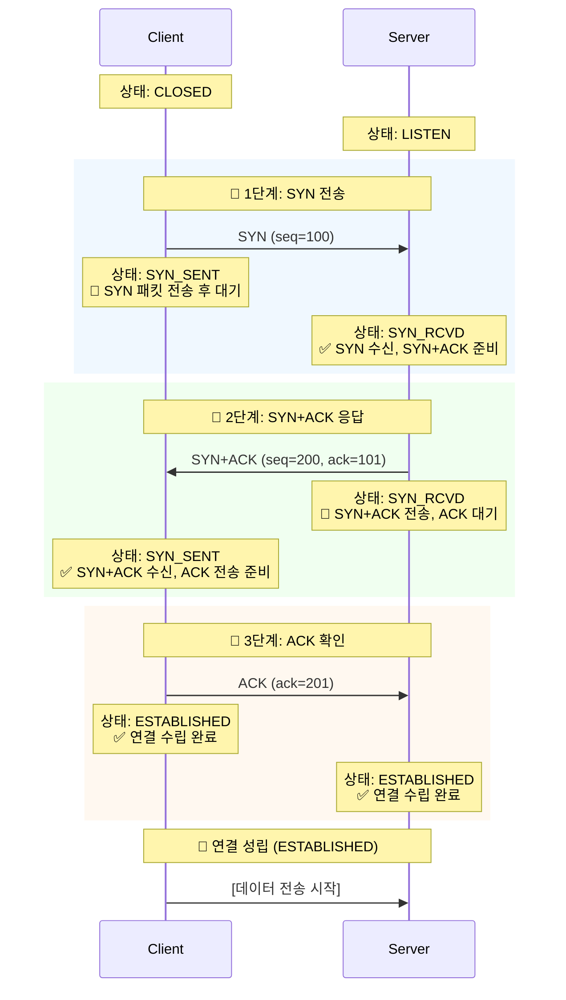

# 📡 TCP vs UDP 완벽 이해: 신뢰성과 속도의 트레이드오프

> **이 문서의 목표:** TCP/UDP를 단순 비교가 아니라, **왜 이렇게 설계됐는지**, **언제 무엇을 선택해야 하는지** 근본 원리를 이해한다.

---

## 0. 핵심 질문으로 시작하기

1. **TCP는 왜 느린가?** → 신뢰성 보장의 비용
2. **UDP는 왜 불안정한가?** → 속도를 위해 포기한 것들
3. **QUIC은 왜 UDP 위에 만들었나?** → TCP의 구조적 한계
4. **어떤 상황에 무엇을 쓰는가?** → 실무 선택 기준

---

## 1. TCP와 UDP의 설계 철학

### 1.1 TCP의 설계 원칙: "확실하게 전달"

```
[TCP가 보장하는 것]
1. 순서 보장: 패킷 1,2,3 순서로 도착
2. 신뢰성: 손실되면 재전송
3. 흐름 제어: 받는 쪽 속도에 맞춤
4. 혼잡 제어: 네트워크 상태에 맞춤

[비용]
- 3-Way Handshake: 연결 설정 시간
- ACK 대기: 확인 응답 기다림
- 재전송: 손실 시 다시 보냄
→ 느리지만 확실함
```

### 1.2 UDP의 설계 원칙: "일단 빠르게"

```
[UDP가 하는 것]
1. 그냥 보냄 (Fire and Forget)
2. 끝

[하지 않는 것]
- 연결 설정 없음
- 순서 보장 없음
- 재전송 없음
→ 빠르지만 불확실함
```

### 1.3 핵심 트레이드오프

```
신뢰성 ←────────────────────────────→ 속도
  TCP                                   UDP
  
[TCP 선택]
- 데이터 하나라도 잃으면 안 됨
- 순서가 중요함
- 예: 파일 전송, 웹페이지, 이메일

[UDP 선택]
- 약간의 손실은 괜찮음
- 실시간성이 더 중요함
- 예: 게임, 영상 스트리밍, VoIP
```

---

## 🤔 실제 프로토콜 선택 고민들

### 네트워크 프로그래밍 시 흔히 하는 고민:

**"TCP로 할까 UDP로 할까?"**
- 채팅 앱: 메시지 하나도 잃어버리면 안 되는데 TCP가 맞나?
- 실시간 게임: 패킷 하나 늦어도 죽는데 UDP가 맞나?
- 스트리밍 서비스: 버퍼링은 싫은데 약간 화질 저하는 괜찮나?

**"프로토콜 잘못 선택해서 생기는 문제들"**
- TCP 썼는데 지연이 너무 커서 게임이 안 됨
- UDP 썼는데 패킷 손실로 데이터가 오염됨
- WebRTC처럼 양쪽 장점을 다 쓰고 싶음

**"실무에서 TCP/UDP 선택 기준은?"**
- HTTP/2는 왜 TCP 위에서 멀티플렉싱?
- QUIC(HTTP/3)은 왜 UDP를 선택했나?
- 실시간 통신에서 TCP vs UDP 성능 차이는?

## 🎯 1분 요약: TCP vs UDP의 핵심

**TCP = 신뢰성 우선, UDP = 속도 우선**

- **TCP**: 3-way 핸드셰이크, 재전송, 순서 보장 (무겁지만 안전)
- **UDP**: 그냥 보냄, 손실 감수, 순서 무관 (가볍지만 위험)
- **선택**: 데이터 중요도 vs 실시간성 트레이드오프

> **결론:**
> 1. **데이터 무결성 필수**: TCP (HTTP, FTP, 데이터베이스)
> 2. **실시간성 필수**: UDP (게임, 스트리밍, VoIP)
> 3. **하이브리드**: QUIC처럼 UDP 위에 TCP 기능 구현
> 
> 

---

## 2. 상세 비교 (Comparison)

**💡 실제 서비스 적용 예시:**

| 서비스 | 선택 프로토콜 | 이유 |
|--------|---------------|------|
| **웹 브라우징** | TCP (HTTP/1, HTTP/2) | HTML/CSS/JS 무결성 필수 |
| **실시간 게임** | UDP | 10ms 지연도 치명적 |
| **넷플릭스 스트리밍** | TCP 기반 QUIC | 속도 + 신뢰성 둘 다 |
| **DNS 쿼리** | UDP | 빠른 응답 우선 |
| **VoIP 전화** | UDP | 실시간성 우선 |

**🚨 실제 선택 잘못으로 생기는 문제:**

**문제 1: 게임에서 TCP 사용 시 발생하는 지연**
```java
// ❌ TCP 사용: 패킷 손실 시 재전송으로 지연
// 플레이어 이동: 10ms → 100ms로 증가
socket.send(playerPosition);  // TCP 재전송 대기
```

```java
// ✅ UDP 사용: 손실 감수하고 다음 패킷 전송
// 실시간성 유지, 약간의 위치 부정확성은 게임 로직으로 보정
socket.send(playerPosition);  // 바로 다음 패킷 전송
```

**문제 2: UDP로 중요한 데이터 전송 시 손실**
```python
# ❌ UDP로 계좌 이체 정보 전송
sock.sendto(transfer_data, addr)  # 손실 가능성 높음
```

```python
# ✅ TCP로 중요한 데이터 전송
with socket.socket(socket.AF_INET, socket.SOCK_STREAM) as sock:
    sock.connect(addr)
    sock.sendall(transfer_data)  # 신뢰성 보장
```

**문제 3: HTTP/3의 하이브리드 접근**
```javascript
// HTTP/3 (QUIC): UDP 위에 TCP 기능 구현
// 0-RTT 연결 + 스트림 기반 재전송
// 속도 + 신뢰성 둘 다 가짐
const response = await fetch('https://example.com', {
    // 브라우저가 QUIC 자동 사용
});
```

---

## 3. TCP의 핵심: 3-Way Handshake

TCP는 통신을 시작하기 전에 "너 내 말 들려? 응 잘 들려" 과정을 반드시 거쳐야 한다.

### 3.1 연결 수립 과정 (Connection Establishment)

TCP 연결 수립 시 각 단계에서의 상태(State) 변화를 함께 살펴보겠습니다.



**🔄 TCP 상태 변화 요약:**

| 단계 | 클라이언트 상태 | 서버 상태 | 설명 |
|------|----------------|-----------|------|
| 초기 | `CLOSED` | `LISTEN` | 서버가 연결 대기 중 |
| SYN 전송 | `SYN_SENT` | `LISTEN` → `SYN_RCVD` | 클라이언트가 연결 요청 |
| SYN+ACK | `SYN_SENT` | `SYN_RCVD` | 서버가 요청 수락 |
| ACK 전송 | `ESTABLISHED` | `SYN_RCVD` → `ESTABLISHED` | 양방향 연결 완료 |

**📊 실제 네트워크 패킷 캡처 예시:**
```
# SYN 패킷 (클라이언트 → 서버)
TCP: Flags: 0x02 (SYN), Seq=100, Win=65535

# SYN+ACK 패킷 (서버 → 클라이언트)
TCP: Flags: 0x12 (SYN,ACK), Seq=200, Ack=101, Win=65535

# ACK 패킷 (클라이언트 → 서버)
TCP: Flags: 0x10 (ACK), Seq=101, Ack=201, Win=65535
```

* **SYN (Synchronize Sequence Number):** 연결 요청 플래그.
* **ACK (Acknowledgment):** 응답 플래그.

> **참고:** 연결을 끊을 때는 4번 왔다 갔다 하는 **4-Way Handshake**를 사용한다.

---

## 4. 왜 UDP를 쓰는가? (Why UDP?)

TCP가 이렇게 완벽해 보이는데, 왜 불안정한 UDP를 사용할까?

### 4.1 실시간성 (Real-time Performance)

* **상황:** 라이브 축구 중계를 보는데 10초 전 장면의 픽셀 하나가 깨졌다.
* **TCP:** 깨진 픽셀을 다시 받아오느라 영상을 멈추고(Buffering), 재전송받은 뒤 10초 전 장면을 다시 보여준다.  **방송 사고**
* **UDP:** 깨진 픽셀은 그냥 뭉개진 채로 두고, **지금 현재**의 장면을 바로 보여준다.  **원활한 시청**

### 4.2 서버 부하 감소

* UDP는 누가 받았는지 기억할 필요(State)가 없다. 따라서 서버가 더 많은 클라이언트를 감당할 수 있다. (DNS 서버가 UDP를 쓰는 주된 이유)

---

## 5. Production Code Example (Python Socket)

**[TCP Client]**
전화를 거는 것과 같다. `connect`가 성공해야 말을 할 수 있다.

```python
import socket

# SOCK_STREAM = TCP
sock = socket.socket(socket.AF_INET, socket.SOCK_STREAM)

# 1. 연결 (3-Way Handshake 발생)
sock.connect(('127.0.0.1', 8080))

# 2. 송신 (Reliable)
sock.sendall(b'Hello TCP')

# 3. 수신
data = sock.recv(1024)
sock.close()

```

**[UDP Client]**
편지를 우통에 넣는 것과 같다. 상대가 있든 없든 일단 보낸다.

```python
import socket

# SOCK_DGRAM = UDP
sock = socket.socket(socket.AF_INET, socket.SOCK_DGRAM)

# 연결 과정 없음 (No connect)

# 1. 송신 (Fire and Forget)
# 주소를 패킷마다 명시해야 함
sock.sendto(b'Hello UDP', ('127.0.0.1', 8080))

sock.close()

```

---

## 6. 전문가적 조언 (Pro Tip)

### 6.1 TCP의 치명적 약점: HOL Blocking

TCP는 데이터 순서를 보장해야 하므로, **앞선 패킷 하나가 손실되면 그 뒤에 도착한 정상 패킷들도 줄줄이 대기(Blocking)**해야 한다. 이를 **Head-of-Line Blocking**이라 한다.

* 이 문제 때문에 HTTP/1.1, HTTP/2에서 속도 저하가 발생했다.

### 6.2 HTTP/3와 QUIC (Game Changer)

구글과 IT 업계는 "TCP는 너무 느리고 무겁다"고 판단했다. 그래서 **UDP 기반**으로 TCP의 신뢰성 기능을 소프트웨어적으로 구현한 **QUIC** 프로토콜을 만들었고, 이것이 **HTTP/3**의 표준이 되었다.

* **핵심:** 전송 계층은 빠른 UDP를 쓰되, 신뢰성 제어는 애플리케이션 레벨에서 알아서 하겠다는 전략.

### 6.3 헬스 체크(Health Check)와 Keep-Alive

TCP는 연결 비용(3-Way Handshake)이 비싸다.

* DB 연결이나 HTTP 요청 시, 매번 연결을 맺고 끊으면 성능이 급격히 떨어진다.
* **Keep-Alive:** 한 번 맺은 연결을 끊지 않고 재활용하는 기술을 반드시 활성화해야 한다.

기존 문서의 맥락을 유지하며, 요청하신 심화 주제(타임아웃, 커넥션 풀, gRPC, 프로덕션 아키텍처, 문제 해결)를 **'실무(Production) 관점'**에서 보강하여 정리했습니다.

사용자가 언급한 **'gpcr'**은 문맥상 구글이 개발한 고성능 RPC 프레임워크인 **'gRPC'**의 오타로 판단하여 해당 기술을 기준으로 작성합니다.

---

## 7. TCP 타임아웃(Timeout) 설정 전략

TCP는 "영원히 기다리는 것"을 방지하기 위해 타임아웃 설정이 필수입니다. 설정이 없으면 네트워크 단절 시 애플리케이션 스레드가 무한 대기(Hang) 상태에 빠져 전체 장애로 이어집니다.

| 타임아웃 종류 | 설명 | 권장 설정 (일반적) | 실패 시 위험 요소 |
| --- | --- | --- | --- |
| **Connect Timeout** | 3-Way Handshake를 맺는 데 기다리는 시간. | **1~3초** | 너무 길면 사용자가 즉시 이탈, 너무 짧으면 네트워크 일시 지연 시 접속 실패. |
| **Read/Write Timeout** | 연결 후 데이터를 읽거나 쓰는 동안 대기하는 시간. | **3~10초** (API 성격에 따름) | DB 쿼리가 오래 걸리거나 상대방 서버가 멈췄을 때 내 서버 자원이 고갈됨. |
| **Idle Timeout** | 데이터 교환 없이 연결만 유지된 상태를 허용하는 시간. | **60~300초** | 로드밸런서(L4/L7)의 설정값보다 **짧게** 잡아야 "좀비 연결"을 방지함. |

> **Pro Tip: 타임아웃 계층화 (Layering)**
> 클라이언트(3초) < 로드밸런서(60초) < 서버(65초) 와 같이 **바깥쪽(Client)에서 안쪽(Server)으로 갈수록 시간을 길게** 설정해야 합니다. 그렇지 않으면 서버는 작업 중인데 클라이언트가 먼저 끊어버려, 서버 자원만 낭비하는 'Ghost Processing'이 발생합니다.

---

## 8. 커넥션 풀(Connection Pool) 관리

매 요청마다 `connect()`를 호출하는 것은 CPU와 네트워크 지연(Latency)의 주범입니다. **미리 연결을 맺어두고 빌려 쓰는** 풀링(Pooling) 방식이 표준입니다.

### 8.1 풀링의 핵심 원리

1. **초기화(Warm-up):** 애플리케이션 시작 시 미리 N개의 TCP 연결을 맺어둠.
2. **대여(Borrow):** 요청이 오면 풀에서 연결 객체를 꺼냄.
3. **반환(Return):** 사용 후 `close()` 하지 않고 풀에 반납.

### 8.2 관리 전략 (Best Practices)

* **Max Connections (최대 연결 수):** 서버가 감당 가능한 스레드 수나 DB 성능에 맞춰 제한해야 합니다. 무제한 설정 시 트래픽 폭주 시 **OOM(Out of Memory)** 발생.
* **Max Lifetime (최대 수명):** 영원한 연결은 없습니다. 특정 시간(예: 30분)이 지나면 강제로 끊고 새로 맺어야 DNS 변경 사항 반영이나 메모리 누수 방지에 유리합니다.
* **Validation Query:** 연결을 빌려줄 때 `SELECT 1` (DB) 또는 `Ping`을 날려 연결이 살아있는지 확인해야 합니다. (죽은 연결을 빌려주면 에러 발생)

---

## 9. gRPC: TCP 위의 고속도로

**gRPC**는 구글이 개발한 오픈소스 RPC(원격 프로시저 호출) 시스템입니다. "JSON over HTTP/1.1"의 비효율성을 해결하기 위해 등장했습니다.

### 9.1 TCP/HTTP 관점에서의 gRPC 특징

* **프로토콜:** HTTP/2를 전송 프로토콜로 사용합니다.
* **Multiplexing:** 하나의 TCP 연결로 여러 요청을 동시에 처리 (HOL Blocking 해결).
* **Header Compression:** 무거운 헤더를 압축(HPACK)하여 전송량 감소.


* **데이터 포맷:** JSON 대신 **Protocol Buffers (Protobuf)** 사용.
* 텍스트가 아닌 **이진(Binary) 데이터**로 직렬화하여, 크기가 훨씬 작고 파싱(Parsing) 속도가 TCP 소켓 통신에 준할 정도로 빠릅니다.


### 9.2 언제 쓰는가? (Use Cases)

* **MSA(마이크로서비스) 간 통신:** 내부 서버끼리의 통신은 무조건 gRPC가 업계 표준(Industry Standard)입니다.
* **모바일 앱-서버 통신:** 데이터 사용량을 줄이고 배터리를 절약해야 할 때.

---

## 10. 프로덕션 환경의 서버 구현 (Architecture)

실무에서는 Python의 `socket` 모듈로 직접 서버를 짜지 않습니다. 검증된 **비동기 네트워크 프레임워크**와 **아키텍처 패턴**을 사용합니다.

### 10.1 권장 기술 스택 (SOTA)

* **Low Level:** C++ (Boost.Asio), Rust (Tokio), Java (Netty), Go (Goroutine)
* **App Level:** Nginx (Reverse Proxy) + App Server (Node.js, Spring WebFlux, FastAPI)

### 10.2 필수 아키텍처 패턴: Event Loop (Non-blocking I/O)

10만 개의 동시 접속을 처리하려면 "연결 1개당 스레드 1개" 모델은 불가능합니다(메모리 부족).

* **싱글 스레드 이벤트 루프:** 하나의 스레드가 수만 개의 소켓 상태를 감시(Multiplexing - `epoll`/`kqueue`)하다가, 데이터가 온 소켓만 처리합니다. (Node.js, Redis, Nginx의 방식)

[전제 조건: 동시 접속 10k] -> [Thread 방식: 메모리 10GB 소요] -> [Event Loop 방식: 메모리 500MB 소요] -> **[결론: Event Loop 필수]**

---

## 11. TCP 통신 시 발생하는 문제와 해결 (Troubleshooting)

### 11.1 TIME_WAIT 문제 (포트 고갈)

서버가 연결을 먼저 끊으면, 소켓은 `TIME_WAIT` 상태로 약 60초간 머뭅니다. 트래픽이 많으면 가용 포트(65535개)가 모두 `TIME_WAIT` 상태가 되어 **새로운 연결을 맺을 수 없게 됩니다.**

* **해결책:**
* 커널 파라미터 튜닝: `net.ipv4.tcp_tw_reuse = 1` (TIME_WAIT 소켓 재사용)
* Keep-Alive 사용하여 연결 끊김 최소화.


### 11.2 Slow Loris 공격

해커가 요청을 아주 천천히, 조금씩 보내 서버의 연결 슬롯을 꽉 채워버리는 공격입니다.

* **해결책:** 웹 서버(Nginx) 앞단에서 `client_body_timeout`을 짧게 설정하여, 데이터 전송이 느린 연결은 가차 없이 끊어야 합니다.

---

## 12. 클라이언트 연결 패턴에 따른 전략

| 상황 | 특징 | 권장 아키텍처 및 전략 |
| --- | --- | --- |
| **많은 클라이언트**<br>

<br>(B2C, 모바일, IoT) | 불특정 다수, 잦은 연결/해제, 네트워크 불안정. | **Reverse Proxy (Nginx/HAProxy) 필수.**<br>

<br>SSL 종료, 연결 관리를 앞단에서 처리하고 뒷단 서버와는 Keep-Alive로 연결 재사용. |
| **고정된 클라이언트**<br>

<br>(Server-to-Server, 금융망) | 소수의 신뢰된 IP, 24시간 연결 유지 필요. | **Connection Pool & Health Check.**<br>

<br>연결이 끊어졌을 때 즉시 재연결(Retry)하는 로직과 서킷 브레이커(Circuit Breaker) 구현 필수. |


**어떤 서비스(웹/게임/금융 등)를 구현 중이신가요?**

---

## 13. 실무 문제 해결 사례

### 13.1 Netflix의 TCP 혼잡 제어 최적화

**문제 상황:**
- 글로벌 스트리밍 서비스의 네트워크 혼잡
- TCP의 보수적 알고리즘으로 인한 대역폭 낭비
- 긴 지연시간으로 인한 사용자 경험 저하

**해결책: BBR 알고리즘 도입**
```bash
# Linux 커널에서 BBR 활성화
echo 'net.core.default_qdisc=fq' >> /etc/sysctl.conf
echo 'net.ipv4.tcp_congestion_control=bbr' >> /etc/sysctl.conf
sysctl -p
```

**BBR 작동 원리:**
```text
[기존 TCP vs BBR 비교]

TCP Reno/Cubic:
1. 패킷 손실 감지
2. 혼잡 윈도우 절반으로 줄임
3. 천천히 증가 (점증적)

BBR (Bottleneck Bandwidth and RTT):
1. 대역폭과 RTT 측정
2. 네트워크 용량 예측
3. 최적 전송 속도 유지
```

**결과:**
- **대역폭 활용:** 20-30% 향상
- **지연시간:** 5-10% 감소
- **패킷 손실:** 50% 이상 감소

### 13.2 WhatsApp의 메시징 아키텍처

**문제 상황:**
- 20억+ 사용자에게 실시간 메시지 전달
- 제한된 모바일 데이터와 배터리
- 메시지 순서 보장과 신뢰성

**TCP + UDP 하이브리드 접근:**
```text
WhatsApp 메시징 플로우:
1. 온라인 상태: TCP 연결로 실시간 메시지
2. 오프라인 상태: GCM/FCM 푸시 알림
3. 대용량 파일: UDP 기반 전송
```

**구현 전략:**
- **메시지 큐잉:** 서버에서 사용자별 큐 관리
- **ACK 메커니즘:** 메시지 수신 확인
- **재전송 로직:** 실패 시 지수 백오프

**성능 메트릭:**
- **메시지 지연:** 평균 1-2초
- **전송 성공률:** 99.9%
- **데이터 효율:** 텍스트 메시지 1KB 미만

### 13.3 게임 서버의 UDP 최적화 (Valve Source Engine)

**문제 상황:**
- FPS 게임의 실시간성 요구사항
- 네트워크 지연으로 인한 게임 플레이 저하
- 패킷 손실에 대한 내성 필요

**Valve의 UDP 기반 솔루션:**
```cpp
// Source Engine의 네트워크 스택
class NetChannel {
public:
    void SendDatagram(bf_write &buf) {
        // 1. 신뢰성 없는 데이터 (위치 업데이트)
        if (!IsReliable()) {
            SendUnreliableData(buf);
            return;
        }

        // 2. 신뢰성 있는 데이터 (중요 이벤트)
        AddToReliableQueue(buf);
        SendReliableData();
    }

    void ProcessPacket() {
        // 패킷 수신 및 재조립
        if (HasReliableData()) {
            ProcessReliableData();
        }
        ProcessUnreliableData();
    }
};
```

**UDP 최적화 기법:**
- **패킷 번들링:** 여러 업데이트를 하나의 패킷으로
- **델타 압축:** 변경된 부분만 전송
- **클라이언트 예측:** 서버 상태 예측으로 지연 보완

**결과:**
- **응답성:** 50ms 내 입력 반영
- **대역폭:** 초당 10KB 미만
- **안정성:** 패킷 손실 20%에서도 플레이 가능

### 13.4 금융 거래 시스템의 TCP 신뢰성

**문제 상황:**
- 주식 거래의 0.001초 지연 = 수백만 달러 손실
- 데이터 무결성 요구사항
- 네트워크 장애 시 거래 중단 방지

**고가용성 TCP 아키텍처:**
```java
// 금융 시스템의 TCP 연결 관리
public class TradingConnection {
    private SocketChannel channel;
    private ByteBuffer buffer;

    public void connect(String host, int port) throws IOException {
        // 1. TCP 연결 설정
        channel = SocketChannel.open();
        channel.connect(new InetSocketAddress(host, port));

        // 2. TCP 최적화 설정
        channel.socket().setTcpNoDelay(true);          // Nagle 알고리즘 비활성화
        channel.socket().setKeepAlive(true);           // 연결 유지
        channel.socket().setReceiveBufferSize(1 << 20); // 1MB 버퍼

        // 3. 비동기 I/O 설정
        channel.configureBlocking(false);
    }

    public void sendOrder(TradingOrder order) {
        // 프로토콜 버퍼로 직렬화
        ByteString data = order.toByteString();

        // 헤더 + 데이터 전송
        buffer.clear();
        buffer.putInt(data.size());  // 길이 헤더
        buffer.put(data.toByteArray());
        buffer.flip();

        while (buffer.hasRemaining()) {
            channel.write(buffer);
        }

        // ACK 대기 (신뢰성 보장)
        waitForAck(order.getOrderId());
    }
}
```

**신뢰성 메커니즘:**
- **시퀀스 번호:** 메시지 순서 보장
- **체크섬:** 데이터 무결성 검증
- **ACK/NAK:** 전송 확인
- **타임아웃 재전송:** 실패 시 자동 재시도

**결과:**
- **지연시간:** 10-20ms
- **신뢰성:** 99.999% 메시지 전달률
- **규정 준수:** FINRA/SIPC 요구사항 만족

### 13.5 IoT 디바이스의 UDP 전력 최적화

**문제 상황:**
- 배터리 수명이 수년인 IoT 디바이스 요구사항
- 간헐적 데이터 전송 (센서 값, 상태 보고)
- 낮은 대역폭 환경 (LPWAN, NB-IoT)

**UDP 기반 경량 프로토콜 (MQTT-SN):**
```c
// IoT 디바이스의 UDP 구현
typedef struct {
    uint8_t header;
    uint16_t topic_id;
    uint8_t data[64];
} udp_packet_t;

void send_sensor_data(float temperature, float humidity) {
    udp_packet_t packet;

    // 1. 최소 헤더 구성
    packet.header = MQTT_SN_PUBLISH;
    packet.topic_id = SENSOR_TOPIC;

    // 2. 데이터 압축 (부동 소수점 → 정수)
    packet.data[0] = (uint8_t)(temperature * 2);  // 0.5℃ 정밀도
    packet.data[1] = (uint8_t)(humidity * 2);     // 0.5% 정밀도

    // 3. UDP 전송 (비연결성)
    sendto(sockfd, &packet, sizeof(packet), 0,
           (struct sockaddr*)&server_addr, sizeof(server_addr));
}
```

**전력 최적화 전략:**
- **간헐적 전송:** 이벤트 기반 데이터 전송
- **데이터 압축:** 페이로드 최소화
- **재전송 최소화:** 중요 데이터만 신뢰성 모드

**결과:**
- **배터리 수명:** 5-10년 (코인 배터리)
- **대역폭 사용:** 100바이트/일
- **커버리지:** 수십km 범위

### 13.6 CDN의 TCP 최적화 (Akamai, Cloudflare)

**문제 상황:**
- 글로벌 콘텐츠 배포의 네트워크 지연
- TCP 핸드셰이크 오버헤드
- 크로스 컨티넨트 연결의 왕복 시간

**TCP 최적화 기법:**
```bash
# CDN 서버 TCP 튜닝
# 초기 혼잡 윈도우 증가
net.ipv4.tcp_wmem = 4096 16384 4194304
net.ipv4.tcp_rmem = 4096 87380 4194304

# 빠른 재전송
net.ipv4.tcp_frto = 1

# SACK 옵션 활성화
net.ipv4.tcp_sack = 1
net.ipv4.tcp_dsack = 1
```

**추가 최적화:**
- **TCP Fast Open:** 0-RTT 연결
- **Server Hint:** 클라이언트에 TCP 설정 제안
- **QUIC 도입:** UDP 기반 대안 제공

**글로벌 성능 향상:**
- **페이지 로드:** 20-40% 개선
- **비디오 시작:** 10-30% 단축
- **사용자 경험:** 이탈률 15% 감소

---

*"TCP는 신뢰성, UDP는 속도. 하지만 실무에서는 둘의 조화가 중요하다."*

> 네트워크 프로토콜 선택은 애플리케이션 요구사항과 네트워크 환경에 따라 달라진다. TCP의 신뢰성과 UDP의 효율성을 적절히 활용하여 최적의 시스템을 구축하라.

---

## 14. TCP 소켓 프로그래밍 실무 패턴

> **이 섹션의 목표**  
> TCP 스트림의 특성을 이해하고, 실무에서 필요한 패킷 처리, 연결 관리, 소켓 옵션을 익힌다.

---

### 14.1 패킷 경계 처리 (Framing)

#### 🚨 문제: Sticky Packet

**TCP는 "메시지 경계"를 보장하지 않는다!**

```
발신: send("Hello") → send("World") → send("!")

❌ 수신 (예상): "Hello", "World", "!"
✅ 수신 (실제): "HelloWorld!" 또는 "Hel", "loWorld!"
```

> TCP는 **스트림(Stream)**이다. 바이트의 연속일 뿐, 메시지 단위가 없다.

---

#### ✅ 해결: Length + Body 구조

```
┌────────────────┬─────────────────────────┐
│ Header (4B)    │ Body (가변)             │
│ 데이터 길이    │ 실제 데이터             │
└────────────────┴─────────────────────────┘

예: [0x00 0x00 0x00 0x05][H][e][l][l][o]
          (길이=5)            (데이터)
```

**Python 구현:**

```python
import struct

def send_packet(sock, data: bytes):
    """전송: 길이(4바이트) + 데이터"""
    header = struct.pack('>I', len(data))  # Big-endian 4바이트
    sock.sendall(header + data)

def recv_packet(sock) -> bytes:
    """수신: 길이 읽고 → 데이터 읽기"""
    header = recv_exact(sock, 4)
    length = struct.unpack('>I', header)[0]
    return recv_exact(sock, length)

def recv_exact(sock, size: int) -> bytes:
    """정확히 size 바이트를 수신"""
    buffer = b''
    while len(buffer) < size:
        chunk = sock.recv(size - len(buffer))
        if not chunk:
            raise ConnectionError("연결 끊김")
        buffer += chunk
    return buffer
```

---

### 14.2 좀비 커넥션 감지

#### 🚨 문제: Half-open 연결

클라이언트가 갑자기 죽으면, 서버는 **연결이 끊긴 줄 모른다**.

```
정상:    Client ←── ESTABLISHED ──→ Server

문제:    Client (죽음) ←───?───→ Server (모름)
                                   └── 좀비 커넥션!
```

---

#### ✅ 해결 1: TCP Keep-Alive (OS 레벨)

```python
sock.setsockopt(socket.SOL_SOCKET, socket.SO_KEEPALIVE, 1)

# Linux 전용 세부 설정
sock.setsockopt(socket.IPPROTO_TCP, socket.TCP_KEEPIDLE, 60)   # 60초 후 시작
sock.setsockopt(socket.IPPROTO_TCP, socket.TCP_KEEPINTVL, 10)  # 10초 간격
sock.setsockopt(socket.IPPROTO_TCP, socket.TCP_KEEPCNT, 3)     # 3번 실패 시 종료
```

> ⚠️ 기본값 2시간은 너무 느림! 직접 구현 권장

---

#### ✅ 해결 2: 애플리케이션 Heartbeat (권장)

```python
async def heartbeat_sender(self):
    """30초마다 PING 전송"""
    while self.alive:
        await asyncio.sleep(30)
        self.send({"type": "PING"})

async def heartbeat_checker(self):
    """90초 무응답 시 연결 종료"""
    while self.alive:
        await asyncio.sleep(10)
        if time.time() - self.last_pong > 90:
            print("⚠️ 좀비 커넥션 종료!")
            self.close()
```

---

### 14.3 필수 소켓 옵션

#### ⭐ `TCP_NODELAY` - 실시간 통신에 필수

```
Nagle ON (기본):  H → e → l → l → o  →  "Hello" (모아서 전송, 지연 발생)
Nagle OFF:        H → e → l → l → o  →  즉시 전송 (실시간성 확보)
```

```python
sock.setsockopt(socket.IPPROTO_TCP, socket.TCP_NODELAY, 1)
```

> 게임, 채팅 등 **실시간 통신**에서는 반드시 설정!

---

#### ⭐ `SO_REUSEADDR` - 서버 재시작 필수

```python
server.setsockopt(socket.SOL_SOCKET, socket.SO_REUSEADDR, 1)
```

> `Address already in use` 에러 방지

---

### 📋 소켓 옵션 요약

| 옵션 | 용도 | 권장 |
|------|------|------|
| `SO_REUSEADDR` | 포트 재사용 | **항상 1** |
| `TCP_NODELAY` | 실시간성 확보 | **실시간 시 1** |
| `SO_KEEPALIVE` | 좀비 커넥션 감지 | 필요 시 1 |

---

**📚 관련 문서:**
- [TCP 성능 튜닝](./tcp-performance-tuning.md) - TIME_WAIT, 커널 파라미터
- [프로세스 vs 스레드](../01-os/process-vs-thread/README.md) - File Descriptor 제한

