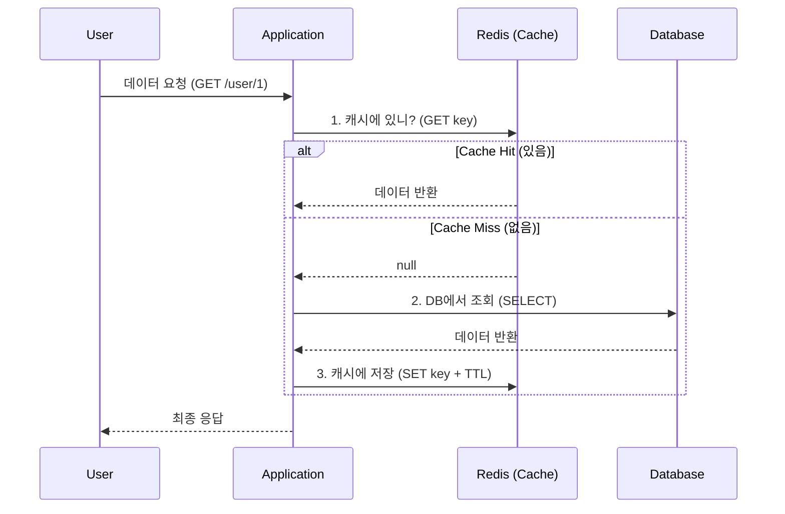

# ⚡ 캐싱 완벽 이해: 성능과 일관성의 트레이드오프

> **이 문서의 목표:** 캐싱을 단순 사용법이 아니라, **왜 효과적인지**, **어떤 문제가 발생하는지** 근본 원리를 이해한다.

---

## 0. 핵심 질문으로 시작하기

1. **캐시가 왜 빠른가?** → 메모리 vs 디스크
2. **캐시 일관성 문제는 왜 발생하는가?** → 두 곳에 데이터 존재
3. **캐시 스탬피드는 왜 위험한가?** → 동시 요청의 폭발
4. **어떤 캐싱 전략을 써야 하는가?** → 상황별 트레이드오프

---

## 1. 캐싱의 원리: 왜 빠른가?

### 1.1 속도 차이의 본질

```
[접근 속도 비교]
CPU 레지스터:  ~1ns
L1 캐시:      ~1ns
L2 캐시:      ~10ns
RAM (메모리): ~100ns
SSD:          ~100,000ns (0.1ms)
HDD:          ~10,000,000ns (10ms)

Redis (메모리): ~1ms
MySQL (디스크): ~10-100ms

→ 메모리는 디스크보다 100배 이상 빠름
```

### 1.2 캐싱의 핵심 원리

```
[지역성의 원리]
1. 시간적 지역성: 최근 접근한 데이터는 다시 접근할 가능성 높음
2. 공간적 지역성: 주변 데이터도 접근할 가능성 높음

[캐시의 전략]
"자주 쓰는 데이터는 빠른 곳에 미리 올려두자"
```

---

## 2. 캐시 일관성 문제: 왜 발생하는가?

### 2.1 문제의 본질

```
[두 곳에 데이터가 존재]
Cache: user.name = "Kim"
DB:    user.name = "Lee" (변경됨)

어느 것이 진짜인가?
→ 불일치 (Inconsistency)
```

### 2.2 해결 전략

```
1. Cache-Aside (Look-Aside)
   읽기: 캐시 먼저 → 없으면 DB → 캐시 저장
   쓰기: DB 업데이트 → 캐시 삭제

2. Write-Through
   쓰기: 캐시 + DB 동시에

3. Write-Back
   쓰기: 캐시만 → 나중에 DB 반영

각각 장단점이 다름 (아래 섹션에서 상세 설명)
```

---

## 💾 실제 캐시 문제와 해결 사례들

### 데이터베이스 성능 개선 시 흔히 하는 고민:

**"데이터베이스 쿼리가 너무 느려!"**
- 사용자 조회가 2-3초 걸림
- 피크타임에 DB CPU 100% 사용
- 캐시를 썼는데도 성능이 안 오름

**"캐시가 데이터와 안 맞아!"**
- 캐시는 최신 데이터인데 DB는 오래된 데이터
- 캐시 만료로 갑자기 모든 요청이 DB로 몰림
- 캐시 서버 다운으로 전체 서비스 마비

**"어떤 데이터를 캐시할까?"**
- 모든 데이터를 캐시하기엔 메모리가 부족
- 어떤 쿼리가 Hot한지 모름
- 캐시 히트율이 낮아서 효과가 없음

## 🎯 1분 요약: 캐싱의 핵심

**캐시 = 느린 디스크 대신 빠른 메모리 사용**

- **문제**: DB 조회는 10-100ms, 메모리는 1ms
- **해결**: 자주 쓰는 데이터를 메모리에 저장
- **주의**: 캐시는 휘발성, TTL 필수, 일관성 관리 필요

> **결론:**
> 1. **읽기 최적화**: Look-aside 패턴으로 캐시 먼저 조회
> 2. **일관성 유지**: Write-through로 데이터 동기화
> 3. **실패 대비**: 캐시 미스 시 DB 폴백, TTL 설정
> 
> 

---

## 2. 주요 캐싱 전략 (Patterns)

### 2.1 실제 캐시 적용 사례

**💡 서비스별 캐시 적용 패턴:**

| 서비스 | 캐시 대상 | TTL | 전략 |
|--------|-----------|-----|------|
| **소셜 미디어** | 사용자 프로필, 타임라인 | 5분 | Look-aside |
| **이커머스** | 상품 정보, 재고 | 1분 | Write-through |
| **게임** | 플레이어 상태, 랭킹 | 30초 | Write-back |

**🚨 실제 문제 사례:**

**문제 1: 캐시 스탬피드 (Thundering Herd)**
```java
// ❌ 잘못된 캐시 만료 처리
@PostMapping("/user/{id}")
public User getUser(@PathVariable Long id) {
    String cacheKey = "user:" + id;

    // 캐시 만료 동시에 1000명의 요청이 몰림
    User user = redisTemplate.opsForValue().get(cacheKey);
    if (user == null) {
        user = userService.getUserFromDB(id);  // DB에 1000번 쿼리!
        redisTemplate.opsForValue().set(cacheKey, user, 5, TimeUnit.MINUTES);
    }
    return user;
}
```

```java
// ✅ 분산 락으로 해결
@PostMapping("/user/{id}")
public User getUser(@PathVariable Long id) {
    String cacheKey = "user:" + id;
    String lockKey = "lock:" + id;

    User user = redisTemplate.opsForValue().get(cacheKey);
    if (user == null) {
        // 분산 락으로 DB 조회는 한 번만
        Boolean locked = redisTemplate.opsForValue().setIfAbsent(lockKey, "1",
            10, TimeUnit.SECONDS);
        if (locked) {
            try {
                user = userService.getUserFromDB(id);
                redisTemplate.opsForValue().set(cacheKey, user, 5, TimeUnit.MINUTES);
            } finally {
                redisTemplate.delete(lockKey);
            }
        } else {
            // 다른 스레드가 조회 중이니 잠시 대기
            Thread.sleep(100);
            return getUser(id); // 재귀 호출로 재시도
        }
    }
    return user;
}
```

**문제 2: 캐시 일관성 깨짐**
```java
// ❌ 데이터 변경 시 캐시 무효화 누락
@PutMapping("/user/{id}")
public void updateUser(@PathVariable Long id, User updatedUser) {
    userService.updateUserInDB(id, updatedUser);
    // 캐시는 그대로 두면? 오래된 데이터 계속 반환!
}
```

```java
// ✅ 캐시 무효화 추가
@PutMapping("/user/{id}")
public void updateUser(@PathVariable Long id, User updatedUser) {
    userService.updateUserInDB(id, updatedUser);
    redisTemplate.delete("user:" + id);  // 캐시 무효화
}
```

**문제 3: 캐시 서버 다운으로 인한 장애**
```java
// ❌ 캐시 연결 실패 시 서비스 다운
public User getUser(Long id) {
    try {
        return redisTemplate.opsForValue().get("user:" + id);
    } catch (Exception e) {
        throw new RuntimeException("Cache failure!");  // 서비스 다운!
    }
}
```

```java
// ✅ Circuit Breaker 패턴 적용
public User getUser(Long id) {
    try {
        return redisTemplate.opsForValue().get("user:" + id);
    } catch (Exception e) {
        // 캐시 실패해도 DB에서 조회 (Graceful Degradation)
        return userService.getUserFromDB(id);
    }
}
```



### 2.2 Write-through

데이터를 쓸 때 **캐시와 DB에 동시에** 쓰는 방식.

* **장점:** 캐시와 DB가 항상 동기화되어 데이터 **일관성(Consistency)**이 높음.
* **단점:** 쓸 때마다 두 곳에 저장해야 하므로 **쓰기 지연(Latency)**이 발생. 자주 조회되지 않는 데이터도 캐시에 들어가 메모리를 낭비함.

### 2.3 Write-back (Write-behind)

캐시에만 먼저 쓰고, 나중에 비동기적으로 DB에 한꺼번에 저장(Batch)하는 방식.

* **장점:** 쓰기 성능이 극도로 빠름 (로그 수집, 클릭 수 집계 등).
* **단점:** 캐시 서버가 꺼지면 **데이터가 영구 소실**될 위험이 큼.

---

## 3. 치명적인 문제: Thundering Herd (Cache Stampede)

캐시를 운영할 때 반드시 대비해야 할 재앙적인 시나리오다.

### 3.1 현상

인기 있는 검색어(Hot Key)의 **TTL(만료 시간)이 끝나는 순간**, 수천 개의 요청이 동시에 들어온다.

1. 모든 요청이 동시에 "캐시에 없네?"(Cache Miss)라고 판단.
2. 수천 개의 요청이 동시에 **DB를 타격**.
3. DB CPU가 100%를 치고 사망  서비스 전면 장애.

### 3.2 해결책

1. **TTL Jitter:** 만료 시간을 똑같이 설정하지 않고 랜덤 값(예: 600초 + 0~60초)을 추가하여 분산시킨다.
2. **Probabilistic Early Recomputation:** 만료되기 전에 확률적으로 미리 갱신한다.

---

## 4. Production-Ready Code Example (Python)

단순한 캐싱이 아니라, **"접속 실패 시 예외 처리"**와 **"TTL 설정"**이 포함된 실무 코드다.

```python
import redis
import json
from datetime import timedelta

# Redis 연결 설정 (Time-out 필수)
r = redis.Redis(host='localhost', port=6379, db=0, socket_timeout=5)

def get_user_profile(user_id):
    cache_key = f"user:profile:{user_id}"
    
    # 1. Look-aside: 캐시 조회
    try:
        cached_data = r.get(cache_key)
        if cached_data:
            return json.loads(cached_data) # Cache Hit
    except redis.ConnectionError:
        # 캐시 서버가 죽어도 서비스는 돌아가야 함 (Fail-safe)
        pass 

    # 2. DB 조회 (Cache Miss or Error)
    # user_data = db.query("SELECT * FROM users WHERE id = %s", user_id)
    user_data = {"id": user_id, "name": "Gemini", "role": "AI"} # Mock DB

    # 3. 캐시 저장 (반드시 TTL 설정!)
    try:
        # 10분(600초) + Jitter(랜덤 0~60초) 권장
        r.setex(cache_key, timedelta(minutes=10), json.dumps(user_data))
    except redis.ConnectionError:
        pass

    return user_data

```

---

## 5. 전문가적 조언 (Pro Tip)

### 5.1 `KEYS *` 명령어 금지

Redis는 **싱글 스레드(Single Threaded)** 기반이다.

* 만약 데이터가 1억 개인데 `KEYS *`(모든 키 조회)를 날리면, 그 명령을 처리하느라 다른 모든 요청(로그인, 결제 등)이 **멈춘다(Block).**
* **대안:** `SCAN` 명령어를 사용하여 커서(Cursor) 방식으로 조금씩 조회해야 한다.

### 5.2 메모리 관리 정책 (Eviction Policy)

Redis 메모리가 꽉 차면 어떻게 할 것인가? `redis.conf` 설정이 중요하다.

* **`noeviction`:** (기본값) 에러를 뱉고 저장을 거부함. (위험)
* **`allkeys-lru`:** (추천) **가장 오랫동안 안 쓴(Least Recently Used)** 데이터부터 지우고 새 데이터를 저장. 캐시 용도에 가장 적합.
* **`volatile-lru`:** TTL이 설정된 키 중에서만 LRU로 삭제.

### 5.3 Local Cache vs Global Cache

* **Global Cache (Redis):** 모든 서버가 공유. 데이터 정합성 좋음. 네트워크 비용 발생.
* **Local Cache (Ehcache, Caffeine):** 서버 메모리에 직접 저장. 속도 가장 빠름. 서버 간 데이터 불일치 발생 가능.
* **전략:** 자주 바뀌지 않는 데이터(코드성 데이터, 공통 설정)는 로컬 캐시에, 자주 바뀌는 데이터는 Redis에 저장하는 **2-Level Caching** 전략이 유효하다.

