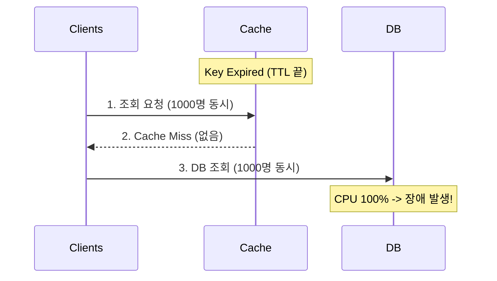

# ⚡ 캐싱 완벽 이해: 성능과 일관성의 트레이드오프

> **이 문서의 목표:** 캐싱을 단순 사용법이 아니라, **왜 효과적인지**, **어떤 문제가 발생하는지** 근본 원리를 이해하고 실무에서 **올바르게 적용하는 법**을 파악한다.

---

## 0. 핵심 질문으로 시작하기

1. **캐시가 왜 빠른가?** → 메모리 vs 디스크의 속도 차이 (약 100배 이상)
2. **캐시 일관성 문제는 왜 발생하는가?** → 원본(DB)과 사본(Cache)의 데이터 불일치 구간 발생
3. **캐시 스탬피드(Thundering Herd)는 왜 위험한가?** → 만료 순간 동시 요청 폭발로 DB 장애 유발
4. **어떤 캐싱 전략을 써야 하는가?** → 읽기 중심(Look-aside) vs 쓰기 중심(Write-back) 트레이드오프 고려

---

## 1. 캐싱(Caching): 왜 필요한가? (Why)

### 1.1 성능과 부하의 딜레마
현대 웹 서비스에서 데이터베이스(DB)는 가장 큰 병목 지점입니다. 
- **속도 차이:** DB(디스크)는 메모리보다 압도적으로 느립니다.
- **비용 문제:** 트래픽이 몰릴 때 DB를 스케일업하는 비용은 매우 비쌉니다.
- **사용자 경험:** 2~3초 걸리는 조회 페이지는 사용자를 떠나게 만듭니다.

### 1.2 실제 마주하는 문제들
1. **"데이터베이스 쿼리가 너무 느려!"**
   - 복잡한 JOIN 연산이나 대량의 데이터 스캔으로 인한 응답 지연.
2. **"트래픽 피크 때 DB가 뻗어요"**
   - 이벤트 오픈 시점에 수만 명의 동시 접속으로 DB CPU 100%.
3. **"캐시랑 DB 데이터가 달라요"**
   - 프로필을 수정했는데, 조회하면 옛날 프로필이 나옴 (데이터 불일치).

> [!NOTE]
> **핵심 통찰:** 캐싱은 "자주 사용되는 데이터를 빠른 공간(메모리)에 미리 복사해두는 것"입니다. 이를 통해 DB 부하를 줄이고 응답 속도를 획기적으로 개선합니다.

---

## 2. 캐싱의 원리와 구조: 어떻게 동작하는가? (How)

### 2.1 메모리 계층 구조 (Memory Hierarchy)

```mermaid
graph BT
    L1[L1 Cache: ~1ns]
    L2[L2 Cache: ~10ns]
    RAM[RAM: ~100ns]
    Redis[Redis: ~1ms]
    SSD[SSD: ~100,000ns (0.1ms)]
    HDD[HDD: ~10,000,000ns (10ms)]
    
    L1 --> L2
    L2 --> RAM
    RAM --> Redis
    Redis --> SSD
    SSD --> HDD

    style L1 fill:#ffcdd2,stroke:#c62828
    style Redis fill:#c8e6c9,stroke:#2e7d32
    style SSD fill:#e1f5fe,stroke:#0277bd
```

* **지역성의 원리 (Locality):** 
  1. **시간적 지역성:** 한 번 접근한 데이터는 조만간 다시 접근할 가능성이 높다.
  2. **공간적 지역성:** 접근한 데이터 주변의 데이터도 접근할 가능성이 높다.

### 2.2 핵심 캐싱 전략 (Caching Patterns)

가장 널리 쓰이는 패턴들을 비교합니다.

| 전략 | 읽기 흐름 | 쓰기 흐름 | 장점 | 단점 |
|:---:|---|---|---|---|
| **Look-aside**<br>(Lazy Loading) | 1. 캐시 조회<br>2. 없으면 DB 조회<br>3. 캐시 저장 | DB에 직접 씀<br>(캐시 관여 X) | 캐시 장애가 나도 서비스 가능 | 초기 조회 시 느림 (Cache Miss),<br>데이터 불일치 가능성 |
| **Write-through** | 캐시에서 읽음 | 캐시+DB 동시 저장 | 데이터 일관성 보장 | 쓰기 속도 느림,<br>안 쓰는 데이터도 캐싱됨 |
| **Write-back**<br>(Write-behind) | 캐시에서 읽음 | 캐시에만 씀<br>→ 나중에 DB 배치 저장 | 쓰기 성능 극대화<br>(로그, 조회수 등) | 캐시 서버 다운 시<br>데이터 영구 손실 위험 |

### 2.3 치명적인 문제: Thundering Herd (Cache Stampede)

인기 있는 데이터(Hot Key)의 **TTL(만료 시간)이 끝나는 순간**, 수천 개의 요청이 동시에 들어오는 현상입니다.



> [!WARNING]
> **해결책:** 
> 1. **TTL Jitter:** 만료 시간에 랜덤 값(0~60초)을 더해 만료 시점을 분산시킵니다.
> 2. **Mutex Lock:** 한 번에 하나의 프로세스만 DB를 조회하고 캐시를 갱신하도록 락을 겁니다.

---

## 3. 실전/구현: 코드로 보는 예시 (What)

### 3.1 Production-Ready Python Code (Look-aside + Fail-safe)

단순한 캐싱이 아니라, **"접속 실패 시 예외 처리"**와 **"TTL 설정"**이 포함된 실무 코드입니다.

```python
import redis
import json
from datetime import timedelta

# Redis 연결 설정 (Time-out 필수)
r = redis.Redis(host='localhost', port=6379, db=0, socket_timeout=5)

def get_user_profile(user_id):
    cache_key = f"user:profile:{user_id}"
    
    # 1. Look-aside: 캐시 조회
    try:
        cached_data = r.get(cache_key)
        if cached_data:
            return json.loads(cached_data) # Cache Hit
    except redis.ConnectionError:
        # 캐시 서버가 죽어도 서비스는 돌아가야 함 (Fail-safe)
        pass 
        
    # 2. DB 조회 (Cache Miss or Error)
    # user_data = db.query("SELECT * FROM users WHERE id = %s", user_id)
    user_data = {"id": user_id, "name": "Gemini", "role": "AI"} # Mock DB

    # 3. 캐시 저장 (반드시 TTL 설정!)
    try:
        # 10분(600초) + Jitter(랜덤 0~60초) 권장
        # setex: Set with Expiration
        r.setex(cache_key, timedelta(minutes=10), json.dumps(user_data))
    except redis.ConnectionError:
        pass

    return user_data
```

### 3.2 전문가적 조언 (Pro Tips)

1. **`KEYS *` 명령어 절대 금지:** Redis는 싱글 스레드입니다. O(N) 명령을 실행하면 완료될 때까지 모든 서비스가 멈춥니다. 대신 `SCAN`을 사용하세요.
2. **메모리 관리 정책 (Eviction Policy):** `maxmemory` 도달 시 동작을 설정해야 합니다.
   - `allkeys-lru`: 가장 오래 안 쓴 키 삭제 (캐시 용도로 추천).
   - `volatile-lru`: TTL 있는 키 중에서만 삭제.
   - `noeviction`: 저장 거부 (에러 발생).
3. **Global vs Local Cache:**
   - **Local (Ehcache):** 더 빠르지만 서버 간 데이터 불일치.
   - **Global (Redis):** 정합성 좋지만 네트워크 비용.
   - **Hybrid:** 변경이 적은 코드성 데이터는 Local, 나머지는 Global.

---

## 4. 🎯 1분 요약

1. **캐싱의 핵심**: 느린 디스크(DB) 대신 빠른 메모리를 사용하여 속도를 높이고 DB 부하를 줄인다.
2. **전략 선택**: 일반적인 조회는 **Look-aside**, 데이터 정합성이 중요하면 **Write-through**, 쓰기 성능이 중요하면 **Write-back**을 쓴다.
3. **주의사항**: 캐시는 언제든 날아갈 수 있다는(휘발성) 전제 하에 설계해야 하며, **TTL**과 **Eviction** 정책 설정이 필수다.

---

## 5. 📝 자가 점검 질문

1. **Look-aside 패턴에서 캐시 미스(Cache Miss)가 발생했을 때의 흐름을 설명하시오.**
   → 캐시 조회 실패 -> DB 조회 -> 결과를 캐시에 저장 -> 클라이언트에 반환.
2. **Redis가 싱글 스레드임에도 빠른 이유는?**
   → 메모리 기반 작업이며, I/O Multiplexing을 사용하여 비동기적으로 요청을 처리하기 때문 (단, 오래 걸리는 명령은 치명적).
3. **캐시 스탬피드(Thundering Herd) 현상을 방지하기 위한 기법 두 가지는?**
   → TTL에 랜덤 시간을 추가하는 Jitter, 혹은 갱신 시 분산 락(Distributed Lock) 사용.
