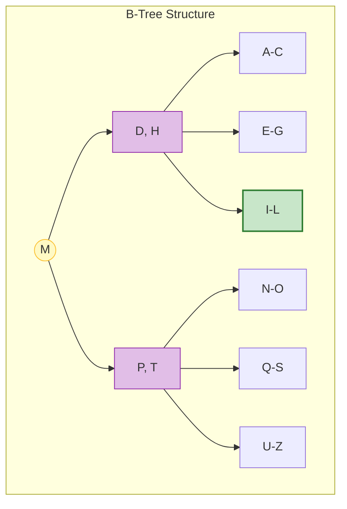

# 🚀 인덱스와 트랜잭션 완벽 이해: 데이터베이스 성능의 본질

> **이 문서의 목표:** 인덱스의 내부 구조(B-Tree)와 비용을 이해하여 최적의 검색 성능을 이끌어내고, 트랜잭션의 격리 수준(Isolation Level)을 적절히 선택하여 데이터 정합성과 동시성 간의 균형을 맞춘다.

---

## 0. 핵심 질문으로 시작하기

1. **인덱스를 많이 만들면 왜 쓰기 성능이 떨어지는가?** → 데이터 변경 시마다 B-Tree의 정렬을 유지하기 위한 재구성 비용이 발생하므로
2. **트랜잭션의 ACID 속성은 무엇인가?** → 원자성(A), 일관성(C), 격리성(I), 지속성(D)
3. **데드락(Deadlock)은 왜 발생하며 어떻게 해결하는가?** → 두 트랜잭션이 서로의 자원을 가진 채 무한 대기할 때 발생. 잠금 순서를 통일하거나 타임아웃으로 해결
4. **격리 수준(Isolation Level)이 높을수록 좋은가?** → 데이터 정확성은 높아지지만 동시 처리량이 줄어들어 성능이 저하되므로 트레이드오프가 필요함

---

## 1. 💥 실제로 겪어본 문제들 (Problem Context)

### 배달의민족, 쿠팡에서 흔히 마주치는 상황들:

**🐌 느린 검색 (인덱스 없음):**
- "서울 맛집 검색"이 30초 걸림
- "특정 시간대 주문 조회"가 1분 이상 소요

**💸 돈 관련 오류 (트랜잭션 없음):**
- 계좌 이체 중간에 실패해서 돈이 증발
- 포인트 차감만 되고 상품 구매는 실패
- 쿠폰 발급 중복으로 재고 초과

---

## 2. 🔍 인덱스: 데이터 검색의 핵심

### 2.1 인덱스가 왜 빠른가? (B-Tree의 원리)

**인덱스가 없으면? (Full Table Scan)**
```sql
SELECT * FROM users WHERE email = 'kim@example.com';
-- 1억 개 행을 처음부터 끝까지 확인 → O(n)
```

**B-Tree 인덱스 사용 시:**

- **탐색:** 루트에서 리프 노드까지 `O(log n)`만에 이동
- **범위 검색:** 리프 노드끼리 연결되어 있어 `BETWEEN` 검색에 최적화

### 2.2 인덱스의 비용 (Trade-off)

| 작업 | 영향 | 이유 |
|---|---|---|
| **읽기 (SELECT)** | 🚀 빨라짐 | 탐색 범위가 획기적으로 줄어듦 |
| **쓰기 (INSERT/UPDATE)** | 🐢 느려짐 | 데이터 변경 시마다 B-Tree 재정렬(페이지 분할 등) 필요 |
| **저장 공간** | 📉 감소 | 인덱스 자체도 디스크 공간을 차지함 (약 10~30% 추가) |

### 2.3 실전 인덱스 전략

**실수 1: 모든 컬럼에 인덱스 생성**
→ 쓰기 성능이 급격히 저하됨. WHERE, JOIN, ORDER BY에 자주 쓰이는 컬럼만 선택적으로 생성.

**실수 2: 함수 사용으로 인덱스 무효화**
```sql
-- ❌ 인덱스 사용 불가 (컬럼 가공)
SELECT * FROM users WHERE UPPER(name) = 'KIM';

-- ✅ 인덱스 사용 가능
SELECT * FROM users WHERE name = 'KIM'; -- (DB 설정에 따라 대소문자 구분 확인)
```

**실수 3: 복합 인덱스 순서 오류**
`CREATE INDEX idx_a_b ON table(a, b)` 인 경우:
- `WHERE a = 1 AND b = 2` (O)
- `WHERE a = 1` (O)
- `WHERE b = 2` (X) → 선행 컬럼(a) 없이 후행 컬럼(b)만으로는 인덱스를 탈 수 없음 (Full Scan 발생)

---

## 3. 🔒 트랜잭션: 데이터 정합성의 수호자

### 3.1 트랜잭션이 필요한 이유

**[계좌 이체 시나리오]**
1. A 계좌에서 100원 출금
2. (서버 크래시!)
3. B 계좌에 100원 입금 (실행 안 됨)
-> **결과: 100원 증발!**

트랜잭션은 이 과정을 **"모두 성공하거나, 아예 없던 일로 하거나(Rollback)"** 보장한다.

### 3.2 ACID 속성

| 속성 | 의미 | 실제 예시 |
|---|---|---|
| **Atomicity (원자성)** | All or Nothing | 이체 도중 실패하면 돈이 빠져나가지 않아야 함 |
| **Consistency (일관성)** | 규칙 준수 | 잔액은 마이너스가 될 수 없다는 제약조건 유지 |
| **Isolation (격리성)** | 서로 간섭 없음 | 내가 조회하는 도중에 남이 데이터를 바꿔도 영향받지 않음 |
| **Durability (지속성)** | 영구 저장 | "송금 완료" 메시지가 떴다면 전원이 꺼져도 기록 보존 |

### 3.3 격리 수준 (Isolation Level)과 문제점

동시성(성능)과 데이터 정확성 사이의 줄타기.

| 수준 | 발생 가능한 문제 | 설명 | 적용 사례 |
|---|---|---|---|
| **Read Uncommitted** | Dirty Read | 커밋되지 않은 데이터도 읽음 (Rollback 되면 엉뚱한 값) | 로그 분석, 정확성 덜 중요한 통계 |
| **Read Committed** | Non-Repeatable Read | 커밋된 데이터만 읽음 (가장 일반적) | **대부분의 웹 서비스 (Oracle, MSSQL, PG 기본)** |
| **Repeatable Read** | Phantom Read | 트랜잭션 내내 같은 값을 읽음 | **MySQL(InnoDB) 기본**, 정산 시스템 |
| **Serializable** | - | 완벽한 직렬화 (가장 느림) | 은행 잔고 등 초민감 데이터 |

---

## 4. 인덱스와 트랜잭션의 상호작용 (Locking)

DB는 데이터 무결성을 위해 **잠금(Lock)**을 사용하며, 이는 인덱스와 밀접한 관련이 있다.

- **인덱스가 있으면:** 해당 **행(Row)**만 잠금 (Record Lock)
- **인덱스가 없으면:** **테이블 전체**를 잠금 (Table Lock) → 동시성 대폭 하락!

> **Pro Tip:** `UPDATE`나 `DELETE` 시 `WHERE` 절에 인덱스가 걸려있지 않으면, DB 전체가 멈출 수도 있다.

---

## 5. 🎯 1분 요약: 데이터베이스 성능의 핵심

**데이터베이스 = 인덱스(속도) + 트랜잭션(안정성)**

1. **인덱스**: 책의 목차와 같다. 읽기는 빨라지지만, 쓸 때마다 목차를 수정해야 해서 쓰기는 느려진다. B-Tree 구조를 이해하고 선행 컬럼 규칙을 지켜야 한다.
2. **트랜잭션**: 작업의 완전성을 보장한다. ACID를 통해 데이터가 깨지는 것을 막는다.
3. **격리 수준**: 성능과 정합성의 트레이드오프다. 보통 `Read Committed`를 쓰고, 필요시 `Repeatable Read`나 락(`SELECT FOR UPDATE`)을 사용한다.

---

## 6. 자가 점검 질문

1. **B-Tree 인덱스에서 데이터가 추가될 때 성능 비용이 발생하는 이유는?**
   → 리프 노드가 꽉 찼을 때 노드 분할(Split)과 트리 재균형(Rebalancing) 작업이 일어나기 때문.
2. **"커버링 인덱스(Covering Index)"란 무엇인가?**
   → 쿼리에 필요한 모든 컬럼이 인덱스에 포함되어 있어, 실제 테이블 데이터 블록을 읽지 않고도 결과를 반환할 수 있는 상태.
3. **트랜잭션 격리 수준 중 `Phantom Read`란 무엇인가?**
   → 한 트랜잭션 안에서 같은 조건으로 두 번 조회했을 때, 다른 트랜잭션이 데이터를 삽입/삭제하여 결과 행의 개수가 달라지는 현상.
4. **데드락을 피하기 위한 애플리케이션 레벨의 전략은?**
   → 트랜잭션을 최대한 짧게 유지하고, 여러 테이블을 수정할 때 항상 같은 순서로 접근하도록 로직을 통일한다.
