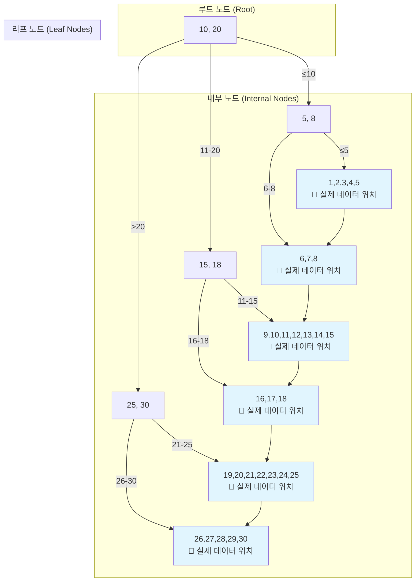
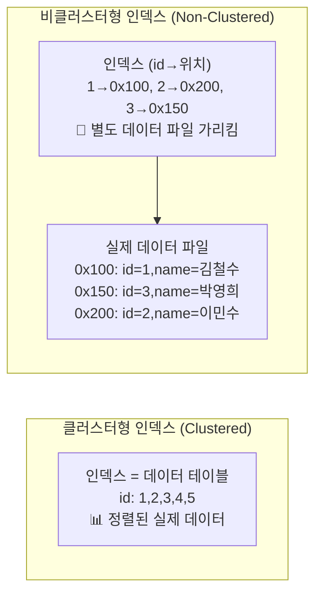

# 🚀 데이터베이스 성능의 양대 축: 인덱스와 트랜잭션

## 💥 실제로 겪어본 문제들

### 배달의민족, 쿠팡에서 흔히 마주치는 상황들:

**🐌 느린 검색 (인덱스 없음):**
- "서울 맛집 검색"이 30초 걸림
- "특정 시간대 주문 조회"가 1분 이상 소요

**💸 돈 관련 오류 (트랜잭션 없음):**
- 계좌 이체 중간에 실패해서 돈이 증발
- 포인트 차감만 되고 상품 구매는 실패
- 쿠폰 발급 중복으로 재고 초과

## 🎯 1분 요약: 왜 이게 중요한가?

**데이터베이스 = 인덱스(속도) + 트랜잭션(안정성)**

- **인덱스**: 책 목차처럼 데이터를 빠르게 찾는 기술
- **트랜잭션**: "All or Nothing" - 모두 성공하거나 모두 실패

> **결론:**
> 1. **인덱스**: 조회 속도를 100배 빠르게 하지만, 쓰기 속도는 느려짐
> 2. **트랜잭션**: 데이터 정합성을 지키지만, 성능은 떨어짐
> 3. **실무**: 둘 다 중요하지만, 상황에 맞게 균형 맞추기

---

## 2. 🔍 인덱스: 데이터 검색의 핵심

### 2.1 인덱스가 왜 필요한가? (실제 문제 사례)

**🚨 배달의민족 검색 속도 문제:**

```sql
-- ❌ 인덱스 없는 경우: 1억개 음식점 데이터에서 검색
SELECT * FROM restaurants WHERE city = '서울' AND rating >= 4.5;
-- 결과: 30초 소요 (Full Table Scan)
```

```sql
-- ✅ 인덱스 적용 후
CREATE INDEX idx_city_rating ON restaurants(city, rating);
SELECT * FROM restaurants WHERE city = '서울' AND rating >= 4.5;
-- 결과: 0.1초 소요
```

**📊 실제 성능 차이:**
- **인덱스 없음**: 1억개 레코드 스캔 = 30초
- **인덱스 있음**: 1,000개만 스캔 = 0.1초
- **속도 향상**: 300배 차이!

### 2.2 B-Tree 인덱스의 실제 구조 (Visual Guide)

B-Tree는 데이터베이스 인덱스의 핵심으로, 실제 데이터가 어떻게 분산되어 저장되는지 이해하는 것이 중요합니다.

#### B-Tree 구조 예시 (차수 3의 B-Tree)


**🔍 데이터 검색 과정 (예: WHERE id = 15 찾기)**
```
루트(10,20) → 15는 10-20 범위 → 내부노드(15,18) → 15는 11-15 범위 → 리프노드에서 15 찾음
깊이: 3단계, 비교 연산: 5회 → 실제 데이터 위치로 이동
```

**💾 실제 데이터 분산 (클러스터형 vs 비클러스터형)**


### 2.2.1 어떤 인덱스를 써야 할까? (실전 선택 가이드)

| 상황 | 추천 인덱스 | 이유 | 예시 |
|------|-------------|------|------|
| **정확한 값 찾기** | B-Tree | 범위 검색 가능 | `WHERE user_id = 123` |
| **범위 검색** | B-Tree | 정렬된 데이터 빠름 | `WHERE price BETWEEN 1000 AND 5000` |
| **정확한 키만** | Hash | 가장 빠름 | Redis 캐시 키 |
| **데이터와 함께 저장** | 클러스터형 | 디스크 I/O 절약 | 기본 키 인덱스 |

**💡 실제 서비스 적용:**
- **배달의민족**: `city + rating` 복합 인덱스
- **쿠팡**: `category + price` 범위 검색용
- **인스타그램**: `user_id + created_at` 타임라인용

### 2.3 인덱스 실전 전략 (개발자가 자주 하는 실수들)

#### ❌ 흔한 실수와 올바른 방법

**실수 1: 모든 컬럼에 인덱스 생성**
```sql
-- ❌ 잘못된 예: 모든 컬럼에 인덱스
CREATE INDEX idx_name ON users(name);
CREATE INDEX idx_email ON users(email);
CREATE INDEX idx_age ON users(age);
CREATE INDEX idx_city ON users(city);

-- 문제: 쓰기 속도 10배 느려짐, 디스크 공간 5배 증가
```

**✅ 현명한 선택:**
```sql
-- WHERE 조건에 자주 사용되는 컬럼만
CREATE INDEX idx_user_search ON users(city, name);  -- 복합 인덱스
CREATE INDEX idx_email ON users(email);            -- 로그인용
```

**실수 2: 복합 인덱스 순서 잘못 설정**
```sql
-- ❌ 잘못된 순서
CREATE INDEX idx_wrong ON orders(created_at, user_id, status);

-- ✅ 올바른 순서 (자주 사용하는 순서대로)
CREATE INDEX idx_orders_search ON orders(status, created_at, user_id);
-- WHERE status = 'paid' AND created_at > '2023-01-01' 용
```

**실수 3: 함수 사용으로 인덱스 무효화**
```sql
-- ❌ 인덱스 사용 불가
SELECT * FROM users WHERE UPPER(name) = 'KIM';
SELECT * FROM orders WHERE DATE(created_at) = '2024-01-01';

-- ✅ 인덱스 사용 가능
SELECT * FROM users WHERE name = 'kim';  -- 대소문자 구분
SELECT * FROM orders WHERE created_at >= '2024-01-01' AND created_at < '2024-01-02';
```

---

## 3. 🔒 트랜잭션: 데이터 정합성의 수호자

### 3.1 트랜잭션이 없으면 어떤 문제가 생기나?

**🚨 실제 사고 사례들:**

**카카오페이 송금 실패:**
```sql
-- ❌ 트랜잭션 없는 위험한 코드
UPDATE accounts SET balance = balance - 1000 WHERE user_id = 1;  -- 철수 계좌에서 1000원 출금
UPDATE accounts SET balance = balance + 1000 WHERE user_id = 2;  -- 영희 계좌로 1000원 입금

-- 서버 다운! 영희는 돈 못 받음, 철수는 돈 날림
```

**쿠팡 주문 실패:**
```sql
-- ❌ 트랜잭션 없는 주문 처리
INSERT INTO orders (user_id, product_id, quantity) VALUES (1, 100, 1);  -- 주문 생성
UPDATE products SET stock = stock - 1 WHERE id = 100;                 -- 재고 감소

-- 네트워크 오류! 재고만 줄고 주문은 안 됨
```

**✅ 올바른 해결책:**
```sql
-- 트랜잭션으로 안전하게
BEGIN TRANSACTION;

UPDATE accounts SET balance = balance - 1000 WHERE user_id = 1;
UPDATE accounts SET balance = balance + 1000 WHERE user_id = 2;

COMMIT;  -- 모두 성공하거나 모두 실패
```

### 3.2 ACID 속성 이해하기 (쉬운 설명)

| 속성 | 쉬운 설명 | 실제 예시 |
|------|-----------|----------|
| **Atomicity** | 모두 성공하거나 모두 실패 | 계좌 이체: 출금과 입금이 함께 |
| **Consistency** | 규칙을 깨지 않음 | 잔액이 음수로 떨어지지 않음 |
| **Isolation** | 서로 간섭하지 않음 | A의 조회가 B의 변경을 보지 않음 |
| **Durability** | 성공하면 영구 저장 | 장애 후에도 데이터 유지 |

### 3.3 격리 수준: 성능 vs 안전성 선택

**격리 수준이 뭐길래 이렇게 복잡할까?**

**비유로 이해하기:**
- **Read Uncommitted**: 화장실 문 잠그지 않음 (누구나 들어올 수 있음)
- **Read Committed**: 화장실 문 잠금 (안에서 나오면 다시 잠금)
- **Repeatable Read**: 화장실 전체 잠금 (안에 있는 동안 계속 잠겨있음)
- **Serializable**: 한 사람씩 차례로 사용 (완전 순차적)

**실제 서비스 적용:**

| 서비스 | 격리 수준 | 이유 |
|--------|-----------|------|
| **은행 앱** | Serializable | 돈이 잘못 계산되면 큰일 |
| **SNS 타임라인** | Read Committed | 약간의 중복 좋아요는 괜찮음 |
| **쇼핑몰** | Repeatable Read | 장바구니 수량 일관성 중요 |
| **로그 분석** | Read Uncommitted | 약간 부정확해도 속도가 우선 |

**💡 실무 팁:**
- **금융/결제**: Serializable 사용
- **일반 웹**: Read Committed로 충분
- **분석/보고서**: Read Uncommitted로 성능 최적화

**Dirty Read (더티 리드):**
```sql
-- 트랜잭션 A: UPDATE users SET balance = 0 WHERE id = 1;
-- 트랜잭션 B: SELECT balance FROM users WHERE id = 1; -- 0을 읽음
-- 트랜잭션 A: ROLLBACK; -- 취소됨
-- 결과: 트랜잭션 B는 실제로 존재하지 않았던 데이터를 읽음
```

**Non-repeatable Read (반복 불가능 읽기):**
```sql
-- 트랜잭션 A: SELECT balance FROM users WHERE id = 1; -- 100
-- 트랜잭션 B: UPDATE users SET balance = 200 WHERE id = 1; COMMIT;
-- 트랜잭션 A: SELECT balance FROM users WHERE id = 1; -- 200 (변경됨)
-- 결과: 같은 트랜잭션 내에서 같은 쿼리가 다른 결과를 반환
```

**Phantom Read (팬텀 리드):**
```sql
-- 트랜잭션 A: SELECT COUNT(*) FROM users WHERE age > 20; -- 10명
-- 트랜잭션 B: INSERT INTO users VALUES (21); COMMIT;
-- 트랜잭션 A: SELECT COUNT(*) FROM users WHERE age > 20; -- 11명
-- 결과: 없는 행이 갑자기 나타남
```

### 3.3 잠금(Locking) 메커니즘

격리 수준을 구현하기 위한 핵심 메커니즘이다.

#### 공유 락(Shared Lock, S-Lock) vs 배타 락(Exclusive Lock, X-Lock)
* **공유 락:** 읽기 작업 시 사용, 여러 트랜잭션이 동시에 획득 가능
* **배타 락:** 쓰기 작업 시 사용, 한 트랜잭션만 독점

#### 데드락(Deadlock) 방지
```sql
-- 데드락 발생 예시
-- 트랜잭션 A: UPDATE table1 SET col1 = 1 WHERE id = 1;
-- 트랜잭션 B: UPDATE table2 SET col2 = 1 WHERE id = 2;
-- 트랜잭션 A: UPDATE table2 SET col2 = 2 WHERE id = 2; -- 대기
-- 트랜잭션 B: UPDATE table1 SET col1 = 2 WHERE id = 1; -- 데드락!

-- 해결: 잠금 순서를 일관되게 유지하거나 타임아웃 설정
```

---

## 4. 인덱스와 트랜잭션의 상호작용

### 4.1 인덱스가 트랜잭션에 미치는 영향

**잠금 범위 감소:**
```sql
-- 인덱스 없는 경우: 테이블 전체 잠금
UPDATE users SET status = 'inactive' WHERE age > 60;

-- 인덱스 있는 경우: 필요한 행만 잠금
UPDATE users SET status = 'inactive' WHERE age > 60;
```

**하지만 주의:** 인덱스가 많을수록 트랜잭션 동안 더 많은 잠금을 관리해야 함

### 4.2 트랜잭션이 인덱스에 미치는 영향

**격리 수준에 따른 인덱스 효율:**
* 낮은 격리 수준: 더티 리드가 가능해 빠르지만 데이터 정합성 문제
* 높은 격리 수준: 느리지만 데이터 정합성 보장

---

## 5. Production-Ready 구현 예시

### 5.1 MySQL 인덱스 생성 및 모니터링

```sql
-- 1. 인덱스 생성
CREATE INDEX idx_user_email ON users(email);
CREATE INDEX idx_post_user_created ON posts(user_id, created_at);

-- 2. 인덱스 사용 확인
EXPLAIN SELECT * FROM users WHERE email = 'test@example.com';

-- 3. 인덱스 통계 확인
SHOW INDEX FROM users;
ANALYZE TABLE users;

-- 4. 트랜잭션 격리 수준 설정
SET SESSION TRANSACTION ISOLATION LEVEL READ COMMITTED;
START TRANSACTION;
-- 작업 수행
COMMIT;
```

### 5.2 PostgreSQL에서 트랜잭션과 인덱스

```sql
-- PostgreSQL은 기본적으로 Read Committed
BEGIN;
-- 작업 수행
SAVEPOINT my_savepoint; -- 롤백 포인트
-- 추가 작업
ROLLBACK TO my_savepoint; -- 부분 롤백
COMMIT;

-- 인덱스 생성 (CONCURRENTLY로 블로킹 방지)
CREATE INDEX CONCURRENTLY idx_users_email ON users(email);
```

---

## 6. 성능 튜닝 전략

### 6.1 인덱스 튜닝
* **Slow Query Log** 분석으로 비효율적 쿼리 찾기
* **Composite Index**로 여러 조건을 하나의 인덱스로 처리
* **Partial Index**로 필요한 데이터만 인덱싱 (PostgreSQL)

### 6.2 트랜잭션 튜닝
* **가능한 짧게:** 트랜잭션 시간을 최소화
* **적절한 격리 수준:** 대부분의 경우 Read Committed로 충분
* **Connection Pool:** 연결 재사용으로 오버헤드 감소

### 6.3 모니터링 지표
* **Lock Wait Time:** 잠금 대기 시간
* **Deadlock Count:** 데드락 발생 빈도
* **Index Usage:** 인덱스 히트율

---

## 7. 전문가적 조언 (Pro Tip)

### 7.1 인덱스 설계 원칙
* **규칙 1:** WHERE, JOIN, ORDER BY에서 자주 사용되는 컬럼에 인덱스 생성
* **규칙 2:** 카디널리티가 높은 컬럼 우선
* **규칙 3:** 쓰기 작업이 많은 테이블은 인덱스 수를 최소화

### 7.2 트랜잭션 설계 원칙
* **규칙 1:** 필요한 최소 범위만 잠금
* **규칙 2:** 데드락을 피하기 위해 리소스 접근 순서 표준화
* **규칙 3:** 롤백이 쉬운 작은 트랜잭션으로 분할

### 7.3 데이터베이스별 특징
* **MySQL InnoDB:** 클러스터형 인덱스 기본, 갭 락으로 팬텀 리드 방지
* **PostgreSQL:** MVCC로 높은 동시성 지원, Partial Index 강력
* **Oracle:** UNDO 세그먼트로 읽기 일관성 유지
