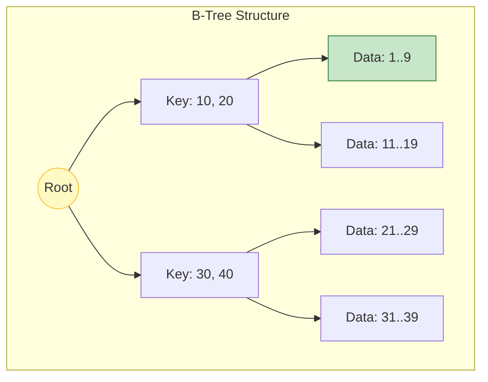
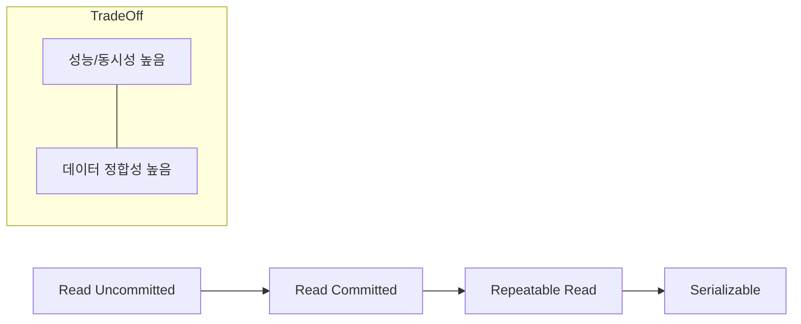

# 🚀 인덱스와 트랜잭션 완벽 이해: 데이터베이스 성능의 본질

> **이 문서의 목표:** 인덱스의 내부 구조(B-Tree)와 비용을 이해하여 최적의 검색 성능을 이끌어내고, 트랜잭션의 격리 수준(Isolation Level)을 적절히 선택하여 데이터 정합성과 동시성 간의 균형을 맞춘다.

---

## 0. 핵심 질문으로 시작하기

1. **인덱스를 많이 만들면 왜 쓰기 성능이 떨어지는가?** → 데이터 변경 시마다 B-Tree 재정렬 비용 발생
2. **트랜잭션의 ACID 속성은 무엇인가?** → 원자성(A), 일관성(C), 격리성(I), 지속성(D)
3. **데드락(Deadlock)은 왜 발생하며 어떻게 해결하는가?** → 상호 자원 점유로 인한 무한 대기. 순서 통일이나 타임아웃으로 해결
4. **격리 수준(Isolation Level)이 높을수록 좋은가?** → 정합성은 올라가지만 동시성이 떨어져 성능 저하 (Trade-off)

---

## 1. 개념 정의: 왜 필요한가? (Why)

### 1.1 데이터베이스의 두 가지 숙명
백엔드 개발자가 DB를 다룰 때 가장 많이 마주치는 두 가지 문제는 **"너무 느리다(성능)"**와 **"데이터가 깨졌다(정합성)"**입니다.

1. **성능 문제 (Slow Query):** 
   - 데이터가 1억 건이 넘어가면 단순 `SELECT`도 몇 초~몇 분이 걸립니다.
   - **해결책:** 인덱스(Index)를 통해 탐색 범위를 획기적으로 줄입니다.
2. **정합성 문제 (Data Integrity):** 
   - 계좌 이체 도중 서버가 죽으면 돈이 증발할 수 있습니다.
   - **해결책:** 트랜잭션(Transaction)을 통해 작업의 완전성을 보장합니다.

> [!NOTE]
> **핵심 통찰:** 인덱스는 **"책의 목차"**와 같아서 읽기를 빠르게 하지만 쓰기를 느리게 합니다. 트랜잭션은 **"안전 장치"**와 같아서 데이터를 보호하지만 성능(동시성)을 희생할 수 있습니다.

---

## 2. 원리/구조: 어떻게 동작하는가? (How)

### 2.1 인덱스의 구조 (B-Tree)

대부분의 RDBMS는 B-Tree(Balanced Tree) 구조를 사용합니다.



- **동작 원리:** 루트에서 리프 노드까지 `O(log N)`의 시간 복잡도로 데이터를 찾습니다. Full Table Scan `O(N)`과 비교하면 천지차이입니다.
- **트레이드오프:** 데이터를 `INSERT`, `UPDATE`, `DELETE` 할 때마다 트리의 균형을 맞추기 위해 노드 분할(Split)과 병합이 일어납니다. 이것이 쓰기 성능 저하의 원인입니다.

### 2.2 트랜잭션의 4가지 성질 (ACID)

| 성질 | 의미 | 예시 |
|:---:|---|---|
| **Atomicity (원자성)** | All or Nothing | 이체 중 실패하면 송금 전으로 롤백 |
| **Consistency (일관성)** | 규칙 준수 | 잔액은 0보다 작을 수 없다는 제약조건 유지 |
| **Isolation (격리성)** | 간섭 없음 | 내가 조회 중일 때 남이 수정해도 영향받지 않음 |
| **Durability (지속성)** | 영구 저장 | 커밋 완료 메시지 후엔 전원이 꺼져도 데이터 보존 |

### 2.3 격리 수준 (Isolation Level)과 동시성



### 2.4 격리 수준별 발생 가능한 문제

| 격리 수준 | Dirty Read | Non-Repeatable Read | Phantom Read | 성능 |
|:---|:---:|:---:|:---:|:---:|
| **READ_UNCOMMITTED** | ⭕ 발생 | ⭕ 발생 | ⭕ 발생 | 최고 |
| **READ_COMMITTED** | ❌ 방지 | ⭕ 발생 | ⭕ 발생 | 높음 |
| **REPEATABLE_READ** | ❌ 방지 | ❌ 방지 | ⭕ 발생 | 중간 |
| **SERIALIZABLE** | ❌ 방지 | ❌ 방지 | ❌ 방지 | 낮음 |

### 2.5 각 문제 상황 설명

#### Dirty Read (더티 리드)
**커밋되지 않은 데이터를 읽는 현상**

```
TX1: UPDATE balance = 0  (아직 커밋 안 함)
TX2: SELECT balance → 0 반환 (잘못된 값!)
TX1: ROLLBACK → balance는 원래 값으로 복구
TX2: 이미 잘못된 값(0)으로 로직 처리 완료 → 문제 발생!
```

#### Non-Repeatable Read (반복 불가능 읽기)
**같은 쿼리를 두 번 실행했을 때 결과가 다른 현상**

```
TX1: SELECT balance → 1000
TX2: UPDATE balance = 500, COMMIT
TX1: SELECT balance → 500 (값이 바뀜!)
     같은 트랜잭션인데 조회 결과가 다름
```

#### Phantom Read (팬텀 리드)
**같은 조건으로 조회했을 때 행(Row)의 개수가 달라지는 현상**

```
TX1: SELECT COUNT(*) WHERE status='ACTIVE' → 10개
TX2: INSERT INTO ... status='ACTIVE', COMMIT
TX1: SELECT COUNT(*) WHERE status='ACTIVE' → 11개 (유령처럼 행 추가!)
```

### 2.6 DB별 기본 격리 수준

| DB | 기본 격리 수준 | 특징 |
|:---|:---|:---|
| **MySQL (InnoDB)** | REPEATABLE READ | MVCC로 Phantom Read도 대부분 방지 |
| **PostgreSQL** | READ COMMITTED | MVCC 기반 |
| **Oracle** | READ COMMITTED | 락 기반 |
| **SQL Server** | READ COMMITTED | 락 기반, SNAPSHOT 옵션 제공 |

> [!TIP]
> **실무 권장:** 대부분의 경우 DB 기본값을 사용하고, 특별한 요구사항이 있을 때만 명시적으로 설정합니다.

---

## 3. 실전/구현: 코드로 보는 예시 (What)

### 3.1 인덱스 적용과 흔한 실수 (SQL)

```sql
-- ✅ 올바른 인덱스 사용
CREATE INDEX idx_user_email ON users(email);
SELECT * FROM users WHERE email = 'test@example.com'; -- 인덱스 타서 빠름

-- ❌ 인덱스를 못 타는 경우 (Full Scan 발생)
-- 1. 컬럼을 가공했을 때
SELECT * FROM users WHERE UPPER(email) = 'TEST@EXAMPLE.COM'; 
-- 2. 앞부분이 아닌 뒷부분 검색 (Like)
SELECT * FROM users WHERE email LIKE '%example.com';
-- 3. 부정 연산자 사용
SELECT * FROM users WHERE email != 'test@example.com';
```

### 3.2 트랜잭션 적용 (Spring Java)

```java
@Service
public class TransferService {

    @Transactional(isolation = Isolation.READ_COMMITTED)
    public void transfer(Long fromId, Long toId, Long amount) {
        // 1. 출금
        Account from = accountRepository.findById(fromId)
            .orElseThrow(() -> new RuntimeException("계좌 없음"));
        from.withdraw(amount);

        // 2. 입금
        Account to = accountRepository.findById(toId)
            .orElseThrow(() -> new RuntimeException("계좌 없음"));
        to.deposit(amount);
        
        // 예외 발생 시 자동으로 Rollback 됨
    }
}
```

> [!WARNING]
> **데드락(Deadlock) 주의:** 
> 트랜잭션 A가 자원 1을 잡고 2를 기다리고, 트랜잭션 B가 자원 2를 잡고 1을 기다리면 영원히 멈춥니다.
> **해결:** 자원 접근 순서를 항상 동일하게 맞추세요. (예: 항상 ID 오름차순으로 락 획득)

---

## 4. 🎯 1분 요약

1. **인덱스**: `WHERE`, `JOIN`, `ORDER BY` 절에 사용되는 컬럼에 걸어야 하며, 너무 많이 걸면 쓰기 성능이 죽는다.
2. **복합 인덱스**: 순서가 중요하다. (A, B) 인덱스는 A 없이 B만으로 검색하면 인덱스를 타지 못한다.
3. **트랜잭션**: ACID를 보장하기 위해 사용하며, 격리 수준(Isolation Level)을 조절해 성능과 정합성의 균형을 맞춰야 한다.
4. **격리 수준 문제**: Dirty Read → Non-Repeatable Read → Phantom Read 순으로 높은 격리 수준에서 방지된다.
5. **DB 기본값**: MySQL은 REPEATABLE READ, Oracle/PostgreSQL/SQL Server는 READ COMMITTED가 기본이다.

---

## 5. 📝 자가 점검 질문

1. **"커버링 인덱스(Covering Index)"란 무엇이며 왜 성능에 좋은가?**
   → 쿼리에 필요한 모든 컬럼이 인덱스에 포함되어 있어, 실제 테이블 데이터 블록을 읽지 않고도 결과를 반환할 수 있어 I/O가 획기적으로 줄어든다.

2. **Dirty Read, Non-Repeatable Read, Phantom Read의 차이는?**
   → Dirty Read: 커밋 안 된 데이터 읽음 / Non-Repeatable Read: 같은 행의 값이 바뀜 / Phantom Read: 행의 개수가 바뀜

3. **MySQL InnoDB의 기본 격리 수준은? 왜 그 수준인가?**
   → REPEATABLE READ. MVCC를 통해 높은 정합성을 보장하면서도 성능을 유지하기 위함.

4. **격리 수준을 SERIALIZABLE로 설정하면 어떤 문제가 발생하는가?**
   → 모든 트랜잭션이 순차 실행되어 동시성이 극도로 낮아지고 성능이 급격히 저하됨.

5. **인덱스를 걸었는데도 쿼리가 느리다면 무엇을 확인해야 하는가?**
   → `EXPLAIN`을 통해 실행 계획을 확인하여 인덱스를 제대로 타고 있는지(Full Table Scan 여부), Cardinality(분별력)가 너무 낮은 컬럼은 아닌지 확인한다.
