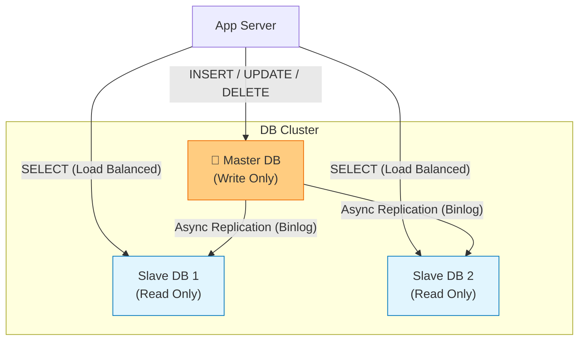
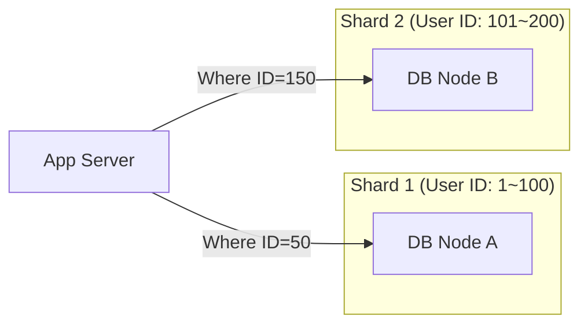

# 🗄️ 데이터베이스 확장: 한 대로는 못 버티겠어!

## 🚨 실제 분산 데이터베이스 문제들

### 데이터베이스 확장 시 흔히 하는 고민:

**"한 대 DB로는 트래픽을 못 감당해!"**
- 읽기 요청이 너무 많아 CPU 100%
- 데이터가 수백 GB로 커져서 백업도 느림
- 쓰기 요청이 몰려서 INSERT/UPDATE가 느림

**"복제했는데 데이터가 안 맞아!"**
- Master에 썼는데 Slave에서 바로 안 보임
- Replication Lag 때문에 최신 데이터 못 봄
- 네트워크 문제로 복제 끊김

**"샤딩했는데 쿼리가 복잡해졌어!"**
- JOIN 쿼리가 샤드 간에 안 돼서 비즈니스 로직 변경
- 트랜잭션이 샤드 간에 걸쳐있어서 처리 어려움
- 샤딩 키 잘못 선택해서 핫스팟 발생

## 🎯 1분 요약: 데이터베이스 확장의 핵심

**확장 = 더 많은 서버로 트래픽 분산**

- **Replication**: 읽기 요청을 여러 DB로 분산 (데이터 복제)
- **Sharding**: 데이터를 여러 DB로 분할 저장 (용량 분산)
- **CAP 이론**: 일관성 + 가용성 + 분할耐性 중 2개만 선택 가능

> **결론:**
> 1. **읽기 부하**: Replication으로 해결 (80%의 경우)
> 2. **쓰기/용량 부하**: Sharding으로 해결 (20%의 경우)
> 3. **트레이드오프**: CAP 이론 고려, 비즈니스 요구사항에 맞게 선택
> 
> 

---

## 2. 읽기 성능 해결: Replication 실전 적용

**💡 실제 적용 사례:**

| 서비스 | Replication 구성 | 효과 |
|--------|------------------|------|
| **인스타그램** | 1 Master + N Slaves | 피드 조회 성능 향상 |
| **넷플릭스** | Multi-region Replication | 글로벌 사용자 응답 속도 |
| **쿠팡** | Read Replicas | 상품 검색 성능 최적화 |

**🚨 실제 문제 사례:**

**문제 1: Replication Lag로 인한 데이터 불일치**
```sql
-- Master에 글 작성
INSERT INTO posts (user_id, content) VALUES (1, '안녕하세요!');

-- 바로 Slave에서 조회 (Replication Lag 발생!)
SELECT * FROM posts WHERE user_id = 1;
-- 결과: 방금 쓴 글이 안 보임!
```

```sql
-- ✅ 해결: Master에서 읽기 또는 Lag 감지
-- 1. 중요한 조회는 Master에서
SELECT * FROM posts WHERE user_id = 1; -- Master에서 조회

-- 2. Lag 모니터링
SHOW SLAVE STATUS; -- Seconds_Behind_Master 확인
```

**문제 2: Slave 장애로 인한 읽기 부하 집중**
```sql
-- Slave 3대 중 1대 다운
-- 나머지 2대에 읽기 요청 3배 집중
-- 결국 나머지 Slave도 다운 → 전체 서비스 영향
```

```sql
-- ✅ 해결: 헬스체크 + 자동 제거
-- 로드밸런서에서 장애 Slave 자동 제외
-- 새로운 Slave 자동 추가
```

**문제 3: 쓰기 부하로 Master가 병목**
```sql
-- Master에만 모든 쓰기 집중
-- Slave는 놀고 있는데 Master가 CPU 100%
-- Replication Lag 증가 → 악순환
```

```sql
-- ✅ 해결: Multi-Master 구성 또는 Sharding 고려
-- 또는 읽기 부하를 더 줄이기 위한 캐시 도입
```

### 2.1 아키텍처 다이어그램



### 2.2 핵심 원리 및 문제점

* **원리:** Master에 데이터가 변경되면, 로그(Binlog)를 Slave에 전달하여 똑같이 반영(Replay)한다.
* **Replication Lag (지연):** Master에 썼는데, Slave에 아직 복제되지 않은 찰나의 순간에 조회를 하면 **"방금 쓴 글이 안 보이는"** 정합성 문제가 발생한다.

---

## 3. 쓰기 성능 해결: Sharding 실전 적용

**💡 실제 적용 사례:**

| 서비스 | 샤딩 전략 | 샤드 키 | 효과 |
|--------|-----------|---------|------|
| **유튜브** | Hash Sharding | Video ID | 동영상 업로드 분산 |
| **트위터** | Range Sharding | User ID | 타임라인 조회 최적화 |
| **에어비앤비** | Geo Sharding | 지역 | 위치 기반 검색 속도 |

**🚨 실제 문제 사례:**

**문제 1: 잘못된 샤드 키 선택으로 핫스팟 발생**
```sql
-- ❌ 시간 기반 Range Sharding (최신 데이터에만 쓰기 집중)
-- Shard 1: 2023년 데이터
-- Shard 2: 2024년 데이터
-- 결과: Shard 2에만 모든 쓰기 몰림, 다른 샤드는 놀음
```

```sql
-- ✅ Hash Sharding으로 균등 분산
-- user_id를 hash(user_id) % 4로 샤드 결정
-- 모든 샤드에 고르게 쓰기 분산
```

**문제 2: JOIN 쿼리가 샤드 간에 걸쳐있어서 실패**
```sql
-- ❌ 샤딩 전: 같은 DB에서 JOIN 가능
SELECT u.name, p.title
FROM users u
JOIN posts p ON u.id = p.user_id;

-- ✅ 샤딩 후: JOIN이 샤드 간에 걸쳐서 불가능
-- users와 posts가 다른 샤드에 있을 수 있음
```

```sql
-- 해결: 애플리케이션 레벨에서 JOIN 수행
// 1. posts에서 user_ids 조회
List<Long> userIds = posts.stream()
    .map(Post::getUserId)
    .collect(Collectors.toList());

// 2. users 샤드에서 일괄 조회
List<User> users = userService.getUsersByIds(userIds);

// 3. 메모리에서 JOIN
Map<Long, User> userMap = users.stream()
    .collect(Collectors.toMap(User::getId, u -> u));

posts.forEach(post -> {
    User user = userMap.get(post.getUserId());
    // JOIN 결과 처리
});
```

**문제 3: 서버 증설 시 데이터 재배치 어려움**
```sql
-- 샤드가 2개에서 4개로 늘어날 때
-- 기존 데이터의 50%를 새 샤드로 이동해야 함
-- 서비스 중단 또는 복잡한 마이그레이션 필요
```

```sql
-- ✅ 사전 계획: Consistent Hashing 사용
// 샤드 추가/삭제 시 최소한의 데이터만 이동
// ex: Ketama 알고리즘
```

### 3.1 샤딩 전략 (Sharding Strategy)

데이터를 나누는 기준(**Shard Key**)이 성능을 좌우한다.

| 방식 | 설명 | 장점 | 단점 |
| --- | --- | --- | --- |
| **Range Sharding** | 숫자의 범위로 나눔 (User ID 1~1000, 1001~2000) | 구현이 쉽고 범위 조회에 유리 | 특정 구간(최신 유저)에 트래픽이 몰리는 **Hot Spot** 발생 |
| **Hash Sharding** | `Hash(ID) % 서버수`로 나눔 | 데이터가 균등하게 분산됨 (Hot Spot 방지) | 서버를 추가/삭제할 때 대대적인 데이터 재배치(Resharding) 필요 |
| **Directory Sharding** | 별도의 조회 테이블(Lookup Table) 사용 | 샤드 위치를 동적으로 변경 가능 | 조회 테이블 자체가 단일 장애점(SPOF)이 될 수 있음 |

### 3.2 아키텍처 다이어그램



---

## 4. 이론적 한계: CAP 이론

분산 데이터베이스 시스템을 구축할 때 마주하는 3가지 속성 중, **현실적으로 2가지만 선택**할 수 있다는 이론이다.

### 4.1 구성 요소

1. **Consistency (일관성):** 모든 노드가 동시에 같은 데이터를 보여주는가? (어느 DB를 찔러도 최신 데이터인가?)
2. **Availability (가용성):** 일부 노드가 죽어도 응답을 받을 수 있는가? (에러 없이 항상 성공하는가?)
3. **Partition Tolerance (분할 내성):** 네트워크 단절로 노드 간 통신이 끊겨도 시스템이 동작하는가?

### 4.2 선택의 기로 (PACELC)

네트워크 장애(P)는 언제든 발생하므로 무조건 안고 가야 한다. 결국 **CP vs AP**의 싸움이다.

| 선택 | 특징 | 사용 사례 | 대표 기술 |
| --- | --- | --- | --- |
| **CP System** | **일관성 우선.** 노드 간 동기화가 깨지면 차라리 에러를 뱉거나 쓰기를 막음. | 은행, 결제, 재고 관리 | Redis, HBase, MongoDB |
| **AP System** | **가용성 우선.** 동기화가 늦어져서 옛날 데이터를 주더라도 일단 응답함. | SNS 피드, 좋아요 수 | Cassandra, DynamoDB |

---

## 5. 전문가적 조언 (Pro Tip)

### 5.1 샤딩은 최후의 수단이다 (Do not Shard Prematurely)

샤딩을 도입하는 순간 시스템 복잡도는 10배 이상 증가합니다.

* **Join 불가:** 서로 다른 샤드에 있는 테이블끼리는 JOIN 연산이 불가능합니다. 앱 레벨에서 데이터를 각각 가져와서 조립해야 합니다.
* **트랜잭션 분산:** Global Transaction(2PC)을 써야 하는데 매우 느리고 실패 확률이 높습니다.
* **조언:** 인덱스 최적화  캐시(Redis) 도입  Replication  그래도 안 되면 그때 샤딩을 고려하십시오.

### 5.2 전역 유일 ID (Global Unique ID)

샤딩 환경에서는 DB의 `Auto Increment`를 사용할 수 없습니다(각 샤드에서 1번이 중복 생성됨).

* **해결책:** 전역적으로 유니크한 ID 생성 전략이 필요합니다.
* **Twitter Snowflake:** 시간+노드ID+시퀀스를 조합해 64비트 정수 ID 생성.
* **UUID:** 유니크하지만 너무 길고 정렬이 안 되어 인덱스 성능에 나쁨. (v7 사용 권장)


### 5.3 CQRS 패턴 (Command Query Responsibility Segregation)

Replication 구조를 앱 레벨에서 세련되게 구현하는 패턴입니다.

* **Command (쓰기):** Master DB로 연결하여 데이터 변경.
* **Query (읽기):** Slave DB로 연결하여 데이터 조회.
* 이를 코드 레벨(Java/Spring 등)에서 어노테이션 등으로 분리하여 관리하는 것이 표준입니다.
