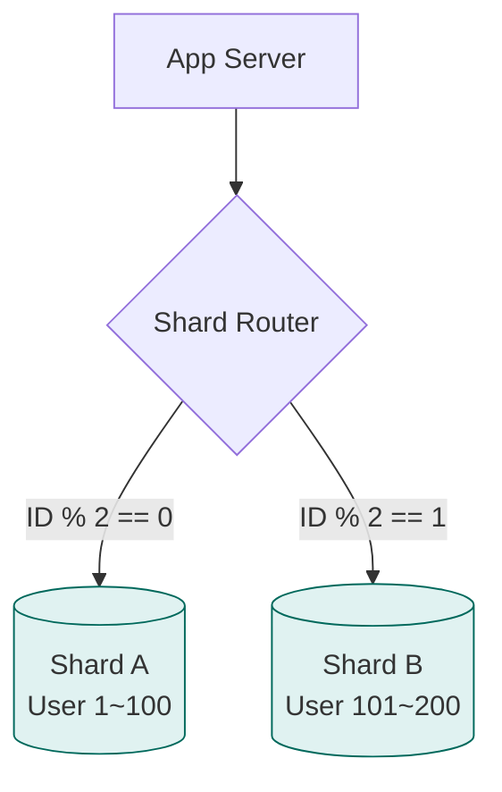

# 🗄️ 데이터베이스 확장: 한 대로는 못 버티겠어!

> **이 문서의 목표:** 서비스 성장으로 인해 단일 데이터베이스가 한계에 도달했을 때, **복제(Replication)**와 **샤딩(Sharding)**을 통해 성능과 용량을 확장하는 전략적 접근법을 익힌다.

---

## 0. 핵심 질문으로 시작하기

1. **DB 서버의 CPU가 터질 것 같으면 무엇부터 해야 하나?** → 읽기 부하인지 쓰기 부하인지 분석. 읽기면 Replication, 쓰기면 Sharding.
2. **Replication Lag란 무엇이며 왜 위험한가?** → 마스터-슬레이브 간 동기화 지연. 방금 쓴 데이터가 조회 안 되는 정합성 문제 발생.
3. **샤딩(Sharding)은 언제 도입해야 하는가?** → 인덱스, 캐시, 스케일업으로도 감당 안 되는 **대용량 데이터/쓰기 부하** 상황의 최후 수단.
4. **CAP 이론에서 현실적인 선택은?** → 네트워크 단절(P)은 불가항력. 일관성(CP) vs 가용성(AP) 중 비즈니스에 맞춰 택일.

---

## 1. 개념 정의: 왜 필요한가? (Why)

### 1.1 단일 서버(Monolithic)의 한계
서비스가 성공하여 트래픽이 폭증하면 하나의 DB 서버로는 감당할 수 없는 시점이 옵니다.
1. **읽기 지연:** 수많은 조회 요청으로 CPU가 100%를 치고 응답이 느려집니다.
2. **용량 부족:** 데이터가 수 TB 단위로 쌓여 디스크가 부족하고 백업/복구도 며칠이 걸립니다.
3. **쓰기 병목:** INSERT/UPDATE 요청이 몰려 Lock 경합이 심해집니다.

> [!NOTE]
> **핵심 통찰:** 확장 방식에는 두 가지가 있습니다.
> 1. **Scale-up:** 더 비싼, 더 좋은 장비로 교체 (한계가 명확함).
> 2. **Scale-out:** 여러 대의 저렴한 장비로 분산 처리 (복제와 샤딩).

---

## 2. 원리/구조: 어떻게 동작하는가? (How)

### 2.1 복제 (Replication): 읽기 분산

대부분의 웹 서비스는 **읽기가 쓰기보다 압도적으로 많습니다 (8:2 비율).** 따라서 읽기 성능을 확장하는 것이 1순위입니다.

```mermaid
graph TD
    subgraph DB_Cluster [Database Cluster]
        direction TB
        Master[("👑 Master DB<br/>(Write + Read)")]
        Slave1[("Slave DB 1<br/>(Read Only)")]
        Slave2[("Slave DB 2<br/>(Read Only)")]
    end
    
    App[App Server] -->|INSERT/UPDATE| Master
    App -->|SELECT (Load Balanced)| Slave1
    App -->|SELECT (Load Balanced)| Slave2
    
    Master -.->|Async Replication<br/>(Binlog)| Slave1
    Master -.->|Async Replication<br/>(Binlog)| Slave2

    style Master fill:#ffcc80,stroke:#ef6c00
    style Slave1 fill:#e1f5fe,stroke:#0277bd
```

- **동작 원리:** Master의 변경 로그(Binlog)를 Slave가 가져와서 똑같이 실행(Replay)합니다.
- **Replication Lag:** 비동기 복제 방식이라 Master에 쓰고 Slave에 반영되기까지 미세한 시차(Lag)가 발생합니다.

### 2.2 샤딩 (Sharding): 쓰기 및 데이터 분산

데이터를 여러 DB에 쪼개서 저장하는 기술입니다. **"무엇을 기준(Shard Key)으로 쪼갤 것인가?"**가 핵심입니다.



| 방식 | 설명 | 장점 | 단점 |
|:---:|---|---|---|
| **Range Sharding** | 범위 기준 (날짜, ID) | 구현 단순, 범위 조회 유리 | 특정 구간에 몰리는 **Hot Spot** 발생 |
| **Hash Sharding** | Hash(Key) % N | 데이터 균등 분산 | 서버 추가/제거 시 데이터 재배치(Resharding) 복잡 |

### 2.3 CAP 이론

분산 시스템에서 3마리 토끼를 다 잡을 수는 없다는 이론입니다.

- **Consistency (일관성):** 모든 노드가 같은 데이터를 보여줌.
- **Availability (가용성):** 일부가 죽어도 응답함.
- **Partition Tolerance (분할 내성):** 네트워크가 끊겨도 동작함.
- **선택:** P는 필수이므로, **CP(정합성)** vs **AP(가용성)** 중 선택.

---

## 3. 실전/구현: 코드로 보는 예시 (What)

### 3.1 서비스별 적용 사례

| 서비스 | 문제 상황 | 해결 전략 |
|---|---|---|
| **인스타그램** | 피드 조회가 엄청남 | **Replication** (Master 1 + Slave 수십 대) |
| **디스코드** | 채팅 메시지가 수십 억 건 | **Sharding** (채널 ID 기준 Hash Sharding) |
| **은행** | 잔고 정합성이 최우선 | **CP 시스템** (Strong Consistency 보장 DB) |

### 3.2 전문가적 조언 (Pro Tips)

1. **Replication Lag 해결:** "내 정보 보기", "결제 직후 확인" 등 민감한 로직은 **Master DB에서 직접 조회**하도록 라우팅해야 합니다.
2. **Global Unique ID:** 샤딩 환경에서는 DB의 `Auto Increment`를 못 씁니다. 중복되지 않는 ID를 만들기 위해 **Snowflake**(시간+노드ID)나 **UUID**를 사용하세요.
3. **샤딩은 최후의 수단:** 샤딩을 하면 JOIN이 안 되고 트랜잭션 관리가 지옥이 됩니다. 인덱스 튜닝 -> 캐시 도입 -> 복제 도입 -> 파티셔닝 -> 그래도 안 되면 샤딩을 고려하세요.

---

## 4. 🎯 1분 요약

1. **읽기 부하**가 문제라면 **Replication**을 도입하여 읽기 요청을 Slave로 분산시킨다.
2. **쓰기 부하/용량**이 문제라면 **Sharding**을 도입하여 데이터를 수평 분할한다.
3. **Replication Lag**와 **Sharding 복잡도**를 항상 염두에 두고, 오버 엔지니어링을 피해야 한다.

---

## 5. 📝 자가 점검 질문

1. **Replication을 도입했을 때 발생할 수 있는 데이터 정합성 문제는 무엇인가?**
   → Master에 저장된 데이터가 Slave로 전파되기 전(Lag)에 조회하면 데이터가 없거나 과거 데이터가 조회되는 현상.
2. **Range Sharding의 치명적인 단점(Hot Spot)은 무엇인가?**
   → 날짜나 증가하는 ID를 기준으로 나누면, "최신 데이터"를 담당하는 특정 샤드에만 트래픽이 집중되어 분산 효과가 사라지는 현상.
3. **CAP 이론에서 RDBMS(MySQL 등)는 보통 어떤 속성을 추구하는가?**
   → 일반적으로 CA 또는 CP를 지향한다. 클러스터 구성 시 네트워크 분단 상황에서 일관성을 위해 가용성을 포기(CP)하거나 그 반대(AP)를 선택해야 한다.
