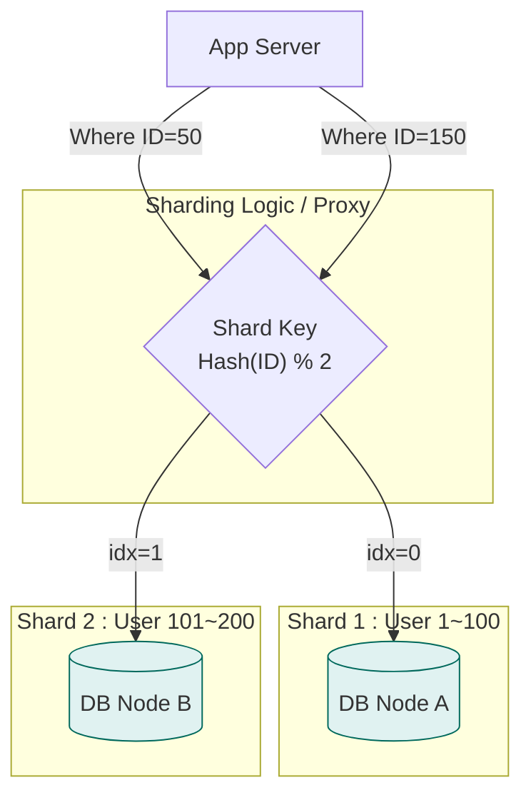

# 🗄️ 데이터베이스 확장: 한 대로는 못 버티겠어!

> **이 문서의 목표:** 서비스 성장으로 인해 단일 데이터베이스가 한계에 도달했을 때, **복제(Replication)**와 **샤딩(Sharding)**을 통해 성능과 용량을 확장하는 전략적 접근법을 익힌다.

---

## 0. 핵심 질문으로 시작하기

1. **DB 서버의 CPU가 터질 것 같으면 무엇부터 해야 하나?** → 읽기 부하인지 쓰기 부하인지 분석 후, 읽기라면 Replication, 쓰기라면 Sharding 또는 캐시 고려
2. **Replication Lag란 무엇이며 왜 위험한가?** → 마스터와 슬레이브 간의 데이터 동기화 지연. 방금 쓴 글이 안 보이는 정합성 문제 발생
3. **샤딩(Sharding)은 언제 도입해야 하는가?** → 인덱스 최적화, 캐시, 스케일업으로도 해결되지 않는 **대용량 데이터/쓰기 부하** 상황에서 최후의 수단으로
4. **CAP 이론에서 현실적인 선택은?** → 네트워크 단절(P)은 피할 수 없으므로, 일관성(CP)과 가용성(AP) 중 비즈니스에 맞는 것을 택일

---

## 1. 🚨 실제 분산 데이터베이스 문제들 (Problem Context)

### 데이터베이스 확장 시 흔히 하는 고민:

**"한 대 DB로는 트래픽을 못 감당해!"**
- 읽기 요청이 너무 많아 CPU 100%
- 데이터가 수백 GB로 커져서 백업도 느림
- 쓰기 요청이 몰려서 INSERT/UPDATE가 느림

**"복제했는데 데이터가 안 맞아!"**
- Master에 썼는데 Slave에서 바로 안 보임
- Replication Lag 때문에 최신 데이터 못 봄
- 네트워크 문제로 복제 끊김

**"샤딩했는데 쿼리가 복잡해졌어!"**
- JOIN 쿼리가 샤드 간에 안 돼서 비즈니스 로직 변경
- 트랜잭션이 샤드 간에 걸쳐있어서 처리 어려움
- 샤딩 키 잘못 선택해서 핫스팟 발생

---

## 2. 읽기 성능 해결: Replication 실전 적용

**읽기 부하는 전체 트래픽의 80% 이상을 차지**하므로, 가장 먼저 고려해야 할 확장 전략이다.

**💡 실제 적용 사례:**

| 서비스 | Replication 구성 | 효과 |
|--------|------------------|------|
| **인스타그램** | 1 Master + N Slaves | 피드 조회 성능 향상 |
| **넷플릭스** | Multi-region Replication | 글로벌 사용자 응답 속도 |
| **쿠팡** | Read Replicas | 상품 검색 성능 최적화 |

### 2.1 아키텍처 다이어그램

```mermaid
graph TD
    subgraph DB_Cluster [Database Cluster]
        direction TB
        Master[("👑 Master DB<br/>(Write/Read)")]
        
        subgraph Slaves [Read Replicas]
            Slave1[("Slave DB 1<br/>(Read Only)")]
            Slave2[("Slave DB 2<br/>(Read Only)")]
        end
    end
    
    App[App Server] -->|INSERT/UPDATE| Master
    App -->|SELECT (Load Balanced)| Slave1
    App -->|SELECT (Load Balanced)| Slave2
    
    Master -.->|Async Replication<br/>(Binlog)| Slave1
    Master -.->|Async Replication<br/>(Binlog)| Slave2

    style Master fill:#ffcc80,stroke:#ef6c00
    style Slave1 fill:#e1f5fe,stroke:#0277bd
    style Slave2 fill:#e1f5fe,stroke:#0277bd
```

### 2.2 핵심 원리 및 문제점 (Replication Lag)

* **원리:** Master에 데이터가 변경되면, 로그(Binlog)를 Slave에 전달하여 똑같이 반영(Replay)한다.
* **문제:** Master에 썼는데, Slave에 아직 복제되지 않은 찰나의 순간에 조회를 하면 **"방금 쓴 글이 안 보이는"** 정합성 문제가 발생한다.

**✅ 해결책:**
1. 중요한 조회(내 정보, 결제 내역)는 **Master에서 직접 읽기**.
2. **Lag 감지:** `SHOW SLAVE STATUS` 등으로 지연이 심한 Slave는 로드밸런싱에서 제외.

---

## 3. 쓰기 성능 해결: Sharding 실전 적용

**쓰기 부하가 한계**에 달하거나, **데이터 용량이 너무 커서** 한 서버에 담을 수 없을 때 사용한다.

### 3.1 샤딩 전략 (Sharding Strategy)

데이터를 나누는 기준(**Shard Key**)이 성능을 좌우한다.

| 방식 | 설명 | 장점 | 단점 |
| --- | --- | --- | --- |
| **Range Sharding** | 숫자의 범위로 나눔 (User ID 1~1000, 1001~2000) | 구현이 쉽고 범위 조회에 유리 | 특정 구간(최신 유저)에 트래픽이 몰리는 **Hot Spot** 발생 |
| **Hash Sharding** | `Hash(ID) % 서버수`로 나눔 | 데이터가 균등하게 분산됨 (Hot Spot 방지) | 서버를 추가/삭제할 때 대대적인 데이터 재배치(Resharding) 필요 |
| **Directory Sharding** | 별도의 조회 테이블(Lookup Table) 사용 | 샤드 위치를 동적으로 변경 가능 | 조회 테이블 자체가 단일 장애점(SPOF)이 될 수 있음 |

### 3.2 아키텍처 다이어그램



---

## 4. 이론적 한계: CAP 이론

분산 데이터베이스 시스템을 구축할 때 마주하는 3가지 속성 중, **현실적으로 2가지만 선택**할 수 있다는 이론이다.

### 4.1 구성 요소
1. **Consistency (일관성):** 모든 노드가 동시에 같은 데이터를 보여주는가?
2. **Availability (가용성):** 일부 노드가 죽어도 에러 없이 응답하는가?
3. **Partition Tolerance (분할 내성):** 네트워크 단절에도 시스템이 유지되는가?

### 4.2 선택의 기로 (PACELC)
네트워크 장애(P)는 피할 수 없으므로, 결국 **CP vs AP**의 선택이다.

| 선택 | 특징 | 사용 사례 | 대표 기술 |
| --- | --- | --- | --- |
| **CP System** | **일관성 우선.** 동기화 깨지면 쓰기 차단/에러. | 은행, 결제, 재고 | Redis, HBase, MongoDB |
| **AP System** | **가용성 우선.** 옛날 데이터라도 일단 응답. | SNS 피드, 좋아요 | Cassandra, DynamoDB |

---

## 5. 전문가적 조언 (Pro Tip)

### 5.1 샤딩은 최후의 수단이다 (Do not Shard Prematurely)
샤딩을 도입하는 순간 **JOIN 불가, 트랜잭션 복잡도 증가** 등 개발 난이도가 급상승한다.
**조언:** 인덱스 최적화 → 캐시(Redis) 도입 → Replication → **그래도 안 되면 그때 샤딩**.

### 5.2 전역 유일 ID (Global Unique ID)
샤딩 환경에서는 DB의 `Auto Increment`를 쓰면 ID가 충돌한다.
**해결책:** Twitter Snowflake(시간+노드ID)나 UUID v7 같은 **분산 ID 생성 전략**을 사용하라.

### 5.3 CQRS 패턴 (Command Query Responsibility Segregation)
앱 레벨에서 **명령(쓰기/Master)**과 **조회(읽기/Slave)** 책임을 코드로 명확히 분리하여 관리하라.

---

## 6. 🎯 1분 요약: 데이터베이스 확장의 핵심

**확장 = 더 많은 서버로 트래픽 분산**

- **Replication**: 읽기 요청을 여러 DB로 분산 (데이터 복제)
- **Sharding**: 데이터를 여러 DB로 분할 저장 (용량 분산)
- **CAP 이론**: 일관성 + 가용성 + 분할내성 중 2개만 선택 가능

> **결론:**
> 1. **읽기 부하**: Replication으로 해결 (80%의 경우)
> 2. **쓰기/용량 부하**: Sharding으로 해결 (20%의 경우)
> 3. **트레이드오프**: CAP 이론 고려, 비즈니스 요구사항에 맞게 선택

---

## 7. 자가 점검 질문

1. **Replication을 도입했을 때 발생할 수 있는 가장 큰 데이터 정합성 문제는?**
   → Replication Lag로 인해 Master의 최신 데이터가 Slave에 반영되지 않은 상태에서 읽히는 문제.
2. **Range Sharding의 치명적인 단점(Hot Spot)은 무엇인가?**
   → 날짜나 증가하는 ID를 기준으로 나누면, 최신 데이터를 담당하는 샤드에만 트래픽이 집중되는 현상.
3. **분산 환경에서 Auto Increment 대신 사용할 수 있는 ID 생성 방식은?**
   → UUID, Twitter Snowflake (TSID), Redis Increment 등.
4. **CAP 이론에서 RDBMS(MySQL 등)는 보통 어떤 속성을 추구하는가?**
   → CA 또는 CP (클러스터 구성에 따라 다르지만, 기본적으로 강력한 일관성을 중시함).
