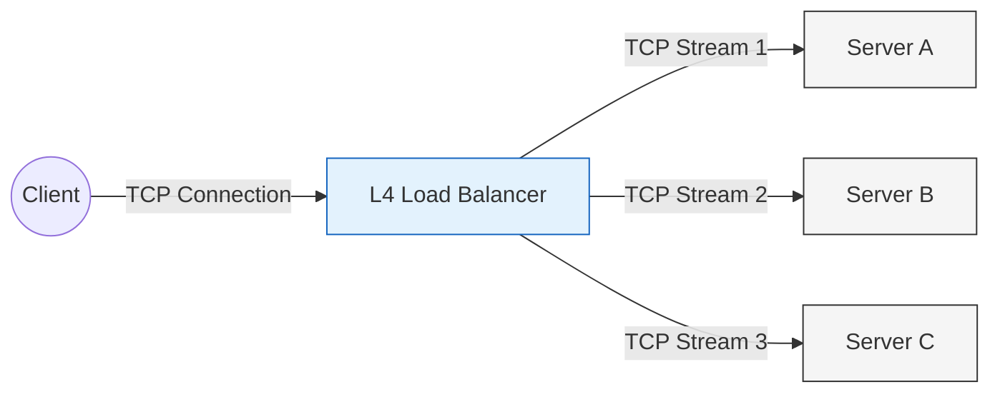
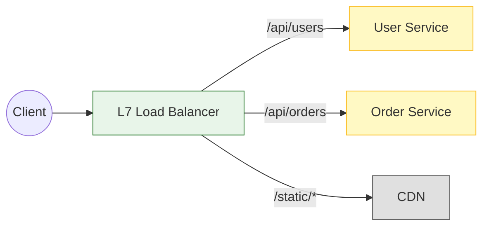
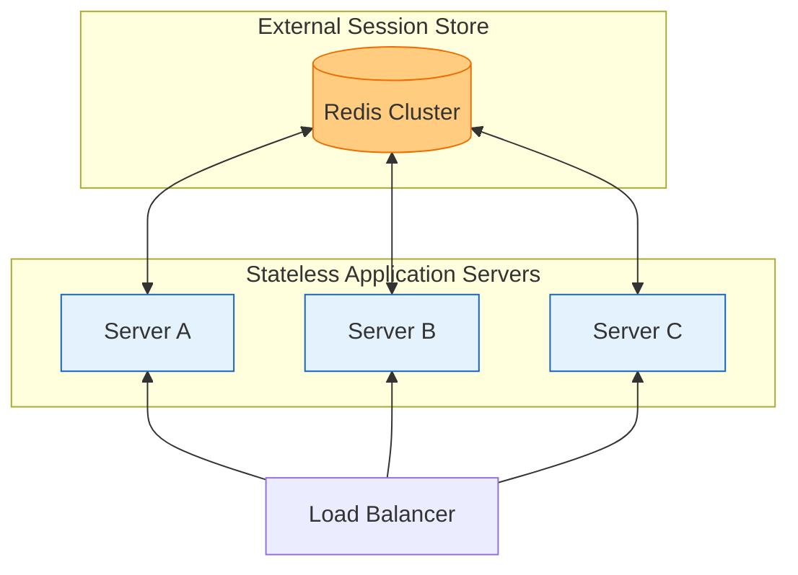
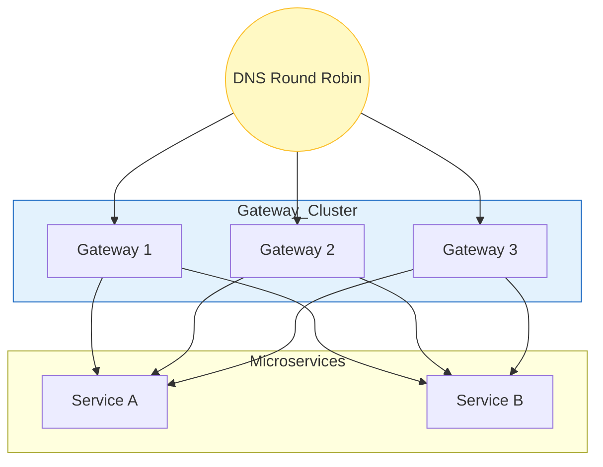

# 🌐 API 통신 패턴: 프로토콜 선택 · 로드밸런싱 · Gateway

> **이 문서를 읽어야 하는 상황**
> - REST vs gRPC 중 뭘 써야 할지 모를 때
> - L4 vs L7 로드밸런서 차이를 알고 싶을 때
> - Sticky Session 문제를 해결하고 싶을 때

---

## ⚠️ 먼저 확인할 전제 (오해 방지)

- **“외부 REST / 내부 gRPC”는 자주 쓰이는 기본값**이지만, 정답은 아닙니다. 조직/인력/관측/배포 환경에 따라 REST만으로도 충분한 경우가 많습니다.
- **gRPC의 부하 분산은 “LB 하나”로 끝나지 않을 수 있습니다.**
  - L7 LB(Envoy/ALB 등)로 해결할 수도 있고,
  - 또는 **클라이언트 사이드 로드밸런싱 + 서비스 디스커버리**(예: Envoy sidecar, xDS, service mesh)로 푸는 패턴도 흔합니다.
- **Sticky Session은 임시방편**인 경우가 많고, 장기적으로는 **Stateless + 외부 상태 저장소(세션/캐시)**로 가는 게 운영이 쉽습니다.

---

## 📌 핵심 요약 (TL;DR)

```
┌─────────────────────────────────────────────────────────────┐
│  프로토콜: 외부는 REST, 내부는 gRPC                         │
│  로드밸런싱: 단순하면 L4, 스마트하면 L7                     │
├─────────────────────────────────────────────────────────────┤
│  • 외부 API    → REST/JSON (호환성 우선)                    │
│  • 내부 MSA    → gRPC (성능 우선)                           │
│  • LB 선택    → URL 라우팅 필요하면 L7, 아니면 L4           │
└─────────────────────────────────────────────────────────────┘
```

---

## 1️⃣ 프로토콜 선택 가이드

### 📊 REST vs gRPC 한눈에 비교

| | REST | gRPC |
|---|:---:|:---:|
| **데이터 포맷** | JSON (텍스트) | Protobuf (바이너리) |
| **속도** | 상대적 느림 | ⚡ 빠름 |
| **페이로드 크기** | 큼 | 작음 (10배 압축) |
| **타입 체크** | 런타임 | 컴파일 타임 ✅ |
| **스트리밍** | 단방향만 | 양방향 지원 ✅ |
| **브라우저** | 완벽 지원 ✅ | gRPC-Web 필요 |
| **디버깅** | curl로 가능 ✅ | 전용 툴 필요 |

---

### ✅ REST를 선택할 때

```
1. 외부 공개 API (Third-party 개발자용)
   └── curl로 테스트 가능, Swagger 문서화 쉬움

2. 웹 브라우저가 직접 호출
   └── CORS, Cookie 처리 표준화

3. CRUD 중심의 단순한 API
   └── GET, POST, PUT, DELETE가 직관적

4. 다양한 클라이언트 (iOS, Android, Web, IoT)
   └── 모든 플랫폼에서 HTTP 지원
```

---

### ✅ gRPC를 선택할 때

```
1. MSA 내부 서비스 간 통신
   └── 바이너리로 네트워크 오버헤드 최소화

2. 실시간/양방향 스트리밍
   └── 채팅, 알림, 실시간 데이터 피드

3. 모바일 앱 (데이터 절약 필요)
   └── 페이로드 10배 작음, 배터리 절약

4. 엄격한 타입 체크 필요
   └── 컴파일 타임에 API 불일치 발견
```

---

### 💡 실무 추천: 하이브리드 패턴

**외부는 REST, 내부는 gRPC**가 가장 많이 쓰이는 패턴이다.

```
외부 클라이언트
      │
      │ REST/JSON
      ▼
┌─────────────┐
│ API Gateway │  ← REST 엔드포인트 노출
└─────────────┘
      │
      │ gRPC (바이너리, 고속)
      ▼
┌─────────────────────────────┐
│  User    Order    Product   │  ← 내부 마이크로서비스
│ Service  Service  Service   │
└─────────────────────────────┘
```

---

## 2️⃣ 로드밸런싱 전략

### 📊 L4 vs L7 한눈에 비교

| | L4 LB | L7 LB |
|---|:---:|:---:|
| **동작 레이어** | TCP/UDP | HTTP |
| **라우팅 기준** | IP + 포트 | URL, 헤더, 쿠키 |
| **속도** | ⚡ 매우 빠름 | 상대적 느림 |
| **URL 기반 분배** | ❌ | ✅ |
| **SSL 종료** | ❌ | ✅ |
| **헤더 수정** | ❌ | ✅ |
| **비용** | 저렴 | 비쌈 |

---

### 💡 L4 LB는 이렇게 동작



---

### 💡 L7 LB는 이렇게 동작



---

### 📋 선택 가이드

```mermaid
flowchart TD
    Start{URL/헤더 기반<br/>라우팅 필요?}
    
    Start -- Yes --> L7[L7 LB]
    Start -- No --> SSL{SSL Termination<br/>필요?}
    
    SSL -- Yes --> L7
    SSL -- No --> gRPC{gRPC 사용?}
    
    gRPC -- Yes --> L7_gRPC[L7 LB<br/>(gRPC-aware)]
    gRPC -- No --> L4[L4 LB ⚡]

    style L7 fill:#e8f5e9,stroke:#2e7d32
    style L7_gRPC fill:#e8f5e9,stroke:#2e7d32
    style L4 fill:#e3f2fd,stroke:#1565c0
```

---

## 3️⃣ 로드밸런싱 알고리즘

### 📋 알고리즘별 특징

| 알고리즘 | 설명 | 사용 시점 |
|----------|------|-----------|
| **Round Robin** | 순차 분배 | 서버 성능 동일할 때 |
| **Least Connections** | 연결 적은 서버로 | 요청 처리 시간 다를 때 |
| **IP Hash** | 같은 IP → 같은 서버 | Sticky Session 필요할 때 |
| **Weighted** | 가중치 기반 분배 | 서버 성능 다를 때 |

```nginx
# Nginx 설정 예시

# 1. Round Robin (기본값)
upstream backend {
    server 10.0.0.1:8080;
    server 10.0.0.2:8080;
}

# 2. Least Connections
upstream backend {
    least_conn;
    server 10.0.0.1:8080;
    server 10.0.0.2:8080;
}

# 3. IP Hash (Sticky Session)
upstream backend {
    ip_hash;
    server 10.0.0.1:8080;
    server 10.0.0.2:8080;
}

# 4. Weighted
upstream backend {
    server 10.0.0.1:8080 weight=5;  # 50%
    server 10.0.0.2:8080 weight=3;  # 30%
    server 10.0.0.3:8080 weight=2;  # 20%
}
```

---

## 4️⃣ Sticky Session 문제와 해결

### 🚨 문제: 세션 불일치

```
요청 1: Client → LB → Server A (장바구니 저장)
요청 2: Client → LB → Server B (장바구니 없음! ❌)
```

---

### 🔧 해결책 1: Sticky Session

```nginx
# IP 기반 (간단하지만 NAT 환경에서 편중)
upstream backend {
    ip_hash;
    server 10.0.0.1:8080;
}

# Cookie 기반 (더 정확)
upstream backend {
    sticky cookie srv_id expires=1h;
    server 10.0.0.1:8080;
}
```

**⚠️ 단점:**
- 부하 불균형 발생 가능
- 서버 죽으면 해당 사용자 세션 전부 유실
- 수평 확장 방해

---

### 🔧 해결책 2: 외부 세션 저장소 (권장 ⭐)

**Stateless 서버 + Redis**가 정답이다.



**장점:**
- 어느 서버로 가도 세션 접근 가능
- 서버 추가/제거 자유로움
- 서버 장애에도 세션 유지

---

## 5️⃣ gRPC 로드밸런싱 주의점

### 🚨 문제: L4 LB + gRPC = 부하 불균형

gRPC는 HTTP/2 기반이라 **하나의 TCP 연결로 모든 요청**을 처리한다.

```
gRPC Client ═══════════════════> Server A (모든 요청!)
              (단일 TCP 연결)
                                 Server B (유휴)
                                 Server C (유휴)

L4 LB는 "연결" 단위로 분산 → 단일 TCP 연결에 요청이 몰리면 한 서버로 쏠릴 수 있음
```

---

### ✅ 해결책: gRPC-aware L7 LB

```
[Client-side Load Balancing]
gRPC Client ─── Request 1 ───> Server A
            ─── Request 2 ───> Server B
            ─── Request 3 ───> Server C

(Client knows all server addresses via Service Discovery)
```

**사용 가능한 L7 LB:**
- Envoy Proxy
- Kong
- AWS ALB (gRPC 지원)
- GCP Cloud Load Balancer

---

### ✅ 대안: 클라이언트 사이드 로드밸런싱(서비스 디스커버리 기반)

L7 LB를 앞단에 두는 대신, **클라이언트(또는 사이드카)가 여러 백엔드를 알고 직접 분산**하는 패턴도 흔합니다.

장점:
- LB를 단일 병목/단일 장애점으로 만들 가능성을 줄임
- gRPC의 연결/스트림 특성과 더 자연스럽게 맞을 때가 많음

단점:
- 서비스 디스커버리/헬스체크/리트라이/타임아웃 정책을 운영해야 함(대개 mesh나 Envoy로 해결)

---

## 6️⃣ API Gateway 패턴

### 💡 API Gateway의 역할

```
┌─────────────────────────────────────┐
│           API Gateway               │
├─────────────────────────────────────┤
│  1. 라우팅 (Path → Service)         │
│  2. 인증/인가 (JWT 검증)            │
│  3. Rate Limiting (DDoS 방어)       │
│  4. 요청/응답 변환                  │
│  5. 로깅 & 모니터링                 │
│  6. 캐싱                            │
│  7. SSL Termination                 │
└─────────────────────────────────────┘
```

---

### ⚠️ 단일 Gateway = SPOF

```
모든 트래픽 ───> Gateway ───> 서비스들
                   ↑
              단일 장애점!
```

---

### ✅ 해결책: Gateway 클러스터



---

## 📋 선택 가이드 요약

### 프로토콜 선택

| 상황 | 선택 |
|------|------|
| 외부 공개 API | REST |
| 내부 MSA 통신 | gRPC |
| 브라우저 직접 호출 | REST |
| 모바일 + 데이터 절약 | gRPC |
| 실시간 양방향 | gRPC Streaming |

### LB 선택

| 상황 | 선택 |
|------|------|
| 단순 분산 | L4 |
| URL 기반 라우팅 | L7 |
| SSL 종료 필요 | L7 |
| gRPC 사용 | L7 (gRPC-aware) |

### 세션 처리

| 상황 | 선택 |
|------|------|
| 일반적인 경우 | Redis 세션 저장소 |
| 간단한 경우 | JWT (Stateless) |
| 레거시 시스템 | Sticky Session |

---

> 💬 **기억할 것**  
> API 설계는 기술 선택이 아니라 **트레이드오프 관리**다.  
> 완벽한 솔루션은 없고, 상황에 맞는 최선의 선택만 있다.

---

**📚 관련 문서:**
- [대규모 시스템 - 타임아웃과 서킷 브레이커](./large-scale-system/README.md)
- [TCP vs UDP - gRPC의 TCP 기반 통신](../02-network/tcp-vs-udp/README.md)
