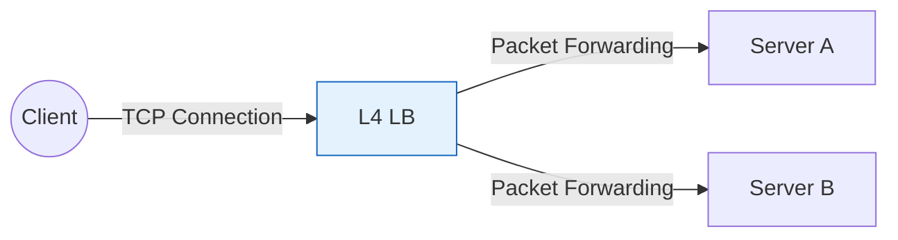
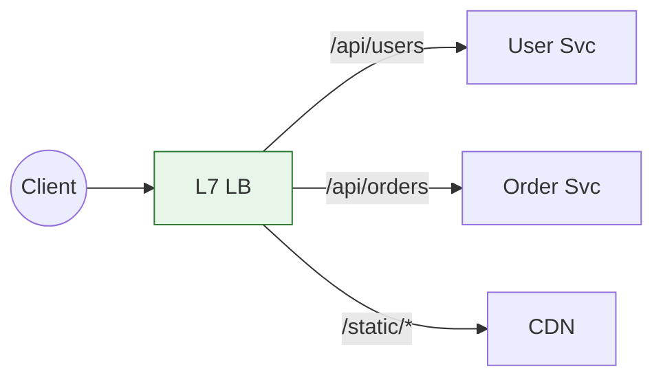
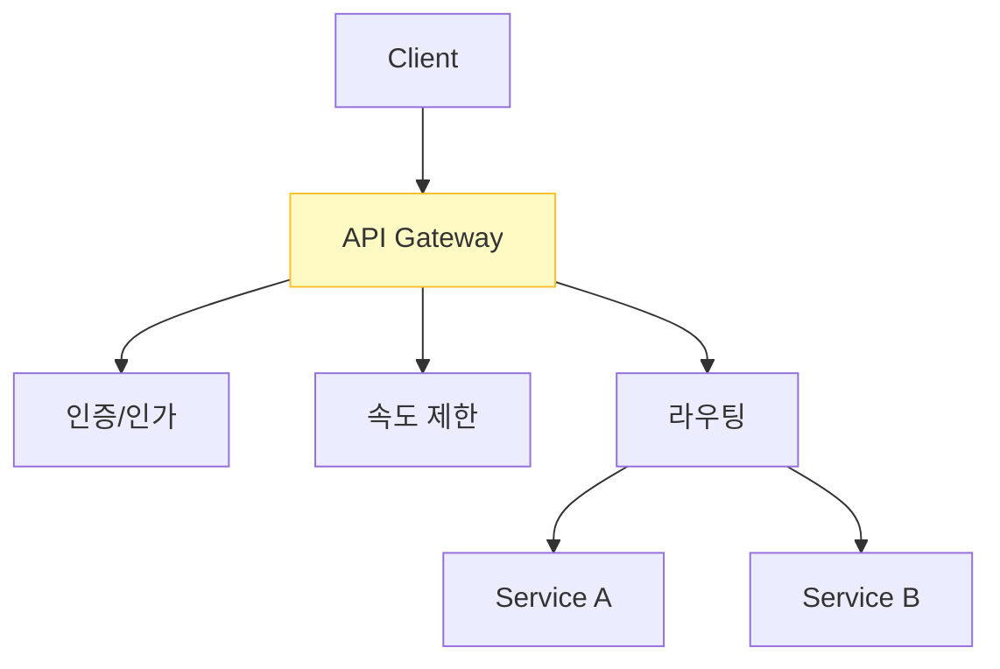
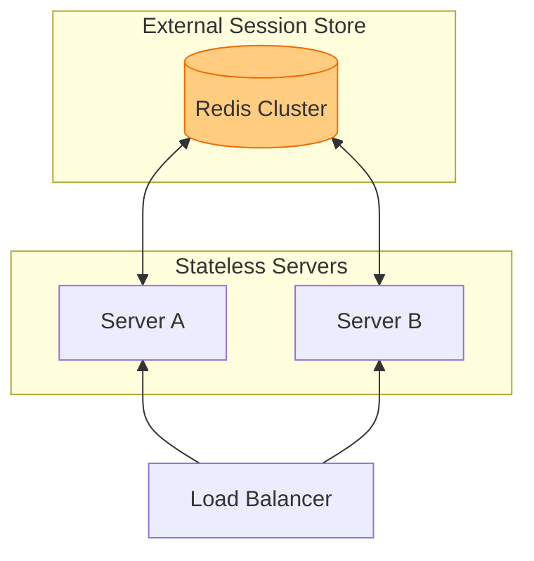

# 🌐 API 통신 패턴: REST vs gRPC와 로드밸런싱 전략

> **이 문서의 목표:** API 통신 프로토콜과 로드밸런싱 전략을 단순 암기가 아니라, **트래픽 분산의 핵심 원리**를 이해하고 실무에서 **상황에 맞는 아키텍처를 설계하는 방법**을 파악한다.

---

## 0. 핵심 질문으로 시작하기

1. **REST와 gRPC 중 무엇을 선택해야 할까?** → 외부 호환성은 REST, 내부 효율성은 gRPC
2. **L4와 L7 로드밸런서의 결정적 차이는?** → IP/Port 기반(빠름) vs URL/Header 기반(똑똑함)
3. **Sticky Session의 문제는 무엇인가?** → 특정 서버 부하 집중 및 유연성 저하 (Redis로 해결 권장)

---

## 1. [개념 정의]: 왜 다양한 통신 패턴이 필요한가? (Why)

서비스의 목적과 환경에 따라 적절한 통신 프로토콜과 트래픽 분산 전략이 다르기 때문이다. 모든 상황에 맞는 만능 해결책은 없으며, 트레이드오프를 이해하고 선택해야 한다.

### 1.1 REST vs gRPC 선택 가이드

| 특징 | REST | gRPC |
|:---:|:---:|:---:|
| **데이터 포맷** | JSON (텍스트) | Protobuf (바이너리) |
| **속도** | 상대적 느림 | ⚡ 빠름 |
| **페이로드 크기** | 큼 | 작음 (10배 압축) |
| **타입 체크** | 런타임 | 컴파일 타임 ✅ |
| **스트리밍** | 단방향만 | 양방향 지원 ✅ |
| **브라우저** | 완벽 지원 ✅ | gRPC-Web 필요 |

> [!NOTE]
> **핵심 통찰:** **외부는 REST, 내부는 gRPC**가 가장 많이 쓰이는 "국룰" 패턴이다. 외부 클라이언트와의 호환성은 REST로 챙기고, 내부 MSA 간의 통신 효율은 gRPC로 극대화한다.

### 1.2 로드밸런싱(Load Balancing)의 필요성

단일 서버로는 늘어나는 트래픽을 감당할 수 없다. 여러 대의 서버에 트래픽을 골고루 분산시켜 **가용성(Availability)**과 **확장성(Scalability)**을 확보해야 한다. 이때 "어떤 기준"으로 나눌 것인가가 L4/L7의 차이이다.

---

## 2. [원리/구조]: 트래픽 분산과 관리의 원리 (How)

### 2.1 L4 vs L7 로드밸런서 동작 원리

| 구분 | L4 LB (Transport Layer) | L7 LB (Application Layer) |
|:---:|:---:|:---:|
| **라우팅 기준** | IP + Port | URL, Header, Cookie |
| **속도** | ⚡ 매우 빠름 | 상대적 느림 (패킷 분석 필요) |
| **기능** | 단순 부하 분산 | URL 기반 라우팅, SSL 종료, 인증 |
| **대표 솔루션** | AWS NLB, LVS | AWS ALB, Nginx, HAProxy |

#### L4 로드밸런서 흐름


#### L7 로드밸런서 흐름


### 2.2 gRPC 로드밸런싱의 특수성

gRPC는 HTTP/2를 기반으로 하며, **하나의 TCP 연결을 오래 유지(Persistent Connection)하고 그 안에서 여러 요청(Multiplexing)을 처리**한다.

> [!WARNING]
> **주의:** L4 LB는 "연결(Connection)" 단위로 부하를 분산한다. gRPC 클라이언트가 한 번 연결을 맺으면, 이후 모든 요청이 그 연결을 통해 **하나의 서버로만** 쏠리게 된다.

**해결책:**
1. **gRPC-aware L7 LB 사용:** Envoy, AWS ALB 등은 HTTP/2 프레임을 이해하고 요청 단위로 분산 가능.
2. **Client-side LB:** 클라이언트가 서비스 디스커버리를 통해 서버 목록을 알고 직접 분산 (복잡도 증가).

### 2.3 API Gateway 패턴

마이크로서비스의 단일 진입점(Entry Point) 역할을 한다.



---

## 3. [실전/구현]: 설정 예시와 문제 해결 (What)

### 3.1 Nginx 로드밸런싱 설정 예시

```nginx
# 1. Round Robin (기본값)
upstream backend {
    server 10.0.0.1:8080;
    server 10.0.0.2:8080;
}

# 2. Least Connections (연결 적은 곳으로)
upstream backend_least {
    least_conn;
    server 10.0.0.1:8080;
    server 10.0.0.2:8080;
}

# 3. IP Hash (Sticky Session - 비추천)
upstream backend_ip {
    ip_hash;
    server 10.0.0.1:8080;
}
```

### 3.2 Sticky Session 문제와 해결 (Redis)

Sticky Session(특정 사용자를 항상 같은 서버로 보냄)은 서버 확장을 어렵게 만든다. **Stateless 서버 + 외부 세션 저장소(Redis)** 패턴이 정석이다.



> [!TIP]
> **장점:** 서버가 죽었다 살아나거나, 오토스케일링으로 서버가 늘어나도 사용자의 로그인 상태(세션)는 유지된다.

---

## 4. 🎯 1분 요약

1. **프로토콜**: 외부는 호환성이 좋은 **REST**, 내부는 효율적인 **gRPC**를 주로 사용한다.
2. **로드밸런서**: 단순 트래픽 분산은 **L4**, URL 라우팅이나 SSL 처리는 **L7**을 사용한다.
3. **세션 처리**: Sticky Session보다는 **Redis 같은 외부 저장소**를 사용하여 서버를 Stateless하게 만드는 것이 좋다.

---

## 5. 📝 자가 점검 질문

1. **L4와 L7 로드밸런서의 가장 큰 차이점은 무엇인가?**
   → L4는 IP/Port 기준, L7은 URL/Header/Cookie 내용 기준.
2. **gRPC 사용 시 일반적인 L4 로드밸런서에서 발생하는 문제는?**
   → 단일 TCP 연결 유지로 인해 트래픽이 한 서버에 쏠림. (L7이나 Client-side LB 필요)
3. **Sticky Session의 단점과 이를 해결하는 아키텍처는?**
   → 특정 서버 부하 집중 및 확장성 저하. Stateless 서버 + Redis 세션 저장소로 해결.
