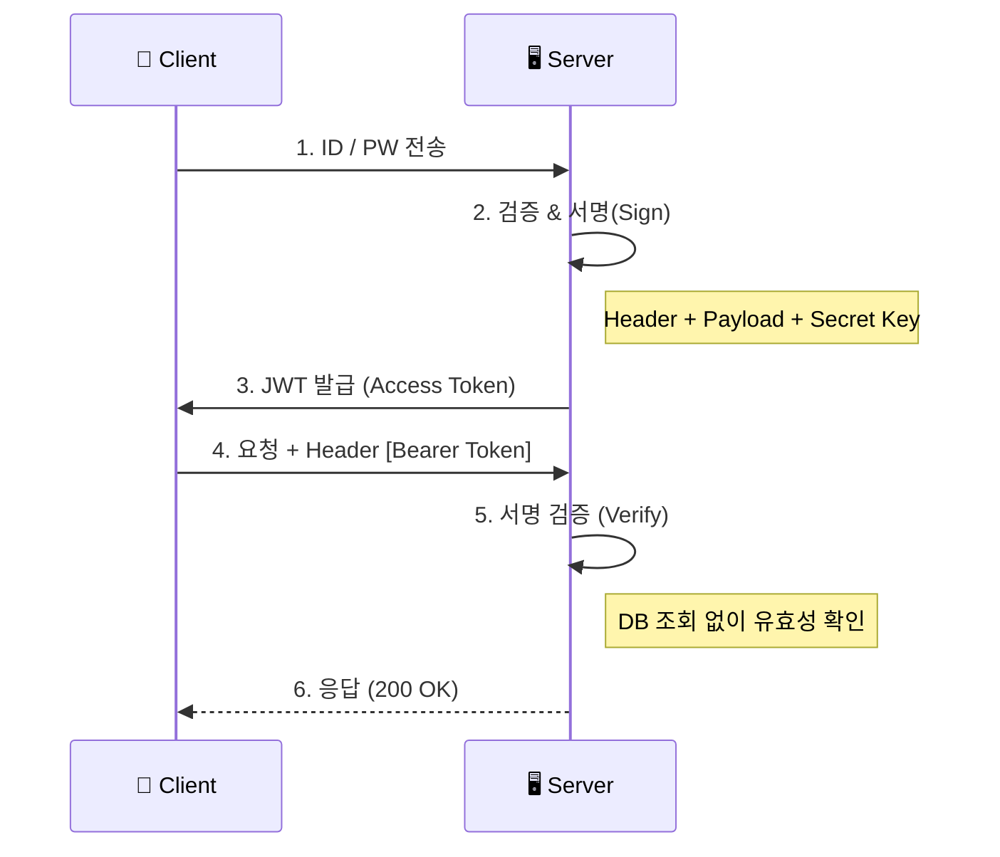
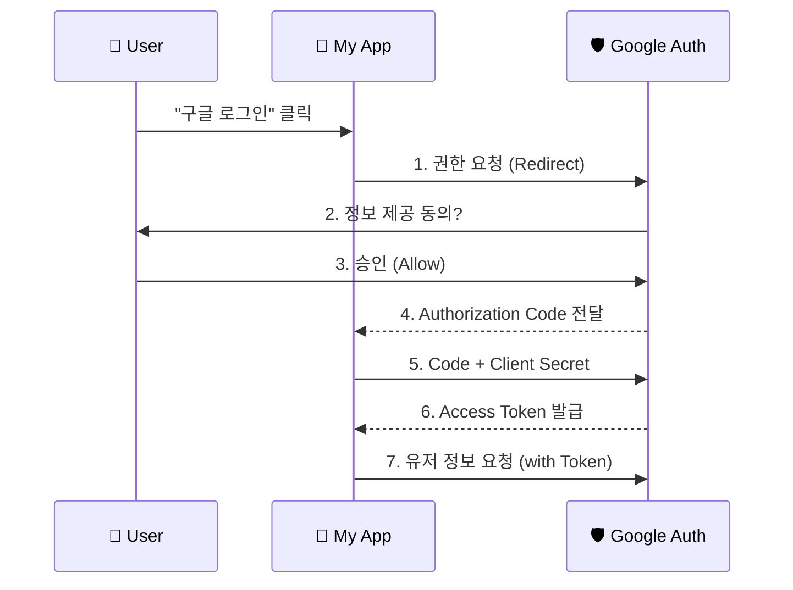

# 🔐 인증/인가 완벽 이해: 보안의 본질

> **이 문서의 목표:** 인증 시스템을 단순 구현이 아니라, **왜 이렇게 설계하는지**, **어떤 공격을 막는지** 보안 관점에서 이해하고 안전한 시스템을 구축한다.

---

## 0. 핵심 질문으로 시작하기

1. **인증(AuthN)과 인가(AuthZ)의 차이는?** → 신원 확인(Who) vs 권한 확인(What)
2. **Session vs JWT의 본질적 차이는?** → 서버 상태(Stateful) vs 클라이언트 상태(Stateless)
3. **왜 Access Token을 짧게 만드는가?** → 탈취 시 피해 최소화 (Refresh Token으로 보완)
4. **OAuth가 해결하는 문제는?** → 비밀번호 공유 없이 안전한 권한 위임

---

## 1. [개념 정의]: 인증과 인가의 본질 (Why)

보안의 가장 기초가 되는 두 가지 개념을 명확히 구분해야 한다.

### 1.1 인증 vs 인가 비교

| 구분 | 영어 (Abbr.) | 질문 | 비유 | 예시 |
|:---:|:---:|:---:|:---:|:---:|
| **인증** | **AuthN** (Authentication) | **Who are you?** | 입국 심사 (여권) | 로그인, 지문 인식 |
| **인가** | **AuthZ** (Authorization) | **What can you do?** | 탑승권 (좌석 등급) | 관리자 페이지 접근, 글쓰기 권한 |

### 1.2 Session vs JWT 트레이드오프

| 특징 | Session | JWT (JSON Web Token) |
|:---:|:---:|:---:|
| **상태 저장 위치** | 서버 메모리/DB | 클라이언트 (토큰 자체) |
| **확장성** | 낮음 (Redis 필요) | 높음 (Stateless) |
| **제어력** | 높음 (즉시 강제 로그아웃 가능) | 낮음 (만료될 때까지 유효) |
| **데이터 크기** | 작음 (Session ID만) | 큼 (Payload 포함) |

> [!NOTE]
> **선택 기준:** 높은 보안과 제어가 필요하면(예: 금융, 넷플릭스) **Session**, 마이크로서비스나 모바일 환경이라 확장성이 중요하면 **JWT**를 선택한다.

---

## 2. [원리/구조]: 인증 흐름과 동작 원리 (How)

### 2.1 JWT 인증 흐름 (Stateless)



### 2.2 OAuth 2.0 동작 원리 (Google Login)

내 서비스가 사용자의 구글 비밀번호를 알지 못해도, 구글의 사용자 정보에 접근할 수 있게 해주는 프레임워크다.



---

## 3. [실전/구현]: 코드로 보는 보안 적용 (What)

### 3.1 Python JWT 생성 및 검증 예시

```python
import jwt
import datetime

SECRET_KEY = "my_super_secret_key"

# 1. 토큰 생성 (로그인 성공 시)
def create_access_token(user_id: str):
    payload = {
        "sub": user_id,
        "role": "admin",
        # [중요] 만료 시간은 짧게 (예: 30분)
        "exp": datetime.datetime.utcnow() + datetime.timedelta(minutes=30)
    }
    return jwt.encode(payload, SECRET_KEY, algorithm="HS256")

# 2. 토큰 검증 (API 요청 시)
def verify_token(token: str):
    try:
        payload = jwt.decode(token, SECRET_KEY, algorithms=["HS256"])
        return payload["sub"]
    except jwt.ExpiredSignatureError:
        raise Exception("토큰 만료! Refresh Token으로 갱신하세요.")
    except jwt.InvalidTokenError:
        raise Exception("유효하지 않은 토큰입니다.")
```

### 3.2 보안 강화 전략 (Pro Tip)

> [!WARNING]
> **Access Token 저장소:** LocalStorage는 XSS 공격에 취약하다. **Refresh Token은 HttpOnly Cookie**에 저장하고, Access Token은 메모리 변수에 담아 사용하는 것이 가장 안전한 프론트엔드 패턴이다.

**Refresh Token 전략:**
1. **Access Token**: 유효기간 30분. 탈취돼도 금방 만료됨.
2. **Refresh Token**: 유효기간 2주. DB에 저장. Access Token 만료 시 서버에 보내 새 토큰 발급 요청.
3. **로그아웃**: DB에서 Refresh Token 삭제 → 재발급 불가.

---

## 4. 🎯 1분 요약

1. **인증 vs 인가**: "누구냐" 확인하는 것과 "권한"을 확인하는 것은 다르다.
2. **Session vs JWT**: 보안과 제어가 중요하면 Session, 확장성이 중요하면 JWT.
3. **OAuth**: 비밀번호 공유 없이 안전하게 권한을 위임받는 표준 프로토콜.

---

## 5. 📝 자가 점검 질문

1. **JWT의 Payload에 비밀번호를 넣으면 안 되는 이유는?**
   → Base64로 인코딩만 되어 있어 누구나 디코딩해서 볼 수 있기 때문.
2. **Refresh Token을 사용하는 근본적인 이유는?**
   → Access Token의 유효기간을 짧게 줄여 탈취 피해를 최소화하면서도, 사용자의 로그인 편의성(지속성)을 유지하기 위함.
3. **OAuth 인증 과정에서 Authorization Code가 필요한 이유는?**
   → Access Token을 브라우저(Front)에 바로 노출하지 않고, 서버(Back)끼리 안전하게 교환하기 위함.
