# 🔐 인증/인가 완벽 이해: 보안의 본질

> **이 문서의 목표:** 인증 시스템을 단순 구현이 아니라, **왜 이렇게 설계하는지**, **어떤 공격을 막는지** 보안 관점에서 이해한다.

---

## 0. 핵심 질문으로 시작하기

1. **인증(AuthN)과 인가(AuthZ)의 차이는?** → 신원 확인 vs 권한 확인
2. **Session vs JWT의 본질적 차이는?** → 서버 상태 vs 클라이언트 상태
3. **왜 토큰을 짧게 만드는가?** → 탈취 피해 최소화
4. **OAuth가 해결하는 문제는?** → 비밀번호 공유 없이 권한 위임

---

## 1. 인증의 본질: 무엇을 증명하는가?

### 1.1 인증(Authentication)의 원리

```
[질문] "너 누구야?"

[증명 방법]
1. 지식 기반: 너만 아는 것 (비밀번호)
2. 소유 기반: 너만 가진 것 (휴대폰, OTP)
3. 존재 기반: 너 자체 (지문, 얼굴)

[MFA: Multi-Factor Authentication]
2가지 이상 조합 → 보안 강화
예: 비밀번호 + SMS 코드
```

### 1.2 인가(Authorization)의 원리

```
[질문] "너 이거 해도 돼?"

인증 완료 후, 권한 확인:
- 이 사용자가 관리자 페이지에 접근할 수 있나?
- 이 사용자가 이 게시글을 삭제할 수 있나?

[권한 모델]
RBAC (Role-Based): 역할 기반 (admin, user)
ABAC (Attribute-Based): 속성 기반 (소유자, 부서)
```

---

## 2. Session vs JWT: 상태의 위치

### 2.1 Session의 원리

```mermaid
flowchart TB
    subgraph Session_Flow [Session 인증 방식]
        direction TB
        User[Client] -- "1. Login" --> Server
        Server -- "2. Create Session\nSave to Memory" --> DB[(Session DB)]
        Server -- "3. Set-Cookie: JSESSIONID=abc" --> User
        User -- "4. Request + Cookie: abc" --> Server
        Server -- "5. Lookup Session ID" --> DB
    end

    style Session_Flow fill:#e3f2fd,stroke:#1565c0
    style DB fill:#fff9c4,stroke:#fbc02d
```



### 2.2 JWT의 원리

```mermaid
flowchart TB
    subgraph JWT_Flow [JWT 인증 방식]
        direction TB
        User[Client] -- "1. Login" --> Server
        Server -- "2. Create JWT (Sign with Secret)" --> Server
        Server -- "3. Return Token" --> User
        User -- "4. Request + Header: Bearer Token" --> Server
        Server -- "5. Verify Signature (No DB access)" --> Server
    end

    style JWT_Flow fill:#e8f5e9,stroke:#2e7d32
```



### 2.3 핵심 트레이드오프

```
제어력 ←────────────────────────────→ 확장성
Session                                JWT

[Session 선택]
- 즉시 로그아웃 필요
- 보안 요구사항 높음
- 단일 서버 또는 세션 저장소 있음

[JWT 선택]
- 마이크로서비스 아키텍처
- 모바일 앱
- 서버 무상태 필요
```

---

## 🚨 실제 인증 문제들

### 개발자들이 흔히 마주치는 고민:

**"세션 만료돼서 로그아웃됐어!"**
- 사용자가 타이핑 중인데 갑자기 로그인 페이지로 튕김
- 세션 타임아웃이 너무 짧거나 길어서 불편
- 서버 재시작할 때 모든 세션 날아감

**"JWT 토큰이 너무 길어서 느려!"**
- HTTP 헤더가 4KB 넘어서 요청이 실패
- 모바일 네트워크에서 토큰 전송 비용 증가
- 쿠키 저장 한계 때문에 일부 브라우저에서 문제

**"OAuth 로그인했는데 권한이 이상해!"**
- 구글 로그인했는데 우리 서비스 권한이 안 생김
- 토큰 만료돼서 API 호출이 계속 실패
- 여러 서비스 로그인할 때 토큰 관리가 복잡

## 🎯 1분 요약: 인증 vs 인가

**인증 = "너 누구야?", 인가 = "너 뭐 할 수 있어?"**

- **Session**: 서버가 기억하는 전통적 방식 (안전하지만 확장 어려움)
- **JWT**: 클라이언트가 들고 다니는 토큰 방식 (확장 쉽지만 취약)
- **OAuth**: 다른 서비스의 신뢰를 빌리는 방식

> **결론:**
> 1. **단순 웹앱**: Session으로 충분
> 2. **마이크로서비스/모바일**: JWT 필수
> 3. **소셜 로그인**: OAuth 2.0 표준 사용
> 
> 

---

## 2. 개념 비교: 인증 vs 인가

| 구분 | 영어 (Abbr.) | 질문 | 비유 | 예시 |
| --- | --- | --- | --- | --- |
| **인증** | **AuthN** (Authentication) | **Who are you?** (너 누구니?) | 입국 심사 (여권 확인) | 로그인(ID/PW), 지문 인식 |
| **인가** | **AuthZ** (Authorization) | **What can you do?** (뭐 할 수 있니?) | 탑승권 확인 (이코노미/비즈니스) | '관리자 페이지' 접근 권한, '글쓰기' 권한 |

---

## 3. Session vs JWT: 실제 선택 기준

**💡 서비스별 선택 사례:**

| 서비스 | 선택 방식 | 이유 |
|--------|-----------|------|
| **넷플릭스** | Session + Redis | 사용자 많고, 서버 확장 필요 |
| **스포티파이** | JWT | 모바일 앱 위주, 확장성 우선 |
| **페이스북** | Custom Token | 자체 생태계, 복잡한 권한 |

**🚨 실제 문제 사례:**

**문제 1: 세션 공유로 인한 확장 어려움**
```java
// ❌ 서버 1대에서만 세션 유지
@RequestMapping("/dashboard")
public String dashboard(HttpSession session) {
    User user = (User) session.getAttribute("user");
    // 서버 2대로 확장 시 세션 공유 문제!
}
```

```java
// ✅ Redis로 세션 공유
@Configuration
public class RedisSessionConfig {
    @Bean
    public RedisConnectionFactory connectionFactory() {
        return new JedisConnectionFactory();
    }
}
// 이제 모든 서버가 같은 세션 공유
```

**문제 2: JWT 토큰 탈취로 인한 보안 취약**
```javascript
// ❌ 로컬 스토리지에 JWT 저장 (취약!)
localStorage.setItem('token', jwtToken);

// 해커가 XSS로 토큰 탈취 가능
const stolenToken = localStorage.getItem('token');
```

```javascript
// ✅ HttpOnly 쿠키에 저장 (안전!)
res.cookie('token', jwtToken, {
    httpOnly: true,  // JS 접근 불가
    secure: true,    // HTTPS만
    sameSite: 'strict'  // CSRF 방지
});
```

**문제 3: 토큰 만료 처리 복잡**
```javascript
// ❌ 토큰 만료 시 사용자 혼란
fetch('/api/data', {
    headers: { 'Authorization': expiredToken }
})
.then(res => {
    if (res.status === 401) {
        // 갑자기 로그인 페이지로 튕김!
        window.location = '/login';
    }
});
```

```javascript
// ✅ 자동 토큰 갱신
const apiCall = async (url) => {
    let token = getToken();
    const res = await fetch(url, {
        headers: { 'Authorization': token }
    });

    if (res.status === 401) {
        // 자동으로 새 토큰 발급
        token = await refreshToken();
        // 재시도
        return fetch(url, {
            headers: { 'Authorization': token }
        });
    }
    return res;
};
```

---

## 4. JWT (JSON Web Token) 구조

JWT는 `.`을 구분자로 하여 세 부분으로 나뉜다. `aaaaa.bbbbb.ccccc`

1. **Header:** 토큰의 타입(JWT)과 암호화 알고리즘(HS256 등).
2. **Payload (내용):** 실제 데이터(Claim). `User ID`, `유효기간(exp)`, `권한(role)` 등이 들어간다.
* **⚠️ 경고:** 여기는 **암호화되지 않고 Base64로 인코딩**만 된 것이다. 즉, **누구나 내용을 볼 수 있다.** 비밀번호나 민감 정보를 절대 넣으면 안 된다.


3. **Signature (서명):** Header + Payload + **서버만의 비밀키(Secret Key)**를 조합해 만든 서명. 위변조를 검증하는 핵심.

### 4.1 JWT 인증 흐름도 (Mermaid)

```mermaid
sequenceDiagram
    participant User as 👤 Client
    participant Server as 🖥️ Server
    participant DB as 🗄️ Database

    Note over User, Server: 1. 인증 (Authentication)
    User->>Server: ID / PW 전송
    Server->>DB: 사용자 확인
    DB-->>Server: OK
    Server->>Server: 🔑 Secret Key로 서명 (Sign)
    Note right of Server: Header + Payload + Signature
    Server->>User: JWT 발급 (Access Token)

    Note over User, Server: 2. 인가 (Authorization)
    User->>Server: API 요청 + [Header: Bearer JWT]
    
    Server->>Server: 🔓 서명 검증 (Verify)
    Note right of Server: DB 조회 없이 유효성 확인 가능
    
    alt 유효한 토큰
        Server->>User: 200 OK (Data)
    else 조작되거나 만료됨
        Server->>User: 401 Unauthorized
    end
```



---

## 5. OAuth 2.0: "구글로 로그인"의 정체

내 서비스가 사용자의 구글 비밀번호를 받지 않고도, 구글의 사용자 정보에 접근할 수 있게 해주는 **인가 프레임워크**다.

### 5.1 핵심 참여자

1. **Resource Owner:** 사용자 (나)
2. **Client:** 내 서비스 (웹/앱)
3. **Authorization Server:** 구글 로그인 서버
4. **Resource Server:** 구글 API 서버 (유저 정보, 캘린더 등)

### 5.2 작동 원리 (Authorization Code Grant)

가장 표준적인 방식이다.

```mermaid
sequenceDiagram
    participant User as 👤 Resource Owner
    participant Client as 📱 Client App
    participant Auth as 🛡️ Google Auth Server
    participant API as ☁️ Google Resource Server

    User->>Client: "구글로 로그인" 클릭
    Client->>Auth: 1. 권한 요청 (Redirect to Google)
    Auth->>User: 2. 로그인 및 정보제공 동의 화면
    User->>Auth: 3. 승인 (Allow)
    Auth-->>Client: 4. Authorization Code 전달 (Callback)
    
    Client->>Auth: 5. Code + Client Secret 전송
    Auth->>Auth: Code 검증
    Auth-->>Client: 6. Access Token 발급
    
    Client->>API: 7. API 요청 (with Access Token)
    API-->>Client: 8. 유저 정보 응답
```



---

## 6. Production-Ready Code Example (Python)

JWT를 생성하고 검증하는 로직이다. `PyJWT` 라이브러리를 사용한다.

```python
import jwt
import datetime

SECRET_KEY = "my_super_secret_key_never_share"

# 1. 토큰 생성 (로그인 성공 시)
def create_access_token(user_id: str):
    payload = {
        "sub": user_id,  # Subject (유저 식별자)
        "role": "admin",
        # [중요] 만료 시간 설정 필수 (짧게 가져가는 것이 좋음, 예: 30분)
        "exp": datetime.datetime.utcnow() + datetime.timedelta(minutes=30)
    }
    # HS256 알고리즘으로 서명
    token = jwt.encode(payload, SECRET_KEY, algorithm="HS256")
    return token

# 2. 토큰 검증 (API 요청 시)
def verify_token(token: str):
    try:
        # 서명이 맞는지, 만료되지 않았는지 확인
        payload = jwt.decode(token, SECRET_KEY, algorithms=["HS256"])
        return payload["sub"] # User ID 반환
    except jwt.ExpiredSignatureError:
        raise Exception("토큰이 만료되었습니다. 다시 로그인하세요.")
    except jwt.InvalidTokenError:
        raise Exception("유효하지 않은 토큰입니다.")

# Test
jwt_token = create_access_token("user_123")
print(f"Generated JWT: {jwt_token}")

```

---

## 7. 전문가적 조언 (Pro Tip)

### 7.1 Access Token & Refresh Token 전략

JWT의 단점(탈취 시 답 없음)을 보완하는 표준 전략이다.

* **Access Token:** 유효기간을 **30분 이내**로 짧게 설정. 탈취당해도 피해를 최소화.
* **Refresh Token:** 유효기간을 **2주~1달**로 길게 설정. DB나 Redis에 저장.
* **Flow:** Access Token이 만료되면(401 에러), 클라이언트는 Refresh Token을 서버로 보내 "새 Access Token 줘"라고 요청한다. 이때 서버는 Refresh Token이 유효한지 DB에서 확인 후 재발급한다. (로그아웃 시 DB의 Refresh Token을 지우면 된다.)

### 7.2 어디에 저장해야 하는가? (XSS vs CSRF)

프론트엔드 개발자의 영원한 난제다.

* **LocalStorage:** 자바스크립트로 접근 가능. 해커가 스크립트를 심으면(XSS) 토큰을 바로 훔쳐갈 수 있다. (편리하지만 위험)
* **HttpOnly Cookie:** 자바스크립트로 접근 불가. XSS 방어에 유리하다. 하지만 CSRF 공격(내 의지와 상관없이 요청이 날아감)에 취약하다.
* **권장:** **Refresh Token은 HttpOnly Cookie**에 저장하고, CSRF 토큰 방식이나 SameSite 쿠키 설정을 통해 방어하는 것이 보안상 가장 안전하다.
