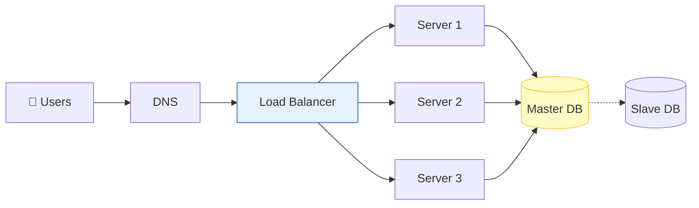
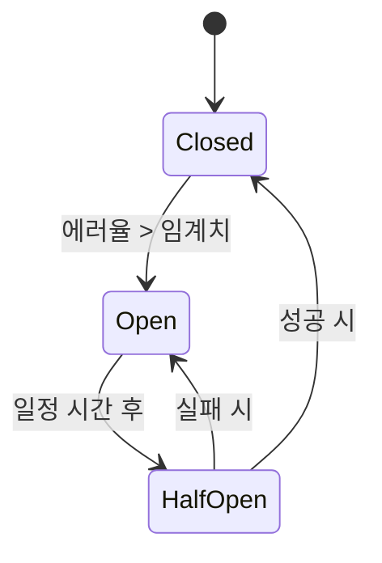

# 🚀 대규모 시스템 설계: 1억 사용자를 위한 아키텍처

> **이 문서의 목표:** 대규모 트래픽을 처리하기 위한 **확장성(Scalability)**, **가용성(Availability)**, **성능(Performance)**의 핵심 원리를 이해하고, 장애에 강한 시스템을 설계한다.

---

## 0. 핵심 질문으로 시작하기

1. **Scale-up(수직)과 Scale-out(수평) 중 언제 무엇을 선택해야 하는가?** → 한계 비용 도달 시 Scale-out 필수
2. **SPOF(단일 장애점)는 어떻게 제거하는가?** → 모든 컴포넌트의 다중화(Redundancy)
3. **DB 병목은 어떻게 해결하는가?** → 샤딩, 레플리케이션, 캐싱의 적절한 조합

---

## 1. [개념 정의]: 대규모 시스템의 과제 (Why)

사용자가 늘어나면 단순한 서버 한 대로는 버틸 수 없다. 대규모 시스템 설계의 목표는 **트래픽이 폭증하거나 일부 서버가 고장 나도 서비스가 죽지 않도록(SPOF 제거)** 만드는 것이다.

### 1.1 핵심 3요소
1. **확장성 (Scalability)**: 트래픽 증가에 맞춰 리소스를 늘릴 수 있는가?
2. **가용성 (Availability)**: 장애가 발생해도 서비스가 계속 동작하는가? (99.99% uptime)
3. **성능 (Performance)**: 빠른 응답 속도를 유지하는가?

---

## 2. [원리/구조]: 확장성과 고가용성 설계 (How)

### 2.1 수평 확장(Scale-out) 아키텍처



> [!NOTE]
> **핵심 원리:** 상태(Session 등)를 서버에 저장하지 않는 **Stateless 아키텍처**여야만 수평 확장이 자유롭다.

### 2.2 데이터베이스 분산 전략

1. **Replication (복제):**
   - **Master:** 쓰기(Write) 전용
   - **Slave:** 읽기(Read) 전용. 대부분의 트래픽은 읽기이므로 부하 분산 효과 큼.
2. **Sharding (샤딩):**
   - 데이터를 기준(User ID 등)에 따라 여러 DB에 쪼개서 저장.
   - 복잡도가 매우 높으므로 최후의 수단으로 고려.

### 2.3 캐싱 전략 (Caching)

DB 부하를 줄이는 가장 효과적인 방법.

```mermaid
graph BT
    DB[Disk DB]
    Redis[Global Cache (Redis)]
    Local[Local Cache]
    CDN[CDN (Edge)]
    
    DB --> Redis
    Redis --> Local
    Local --> CDN
```

---

## 3. [실전/구현]: 장애 격리와 최적화 (What)

### 3.1 장애 격리 패턴 (Resilience Patterns)

한 서비스의 장애가 전체로 전파되는 것(Cascading Failure)을 막아야 한다.

| 패턴 | 설명 | 적용 예시 |
|:---:|:---|:---|
| **Circuit Breaker** | 장애 발생 시 즉시 차단하여 대기 시간 제거 | 외부 API 호출 시 |
| **Bulkhead (격벽)** | 리소스(스레드 풀)를 분리하여 영향 격리 | 주문/결제 스레드 분리 |
| **Retry & Backoff** | 일시적 오류 재시도 (점진적 대기) | 네트워크 타임아웃 |

### 3.2 서킷 브레이커 상태도



### 3.3 성능 최적화: 비동기 처리

오래 걸리는 작업(이메일 발송, 결제 처리)은 **메시지 큐(Kafka, RabbitMQ)**를 이용해 비동기로 처리한다.

```python
# 비동기 처리 예시 (Pseudo Code)
def order_process(order):
    # 1. DB 저장 (필수, 동기)
    db.save(order)
    
    # 2. 알림 발송 (부가, 비동기)
    # 기다리지 않고 큐에 넣고 바로 리턴
    message_queue.push("send_email", order.user_email)
    
    return "Order Success"
```

---

## 4. 🎯 1분 요약

1. **확장성**: 서버는 **Stateless**하게 만들고 **Scale-out**으로 대응한다.
2. **데이터**: **캐싱**을 적극 활용하고, **Replication**으로 읽기 부하를 분산한다.
3. **장애 대응**: **SPOF**를 없애고, **서킷 브레이커**로 장애 전파를 차단한다.

---

## 5. 📝 자가 점검 질문

1. **CAP 이론에서 대규모 분산 시스템이 주로 선택하는 속성 두 가지는?**
   → CP(일관성) 또는 AP(가용성). 보통 인터넷 서비스는 AP를 택하고 결과적 일관성(Eventual Consistency)을 추구한다.
2. **Cache-aside (Lazy Loading) 전략이란?**
   → 데이터를 찾을 때 캐시에 없으면 DB에서 가져와 캐시에 저장하는 방식. 가장 일반적이다.
3. **서킷 브레이커가 필요한 이유는?**
   → 장애가 난 서비스에 계속 요청을 보내 전체 시스템의 리소스가 고갈되는 것을 막기 위해.
