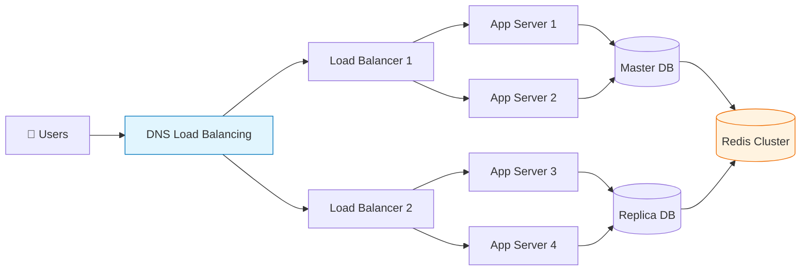
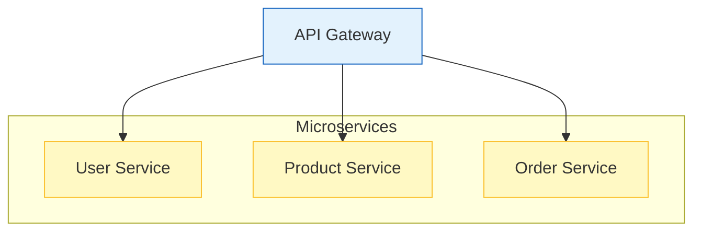
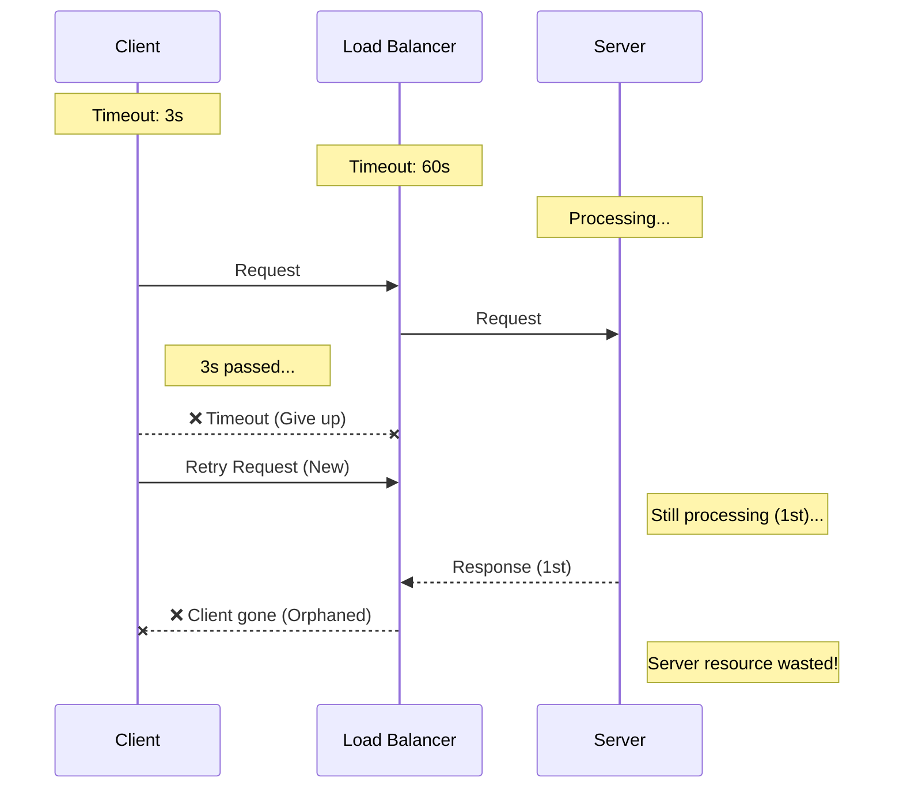

# 🚀 대규모 시스템 설계: 1억 사용자를 위한 아키텍처

## 💥 실제 대규모 서비스 고민들

### 서비스 확장 시 흔히 하는 고민:

**"트래픽이 폭증하는데 시스템이 버티질 않아!"**
- 이벤트 때 서버가 터져서 서비스 다운
- 갑자기 유명해져서 트래픽 10배 증가
- 해외 사용자 늘어나면서 글로벌 확장 필요

**"서버 하나 죽었는데 전체 서비스가 마비됐어!"**
- SPOF(Single Point of Failure)로 인한 장애
- 데이터센터 화재로 서비스 중단
- DDoS 공격으로 서비스 마비

**"응답이 너무 느려서 사용자가 이탈해!"**
- API 응답 시간이 5초 넘음
- 이미지 로딩이 느려서 이탈률 증가
- 모바일에서 특히 느림

## 🎯 1분 요약: 대규모 시스템의 핵심

**대규모 시스템 = SPOF 제거 + 수평 확장 + 장애 자동 복구**

- **수직 확장**: 서버 성능 높이기 (한계 있음)
- **수평 확장**: 서버 대수 늘리기 (무한 확장 가능)
- **내결함성**: 하나의 장애가 전체에 영향 미치지 않음

> **결론:**
> 1. **확장성**: 로드밸런서 + 마이크로서비스로 트래픽 분산
> 2. **가용성**: 다중화 + 자동 복구로 99.9% uptime
> 3. **성능**: 캐시 + CDN + 최적화로 응답 시간 최소화

---

## 2. 확장성 전략: 실제 적용 사례

**💡 서비스별 확장 전략:**

| 서비스 | 확장 전략 | 트래픽 규모 | 핵심 기술 |
|--------|-----------|-------------|----------|
| **넷플릭스** | 수평 확장 | 2억+ 사용자 | 마이크로서비스 + Kubernetes |
| **페이스북** | 수평 확장 | 30억+ 사용자 | PHP + 수평 샤딩 |
| **에어비앤비** | 수평 확장 | 1억+ 숙소 | 마이크로서비스 + 이벤트 기반 |

**🚨 실제 문제 사례:**

**문제 1: 수직 확장의 한계**
```bash
# ❌ AWS에서 점점 큰 인스턴스로 업그레이드
t2.micro → t2.small → t2.medium → c5.large → c5.2xlarge
# 비용 증가 + 결국 한계 도달
```

```bash
# ✅ 수평 확장으로 해결
# Load Balancer 뒤에 여러 작은 인스턴스
# 트래픽 증가 시 인스턴스 개수만 늘림
# 비용 효율적 + 무한 확장 가능
```

**문제 2: 데이터베이스 병목**
```sql
-- ❌ 단일 데이터베이스로 모든 요청 처리
-- 읽기/쓰기 모두 한 곳으로 집중
SELECT * FROM users WHERE id = 123;  -- 느림
INSERT INTO orders (id, user_id, total_amount, created_at)
VALUES (98765, 123, 19900, NOW());  -- 더 느림
```

```sql
-- ✅ 데이터베이스 레이어 분리
-- Master: 쓰기 전용
-- Slaves: 읽기 전용 (복제)
-- Redis: 캐시 레이어
```

**문제 3: 캐시 전략 실패**
```java
// ❌ 모든 데이터를 캐시하려다 메모리 부족
@Cacheable("allUsers")
public List<User> getAllUsers() {
    return userRepository.findAll();  // 100만개 유저 데이터 캐시?
}
```

```java
// ✅ Hot 데이터만 캐시
@Cacheable("user")
public User getUserById(@CacheKey Long id) {
    return userRepository.findById(id);  // 자주 조회되는 데이터만
}

// LRU 캐시 + 적절한 TTL 설정
```

### 2.2 수평 확장 아키텍처



### 2.3 로드 밸런싱 전략

**L4 vs L7 로드 밸런싱:**
* **L4 (Transport Layer):** IP/포트 기반 분산, 빠르고 단순
* **L7 (Application Layer):** HTTP 헤더 기반 분산, 지능적 라우팅 가능

**알고리즘:**
* **Round Robin:** 순차적 분배
* **Least Connections:** 연결 적은 서버 우선
* **IP Hash:** 같은 IP는 같은 서버로 (세션 유지)

---

## 3. 고가용성(High Availability) 설계

시스템이 장애가 발생해도 계속 동작하도록 하는 설계 원칙이다.

### 3.1 다중화(Multiplication)의 원칙

**서버 다중화:**
```mermaid
graph TD
    LB[Load Balancer<br/>Public IP: 1.2.3.4]
    
    subgraph Web_Servers [Web Server Cluster]
        S1[Web Svr 1<br/>(Active)]
        S2[Web Svr 2<br/>(Standby)]
    end
    
    LB --> S1
    LB -.-> S2

    style LB fill:#e3f2fd,stroke:#1565c0
    style S1 fill:#c8e6c9,stroke:#2e7d32
    style S2 fill:#e0e0e0,stroke:#616161,stroke-dasharray: 5 5
```

**데이터베이스 다중화:**
* **Master-Slave 복제:** 쓰기는 Master, 읽기는 Slave 분산
* **Multi-Master:** 여러 Master가 쓰기 처리 (충돌 해결 필요)

### 3.2 장애 감지와 자동 복구

**헬스 체크(Health Check):**
* **Active Monitoring:** 주기적 상태 확인
* **Passive Monitoring:** 요청 실패 시 자동 제외

**자동 복구:**
* **Auto Scaling:** 트래픽 증가 시 서버 자동 추가
* **Self-Healing:** 장애 서버 자동 재시작/교체

---

## 4. 마이크로서비스 아키텍처(Microservices)

하나의 큰 애플리케이션을 작은 독립적인 서비스들로 나누는 설계 패턴이다.

### 4.1 마이크로서비스의 장단점

| 장점 | 단점 |
| --- | --- |
| 독립적 배포 및 확장 가능 | 서비스 간 통신 복잡성 증가 |
| 기술 스택 다양화 가능 | 분산 트랜잭션 관리 어려움 |
| 장애 격리 (한 서비스 죽어도 영향 최소) | 모니터링 및 디버깅 복잡 |

### 4.2 서비스 분해 전략

**DDD(Domain-Driven Design) 기반 분해:**


**서비스 간 통신:**
* **동기:** REST API, gRPC
* **비동기:** 메시지 큐(Kafka, RabbitMQ)

### 4.3 API 게이트웨이(API Gateway)

마이크로서비스의 입구 역할을 하는 단일 진입점이다.

**주요 기능:**
* **라우팅:** 요청을 적절한 서비스로 전달
* **인증/인가:** 공통 보안 로직 처리
* **로드 밸런싱:** 서비스 인스턴스 간 분산
* **변환:** 프로토콜 변환, 데이터 포맷팅

---

## 5. 데이터 관리 전략

대규모 시스템에서 데이터는 가장 복잡한 부분이다.

### 5.1 데이터베이스 샤딩(Sharding)

데이터를 여러 데이터베이스에 분산 저장하는 기법이다.

**샤딩 전략:**
* **Range Sharding:** ID 범위로 분할 (1-1000, 1001-2000)
* **Hash Sharding:** 해시 함수로 균등 분배
* **Directory Sharding:** 매핑 테이블로 유연하게 분배

**주의사항:**
* **Cross-shard Query:** 조인 연산이 불가능해 애플리케이션 레벨에서 처리
* **Rebalancing:** 서버 증설 시 데이터 재분배의 어려움

### 5.2 캐싱 계층 설계

**다중 레벨 캐싱:**
```mermaid
graph BT
    DB[Database<br/>(Disk Storage)]
    Local[Local Cache<br/>(In-Memory)]
    Redis[Redis/Memcached<br/>(App Cache)]
    CDN[CDN<br/>(Global Edge)]
    
    DB --> Local
    Local --> Redis
    Redis --> CDN

    style DB fill:#e0e0e0,stroke:#616161
    style Local fill:#fff9c4,stroke:#fbc02d
    style Redis fill:#ffcc80,stroke:#ef6c00
    style CDN fill:#ffab91,stroke:#d84315
```

**캐시 전략:**
* **Cache-aside:** 애플리케이션이 캐시 관리
* **Write-through:** DB와 캐시 동시 업데이트
* **Write-back:** 캐시에 먼저 쓰고 비동기 DB 반영

### 5.3 데이터 일관성

**CAP 이론:**
* **Consistency:** 모든 노드가 같은 데이터
* **Availability:** 일부 노드 죽어도 응답 가능
* **Partition Tolerance:** 네트워크 분단 시에도 동작

**실무적 선택:**
* **CP 시스템:** 금융, 은행 (일관성 우선)
* **AP 시스템:** 소셜 미디어 (가용성 우선)

---

## 6. 성능 최적화 기법

### 6.1 프론트엔드 최적화

**CDN(Content Delivery Network):**
* 전 세계 엣지 서버에 콘텐츠 배포
* 사용자와 가까운 서버에서 응답

**웹 최적화:**
* **압축:** Gzip으로 응답 압축
* **번들링:** JS/CSS 파일 통합
* **Lazy Loading:** 필요한 시점에 리소스 로드

### 6.2 백엔드 최적화

**비동기 처리:**
```python
# 동기 처리 (문제점: 응답 대기)
def process_order(order):
    payment_result = payment_service.charge(order)  # 3초 대기
    inventory_result = inventory_service.reserve(order)  # 2초 대기
    return "Order completed"

# 비동기 처리 (개선: 빠른 응답)
async def process_order_async(order):
    # 동시에 실행
    payment_task = asyncio.create_task(payment_service.charge(order))
    inventory_task = asyncio.create_task(inventory_service.reserve(order))

    await asyncio.gather(payment_task, inventory_task)
    return "Order accepted"  # 즉시 응답
```

**커넥션 풀링:**
* DB 연결 재사용으로 오버헤드 감소
* 스레드 풀, HTTP 클라이언트 풀 관리

### 6.3 데이터베이스 최적화

**인덱스 전략:**
* 쿼리 패턴 분석 후 전략적 인덱스 생성
* 복합 인덱스로 다중 조건 처리

**읽기/쓰기 분리:**
* Master: 쓰기 전용
* Slave: 읽기 전용
* Replication Lag 모니터링

---

## 7. 모니터링과 관측성(Observability)

대규모 시스템은 "보이지 않는 것을 볼 수 있어야" 한다.

### 7.1 모니터링 지표

**시스템 메트릭:**
* **RED 메트릭:** Rate(요청률), Error(에러율), Duration(응답시간)
* **USE 메트릭:** Utilization(사용률), Saturation(포화도), Error(에러)

**비즈니스 메트릭:**
* DAU/MAU (일간/월간 활성 사용자)
* 전환율, 이탈률
* API 호출 빈도

### 7.2 로깅 전략

**구조화된 로깅:**
```json
{
  "timestamp": "2024-01-15T10:30:00Z",
  "level": "ERROR",
  "service": "user-service",
  "request_id": "abc-123-def",
  "user_id": "user_456",
  "message": "Failed to update user profile",
  "error": "ValidationError: Invalid email format",
  "stack_trace": "ValidationError: Invalid email format\n  at com.example.user.ProfileValidator.validate(ProfileValidator.java:42)\n  at com.example.user.UserService.updateProfile(UserService.java:128)\n  at com.example.user.UserController.update(UserController.java:57)"
}
```

**분산 추적(Distributed Tracing):**
* 요청이 여러 서비스를 통과하는 경로 추적
* Jaeger, Zipkin 등으로 구현

### 7.3 알림과 자동화

**알림 전략:**
* **페이지(Paging):** 즉시 대응 필요한 심각한 장애
* **티켓(Ticket):** 업무 시간 내 처리 가능한 이슈
* **메일:** 정보성 알림

**자동화:**
* **Auto-scaling:** 트래픽 증가 시 자동 확장
* **Auto-healing:** 장애 감지 시 자동 복구
* **Auto-remediation:** 알려진 문제 자동 해결

---

## 8. 보안 설계

대규모 시스템은 해킹의 주요 표적이 된다.

### 8.1 Defense in Depth (다중 방어)

**네트워크 레벨:**
* **WAF(Web Application Firewall):** SQL Injection, XSS 차단
* **DDoS Protection:** Cloudflare, AWS Shield

**애플리케이션 레벨:**
* **Input Validation:** 모든 입력값 검증
* **인증/인가:** JWT, OAuth 2.0
* **암호화:** 전송 중 TLS, 저장 시 AES

### 8.2 제로 트러스트 모델

**기본 원칙:** "내부 네트워크도 신뢰하지 말라"

**구현:**
* **마이크로 세그먼테이션:** 서비스 간 네트워크 격리
* **지속적 검증:** 모든 요청에 대한 실시간 인증
* **최소 권한:** 필요한 최소한의 권한만 부여

---

## 9. Production-Ready 예시

### 9.1 Netflix 아키텍처

```mermaid
graph TD
    GW[API Gateway<br/>(Zuul)]
    
    subgraph Services
        User[User Service]
        Content[Content Service]
    end
    
    Registry[Eureka<br/>(Service Registry)]
    
    GW --> User
    GW --> Content
    
    User -.-> Registry
    Content -.-> Registry
    GW -.-> Registry

    style GW fill:#e3f2fd,stroke:#1565c0
    style Registry fill:#fff9c4,stroke:#fbc02d
```

### 9.2 AWS 기반 대규모 아키텍처

```text
[AWS Well-Architected Framework]
┌─────────────────────────────────────┐
│           CloudFront (CDN)          │
└─────────────────────────────────────┘
                   │
          ┌────────┴────────┐
          │                 │
    ┌─────┴─────┐     ┌─────┴─────┐
    │   ALB     │     │   API GW  │
    │(Load      │     │(Gateway)  │
    │ Balancer) │     │           │
    └─────┬─────┘     └─────┬─────┘
          │                 │
    ┌─────┼─────────────────┼─────┐
    │     │        │        │     │
┌───┴──┐ ┌┴┐ ┌────┴────┐ ┌──┴──┐
│ ECS  │ │ │ │ Lambda  │ │ RDS │
│Tasks │ │ │ │Functions│ │Aurora│
└──────┘ └─┘ └─────────┘ └─────┘
```

---

## 10. 전문가적 조언 (Pro Tip)

### 10.1 설계 원칙
* **KISS (Keep It Simple, Stupid):** 복잡성을 최소화
* **YAGNI (You Aren't Gonna Need It):** 필요할 때 확장
* **Fail Fast:** 빠른 실패로 문제 조기 발견

### 10.2 운영 원칙
* **모니터링 우선:** 메트릭 수집부터 시작
* **자동화:** 수동 작업을 코드로 변환
* **문서화:** 아키텍처 결정 이유 기록

### 10.3 성장 관리
* **점진적 마이그레이션:** Big Bang이 아닌 단계적 전환
* **A/B 테스트:** 변경사항의 영향 측정
* **롤백 계획:** 언제든 원상복구 가능하도록

---

## 11. 장애 격리 전략 (Resilience Patterns)

> **이 섹션의 목표**  
> 한 서비스의 장애가 전체 시스템으로 전파되는 것(**Cascading Failure**)을 막는다.

---

### 📌 핵심 요약

```
┌─────────────────────────────────────────────────────────────┐
│  장애 격리 4대 패턴                                         │
├─────────────────────────────────────────────────────────────┤
│  1. 타임아웃 계층화  → 고아 요청 방지                       │
│  2. 지수 백오프      → 재시도 폭탄 방지                     │
│  3. 서킷 브레이커    → 연쇄 장애 차단                       │
│  4. 격벽(Bulkhead)   → 리소스 격리                          │
└─────────────────────────────────────────────────────────────┘
```

---

### 11.1 타임아웃 계층화

#### 🚨 문제: 고아 요청 (Orphaned Request)

클라이언트가 먼저 포기했는데, 서버는 여전히 작업 중인 상황.



#### ✅ 해결: 바깥쪽 → 안쪽으로 타임아웃 증가

```
Client(3초) < Gateway(5초) < LB(10초) < Server(15초) < DB(20초)
```

```java
// Spring WebClient
WebClient client = WebClient.builder()
    .clientConnector(new ReactorClientHttpConnector(
        HttpClient.create()
            .option(ChannelOption.CONNECT_TIMEOUT_MILLIS, 3000)  // 연결 3초
            .responseTimeout(Duration.ofSeconds(5))              // 응답 5초
    ))
    .build();
```

---

### 11.2 재시도 전략

#### 🚨 문제: 재시도 폭탄 (Thundering Herd)

```
서버 과부하 상태
    ↓
1000명 동시 재시도 → 서버 부하 3배 → 완전히 죽음 💀
```

#### ✅ 해결: 지수 백오프 + Jitter

| 항목 | ❌ 잘못된 방식 | ✅ 올바른 방식 |
|------|--------------|---------------|
| 재시도 횟수 | 무한 | **최대 3회** |
| 재시도 간격 | 즉시 | **1초 → 2초 → 4초** |
| 재시도 대상 | 모든 에러 | **5xx만** (4xx는 금지) |
| 동시 재시도 | 모두 동시 | **Jitter로 분산** |

```python
def retry_with_backoff(func, max_retries=3):
    for attempt in range(max_retries):
        try:
            return func()
        except RetryableError:
            if attempt == max_retries - 1:
                raise
            
            # 지수 백오프: 1초 → 2초 → 4초
            delay = 2 ** attempt
            
            # Jitter: 랜덤하게 분산 (동시 재시도 방지)
            jitter = delay * random.random()
            
            time.sleep(delay + jitter)
```

---

### 11.3 서킷 브레이커

#### 💡 개념: 빠른 실패 (Fail Fast)

장애 서비스에 계속 요청 → 호출하는 쪽도 타임아웃으로 죽음

**서킷 브레이커 = 전기 차단기처럼 동작**

```
[Circuit Breaker State Machine]

       (Failure Rate < Threshold)
           ┌───────────┐
      ┌───►│  CLOSED   │◄──────┐
      │    │ (Normal)  │       │
      │    └─────┬─────┘       │ (Success)
      │          │             │
 (Success)       │(Failure > Threshold)
      │          ▼             │
      │    ┌───────────┐       │
      │    │   OPEN    │       │
      │    │(Rejected) │       │
      │    └─────┬─────┘       │
      │          │             │
      │          │(Timeout)    │
      │          ▼             │
      │    ┌───────────┐       │
      └─── │ HALF-OPEN │───────┘
           │ (Testing) │
           └───────────┘
           (Failure)
               │
               ▼
             OPEN
```

| 상태 | 동작 |
|------|------|
| **CLOSED** | 정상. 모든 요청 통과 |
| **OPEN** | 차단. 요청 즉시 실패 반환 (빠른 실패) |
| **HALF-OPEN** | 일부 요청만 통과시켜 복구 확인 |

```java
// Resilience4j 설정
CircuitBreakerConfig config = CircuitBreakerConfig.custom()
    .failureRateThreshold(50)           // 실패율 50% → OPEN
    .waitDurationInOpenState(Duration.ofSeconds(30))  // 30초 후 HALF-OPEN
    .slidingWindowSize(10)              // 최근 10개 요청 기준
    .build();
```

---

### 11.4 격벽 (Bulkhead) 패턴

#### 💡 개념: 서비스별 리소스 분리

```mermaid
graph TD
    subgraph No_Bulkhead [❌ 격벽 없음]
        Pool1[공유 스레드 풀 100개]
        SvcA1[Service A: 50개 점유]
        SvcB1[Service B: 50개 대기]
        SvcC1[Service C: 0개 대기]
        
        Pool1 --> SvcA1
        Pool1 --> SvcB1
        Pool1 --> SvcC1
        
        style SvcB1 fill:#ffcdd2
        style SvcC1 fill:#ffcdd2
    end

    subgraph Bulkhead [✅ 격벽 적용]
        PoolA[Pool A: 30개] --> SvcA2[Service A<br/>(Full)]
        PoolB[Pool B: 30개] --> SvcB2[Service B<br/>(OK)]
        PoolC[Pool C: 30개] --> SvcC2[Service C<br/>(OK)]
        
        style SvcA2 fill:#ffcdd2
        style SvcB2 fill:#c8e6c9
        style SvcC2 fill:#c8e6c9
    end
```

---

### 📋 장애 격리 패턴 요약

| 패턴 | 목적 | 적용 시점 |
|------|------|----------|
| **타임아웃 계층화** | 고아 요청 방지 | 모든 외부 호출 |
| **지수 백오프 + Jitter** | 재시도 폭탄 방지 | 재시도 로직 |
| **서킷 브레이커** | 연쇄 장애 차단 | 외부 서비스 호출 |
| **격벽(Bulkhead)** | 리소스 격리 | 서비스별 스레드 풀 |

> 💡 **Pro Tip:** 4가지 패턴은 **조합**으로 사용해야 효과적이다.  
> 적용 순서: `Bulkhead` → `CircuitBreaker` → `Retry` → `Timeout`