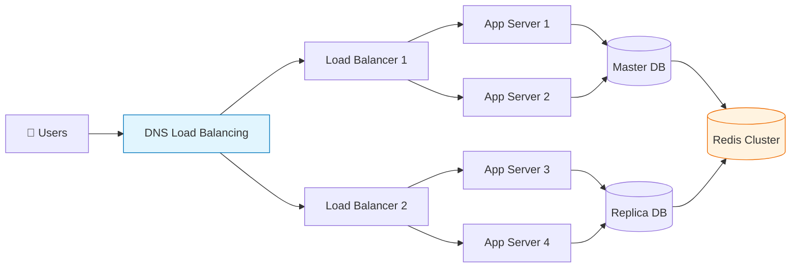

# 대규모 시스템 설계: 수백만 사용자를 위한 아키텍처

수백만 명의 사용자를 동시에 처리해야 하는 시스템을 설계하는 것은 단순한 확장이 아닌 완전히 다른 패러다임을 요구한다. "작은 시스템을 크게 만드는 것"이 아니라 "큰 시스템을 작게 나누어 관리하는 것"이다.

## 1. 핵심 요약 (Executive Summary)

대규모 시스템은 **단일 장애점(SPOF)을 제거**하고 **수평적 확장성**을 갖추는 것을 목표로 한다. 트래픽이 폭증하더라도 시스템이 안정적으로 동작하도록 설계해야 한다.

> **결론:**
> 1. **확장성(Scalability):** 로드 밸런서와 마이크로서비스로 수평 확장
> 2. **가용성(Availability):** 다중화와 자동 장애 복구로 99.9% uptime 달성
> 3. **성능(Performance):** 캐싱, CDN, 데이터베이스 최적화로 응답 시간 최소화
> 4. **신뢰성(Reliability):** 모니터링과 회로 차단기로 장애 전파 방지

---

## 2. 확장성(Scalability) 전략

시스템이 성장함에 따라 트래픽을 처리할 수 있는 능력을 키우는 방법이다.

### 2.1 수직 확장 vs 수평 확장

| 구분 | 수직 확장 (Scale-up) | 수평 확장 (Scale-out) |
| --- | --- | --- |
| **방법** | 더 큰 서버로 교체 | 서버 대수를 늘림 |
| **장점** | 구현 간단, 데이터 일관성 용이 | 무한 확장 가능, 비용 효율적 |
| **단점** | 물리적 한계 존재, 고비용 | 복잡성 증가, 데이터 동기화 필요 |
| **적합** | 초기 스타트업, 고성능 컴퓨팅 | 웹 서비스, 클라우드 네이티브 |

### 2.2 수평 확장 아키텍처



### 2.3 로드 밸런싱 전략

**L4 vs L7 로드 밸런싱:**
* **L4 (Transport Layer):** IP/포트 기반 분산, 빠르고 단순
* **L7 (Application Layer):** HTTP 헤더 기반 분산, 지능적 라우팅 가능

**알고리즘:**
* **Round Robin:** 순차적 분배
* **Least Connections:** 연결 적은 서버 우선
* **IP Hash:** 같은 IP는 같은 서버로 (세션 유지)

---

## 3. 고가용성(High Availability) 설계

시스템이 장애가 발생해도 계속 동작하도록 하는 설계 원칙이다.

### 3.1 다중화(Multiplication)의 원칙

**서버 다중화:**
```text
[웹 서버 다중화]
┌─────────────────┐    ┌─────────────────┐
│   Web Server 1  │    │   Web Server 2  │
│   (Active)      │    │   (Standby)     │
└─────────────────┘    └─────────────────┘
         │                       │
         └───────── Load ─────────┘
                 Balancer
```

**데이터베이스 다중화:**
* **Master-Slave 복제:** 쓰기는 Master, 읽기는 Slave 분산
* **Multi-Master:** 여러 Master가 쓰기 처리 (충돌 해결 필요)

### 3.2 장애 감지와 자동 복구

**헬스 체크(Health Check):**
* **Active Monitoring:** 주기적 상태 확인
* **Passive Monitoring:** 요청 실패 시 자동 제외

**자동 복구:**
* **Auto Scaling:** 트래픽 증가 시 서버 자동 추가
* **Self-Healing:** 장애 서버 자동 재시작/교체

---

## 4. 마이크로서비스 아키텍처(Microservices)

하나의 큰 애플리케이션을 작은 독립적인 서비스들로 나누는 설계 패턴이다.

### 4.1 마이크로서비스의 장단점

| 장점 | 단점 |
| --- | --- |
| 독립적 배포 및 확장 가능 | 서비스 간 통신 복잡성 증가 |
| 기술 스택 다양화 가능 | 분산 트랜잭션 관리 어려움 |
| 장애 격리 (한 서비스 죽어도 영향 최소) | 모니터링 및 디버깅 복잡 |

### 4.2 서비스 분해 전략

**DDD(Domain-Driven Design) 기반 분해:**
```text
[이커머스 도메인 분해 예시]
┌─────────────────┐    ┌─────────────────┐    ┌─────────────────┐
│   User Service  │    │  Product Service│    │  Order Service  │
│   (회원 관리)   │    │  (상품 관리)    │    │  (주문 처리)    │
└─────────────────┘    └─────────────────┘    └─────────────────┘
         │                       │                       │
         └─────────────────── API Gateway ──────────────────┘
```

**서비스 간 통신:**
* **동기:** REST API, gRPC
* **비동기:** 메시지 큐(Kafka, RabbitMQ)

### 4.3 API 게이트웨이(API Gateway)

마이크로서비스의 입구 역할을 하는 단일 진입점이다.

**주요 기능:**
* **라우팅:** 요청을 적절한 서비스로 전달
* **인증/인가:** 공통 보안 로직 처리
* **로드 밸런싱:** 서비스 인스턴스 간 분산
* **변환:** 프로토콜 변환, 데이터 포맷팅

---

## 5. 데이터 관리 전략

대규모 시스템에서 데이터는 가장 복잡한 부분이다.

### 5.1 데이터베이스 샤딩(Sharding)

데이터를 여러 데이터베이스에 분산 저장하는 기법이다.

**샤딩 전략:**
* **Range Sharding:** ID 범위로 분할 (1-1000, 1001-2000)
* **Hash Sharding:** 해시 함수로 균등 분배
* **Directory Sharding:** 매핑 테이블로 유연하게 분배

**주의사항:**
* **Cross-shard Query:** 조인 연산이 불가능해 애플리케이션 레벨에서 처리
* **Rebalancing:** 서버 증설 시 데이터 재분배의 어려움

### 5.2 캐싱 계층 설계

**다중 레벨 캐싱:**
```text
[캐싱 피라미드]
   ┌─ CDN (정적 콘텐츠)
  ┌─┴─ Application Cache (Redis)
 ┌─┴── Database Cache (InnoDB Buffer Pool)
└──── Database (Disk)
```

**캐시 전략:**
* **Cache-aside:** 애플리케이션이 캐시 관리
* **Write-through:** DB와 캐시 동시 업데이트
* **Write-back:** 캐시에 먼저 쓰고 비동기 DB 반영

### 5.3 데이터 일관성

**CAP 이론:**
* **Consistency:** 모든 노드가 같은 데이터
* **Availability:** 일부 노드 죽어도 응답 가능
* **Partition Tolerance:** 네트워크 분단 시에도 동작

**실무적 선택:**
* **CP 시스템:** 금융, 은행 (일관성 우선)
* **AP 시스템:** 소셜 미디어 (가용성 우선)

---

## 6. 성능 최적화 기법

### 6.1 프론트엔드 최적화

**CDN(Content Delivery Network):**
* 전 세계 엣지 서버에 콘텐츠 배포
* 사용자와 가까운 서버에서 응답

**웹 최적화:**
* **압축:** Gzip으로 응답 압축
* **번들링:** JS/CSS 파일 통합
* **Lazy Loading:** 필요한 시점에 리소스 로드

### 6.2 백엔드 최적화

**비동기 처리:**
```python
# 동기 처리 (문제점: 응답 대기)
def process_order(order):
    payment_result = payment_service.charge(order)  # 3초 대기
    inventory_result = inventory_service.reserve(order)  # 2초 대기
    return "Order completed"

# 비동기 처리 (개선: 빠른 응답)
async def process_order_async(order):
    # 동시에 실행
    payment_task = asyncio.create_task(payment_service.charge(order))
    inventory_task = asyncio.create_task(inventory_service.reserve(order))

    await asyncio.gather(payment_task, inventory_task)
    return "Order accepted"  # 즉시 응답
```

**커넥션 풀링:**
* DB 연결 재사용으로 오버헤드 감소
* 스레드 풀, HTTP 클라이언트 풀 관리

### 6.3 데이터베이스 최적화

**인덱스 전략:**
* 쿼리 패턴 분석 후 전략적 인덱스 생성
* 복합 인덱스로 다중 조건 처리

**읽기/쓰기 분리:**
* Master: 쓰기 전용
* Slave: 읽기 전용
* Replication Lag 모니터링

---

## 7. 모니터링과 관측성(Observability)

대규모 시스템은 "보이지 않는 것을 볼 수 있어야" 한다.

### 7.1 모니터링 지표

**시스템 메트릭:**
* **RED 메트릭:** Rate(요청률), Error(에러율), Duration(응답시간)
* **USE 메트릭:** Utilization(사용률), Saturation(포화도), Error(에러)

**비즈니스 메트릭:**
* DAU/MAU (일간/월간 활성 사용자)
* 전환율, 이탈률
* API 호출 빈도

### 7.2 로깅 전략

**구조화된 로깅:**
```json
{
  "timestamp": "2024-01-15T10:30:00Z",
  "level": "ERROR",
  "service": "user-service",
  "request_id": "abc-123-def",
  "user_id": "user_456",
  "message": "Failed to update user profile",
  "error": "ValidationError: Invalid email format",
  "stack_trace": "..."
}
```

**분산 추적(Distributed Tracing):**
* 요청이 여러 서비스를 통과하는 경로 추적
* Jaeger, Zipkin 등으로 구현

### 7.3 알림과 자동화

**알림 전략:**
* **페이지(Paging):** 즉시 대응 필요한 심각한 장애
* **티켓(Ticket):** 업무 시간 내 처리 가능한 이슈
* **메일:** 정보성 알림

**자동화:**
* **Auto-scaling:** 트래픽 증가 시 자동 확장
* **Auto-healing:** 장애 감지 시 자동 복구
* **Auto-remediation:** 알려진 문제 자동 해결

---

## 8. 보안 설계

대규모 시스템은 해킹의 주요 표적이 된다.

### 8.1 Defense in Depth (다중 방어)

**네트워크 레벨:**
* **WAF(Web Application Firewall):** SQL Injection, XSS 차단
* **DDoS Protection:** Cloudflare, AWS Shield

**애플리케이션 레벨:**
* **Input Validation:** 모든 입력값 검증
* **인증/인가:** JWT, OAuth 2.0
* **암호화:** 전송 중 TLS, 저장 시 AES

### 8.2 제로 트러스트 모델

**기본 원칙:** "내부 네트워크도 신뢰하지 말라"

**구현:**
* **마이크로 세그먼테이션:** 서비스 간 네트워크 격리
* **지속적 검증:** 모든 요청에 대한 실시간 인증
* **최소 권한:** 필요한 최소한의 권한만 부여

---

## 9. Production-Ready 예시

### 9.1 Netflix 아키텍처

```text
[Netflix 마이크로서비스 아키텍처]
┌─────────────────┐
│   API Gateway   │  <- Zuul
│   (Edge Service)|
└─────────────────┘
         │
    ┌────┴────┐
    │         │
┌───┴───┐ ┌───┴───┐
│User   │ │Content│
│Service│ │Service│
└───┬───┘ └───┬───┘
    │         │
    └────┬────┘
         │
    ┌────┴────┐
    │  Eureka │  <- 서비스 디스커버리
    │ (Registry)
    └─────────┘
```

### 9.2 AWS 기반 대규모 아키텍처

```text
[AWS Well-Architected Framework]
┌─────────────────────────────────────┐
│           CloudFront (CDN)          │
└─────────────────────────────────────┘
                   │
          ┌────────┴────────┐
          │                 │
    ┌─────┴─────┐     ┌─────┴─────┐
    │   ALB     │     │   API GW  │
    │(Load      │     │(Gateway)  │
    │ Balancer) │     │           │
    └─────┬─────┘     └─────┬─────┘
          │                 │
    ┌─────┼─────────────────┼─────┐
    │     │        │        │     │
┌───┴──┐ ┌┴┐ ┌────┴────┐ ┌──┴──┐
│ ECS  │ │ │ │ Lambda  │ │ RDS │
│Tasks │ │ │ │Functions│ │Aurora│
└──────┘ └─┘ └─────────┘ └─────┘
```

---

## 10. 전문가적 조언 (Pro Tip)

### 10.1 설계 원칙
* **KISS (Keep It Simple, Stupid):** 복잡성을 최소화
* **YAGNI (You Aren't Gonna Need It):** 필요할 때 확장
* **Fail Fast:** 빠른 실패로 문제 조기 발견

### 10.2 운영 원칙
* **모니터링 우선:** 메트릭 수집부터 시작
* **자동화:** 수동 작업을 코드로 변환
* **문서화:** 아키텍처 결정 이유 기록

### 10.3 성장 관리
* **점진적 마이그레이션:** Big Bang이 아닌 단계적 전환
* **A/B 테스트:** 변경사항의 영향 측정
* **롤백 계획:** 언제든 원상복구 가능하도록