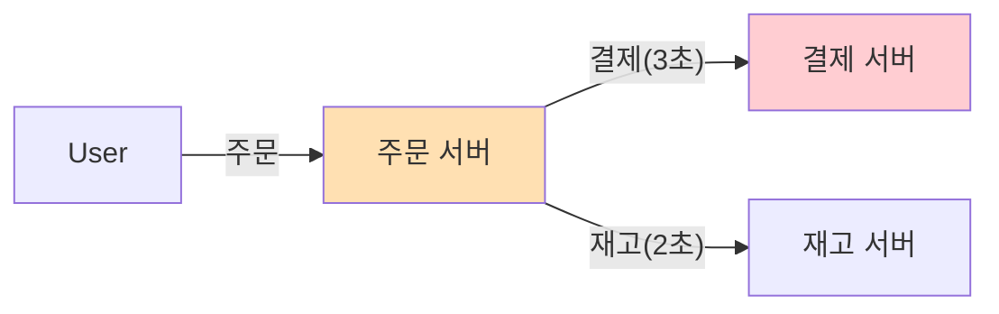

# 📨 메시지 큐 완벽 이해: 비동기 아키텍처의 핵심

> **이 문서의 목표:** 메시지 큐를 단순 도구가 아니라, **결합도를 낮추고 시스템 안정성을 높이는** 비동기 아키텍처의 핵심 컴포넌트로 이해하고 활용한다.

---

## 0. 핵심 질문으로 시작하기

1. **동기 통신과 비동기 통신의 결정적 차이는?** → 요청 후 대기(Blocking)하느냐, 바로 할 일 하느냐(Non-blocking).
2. **메시지 큐를 도입하면 어떤 문제를 해결할 수 있는가?** → 서비스 간 결합도 감소, 트래픽 폭주 시 버퍼링, 장애 격리.
3. **RabbitMQ와 Kafka는 어떤 기준으로 선택하는가?** → 복잡한 라우팅/작업 큐(RabbitMQ) vs 대용량 데이터 스트리밍(Kafka).

---

## 1. [개념 정의]: 왜 메시지 큐가 필요한가? (Why)

직접 통신(HTTP)의 한계를 극복하기 위함이다. 서비스끼리 강하게 결합되어 있으면 하나만 죽어도 전체가 죽고, 트래픽이 몰리면 연쇄적으로 터진다.

### 1.1 동기 방식의 문제점


*   **문제:** 결제 서버가 느려지면 주문 서버도 같이 느려진다. (전체 응답 시간 = 3초 + 2초 + a)

### 1.2 비동기 방식의 해결책

```mermaid
graph LR
    User -->|주문| Order[주문 서버]
    Order --"이벤트 발행"--> MQ[Message Queue]
    Order -.->"바로 응답"-> User
    
    MQ --"구독"--> Pay[결제 서버]
    MQ --"구독"--> Stock[재고 서버]

    style MQ fill:#fff9c4,stroke:#fbc02d
```
*   **해결:** 주문 서버는 큐에 넣고 바로 응답한다. 결제/재고 서버는 자기 속도대로 처리한다.

---

## 2. [원리/구조]: 메시지 전달 보장과 아키텍처 (How)

### 2.1 RabbitMQ vs Kafka 비교

| 특징 | RabbitMQ | Apache Kafka |
|:---:|:---:|:---:|
| **철학** | Smart Broker, Dumb Consumer | Dumb Broker, Smart Consumer |
| **용도** | 작업 큐, 복잡한 라우팅, MSA 통신 | 대용량 로그 수집, 스트리밍, 이벤트 소싱 |
| **메시지 보존** | 소비(Ack)되면 삭제 | 설정 기간 동안 디스크에 보존 |
| **성능** | 좋음 (수만 TPS) | 압도적임 (수백만 TPS) |

### 2.2 메시지 전달 보장 수준 (QoS)

1. **At-most-once (최대 한 번):** 쏘고 잊음. 유실 가능성 O. (로그 수집 등)
2. **At-least-once (적어도 한 번):** 실패하면 재전송. 중복 가능성 O. **(가장 일반적)**
3. **Exactly-once (정확히 한 번):** 중복도 유실도 없음. 구현 어려움/비용 높음. (결제 등)

> [!IMPORTANT]
> **멱등성(Idempotency):** 대부분의 큐는 "적어도 한 번"을 보장하므로, **같은 메시지가 두 번 와도 결과가 같도록** 컨슈머를 설계해야 한다.

---

## 3. [실전/구현]: Python Producer/Consumer 예시 (What)

RabbitMQ를 사용한 비동기 작업 처리 예시.

### 3.1 Producer (작업 요청)

```python
import pika

# 연결
connection = pika.BlockingConnection(pika.ConnectionParameters('localhost'))
channel = connection.channel()
channel.queue_declare(queue='task_queue', durable=True)

# 메시지 발행
message = "Order Created: #12345"
channel.basic_publish(
    exchange='',
    routing_key='task_queue',
    body=message,
    properties=pika.BasicProperties(
        delivery_mode=2,  # 메시지 영구 저장 (Persistent)
    ))
print(" [x] Sent %r" % message)
connection.close()
```

### 3.2 Consumer (작업 처리)

```python
import pika
import time

def callback(ch, method, properties, body):
    print(" [x] Received %r" % body)
    time.sleep(body.count(b'.'))  # 작업 시뮬레이션
    print(" [x] Done")
    # 수동 Ack (처리 완료 신호)
    ch.basic_ack(delivery_tag=method.delivery_tag)

connection = pika.BlockingConnection(pika.ConnectionParameters('localhost'))
channel = connection.channel()
channel.queue_declare(queue='task_queue', durable=True)

# 공평 분배 (한 번에 하나씩만)
channel.basic_qos(prefetch_count=1)
channel.basic_consume(queue='task_queue', on_message_callback=callback)

print(' [*] Waiting for messages. To exit press CTRL+C')
channel.start_consuming()
```

> [!TIP]
> **Dead Letter Queue (DLQ):** 처리에 계속 실패하는 메시지는 영원히 재시도하지 말고, 별도의 DLQ로 빼서 나중에 수동으로 분석/처리해야 한다.

---

## 4. 🎯 1분 요약

1. **역할**: 메시지 큐는 시스템 간의 **완충재(Buffer)** 역할을 하여 결합도를 낮춘다.
2. **선택**: 단순 작업 큐는 **RabbitMQ**, 대용량 데이터 파이프라인은 **Kafka**.
3. **주의**: 비동기 시스템은 **순서 보장**과 **중복 처리(멱등성)** 문제를 반드시 고려해야 한다.

---

## 5. 📝 자가 점검 질문

1. **동기 통신의 단점은 무엇인가?**
   → 타임아웃, 연쇄 장애(Cascading Failure), 클라이언트 대기 시간 증가.
2. **RabbitMQ와 Kafka의 가장 큰 차이점(메시지 삭제 시점)은?**
   → RabbitMQ는 소비되면 삭제, Kafka는 소비돼도 디스크에 보존(Replay 가능).
3. **멱등성(Idempotency)이란 무엇이며 왜 중요한가?**
   → 연산을 여러 번 적용해도 결과가 달라지지 않는 성질. 메시지가 중복 전달될 수 있기 때문에 필수적이다.
