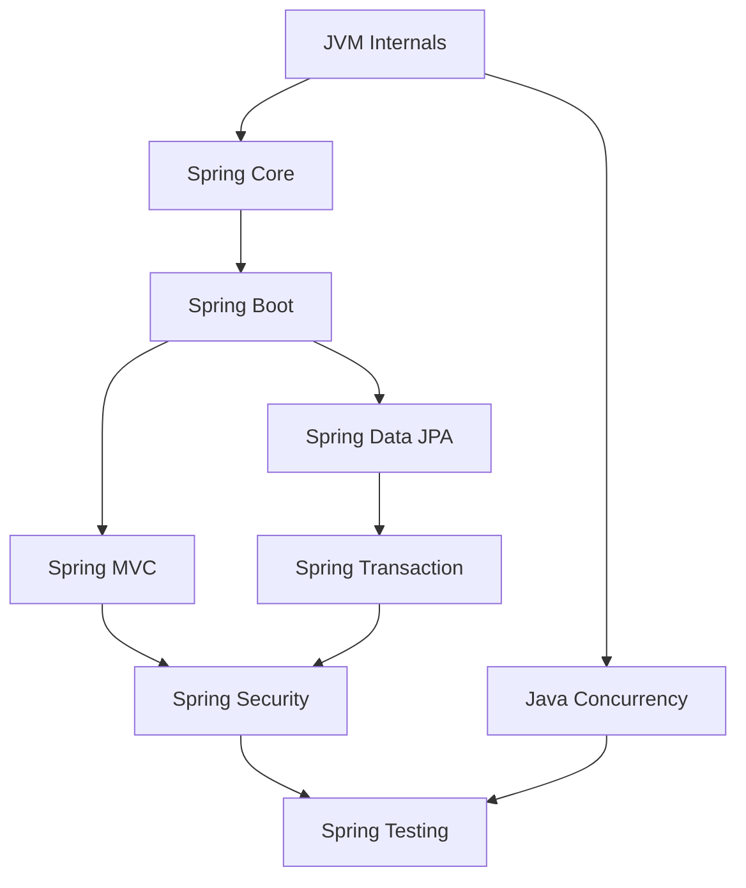

# ☕ Java 생태계: JVM부터 Spring Framework까지

> **이 섹션의 목표:** Java 언어의 핵심 원리부터 Spring 프레임워크를 활용한 엔터프라이즈 애플리케이션 개발까지, **왜 이렇게 동작하는지**를 이해하고 실무에 적용한다.

---

## 📂 목차

### 🔧 [JVM Internals](./jvm-internals)
JVM의 내부 구조와 동작 원리를 파헤칩니다.

- JVM 아키텍처 (Class Loader, Runtime Data Area, Execution Engine)
- 가비지 컬렉션 (GC) 알고리즘과 튜닝
- JIT 컴파일러와 성능 최적화
- Virtual Threads (Java 21), Records, Sealed Classes

### 🌱 [Spring Core](./spring-core)
Spring Framework의 핵심 철학과 동작 원리를 다룹니다.

- IoC (Inversion of Control) 컨테이너
- DI (Dependency Injection) 패턴과 구현
- AOP (Aspect-Oriented Programming)
- Bean Lifecycle과 Scope

### 🚀 [Spring Boot](./spring-boot)
Spring Boot의 자동 설정과 생산성 향상 기능을 학습합니다.

- Auto Configuration 원리
- Starter 의존성 관리
- Actuator와 모니터링
- Profile과 외부 설정

### 🌐 [Spring MVC](./spring-mvc)
웹 애플리케이션 개발의 핵심 MVC 패턴을 다룹니다.

- DispatcherServlet과 요청 처리 흐름
- Filter vs Interceptor vs AOP
- Exception Handling 전략
- REST API 설계와 ResponseEntity

### 🗄️ [Spring Data JPA](./spring-data-jpa)
ORM과 데이터 접근 계층을 심층 분석합니다.

- JPA vs Hibernate vs Spring Data JPA
- 영속성 컨텍스트와 1차 캐시
- N+1 문제와 해결 전략 (Fetch Join, EntityGraph)
- QueryDSL과 동적 쿼리

### 🔒 [Spring Security](./spring-security)
인증/인가 시스템의 구조와 구현을 다룹니다.

- Security Filter Chain 구조
- 인증(Authentication) vs 인가(Authorization)
- JWT 토큰 기반 인증 구현
- OAuth2 Client/Resource Server

### 🧪 [Spring Testing](./spring-testing)
테스트 전략과 효과적인 테스트 코드 작성법입니다.

- 단위 테스트 vs 통합 테스트
- @SpringBootTest vs @WebMvcTest vs @DataJpaTest
- Mockito와 Mock 객체 활용
- Testcontainers로 실제 환경 테스트

### 💳 [Spring Transaction](./spring-transaction)
트랜잭션 관리의 핵심 원리를 다룹니다.

- @Transactional 전파 레벨 (REQUIRED, REQUIRES_NEW, NESTED)
- 격리 수준 (Isolation Level)
- 롤백 규칙과 주의사항
- 내부 호출 문제 해결

### ⚡ [Java Concurrency](./java-concurrency)
멀티스레딩과 동시성 프로그래밍을 마스터합니다.

- Thread와 Runnable
- synchronized와 Lock
- ExecutorService와 Thread Pool
- CompletableFuture와 비동기 처리
- Virtual Threads (Java 21)와 @Async

---

## 🎯 학습 순서 가이드

> [!TIP]
> **추천 학습 순서:** JVM → Spring Core → Spring Boot → MVC/JPA → Transaction → Security → Testing
