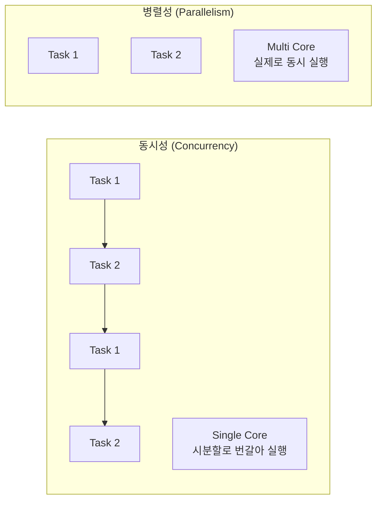
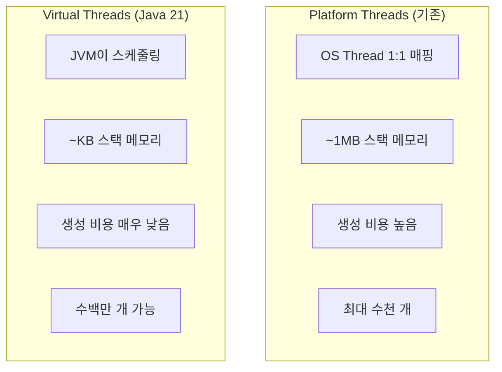

# ⚡ Java Concurrency: 멀티스레딩과 동시성

> **이 문서의 목표:** Java의 **동시성 프로그래밍** 원리를 이해하고, Thread Pool, CompletableFuture를 활용하여 **안전하고 효율적인 비동기 처리**를 구현할 수 있는 역량을 기른다.

---

## 0. 핵심 질문으로 시작하기

1. **동시성(Concurrency) vs 병렬성(Parallelism)의 차이는?** → 논리적 동시 실행 vs 물리적 동시 실행
2. **synchronized vs Lock의 차이는?** → 암묵적 락 vs 명시적 락
3. **ExecutorService를 사용하는 이유는?** → 스레드 생성 비용 절감, 리소스 관리
4. **CompletableFuture의 장점은?** → 비동기 작업 조합, 논블로킹

---

## 1. 동시성의 기초: 왜 필요한가? (Why)

### 1.1 동시성 vs 병렬성



| 개념 | 설명 | 예시 |
|:---:|:---|:---|
| **동시성** | 여러 작업을 논리적으로 동시에 처리 | 싱글 코어에서 멀티태스킹 |
| **병렬성** | 여러 작업을 물리적으로 동시에 처리 | 멀티 코어에서 병렬 연산 |

> [!NOTE]
> **핵심 통찰:** 동시성은 구조(Structure)의 문제이고, 병렬성은 실행(Execution)의 문제입니다.

---

## 2. Thread와 동기화: 어떻게 동작하는가? (How)

### 2.1 Thread 생성 방법

```java
// 방법 1: Thread 상속 (비권장)
class MyThread extends Thread {
    @Override
    public void run() {
        System.out.println("Thread 실행");
    }
}

// 방법 2: Runnable 구현 (권장)
Runnable task = () -> System.out.println("Runnable 실행");
Thread thread = new Thread(task);
thread.start();

// 방법 3: ExecutorService 사용 (가장 권장)
ExecutorService executor = Executors.newFixedThreadPool(4);
executor.submit(() -> System.out.println("ExecutorService 실행"));
```

### 2.2 동기화 (synchronized)

```java
public class Counter {
    private int count = 0;
    
    // ❌ Race Condition 발생
    public void incrementUnsafe() {
        count++;  // read → modify → write (원자적이지 않음)
    }
    
    // ✅ synchronized로 동기화
    public synchronized void incrementSafe() {
        count++;
    }
    
    // ✅ synchronized 블록
    public void incrementBlock() {
        synchronized (this) {
            count++;
        }
    }
}
```

### 2.3 Lock 인터페이스

```java
public class Counter {
    private int count = 0;
    private final Lock lock = new ReentrantLock();
    
    public void increment() {
        lock.lock();  // 명시적 락 획득
        try {
            count++;
        } finally {
            lock.unlock();  // 반드시 해제!
        }
    }
    
    // tryLock: 타임아웃 지원
    public boolean tryIncrement(long timeout) throws InterruptedException {
        if (lock.tryLock(timeout, TimeUnit.MILLISECONDS)) {
            try {
                count++;
                return true;
            } finally {
                lock.unlock();
            }
        }
        return false;
    }
}
```

| 비교 | synchronized | Lock |
|:---:|:---|:---|
| **사용** | 암묵적, 간단 | 명시적, 유연 |
| **타임아웃** | 불가 | tryLock() 지원 |
| **Condition** | wait/notify | 다중 Condition 지원 |
| **공정성** | 불공정 | 공정 모드 선택 가능 |

---

## 3. ExecutorService: 스레드 풀 관리 (What)

### 3.1 ExecutorService 종류

```java
// 고정 크기 스레드 풀
ExecutorService fixed = Executors.newFixedThreadPool(4);

// 캐시 스레드 풀 (필요 시 생성, 60초 유휴 시 제거)
ExecutorService cached = Executors.newCachedThreadPool();

// 단일 스레드
ExecutorService single = Executors.newSingleThreadExecutor();

// 스케줄링 가능한 풀
ScheduledExecutorService scheduled = Executors.newScheduledThreadPool(2);
```

### 3.2 실전 사용 예시

```java
@Service
@RequiredArgsConstructor
public class OrderService {
    
    private final ExecutorService executor = Executors.newFixedThreadPool(10);
    
    public void processOrderAsync(Order order) {
        // 비동기 실행
        CompletableFuture.runAsync(() -> {
            sendEmailNotification(order);
        }, executor);
        
        CompletableFuture.runAsync(() -> {
            updateInventory(order);
        }, executor);
    }
    
    @PreDestroy
    public void shutdown() {
        executor.shutdown();
        try {
            if (!executor.awaitTermination(60, TimeUnit.SECONDS)) {
                executor.shutdownNow();
            }
        } catch (InterruptedException e) {
            executor.shutdownNow();
        }
    }
}
```

> [!WARNING]
> **흔한 실수:** ExecutorService를 shutdown하지 않으면 애플리케이션이 종료되지 않습니다. @PreDestroy에서 반드시 정리하세요.

---

## 4. CompletableFuture: 비동기 프로그래밍

### 4.1 기본 사용법

```java
// 비동기 실행
CompletableFuture<String> future = CompletableFuture.supplyAsync(() -> {
    // 시간이 오래 걸리는 작업
    return fetchDataFromApi();
});

// 결과 처리
future.thenApply(data -> processData(data))       // 변환
      .thenAccept(result -> saveResult(result))   // 소비
      .exceptionally(ex -> {                      // 예외 처리
          log.error("Error", ex);
          return null;
      });
```

### 4.2 비동기 작업 조합

```java
public CompletableFuture<OrderSummary> getOrderSummary(Long orderId) {
    
    CompletableFuture<Order> orderFuture = 
            CompletableFuture.supplyAsync(() -> orderRepository.findById(orderId));
    
    CompletableFuture<User> userFuture = 
            orderFuture.thenCompose(order -> 
                    CompletableFuture.supplyAsync(() -> 
                            userRepository.findById(order.getUserId())));
    
    CompletableFuture<List<Product>> productsFuture = 
            orderFuture.thenCompose(order -> 
                    CompletableFuture.supplyAsync(() -> 
                            productRepository.findByIds(order.getProductIds())));
    
    // 모든 Future 결합
    return orderFuture.thenCombine(userFuture, (order, user) -> 
            new OrderSummary(order, user))
            .thenCombine(productsFuture, (summary, products) -> {
                summary.setProducts(products);
                return summary;
            });
}
```

### 4.3 주요 메서드

| 메서드 | 설명 |
|:---|:---|
| `supplyAsync()` | 비동기 실행 (반환값 있음) |
| `runAsync()` | 비동기 실행 (반환값 없음) |
| `thenApply()` | 결과 변환 |
| `thenCompose()` | 다른 CompletableFuture와 연결 |
| `thenCombine()` | 두 Future 결과 결합 |
| `allOf()` | 모든 Future 완료 대기 |
| `anyOf()` | 하나라도 완료되면 반환 |

---

## 5. 동시성 유틸리티

### 5.1 Atomic 클래스

```java
// 원자적 연산 보장
private final AtomicInteger counter = new AtomicInteger(0);

public void increment() {
    counter.incrementAndGet();  // Thread-safe
}

public void compareAndSet() {
    counter.compareAndSet(0, 1);  // CAS 연산
}
```

### 5.2 Concurrent Collections

```java
// Thread-safe 컬렉션
ConcurrentHashMap<String, User> userCache = new ConcurrentHashMap<>();
CopyOnWriteArrayList<String> logs = new CopyOnWriteArrayList<>();
BlockingQueue<Task> taskQueue = new LinkedBlockingQueue<>();
```

| 컬렉션 | 특징 | 용도 |
|:---|:---|:---|
| `ConcurrentHashMap` | 세그먼트 락, 높은 동시성 | 캐시 |
| `CopyOnWriteArrayList` | 읽기 최적화, 쓰기 시 복사 | 읽기 많은 리스트 |
| `BlockingQueue` | 블로킹 삽입/제거 | Producer-Consumer |

---

## 6. Virtual Threads (Java 21)

### 6.1 Virtual Threads vs Platform Threads



### 6.2 사용 방법

```java
// 방법 1: 직접 생성
Thread vThread = Thread.startVirtualThread(() -> {
    System.out.println("Virtual Thread 실행");
});

// 방법 2: ExecutorService (권장)
try (ExecutorService executor = Executors.newVirtualThreadPerTaskExecutor()) {
    IntStream.range(0, 10_000).forEach(i -> {
        executor.submit(() -> {
            Thread.sleep(Duration.ofSeconds(1));
            return i;
        });
    });
}  // try-with-resources로 자동 종료

// 방법 3: Thread.Builder
Thread vThread = Thread.ofVirtual()
        .name("my-vthread")
        .start(() -> doWork());
```

### 6.3 Spring Boot 3.2+ 통합

```yaml
# application.yml
spring:
  threads:
    virtual:
      enabled: true  # 모든 요청을 Virtual Thread로 처리
```

```java
// 또는 직접 설정
@Bean
public TomcatProtocolHandlerCustomizer<?> protocolHandlerVirtualThreadExecutorCustomizer() {
    return protocolHandler -> {
        protocolHandler.setExecutor(Executors.newVirtualThreadPerTaskExecutor());
    };
}
```

> [!IMPORTANT]
> **Virtual Threads 주의사항:**
> - `synchronized` 블록 내 blocking I/O → 성능 저하 (pinning 문제)
> - `ReentrantLock` 사용 권장
> - CPU 바운드 작업에는 부적합

```java
// ❌ 피해야 할 패턴 (Pinning)
synchronized (lock) {
    // blocking I/O 작업
    socket.read();
}

// ✅ 권장 패턴
private final ReentrantLock lock = new ReentrantLock();

lock.lock();
try {
    socket.read();
} finally {
    lock.unlock();
}
```

---

## 7. Spring @Async

### 7.1 기본 설정

```java
@Configuration
@EnableAsync
public class AsyncConfig implements AsyncConfigurer {
    
    @Override
    public Executor getAsyncExecutor() {
        ThreadPoolTaskExecutor executor = new ThreadPoolTaskExecutor();
        executor.setCorePoolSize(5);
        executor.setMaxPoolSize(10);
        executor.setQueueCapacity(100);
        executor.setThreadNamePrefix("Async-");
        executor.setRejectedExecutionHandler(new ThreadPoolExecutor.CallerRunsPolicy());
        executor.initialize();
        return executor;
    }
    
    @Override
    public AsyncUncaughtExceptionHandler getAsyncUncaughtExceptionHandler() {
        return (ex, method, params) -> {
            log.error("Async method {} threw exception: {}", method.getName(), ex.getMessage());
        };
    }
}
```

### 7.2 사용 예시

```java
@Service
@RequiredArgsConstructor
public class OrderService {
    
    private final NotificationService notificationService;
    
    public Order createOrder(OrderRequest request) {
        Order order = orderRepository.save(new Order(request));
        
        // 비동기 알림 발송 (응답 시간에 영향 없음)
        notificationService.sendNotificationAsync(order);
        
        return order;
    }
}

@Service
@Slf4j
public class NotificationService {
    
    @Async
    public void sendNotificationAsync(Order order) {
        // 별도 스레드에서 실행
        emailSender.send(order.getEmail(), "주문 완료");
        smsSender.send(order.getPhone(), "주문이 접수되었습니다.");
    }
    
    @Async
    public CompletableFuture<Boolean> sendWithResult(Order order) {
        boolean result = emailSender.send(order.getEmail(), "주문 완료");
        return CompletableFuture.completedFuture(result);
    }
}
```

> [!WARNING]
> **@Async 주의사항:**
> 1. **같은 클래스 내부 호출 불가** - 프록시를 거치지 않아 동기 실행
> 2. **public 메서드만** 가능
> 3. **self-invocation** 패턴 사용 시 주입받은 Bean 사용

```java
// ❌ 동작 안 함 (내부 호출)
@Service
public class OrderService {
    public void process() {
        asyncMethod();  // 동기로 실행됨!
    }
    
    @Async
    public void asyncMethod() { }
}

// ✅ 해결: 다른 Bean에서 호출
@Service
@RequiredArgsConstructor
public class OrderService {
    private final AsyncService asyncService;
    
    public void process() {
        asyncService.asyncMethod();  // 비동기로 실행
    }
}
```

---

## 8. 🎯 1분 요약

1. **동시성 vs 병렬성**: 논리적 vs 물리적 동시 실행
2. **synchronized vs Lock**: 암묵적 vs 명시적, Lock이 더 유연
3. **ExecutorService**: 스레드 풀로 리소스 효율적 관리
4. **CompletableFuture**: 비동기 작업 조합, 논블로킹 프로그래밍
5. **Virtual Threads (Java 21)**: 경량 스레드, I/O 바운드에 최적
6. **@Async**: Spring 비동기 처리, 다른 Bean에서 호출 필수

---

## 9. 📝 자가 점검 질문

1. **Deadlock이 발생하는 조건 4가지는?**
   → 상호 배제, 점유 대기, 비선점, 순환 대기

2. **volatile 키워드의 역할은?**
   → 변수의 가시성 보장, CPU 캐시가 아닌 메인 메모리에서 읽기/쓰기

3. **ThreadLocal은 언제 사용하는가?**
   → 스레드별로 독립적인 변수가 필요할 때 (예: 트랜잭션 컨텍스트)

4. **Fork/Join Framework의 특징은?**
   → Work-Stealing 알고리즘, 분할 정복 작업에 최적화

5. **Virtual Thread에서 synchronized 대신 ReentrantLock을 사용하는 이유는?**
   → synchronized 블록 내 blocking I/O 시 carrier thread가 고정(pinning)되어 성능 저하

6. **@Async가 같은 클래스 내에서 동작하지 않는 이유는?**
   → 프록시 기반 AOP라서 내부 호출은 프록시를 거치지 않음. 다른 Bean에서 호출 필요

7. **Virtual Threads가 적합하지 않은 작업은?**
   → CPU 바운드 작업. I/O 대기가 없는 연산 집약적 작업에는 Platform Thread가 적합
