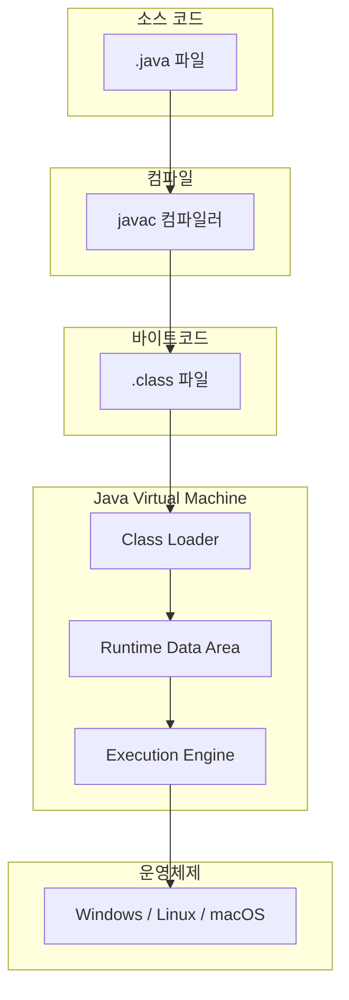
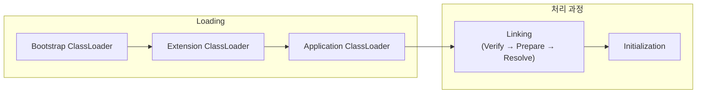
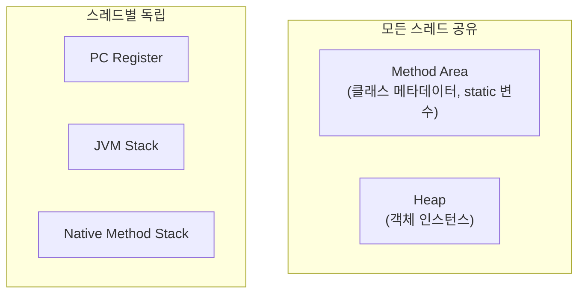
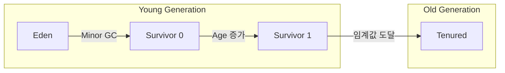
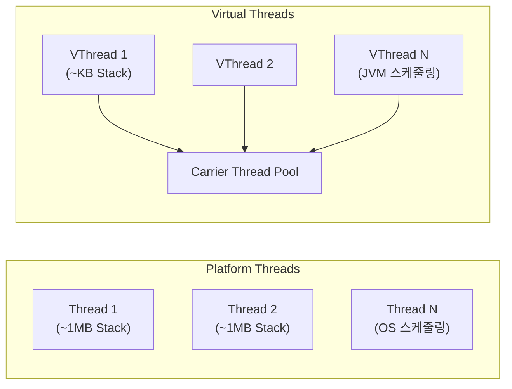

# 🔧 JVM Internals: Java Virtual Machine의 내부 구조

> **이 문서의 목표:** JVM이 Java 코드를 어떻게 실행하는지 이해하고, **메모리 관리**와 **GC 튜닝**을 통해 애플리케이션 성능을 최적화할 수 있는 역량을 기른다.

---

## 0. 핵심 질문으로 시작하기

1. **JVM의 주요 구성 요소는 무엇인가?** → Class Loader, Runtime Data Area, Execution Engine
2. **Heap과 Stack의 차이는?** → 객체 vs 메서드 호출 정보, 공유 vs 스레드별 독립
3. **GC는 왜 필요하고 어떻게 동작하는가?** → 자동 메모리 관리, Mark-Sweep-Compact
4. **Stop-The-World란?** → GC 수행 중 애플리케이션 일시 정지

---

## 1. JVM 아키텍처: 왜 이렇게 설계되었는가? (Why)

Java의 **"Write Once, Run Anywhere"** 철학을 실현하기 위해 JVM이라는 추상화 계층이 도입되었습니다.



> [!NOTE]
> **핵심 통찰:** JVM은 바이트코드를 해석하는 가상 머신으로, OS에 종속되지 않는 이식성을 제공합니다.

---

## 2. JVM 구성 요소: 어떻게 동작하는가? (How)

### 2.1 Class Loader (클래스 로더)

클래스 파일을 메모리에 로드하는 역할을 담당합니다.



| 로더 | 역할 | 로드 대상 |
|:---:|:---|:---|
| **Bootstrap** | JVM 기본 클래스 로드 | `java.lang.*`, `java.util.*` |
| **Extension** | 확장 라이브러리 로드 | `$JAVA_HOME/lib/ext` |
| **Application** | 애플리케이션 클래스 로드 | classpath의 클래스들 |

### 2.2 Runtime Data Area (런타임 데이터 영역)



#### Heap 영역 구조 (Generational GC)



### 2.3 Execution Engine (실행 엔진)

| 구성 요소 | 역할 |
|:---:|:---|
| **Interpreter** | 바이트코드를 한 줄씩 해석하여 실행 |
| **JIT Compiler** | 반복 실행되는 코드를 네이티브 코드로 컴파일 |
| **Garbage Collector** | 사용하지 않는 객체의 메모리 해제 |

---

## 3. Garbage Collection: 메모리 자동 관리 (What)

### 3.1 GC 알고리즘

```java
// GC가 수거하는 대상: 더 이상 참조되지 않는 객체
public void createGarbage() {
    Object obj = new Object();  // Heap에 객체 생성
    obj = null;                 // 참조 해제 → GC 대상
}
```

| GC 종류 | 특징 | 적합한 환경 |
|:---:|:---|:---|
| **Serial GC** | 단일 스레드, Stop-The-World 김 | 소규모 애플리케이션 |
| **Parallel GC** | 멀티 스레드 GC | 처리량 중시 |
| **G1 GC** | Region 기반, 예측 가능한 STW | 대용량 힙 (Java 9+ 기본) |
| **ZGC** | 초저지연 (< 10ms STW) | 대규모 실시간 시스템 |

### 3.2 GC 튜닝 옵션

```bash
# G1 GC 사용, 최대 힙 4GB, 목표 STW 200ms
java -XX:+UseG1GC -Xmx4g -XX:MaxGCPauseMillis=200 -jar app.jar

# GC 로그 활성화 (Java 11+)
java -Xlog:gc*:file=gc.log:time,uptime,level,tags -jar app.jar
```

> [!WARNING]
> **흔한 실수:** 힙 크기를 무조건 크게 설정하면 Full GC 시간이 길어질 수 있습니다. 애플리케이션 특성에 맞게 튜닝하세요.

---

## 4. Java 버전별 주요 변경사항

### 4.1 Modern Java 핵심 기능

| 버전 | 기능 | 설명 |
|:---:|:---|:---|
| **Java 8** | Lambda, Stream API | 함수형 프로그래밍 지원 |
| **Java 11** | var, HTTP Client | 지역 변수 타입 추론, 표준 HTTP 클라이언트 |
| **Java 17** | Records, Sealed Classes | 불변 데이터 클래스, 상속 제한 |
| **Java 21** | Virtual Threads, Pattern Matching | 경량 스레드, 향상된 switch |

### 4.2 Virtual Threads (Java 21) - Project Loom

기존 Platform Thread와 달리 **경량 스레드**로, I/O 바운드 작업에서 획기적인 성능 향상을 제공합니다.



```java
// 기존 방식: Platform Thread
ExecutorService executor = Executors.newFixedThreadPool(100);

// Java 21: Virtual Threads
ExecutorService virtualExecutor = Executors.newVirtualThreadPerTaskExecutor();

// 또는 직접 생성
Thread.startVirtualThread(() -> {
    // I/O 작업 수행
    fetchDataFromApi();
});

// Spring Boot 3.2+ 설정
// application.yml
// spring:
//   threads:
//     virtual:
//       enabled: true
```

| 비교 | Platform Thread | Virtual Thread |
|:---:|:---|:---|
| **메모리** | ~1MB Stack | ~KB Stack |
| **생성 비용** | 높음 | 매우 낮음 |
| **스케줄링** | OS 커널 | JVM |
| **적합한 작업** | CPU 바운드 | I/O 바운드 |
| **최대 개수** | 수천 개 | 수백만 개 |

> [!TIP]
> **Virtual Threads 사용 시기:**
> - 대량의 동시 HTTP 요청 처리
> - 데이터베이스 쿼리 등 I/O 대기 작업
> - CPU 집약적 작업에는 Platform Thread가 적합

### 4.3 Records (Java 17)

```java
// 기존 방식: 보일러플레이트 코드 많음
public class UserDto {
    private final String name;
    private final int age;
    // constructor, getters, equals, hashCode, toString...
}

// Java 17+: Record
public record UserDto(String name, int age) {}
// 자동으로 생성자, getter, equals, hashCode, toString 제공
```

---

## 5. 🎯 1분 요약

1. **JVM 구조**: Class Loader → Runtime Data Area → Execution Engine
2. **메모리 영역**: Heap(객체), Stack(메서드 호출), Method Area(클래스 정보)
3. **GC**: Young → Old 세대별 관리, G1 GC가 Java 9+ 기본
4. **최적화**: JIT 컴파일러가 핫스팟 코드를 네이티브로 변환
5. **Virtual Threads (Java 21)**: 경량 스레드로 I/O 바운드 작업 최적화

---

## 6. 📝 자가 점검 질문

1. **Stack과 Heap의 차이를 메모리 관점에서 설명하세요.**
   → Stack: 스레드별 독립, LIFO, 메서드 호출 정보 / Heap: 전역 공유, 객체 인스턴스 저장

2. **G1 GC가 기존 GC보다 나은 점은?**
   → Region 기반 수집으로 예측 가능한 STW 시간, 대용량 힙에서 효율적

3. **OutOfMemoryError: Java heap space가 발생하면?**
   → 힙 크기 부족 또는 메모리 누수. `-Xmx` 증가 또는 힙 덤프 분석 필요

4. **Class Loader의 위임 모델(Delegation Model)이란?**
   → 하위 로더가 상위 로더에게 먼저 클래스 로딩을 위임하는 구조

5. **Virtual Thread와 Platform Thread의 차이는?**
   → Virtual: JVM 스케줄링, KB 단위 메모리, I/O 작업에 최적
   → Platform: OS 스케줄링, MB 단위 메모리, CPU 작업에 적합

6. **Java 21에서 Record를 사용하는 이유는?**
   → 불변 데이터 클래스를 간결하게 정의, 보일러플레이트 코드 제거
