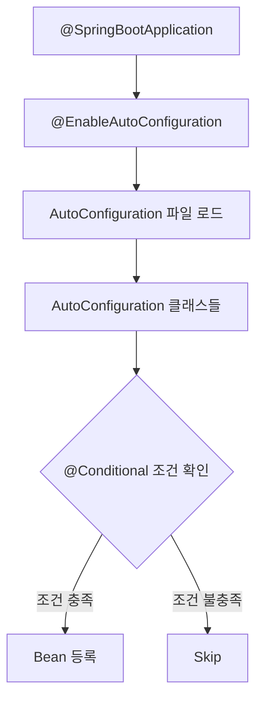

# 🚀 Spring Boot: 자동 설정의 마법

> **이 문서의 목표:** Spring Boot의 **Auto Configuration** 원리를 이해하고, 생산성을 높이는 다양한 기능들을 **왜 그렇게 동작하는지** 파악하여 효과적으로 활용한다.

---

## 0. 핵심 질문으로 시작하기

1. **Spring Boot가 Spring Framework와 다른 점은?** → 자동 설정, 내장 서버, Starter 의존성
2. **Auto Configuration은 어떻게 동작하는가?** → @Conditional + META-INF/spring.factories
3. **application.yml vs application.properties?** → YAML은 계층 구조, properties는 단순 키-값
4. **Profile은 언제 사용하는가?** → 환경별(dev, prod) 설정 분리

---

## 1. Spring Boot의 철학: 왜 만들어졌는가? (Why)

### 1.1 Spring Framework의 문제점

```xml
<!-- 기존 Spring: 수십 줄의 XML 설정 필요 -->
<bean id="dataSource" class="org.apache.commons.dbcp.BasicDataSource">
    <property name="driverClassName" value="com.mysql.jdbc.Driver"/>
    <property name="url" value="jdbc:mysql://localhost:3306/mydb"/>
    <!-- ... 더 많은 설정 ... -->
</bean>

<bean id="transactionManager" 
      class="org.springframework.jdbc.datasource.DataSourceTransactionManager">
    <property name="dataSource" ref="dataSource"/>
</bean>
```

### 1.2 Spring Boot의 해결책

```yaml
# Spring Boot: 단 몇 줄로 끝
spring:
  datasource:
    url: jdbc:mysql://localhost:3306/mydb
    username: root
    password: secret
```

> [!NOTE]
> **핵심 통찰:** "Convention over Configuration" - 합리적인 기본값을 제공하고, 필요한 부분만 커스터마이징합니다.

---

## 2. Auto Configuration: 어떻게 동작하는가? (How)

### 2.1 동작 원리



> [!IMPORTANT]
> **Spring Boot 버전별 설정 파일 차이:**
> | 버전 | 설정 파일 위치 |
> |:---:|:---|
> | **2.x** | `META-INF/spring.factories` |
> | **3.x** | `META-INF/spring/org.springframework.boot.autoconfigure.AutoConfiguration.imports` |
>
> Spring Boot 3.x부터는 `spring.factories`가 deprecated되고 `.imports` 파일을 사용합니다.

### 2.2 @SpringBootApplication 분석

```java
@SpringBootApplication
// 실제로는 아래 3개 어노테이션의 조합
// @SpringBootConfiguration  → @Configuration과 동일
// @EnableAutoConfiguration  → 자동 설정 활성화
// @ComponentScan            → 컴포넌트 스캔
public class Application {
    public static void main(String[] args) {
        SpringApplication.run(Application.class, args);
    }
}
```

### 2.3 조건부 설정 (@Conditional)

| 어노테이션 | 조건 |
|:---|:---|
| `@ConditionalOnClass` | 특정 클래스가 classpath에 있을 때 |
| `@ConditionalOnMissingBean` | 해당 타입의 Bean이 없을 때 |
| `@ConditionalOnProperty` | 특정 프로퍼티 값이 설정되었을 때 |

```java
// DataSource 자동 설정 예시 (실제 Spring Boot 내부)
@Configuration
@ConditionalOnClass(DataSource.class)
@ConditionalOnMissingBean(DataSource.class)
public class DataSourceAutoConfiguration {
    
    @Bean
    @ConfigurationProperties("spring.datasource")
    public DataSource dataSource() {
        return DataSourceBuilder.create().build();
    }
}
```

---

## 3. Starter 의존성: 무엇을 제공하는가? (What)

### 3.1 주요 Starter 목록

| Starter | 포함 내용 |
|:---|:---|
| `spring-boot-starter-web` | Spring MVC, Tomcat, Jackson |
| `spring-boot-starter-data-jpa` | Spring Data JPA, Hibernate |
| `spring-boot-starter-security` | Spring Security |
| `spring-boot-starter-test` | JUnit, Mockito, AssertJ |

### 3.2 의존성 관리

```gradle
// build.gradle
dependencies {
    implementation 'org.springframework.boot:spring-boot-starter-web'
    // 버전 명시 불필요! spring-boot-dependencies BOM이 관리
}
```

> [!TIP]
> **버전 충돌 방지:** Spring Boot BOM(Bill of Materials)이 모든 의존성 버전을 호환되게 관리합니다.

---

## 4. 외부 설정과 Profile

### 4.1 설정 우선순위 (높은 순)

```
1. 커맨드라인 인수 (--server.port=9000)
2. 환경 변수 (SERVER_PORT=9000)
3. application-{profile}.yml
4. application.yml
5. @PropertySource
6. 기본값
```

### 4.2 Profile 활용

```yaml
# application.yml (공통)
spring:
  profiles:
    active: local  # 기본 프로파일

---
# application-local.yml
spring:
  datasource:
    url: jdbc:h2:mem:testdb

---
# application-prod.yml
spring:
  datasource:
    url: jdbc:mysql://prod-db:3306/mydb
```

```bash
# 실행 시 프로파일 지정
java -jar app.jar --spring.profiles.active=prod
```

### 4.3 @ConfigurationProperties

```java
@Configuration
@ConfigurationProperties(prefix = "app")
@Validated
public class AppProperties {
    
    @NotBlank
    private String name;
    
    @Min(1)
    @Max(100)
    private int maxConnections;
    
    // getters, setters
}
```

```yaml
app:
  name: MyApplication
  max-connections: 50  # kebab-case 자동 변환
```

---

## 5. Actuator: 모니터링과 관리

### 5.1 주요 엔드포인트

| 엔드포인트 | 설명 |
|:---|:---|
| `/actuator/health` | 애플리케이션 상태 |
| `/actuator/info` | 빌드 정보 |
| `/actuator/metrics` | 메트릭 정보 |
| `/actuator/env` | 환경 변수 |

### 5.2 설정 예시

```yaml
management:
  endpoints:
    web:
      exposure:
        include: health, info, metrics
  endpoint:
    health:
      show-details: always
```

> [!WARNING]
> **보안 주의:** 프로덕션 환경에서는 `/actuator` 엔드포인트에 반드시 인증을 적용하세요.

---

## 6. 🎯 1분 요약

1. **Auto Configuration**: @Conditional 조건에 따라 Bean 자동 등록
2. **Starter**: 관련 의존성 묶음 + 자동 설정 제공
3. **Profile**: 환경별 설정 분리 (local, dev, prod)
4. **Actuator**: 운영 환경 모니터링 엔드포인트 제공

---

## 7. 📝 자가 점검 질문

1. **Auto Configuration을 비활성화하는 방법은?**
   → `@SpringBootApplication(exclude = {DataSourceAutoConfiguration.class})`

2. **application.yml의 설정이 적용되지 않을 때 확인할 것은?**
   → 파일 위치(src/main/resources), 들여쓰기, 프로파일 활성화 여부

3. **@Value vs @ConfigurationProperties의 차이는?**
   → @Value: 단일 값, SpEL 지원 / @ConfigurationProperties: 계층적 바인딩, 타입 안전

4. **Actuator의 커스텀 Health Indicator를 만드는 방법은?**
   → `HealthIndicator` 인터페이스 구현, `Health.up()` 또는 `Health.down()` 반환
