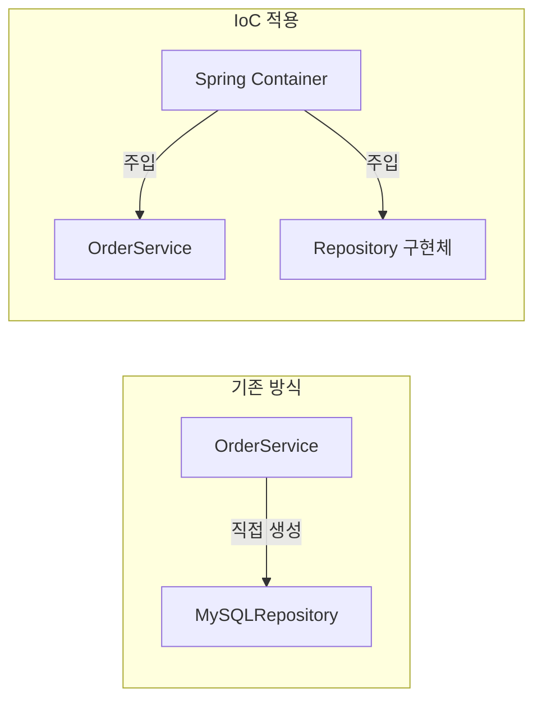
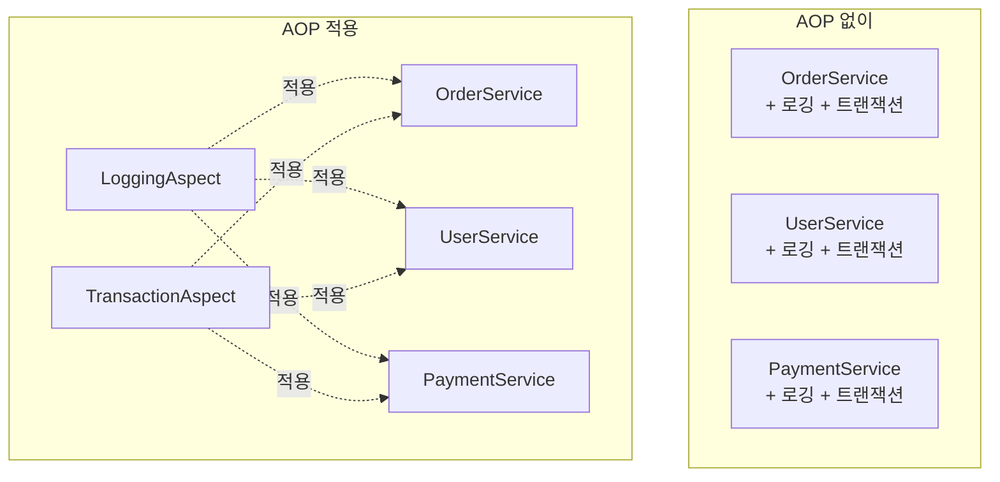

# 🌱 Spring Core: IoC와 DI의 본질

> **이 문서의 목표:** Spring Framework의 핵심 철학인 **IoC(제어의 역전)**와 **DI(의존성 주입)**를 단순 사용법이 아닌 **설계 원리**로 이해하고, 유연한 애플리케이션 구조를 설계할 수 있는 역량을 기른다.

---

## 0. 핵심 질문으로 시작하기

1. **IoC란 무엇이고 왜 필요한가?** → 객체 생성/관리 책임을 프레임워크에 위임, 결합도 감소
2. **DI의 3가지 방식과 권장 방식은?** → 생성자, Setter, 필드 주입 / 생성자 주입 권장
3. **Bean의 Scope 종류는?** → singleton, prototype, request, session, application
4. **AOP는 어떤 문제를 해결하는가?** → 횡단 관심사(로깅, 트랜잭션) 분리

---

## 1. IoC (Inversion of Control): 왜 필요한가? (Why)

### 1.1 전통적인 방식의 문제점

```java
// ❌ 강한 결합: OrderService가 직접 의존성을 생성
public class OrderService {
    private final OrderRepository repository = new MySQLOrderRepository();
    private final PaymentGateway payment = new StripePaymentGateway();
    
    // 테스트 시 Mock 객체로 교체 불가능!
}
```

### 1.2 IoC를 적용한 방식

```java
// ✅ 느슨한 결합: 외부에서 의존성을 주입받음
public class OrderService {
    private final OrderRepository repository;
    private final PaymentGateway payment;
    
    public OrderService(OrderRepository repository, PaymentGateway payment) {
        this.repository = repository;
        this.payment = payment;
    }
}
```



> [!NOTE]
> **핵심 통찰:** 제어의 흐름이 역전됩니다. 객체가 의존성을 찾는 것이 아니라, 컨테이너가 의존성을 주입해줍니다.

---

## 2. DI (Dependency Injection): 어떻게 동작하는가? (How)

### 2.1 의존성 주입 방식 비교

| 방식 | 장점 | 단점 | 권장 |
|:---:|:---|:---|:---:|
| **생성자 주입** | 불변성 보장, 테스트 용이 | 의존성 많으면 코드 길어짐 | ✅ |
| **Setter 주입** | 선택적 의존성에 적합 | 불변성 보장 불가 | △ |
| **필드 주입** | 코드 간결 | 테스트 어려움, 순환 참조 감지 불가 | ❌ |

### 2.2 생성자 주입 (권장)

```java
@Service
public class OrderService {
    
    private final OrderRepository orderRepository;
    private final PaymentGateway paymentGateway;
    
    // @Autowired 생략 가능 (생성자가 하나일 때)
    public OrderService(OrderRepository orderRepository, 
                        PaymentGateway paymentGateway) {
        this.orderRepository = orderRepository;
        this.paymentGateway = paymentGateway;
    }
}
```

> [!IMPORTANT]
> **생성자 주입을 권장하는 이유:**
> 1. `final` 키워드로 **불변성** 보장
> 2. **순환 참조**를 컴파일 시점에 감지
> 3. **테스트** 시 Mock 객체 주입 용이

### 2.3 Lombok으로 간소화

```java
@Service
@RequiredArgsConstructor  // final 필드에 대한 생성자 자동 생성
public class OrderService {
    
    private final OrderRepository orderRepository;
    private final PaymentGateway paymentGateway;
}
```

---

## 3. Bean Lifecycle: 생명주기 관리


```java
@Component
public class DatabaseConnection {
    
    @PostConstruct
    public void init() {
        // 빈 생성 후 초기화 로직
        System.out.println("DB 커넥션 풀 초기화");
    }
    
    @PreDestroy
    public void cleanup() {
        // 빈 소멸 전 정리 로직
        System.out.println("DB 커넥션 풀 정리");
    }
}
```

---

## 4. Bean Scope: 범위 설정

| Scope | 설명 | 사용 예시 |
|:---:|:---|:---|
| **singleton** | 컨테이너당 하나 (기본값) | Service, Repository |
| **prototype** | 요청마다 새 인스턴스 | 상태를 가진 객체 |
| **request** | HTTP 요청당 하나 | 요청 정보 저장 |
| **session** | HTTP 세션당 하나 | 사용자 세션 정보 |

```java
@Component
@Scope("prototype")
public class PrototypeBean {
    // 매번 새로운 인스턴스 생성
}
```

> [!WARNING]
> **주의:** Singleton 빈에서 Prototype 빈을 주입받으면, Prototype이 의도대로 동작하지 않습니다. `ObjectProvider` 또는 `@Lookup`을 사용하세요.

---

## 5. 동일 타입 빈 선택: @Qualifier와 @Primary

동일한 인터페이스를 구현한 빈이 여러 개일 때 어떤 빈을 주입할지 결정합니다.

### 5.1 @Primary (기본 빈 지정)

```java
public interface PaymentGateway {
    void pay(int amount);
}

@Component
@Primary  // 기본으로 주입될 빈
public class StripePaymentGateway implements PaymentGateway {
    @Override
    public void pay(int amount) { /* Stripe 결제 */ }
}

@Component
public class TossPaymentGateway implements PaymentGateway {
    @Override
    public void pay(int amount) { /* Toss 결제 */ }
}
```

### 5.2 @Qualifier (명시적 선택)

```java
@Service
@RequiredArgsConstructor
public class OrderService {
    
    // @Primary가 있어도 @Qualifier가 우선
    @Qualifier("tossPaymentGateway")
    private final PaymentGateway paymentGateway;
}

// 또는 커스텀 Qualifier 생성
@Target({ElementType.FIELD, ElementType.PARAMETER})
@Retention(RetentionPolicy.RUNTIME)
@Qualifier
public @interface MainPayment {}

@Component
@MainPayment
public class StripePaymentGateway implements PaymentGateway { }
```

| 어노테이션 | 우선순위 | 용도 |
|:---:|:---:|:---|
| **@Qualifier** | 높음 | 특정 빈을 명시적으로 선택 |
| **@Primary** | 낮음 | 기본 빈 지정, 대부분의 경우 사용 |

---

## 6. AOP (Aspect-Oriented Programming)

### 5.1 횡단 관심사 문제



### 5.2 AOP 구현 예시

```java
@Aspect
@Component
public class LoggingAspect {
    
    private static final Logger log = LoggerFactory.getLogger(LoggingAspect.class);
    
    // 모든 Service 클래스의 메서드 실행 시
    @Around("execution(* com.example..*Service.*(..))")
    public Object logExecutionTime(ProceedingJoinPoint joinPoint) throws Throwable {
        long start = System.currentTimeMillis();
        
        Object result = joinPoint.proceed();
        
        long executionTime = System.currentTimeMillis() - start;
        log.info("{} 실행 시간: {}ms", joinPoint.getSignature(), executionTime);
        
        return result;
    }
}
```

### 5.3 AOP 용어 정리

| 용어 | 설명 |
|:---:|:---|
| **Aspect** | 횡단 관심사 모듈 (로깅, 트랜잭션) |
| **Join Point** | Aspect가 적용될 수 있는 지점 (메서드 실행) |
| **Pointcut** | Join Point를 선별하는 표현식 |
| **Advice** | 실제 실행될 로직 (Before, After, Around) |

---

## 7. 🎯 1분 요약

1. **IoC**: 객체 생성/관리를 Spring Container에 위임 → 결합도 감소
2. **DI**: 생성자 주입 권장 (불변성, 테스트 용이, 순환 참조 감지)
3. **Bean Scope**: singleton(기본), prototype, request, session
4. **@Qualifier/@Primary**: 동일 타입 빈 중 선택 (@Qualifier가 우선)
5. **AOP**: 횡단 관심사(로깅, 트랜잭션)를 핵심 로직에서 분리

---

## 8. 📝 자가 점검 질문

1. **IoC와 DI의 차이를 설명하세요.**
   → IoC는 제어 흐름의 역전(개념), DI는 IoC를 구현하는 방법(패턴)

2. **생성자 주입이 필드 주입보다 나은 이유는?**
   → 불변성 보장, 순환 참조 컴파일 시점 감지, 테스트 시 Mock 주입 용이

3. **@Component vs @Bean의 차이는?**
   → @Component: 클래스 레벨, 컴포넌트 스캔 대상 / @Bean: 메서드 레벨, 수동 등록

4. **AOP의 프록시 방식 (JDK Dynamic Proxy vs CGLIB)의 차이는?**
   → JDK: 인터페이스 기반 / CGLIB: 클래스 상속 기반, Spring Boot 기본값

5. **@Primary와 @Qualifier 중 우선순위가 높은 것은?**
   → @Qualifier. 명시적 지정이 기본값보다 우선
