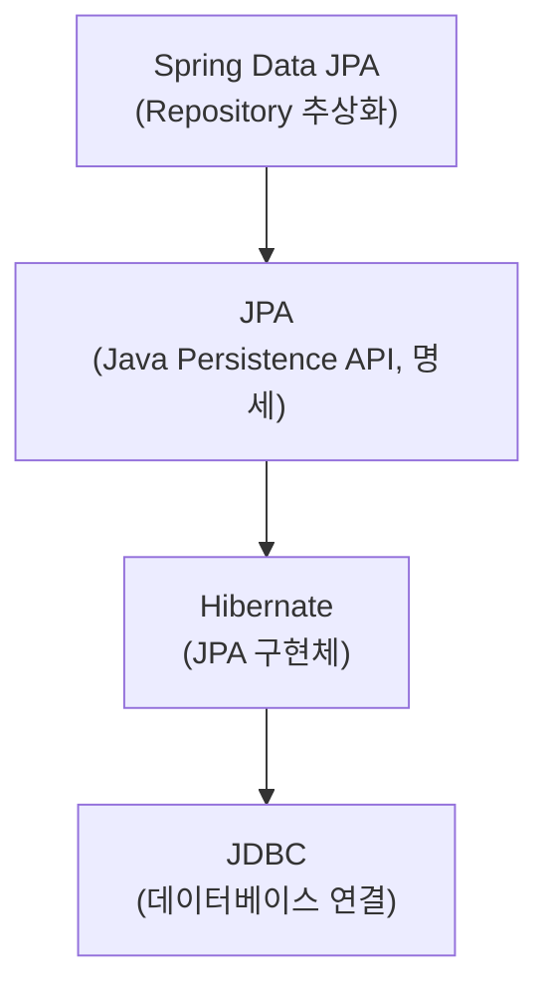
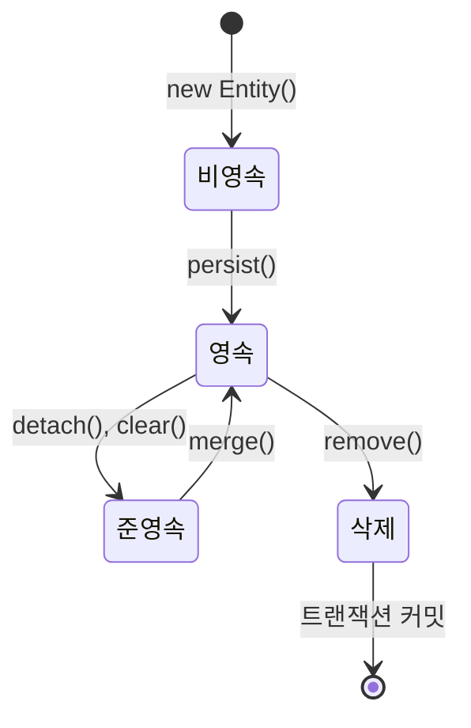

# 🗄️ Spring Data JPA: ORM과 영속성 컨텍스트

> **이 문서의 목표:** JPA의 핵심 개념인 **영속성 컨텍스트**를 이해하고, 실무에서 자주 발생하는 **N+1 문제**를 해결하며, 효율적인 데이터 접근 계층을 설계할 수 있는 역량을 기른다.

---

## 0. 핵심 질문으로 시작하기

1. **JPA vs Hibernate vs Spring Data JPA의 관계는?** → 명세 vs 구현체 vs 추상화
2. **영속성 컨텍스트란?** → 엔티티를 관리하는 1차 캐시
3. **N+1 문제란 무엇이고 해결 방법은?** → 연관 엔티티 조회 시 추가 쿼리 발생, Fetch Join으로 해결
4. **지연 로딩(Lazy) vs 즉시 로딩(Eager)?** → 성능 최적화, Lazy 권장

---

## 1. JPA 계층 구조: 왜 이렇게 나뉘는가? (Why)



| 레이어 | 역할 |
|:---|:---|
| **Spring Data JPA** | Repository 인터페이스만으로 CRUD 구현 |
| **JPA** | ORM 표준 명세 (인터페이스) |
| **Hibernate** | JPA 구현체 (실제 동작) |

> [!NOTE]
> **핵심 통찰:** JPA는 인터페이스(명세), Hibernate는 구현체입니다. Spring Data JPA는 이를 더 쉽게 사용하게 해주는 추상화 계층입니다.

---

## 2. 영속성 컨텍스트: 어떻게 동작하는가? (How)

### 2.1 엔티티 생명주기



### 2.2 영속성 컨텍스트의 이점

```java
@Transactional
public void example() {
    // 1차 캐시: 같은 트랜잭션 내 동일 엔티티는 한 번만 조회
    User user1 = userRepository.findById(1L).get();  // DB 조회
    User user2 = userRepository.findById(1L).get();  // 1차 캐시에서 반환
    System.out.println(user1 == user2);  // true (동일성 보장)
    
    // 변경 감지 (Dirty Checking)
    user1.setName("변경된 이름");
    // save() 호출 없이도 트랜잭션 커밋 시 UPDATE 쿼리 자동 실행
}
```

| 기능 | 설명 |
|:---:|:---|
| **1차 캐시** | 동일 트랜잭션 내 엔티티 재사용 |
| **동일성 보장** | 같은 엔티티는 같은 인스턴스 |
| **변경 감지** | 엔티티 변경 시 자동 UPDATE |
| **쓰기 지연** | 트랜잭션 커밋 시점에 쿼리 일괄 실행 |

---

## 3. N+1 문제와 해결: 실전 코드 (What)

### 3.1 N+1 문제 발생 상황

```java
@Entity
public class Team {
    @Id @GeneratedValue
    private Long id;
    
    @OneToMany(mappedBy = "team", fetch = FetchType.LAZY)
    private List<Member> members = new ArrayList<>();
}

@Entity
public class Member {
    @Id @GeneratedValue
    private Long id;
    
    @ManyToOne(fetch = FetchType.LAZY)
    private Team team;
}
```

```java
// ❌ N+1 발생
List<Team> teams = teamRepository.findAll();  // 쿼리 1회
for (Team team : teams) {
    team.getMembers().size();  // 팀마다 추가 쿼리 N회 발생!
}
```

### 3.2 해결 방법 1: Fetch Join

```java
public interface TeamRepository extends JpaRepository<Team, Long> {
    
    @Query("SELECT t FROM Team t JOIN FETCH t.members")
    List<Team> findAllWithMembers();
}
```

### 3.3 해결 방법 2: @EntityGraph

```java
public interface TeamRepository extends JpaRepository<Team, Long> {
    
    @EntityGraph(attributePaths = {"members"})
    List<Team> findAll();
}
```

### 3.4 해결 방법 3: @BatchSize

```java
@Entity
public class Team {
    @OneToMany(mappedBy = "team")
    @BatchSize(size = 100)  // IN 쿼리로 100개씩 조회
    private List<Member> members;
}
```

| 방법 | 장점 | 단점 |
|:---:|:---|:---|
| **Fetch Join** | 한 번의 쿼리로 해결 | 페이징 불가, 중복 데이터 |
| **@EntityGraph** | 선언적, 간편 | 복잡한 조건 불가 |
| **@BatchSize** | 페이징 가능 | 추가 쿼리 발생 (N/batch) |

> [!WARNING]
> **흔한 실수:** `FetchType.EAGER`로 모두 설정하면 N+1은 피하지만, 불필요한 데이터까지 항상 로딩됩니다. **기본은 LAZY, 필요할 때만 Fetch Join**을 사용하세요.

---

## 4. Repository 활용

### 4.1 쿼리 메서드

```java
public interface UserRepository extends JpaRepository<User, Long> {
    
    // 메서드 이름으로 쿼리 생성
    List<User> findByNameAndAge(String name, int age);
    List<User> findByNameContaining(String keyword);
    List<User> findByCreatedAtAfter(LocalDateTime date);
    
    // 정렬과 페이징
    Page<User> findByStatus(UserStatus status, Pageable pageable);
    
    // @Query로 직접 작성
    @Query("SELECT u FROM User u WHERE u.email LIKE %:domain")
    List<User> findByEmailDomain(@Param("domain") String domain);
    
    // Native Query
    @Query(value = "SELECT * FROM users WHERE created_at > :date", nativeQuery = true)
    List<User> findRecentUsers(@Param("date") LocalDateTime date);
}
```

### 4.2 동적 쿼리 (QueryDSL)

```java
@Repository
@RequiredArgsConstructor
public class UserQueryRepository {
    
    private final JPAQueryFactory queryFactory;
    
    public List<User> searchUsers(UserSearchCondition condition) {
        return queryFactory
                .selectFrom(user)
                .where(
                    nameContains(condition.getName()),
                    ageGoe(condition.getMinAge()),
                    statusEq(condition.getStatus())
                )
                .fetch();
    }
    
    private BooleanExpression nameContains(String name) {
        return name != null ? user.name.contains(name) : null;
    }
    
    private BooleanExpression ageGoe(Integer minAge) {
        return minAge != null ? user.age.goe(minAge) : null;
    }
    
    private BooleanExpression statusEq(UserStatus status) {
        return status != null ? user.status.eq(status) : null;
    }
}
```

---

## 5. 트랜잭션과 영속성 컨텍스트

### 5.1 @Transactional 범위

```java
@Service
@RequiredArgsConstructor
public class UserService {
    
    private final UserRepository userRepository;
    
    @Transactional  // 영속성 컨텍스트 시작
    public void updateUser(Long id, String newName) {
        User user = userRepository.findById(id)
                .orElseThrow(() -> new EntityNotFoundException("User not found"));
        
        user.setName(newName);  // 변경 감지
        // save() 호출 불필요!
    }  // 트랜잭션 커밋 → 변경 감지 → UPDATE 쿼리 실행
    
    @Transactional(readOnly = true)  // 읽기 전용 최적화
    public User getUser(Long id) {
        return userRepository.findById(id)
                .orElseThrow(() -> new EntityNotFoundException("User not found"));
    }
}
```

> [!TIP]
> **readOnly = true 설정 시:**
> - 변경 감지 비활성화 → 성능 향상
> - 읽기 전용 DB 연결 사용 가능 (Replication 환경)

---

## 6. 실무 필수 기능

### 6.1 Auditing (생성/수정 시간 자동 관리)

```java
// 1. 설정 활성화
@Configuration
@EnableJpaAuditing
public class JpaConfig {
    
    @Bean
    public AuditorAware<String> auditorProvider() {
        return () -> Optional.ofNullable(SecurityContextHolder.getContext())
                .map(SecurityContext::getAuthentication)
                .map(Authentication::getName);
    }
}

// 2. BaseEntity 정의
@MappedSuperclass
@EntityListeners(AuditingEntityListener.class)
@Getter
public abstract class BaseEntity {
    
    @CreatedDate
    @Column(updatable = false)
    private LocalDateTime createdAt;
    
    @LastModifiedDate
    private LocalDateTime updatedAt;
    
    @CreatedBy
    @Column(updatable = false)
    private String createdBy;
    
    @LastModifiedBy
    private String updatedBy;
}

// 3. Entity에서 상속
@Entity
public class User extends BaseEntity {
    @Id @GeneratedValue
    private Long id;
    private String name;
}
```

### 6.2 Projection (필요한 컬럼만 조회)

```java
// Interface 기반 Projection
public interface UserSummary {
    String getName();
    String getEmail();
}

// DTO 기반 Projection (권장)
public record UserDto(String name, String email) {}

public interface UserRepository extends JpaRepository<User, Long> {
    
    // Interface Projection
    List<UserSummary> findAllProjectedBy();
    
    // DTO Projection (@Query 사용)
    @Query("SELECT new com.example.dto.UserDto(u.name, u.email) FROM User u")
    List<UserDto> findAllAsDto();
    
    // 동적 Projection
    <T> List<T> findByStatus(UserStatus status, Class<T> type);
}
```

> [!TIP]
> **Projection 사용 시기:**
> - Entity의 일부 필드만 필요할 때 → 불필요한 데이터 로딩 방지
> - API 응답용 DTO가 Entity와 다를 때 → 영속성 컨텍스트 오염 방지

### 6.3 벌크 연산 (@Modifying)

```java
public interface UserRepository extends JpaRepository<User, Long> {
    
    @Modifying(clearAutomatically = true)  // 영속성 컨텍스트 자동 초기화
    @Query("UPDATE User u SET u.status = :status WHERE u.lastLoginAt < :date")
    int bulkUpdateStatus(@Param("status") UserStatus status, 
                         @Param("date") LocalDateTime date);
    
    @Modifying
    @Query("DELETE FROM User u WHERE u.status = 'INACTIVE'")
    int deleteInactiveUsers();
}
```

> [!WARNING]
> **벌크 연산 주의사항:**
> - 영속성 컨텍스트를 무시하고 DB에 직접 쿼리 실행
> - `clearAutomatically = true`로 1차 캐시 동기화 필요
> - 변경 감지(Dirty Checking)와 함께 사용 시 주의

---

## 7. 🎯 1분 요약

1. **영속성 컨텍스트**: 1차 캐시, 변경 감지, 쓰기 지연 제공
2. **N+1 문제**: Fetch Join, @EntityGraph, @BatchSize로 해결
3. **Lazy Loading**: 기본값으로 사용, 필요 시 Fetch Join
4. **@Transactional**: 영속성 컨텍스트 범위 결정, readOnly로 최적화
5. **Auditing**: @CreatedDate, @LastModifiedDate로 자동 시간 관리
6. **Projection**: 필요한 컬럼만 조회하여 성능 최적화

---

## 8. 📝 자가 점검 질문

1. **영속성 컨텍스트의 변경 감지는 어느 시점에 동작하는가?**
   → 트랜잭션 커밋 또는 flush() 호출 시

2. **OSIV(Open Session In View)란 무엇이고 장단점은?**
   → 뷰 렌더링까지 영속성 컨텍스트 유지. 편리하지만 DB 커넥션 점유 시간 증가

3. **Fetch Join의 한계는?**
   → 컬렉션(OneToMany) 두 개 이상 Fetch Join 불가, 페이징 불가

4. **준영속 상태의 엔티티를 다시 영속 상태로 만드는 방법은?**
   → `merge()` 사용. 단, 새 인스턴스를 반환하므로 반환값을 사용해야 함

5. **@Modifying에서 clearAutomatically를 사용하는 이유는?**
   → 벌크 연산은 영속성 컨텍스트를 무시하므로 1차 캐시와 DB 데이터 불일치 방지

6. **Projection을 사용하면 좋은 경우는?**
   → Entity 일부 필드만 필요할 때, 성능 최적화 및 불필요한 데이터 로딩 방지
