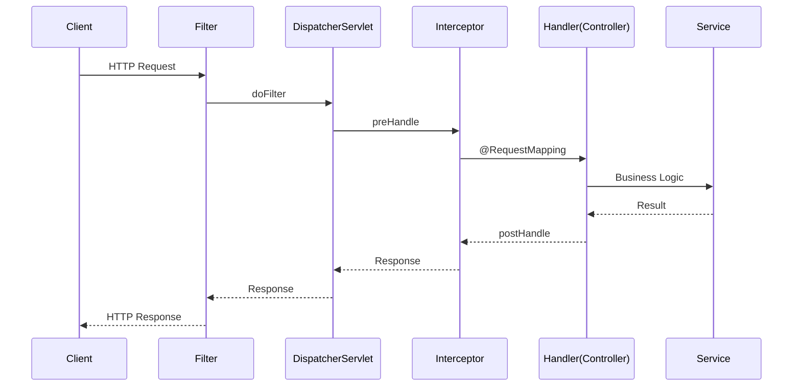
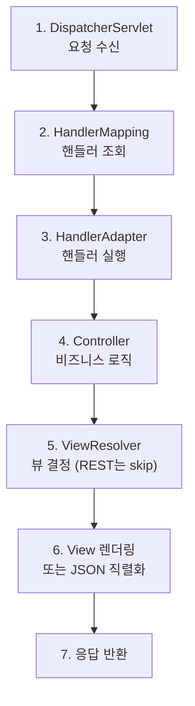
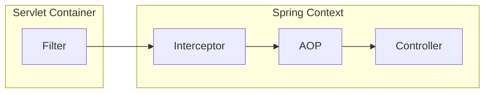
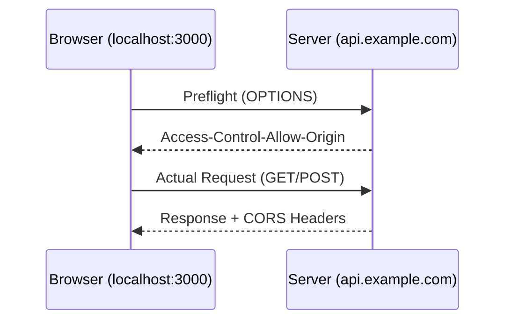

# 🌐 Spring MVC: 웹 요청 처리의 흐름

> **이 문서의 목표:** Spring MVC의 **요청 처리 파이프라인**을 이해하고, Filter, Interceptor, AOP의 차이를 명확히 파악하여 적절한 곳에 횡단 관심사를 배치할 수 있는 역량을 기른다.

---

## 0. 핵심 질문으로 시작하기

1. **DispatcherServlet의 역할은?** → Front Controller, 모든 요청의 진입점
2. **Filter vs Interceptor vs AOP의 차이는?** → 적용 범위와 시점이 다름
3. **@Controller vs @RestController?** → @ResponseBody 포함 여부
4. **예외 처리 전략은?** → @ExceptionHandler, @ControllerAdvice

---

## 1. Spring MVC 아키텍처: 왜 이렇게 설계되었는가? (Why)

### 1.1 Front Controller 패턴

모든 요청을 단일 진입점(DispatcherServlet)에서 받아 처리합니다.



> [!NOTE]
> **핵심 통찰:** DispatcherServlet이 중앙 집중식으로 요청을 분배하여, 공통 처리 로직을 일관되게 적용할 수 있습니다.

---

## 2. 요청 처리 흐름: 어떻게 동작하는가? (How)

### 2.1 DispatcherServlet 내부 흐름



### 2.2 주요 컴포넌트

| 컴포넌트 | 역할 |
|:---|:---|
| **HandlerMapping** | URL → Controller 메서드 매핑 |
| **HandlerAdapter** | Controller 메서드 실행 |
| **ViewResolver** | 뷰 이름 → 실제 View 객체 변환 |
| **HttpMessageConverter** | 객체 ↔ JSON/XML 변환 |

---

## 3. Filter vs Interceptor vs AOP

### 3.1 실행 순서



### 3.2 비교표

| 구분 | Filter | Interceptor | AOP |
|:---:|:---|:---|:---|
| **관리 주체** | Servlet Container | Spring Container | Spring Container |
| **적용 대상** | 모든 요청 | Spring MVC 요청만 | 모든 Bean |
| **접근 가능** | Request/Response | Request/Response + Handler | JoinPoint 정보 |
| **용도** | 인코딩, 보안, 로깅 | 인증, 권한, 로깅 | 트랜잭션, 로깅 |

### 3.3 구현 예시

#### Filter

```java
@Component
@Order(1)
public class LoggingFilter implements Filter {
    
    @Override
    public void doFilter(ServletRequest request, ServletResponse response, 
                         FilterChain chain) throws IOException, ServletException {
        HttpServletRequest req = (HttpServletRequest) request;
        log.info("Request URI: {}", req.getRequestURI());
        
        chain.doFilter(request, response);  // 다음 필터로 전달
        
        log.info("Response Status: {}", ((HttpServletResponse) response).getStatus());
    }
}
```

#### Interceptor

```java
@Component
public class AuthInterceptor implements HandlerInterceptor {
    
    @Override
    public boolean preHandle(HttpServletRequest request, 
                             HttpServletResponse response, 
                             Object handler) {
        String token = request.getHeader("Authorization");
        if (token == null) {
            response.setStatus(HttpStatus.UNAUTHORIZED.value());
            return false;  // 요청 중단
        }
        return true;  // 다음 단계 진행
    }
    
    @Override
    public void postHandle(HttpServletRequest request, 
                           HttpServletResponse response,
                           Object handler, ModelAndView modelAndView) {
        // Controller 실행 후, View 렌더링 전
    }
    
    @Override
    public void afterCompletion(HttpServletRequest request, 
                                HttpServletResponse response,
                                Object handler, Exception ex) {
        // 요청 완료 후 (예외 발생 여부 관계없이)
    }
}
```

#### Interceptor 등록

```java
@Configuration
public class WebConfig implements WebMvcConfigurer {
    
    private final AuthInterceptor authInterceptor;
    
    @Override
    public void addInterceptors(InterceptorRegistry registry) {
        registry.addInterceptor(authInterceptor)
                .addPathPatterns("/api/**")
                .excludePathPatterns("/api/auth/**");
    }
}
```

---

## 4. Controller 구현: 실전 코드 (What)

### 4.1 @RestController

```java
@RestController
@RequestMapping("/api/v1/users")
@RequiredArgsConstructor
public class UserController {
    
    private final UserService userService;
    
    @GetMapping("/{id}")
    public ResponseEntity<UserResponse> getUser(@PathVariable Long id) {
        return ResponseEntity.ok(userService.findById(id));
    }
    
    @PostMapping
    public ResponseEntity<UserResponse> createUser(
            @Valid @RequestBody UserCreateRequest request) {
        UserResponse created = userService.create(request);
        URI location = URI.create("/api/v1/users/" + created.getId());
        return ResponseEntity.created(location).body(created);
    }
    
    @PutMapping("/{id}")
    public ResponseEntity<UserResponse> updateUser(
            @PathVariable Long id,
            @Valid @RequestBody UserUpdateRequest request) {
        return ResponseEntity.ok(userService.update(id, request));
    }
    
    @DeleteMapping("/{id}")
    public ResponseEntity<Void> deleteUser(@PathVariable Long id) {
        userService.delete(id);
        return ResponseEntity.noContent().build();
    }
}
```

### 4.2 요청 파라미터 바인딩

| 어노테이션 | 용도 | 예시 |
|:---|:---|:---|
| `@PathVariable` | URL 경로 변수 | `/users/{id}` |
| `@RequestParam` | 쿼리 파라미터 | `/users?name=kim` |
| `@RequestBody` | JSON 요청 본문 | POST/PUT body |
| `@RequestHeader` | HTTP 헤더 | Authorization |

---

## 5. 예외 처리 전략

### 5.1 @ControllerAdvice (전역 예외 처리)

```java
@RestControllerAdvice
@Slf4j
public class GlobalExceptionHandler {
    
    @ExceptionHandler(EntityNotFoundException.class)
    public ResponseEntity<ErrorResponse> handleNotFound(EntityNotFoundException e) {
        log.warn("Entity not found: {}", e.getMessage());
        return ResponseEntity.status(HttpStatus.NOT_FOUND)
                .body(new ErrorResponse("NOT_FOUND", e.getMessage()));
    }
    
    @ExceptionHandler(MethodArgumentNotValidException.class)
    public ResponseEntity<ErrorResponse> handleValidation(MethodArgumentNotValidException e) {
        String message = e.getBindingResult().getFieldErrors().stream()
                .map(error -> error.getField() + ": " + error.getDefaultMessage())
                .collect(Collectors.joining(", "));
        return ResponseEntity.badRequest()
                .body(new ErrorResponse("VALIDATION_ERROR", message));
    }
    
    @ExceptionHandler(Exception.class)
    public ResponseEntity<ErrorResponse> handleUnexpected(Exception e) {
        log.error("Unexpected error", e);
        return ResponseEntity.status(HttpStatus.INTERNAL_SERVER_ERROR)
                .body(new ErrorResponse("INTERNAL_ERROR", "서버 오류가 발생했습니다."));
    }
}
```

> [!WARNING]
> **흔한 실수:** 예외를 catch하고 로그만 남긴 뒤 null을 반환하면 안 됩니다. 클라이언트에게 명확한 에러 응답을 보내세요.

---

## 6. CORS 설정

### 6.1 CORS (Cross-Origin Resource Sharing)

다른 도메인에서 API를 호출할 때 필요한 보안 설정입니다.



### 6.2 설정 방법

```java
// 방법 1: 컨트롤러 레벨
@RestController
@CrossOrigin(origins = "http://localhost:3000")
public class UserController { }

// 방법 2: 메서드 레벨
@GetMapping("/users")
@CrossOrigin(origins = "*", maxAge = 3600)
public List<User> getUsers() { }

// 방법 3: 전역 설정 (권장)
@Configuration
public class WebConfig implements WebMvcConfigurer {
    
    @Override
    public void addCorsMappings(CorsRegistry registry) {
        registry.addMapping("/api/**")
                .allowedOrigins("http://localhost:3000", "https://example.com")
                .allowedMethods("GET", "POST", "PUT", "DELETE", "OPTIONS")
                .allowedHeaders("*")
                .allowCredentials(true)
                .maxAge(3600);
    }
}
```

> [!WARNING]
> **Spring Security와 함께 사용 시:**
> `WebMvcConfigurer`만으로는 부족합니다. Security 설정에서도 CORS를 활성화해야 합니다.

```java
@Bean
public SecurityFilterChain securityFilterChain(HttpSecurity http) throws Exception {
    return http
            .cors(cors -> cors.configurationSource(corsConfigurationSource()))
            // ... 기타 설정
            .build();
}

@Bean
public CorsConfigurationSource corsConfigurationSource() {
    CorsConfiguration config = new CorsConfiguration();
    config.setAllowedOrigins(List.of("http://localhost:3000"));
    config.setAllowedMethods(List.of("*"));
    config.setAllowedHeaders(List.of("*"));
    config.setAllowCredentials(true);
    
    UrlBasedCorsConfigurationSource source = new UrlBasedCorsConfigurationSource();
    source.registerCorsConfiguration("/**", config);
    return source;
}
```

---

## 7. 비동기 처리

### 7.1 @Async 사용

```java
// 1. 설정 활성화
@Configuration
@EnableAsync
public class AsyncConfig implements AsyncConfigurer {
    
    @Override
    public Executor getAsyncExecutor() {
        ThreadPoolTaskExecutor executor = new ThreadPoolTaskExecutor();
        executor.setCorePoolSize(5);
        executor.setMaxPoolSize(10);
        executor.setQueueCapacity(100);
        executor.setThreadNamePrefix("Async-");
        executor.initialize();
        return executor;
    }
}

// 2. 비동기 메서드 정의
@Service
@RequiredArgsConstructor
public class NotificationService {
    
    @Async
    public void sendEmailAsync(String email, String message) {
        // 비동기로 실행됨
        emailSender.send(email, message);
    }
    
    @Async
    public CompletableFuture<String> fetchDataAsync() {
        String result = externalApi.call();
        return CompletableFuture.completedFuture(result);
    }
}
```

> [!IMPORTANT]
> **@Async 주의사항:**
> - 같은 클래스 내부 호출은 프록시를 거치지 않아 **동기로 실행**됨
> - 반드시 다른 Bean에서 호출해야 비동기 동작

### 7.2 WebClient (비동기 HTTP 클라이언트)

```java
@Service
public class ExternalApiService {
    
    private final WebClient webClient;
    
    public ExternalApiService(WebClient.Builder builder) {
        this.webClient = builder
                .baseUrl("https://api.example.com")
                .defaultHeader(HttpHeaders.CONTENT_TYPE, MediaType.APPLICATION_JSON_VALUE)
                .build();
    }
    
    // 비동기 호출
    public Mono<UserDto> getUserAsync(Long id) {
        return webClient.get()
                .uri("/users/{id}", id)
                .retrieve()
                .bodyToMono(UserDto.class);
    }
    
    // 동기 호출 (block)
    public UserDto getUserSync(Long id) {
        return webClient.get()
                .uri("/users/{id}", id)
                .retrieve()
                .bodyToMono(UserDto.class)
                .block();
    }
}
```

| 비교 | RestTemplate | WebClient |
|:---:|:---|:---|
| **동작** | 동기 (Blocking) | 비동기/동기 모두 지원 |
| **상태** | Deprecated (유지보수 모드) | 권장 |
| **성능** | 스레드 차단 | Non-blocking I/O |

---

## 8. 🎯 1분 요약

1. **DispatcherServlet**: Front Controller로 모든 요청 중앙 처리
2. **Filter → Interceptor → AOP**: 범위와 목적에 따라 선택
3. **@RestController**: @Controller + @ResponseBody
4. **@ControllerAdvice**: 전역 예외 처리로 일관된 에러 응답
5. **CORS**: WebMvcConfigurer + Security 설정 함께 필요
6. **@Async/WebClient**: 비동기 처리로 응답 시간 개선

---

## 9. 📝 자가 점검 질문

1. **Filter와 Interceptor 중 인증 로직은 어디에 넣어야 할까?**
   → 일반적으로 Interceptor (Spring Security 사용 시 Filter Chain)

2. **@RequestBody가 없으면 POST 요청의 JSON이 어떻게 처리되는가?**
   → 바인딩되지 않음. form-data는 @ModelAttribute로 처리

3. **ResponseEntity를 사용하는 이유는?**
   → HTTP 상태 코드, 헤더, 본문을 명시적으로 제어 가능

4. **Interceptor의 preHandle이 false를 반환하면?**
   → 요청이 Controller까지 도달하지 않고 중단됨

5. **@Async가 같은 클래스 내에서 동작하지 않는 이유는?**
   → 프록시를 거치지 않아 AOP가 적용되지 않음. 다른 Bean에서 호출 필요

6. **RestTemplate 대신 WebClient를 사용하는 이유는?**
   → Non-blocking I/O, 비동기 지원, RestTemplate은 유지보수 모드
