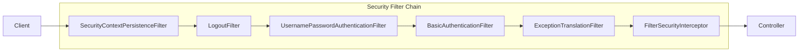
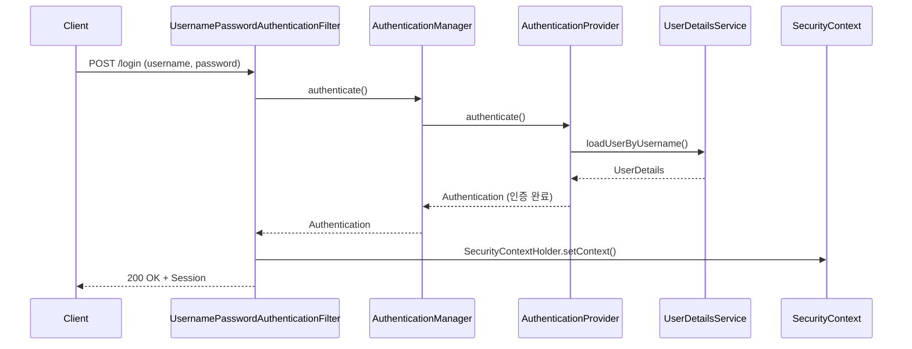
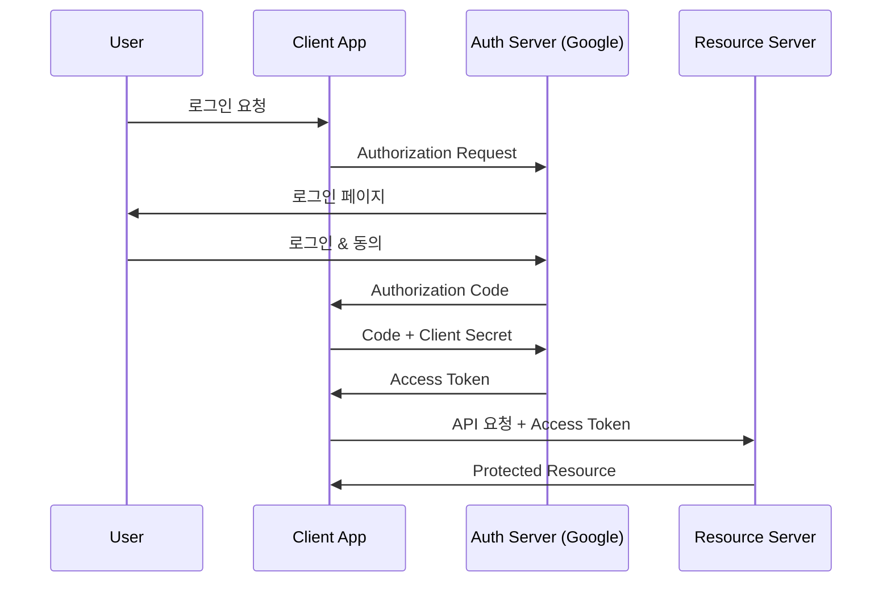

# 🔒 Spring Security: 인증과 인가의 구조

> **이 문서의 목표:** Spring Security의 **Filter Chain 구조**를 이해하고, JWT 기반 인증과 OAuth2 연동을 **원리 중심**으로 구현할 수 있는 역량을 기른다.

---

## 0. 핵심 질문으로 시작하기

1. **인증(Authentication) vs 인가(Authorization)의 차이는?** → "누구인가" vs "무엇을 할 수 있는가"
2. **Security Filter Chain은 어떻게 동작하는가?** → 여러 필터가 순차적으로 요청 처리
3. **JWT 토큰 인증의 장단점은?** → Stateless, 서버 부하 감소 vs 토큰 무효화 어려움
4. **OAuth2의 Grant Type은?** → Authorization Code, Client Credentials 등

---

## 1. Spring Security 아키텍처: 왜 이렇게 설계되었는가? (Why)

### 1.1 Filter Chain 기반 설계



> [!NOTE]
> **핵심 통찰:** 보안 로직을 Filter로 분리하여 Controller 코드를 깔끔하게 유지하고, 관심사를 분리합니다.

---

## 2. 인증 흐름: 어떻게 동작하는가? (How)

### 2.1 Form Login 인증 흐름



### 2.2 핵심 컴포넌트

| 컴포넌트 | 역할 |
|:---|:---|
| **SecurityContext** | 인증된 사용자 정보(Authentication) 보관 |
| **AuthenticationManager** | 인증 처리 진입점 (ProviderManager) |
| **AuthenticationProvider** | 실제 인증 로직 수행 |
| **UserDetailsService** | 사용자 정보 조회 |
| **PasswordEncoder** | 비밀번호 암호화/검증 |

---

## 3. Security 설정: 실전 코드 (What)

### 3.1 기본 설정 (Spring Security 6.x)

```java
@Configuration
@EnableWebSecurity
@RequiredArgsConstructor
public class SecurityConfig {
    
    private final JwtAuthenticationFilter jwtAuthenticationFilter;
    private final CustomUserDetailsService userDetailsService;
    
    @Bean
    public SecurityFilterChain securityFilterChain(HttpSecurity http) throws Exception {
        return http
                .csrf(csrf -> csrf.disable())  // REST API는 CSRF 비활성화
                .sessionManagement(session -> 
                    session.sessionCreationPolicy(SessionCreationPolicy.STATELESS))
                .authorizeHttpRequests(auth -> auth
                    .requestMatchers("/api/auth/**").permitAll()
                    .requestMatchers("/api/admin/**").hasRole("ADMIN")
                    .requestMatchers("/api/**").authenticated()
                    .anyRequest().permitAll()
                )
                .addFilterBefore(jwtAuthenticationFilter, 
                    UsernamePasswordAuthenticationFilter.class)
                .build();
    }
    
    @Bean
    public AuthenticationManager authenticationManager(
            AuthenticationConfiguration config) throws Exception {
        return config.getAuthenticationManager();
    }
    
    @Bean
    public PasswordEncoder passwordEncoder() {
        return new BCryptPasswordEncoder();
    }
}
```

### 3.2 UserDetailsService 구현

```java
@Service
@RequiredArgsConstructor
public class CustomUserDetailsService implements UserDetailsService {
    
    private final UserRepository userRepository;
    
    @Override
    public UserDetails loadUserByUsername(String email) throws UsernameNotFoundException {
        User user = userRepository.findByEmail(email)
                .orElseThrow(() -> new UsernameNotFoundException("User not found: " + email));
        
        return org.springframework.security.core.userdetails.User.builder()
                .username(user.getEmail())
                .password(user.getPassword())
                .roles(user.getRole().name())
                .build();
    }
}
```

---

## 4. JWT 인증 구현

### 4.1 JWT 토큰 생성/검증 (jjwt 0.12.x+)

```java
@Component
public class JwtTokenProvider {
    
    private final SecretKey secretKey;
    private final long validityInMilliseconds;
    
    public JwtTokenProvider(
            @Value("${jwt.secret}") String secret,
            @Value("${jwt.expiration}") long validityInMilliseconds) {
        // Base64로 인코딩된 시크릿 키를 SecretKey 객체로 변환
        this.secretKey = Keys.hmacShaKeyFor(Decoders.BASE64.decode(secret));
        this.validityInMilliseconds = validityInMilliseconds;
    }
    
    public String createToken(String email, String role) {
        Date now = new Date();
        Date validity = new Date(now.getTime() + validityInMilliseconds);
        
        return Jwts.builder()
                .subject(email)
                .claim("role", role)
                .issuedAt(now)
                .expiration(validity)
                .signWith(secretKey)
                .compact();
    }
    
    public String getEmail(String token) {
        return Jwts.parser()
                .verifyWith(secretKey)
                .build()
                .parseSignedClaims(token)
                .getPayload()
                .getSubject();
    }
    
    public boolean validateToken(String token) {
        try {
            Jwts.parser()
                    .verifyWith(secretKey)
                    .build()
                    .parseSignedClaims(token);
            return true;
        } catch (JwtException | IllegalArgumentException e) {
            return false;
        }
    }
}
```

> [!IMPORTANT]
> **jjwt 버전별 차이:**
> - `0.9.x`: `Jwts.parser().setSigningKey()` (Deprecated)
> - `0.12.x+`: `Jwts.parser().verifyWith().build()` (권장)

```gradle
// build.gradle 의존성 (jjwt 0.12.x)
implementation 'io.jsonwebtoken:jjwt-api:0.12.5'
runtimeOnly 'io.jsonwebtoken:jjwt-impl:0.12.5'
runtimeOnly 'io.jsonwebtoken:jjwt-jackson:0.12.5'
```
```

### 4.2 JWT 인증 필터

```java
@Component
@RequiredArgsConstructor
public class JwtAuthenticationFilter extends OncePerRequestFilter {
    
    private final JwtTokenProvider jwtTokenProvider;
    private final CustomUserDetailsService userDetailsService;
    
    @Override
    protected void doFilterInternal(HttpServletRequest request,
                                    HttpServletResponse response,
                                    FilterChain filterChain) 
            throws ServletException, IOException {
        
        String token = resolveToken(request);
        
        if (token != null && jwtTokenProvider.validateToken(token)) {
            String email = jwtTokenProvider.getEmail(token);
            UserDetails userDetails = userDetailsService.loadUserByUsername(email);
            
            UsernamePasswordAuthenticationToken authentication =
                    new UsernamePasswordAuthenticationToken(
                            userDetails, null, userDetails.getAuthorities());
            
            SecurityContextHolder.getContext().setAuthentication(authentication);
        }
        
        filterChain.doFilter(request, response);
    }
    
    private String resolveToken(HttpServletRequest request) {
        String bearerToken = request.getHeader("Authorization");
        if (bearerToken != null && bearerToken.startsWith("Bearer ")) {
            return bearerToken.substring(7);
        }
        return null;
    }
}
```

---

## 5. OAuth2 연동

### 5.1 OAuth2 흐름 (Authorization Code Grant)



### 5.2 OAuth2 설정

```yaml
spring:
  security:
    oauth2:
      client:
        registration:
          google:
            client-id: ${GOOGLE_CLIENT_ID}
            client-secret: ${GOOGLE_CLIENT_SECRET}
            scope: email, profile
```

```java
@Configuration
@EnableWebSecurity
public class OAuth2SecurityConfig {
    
    @Bean
    public SecurityFilterChain securityFilterChain(HttpSecurity http) throws Exception {
        return http
                .oauth2Login(oauth2 -> oauth2
                    .userInfoEndpoint(userInfo -> 
                        userInfo.userService(customOAuth2UserService))
                    .successHandler(oAuth2SuccessHandler)
                )
                .build();
    }
}
```

> [!WARNING]
> **보안 주의:** Client Secret은 절대 코드에 직접 작성하지 마세요. 환경 변수나 Vault를 사용하세요.

---

## 6. 🎯 1분 요약

1. **인증 vs 인가**: Authentication(신원 확인) vs Authorization(권한 확인)
2. **Filter Chain**: 여러 필터가 순차적으로 보안 처리
3. **JWT**: Stateless 인증, Access/Refresh Token 전략 필요
4. **OAuth2**: 외부 인증 서버 위임, Authorization Code Grant 권장

---

## 7. 📝 자가 점검 질문

1. **CSRF 공격이란 무엇이고, REST API에서 비활성화해도 되는 이유는?**
   → 세션 기반 인증을 악용한 공격. JWT는 쿠키가 아닌 헤더로 전송하므로 CSRF 불필요

2. **JWT의 단점과 해결 방법은?**
   → 토큰 탈취 시 무효화 어려움. Refresh Token Rotation, 블랙리스트 사용

3. **@PreAuthorize vs @Secured의 차이는?**
   → @PreAuthorize: SpEL 지원, 더 유연 / @Secured: 단순 역할 검사

4. **SecurityContextHolder의 기본 전략은?**
   → ThreadLocal. 스레드별로 SecurityContext 관리
