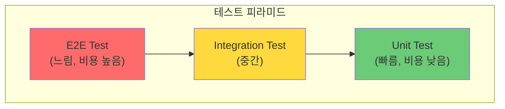
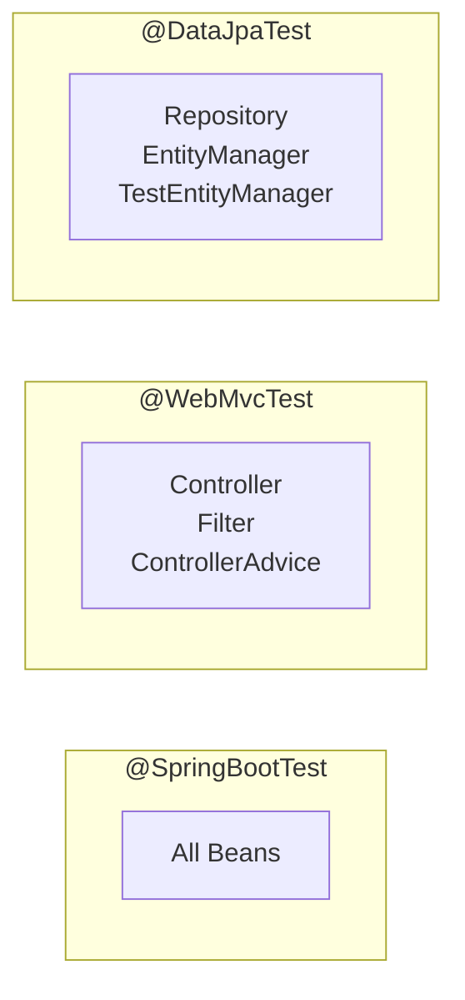

# 🧪 Spring Testing: 효과적인 테스트 전략

> **이 문서의 목표:** Spring Boot 테스트의 **계층별 테스트 전략**을 이해하고, Mock과 Slice Test를 활용하여 **빠르고 안정적인 테스트**를 작성할 수 있는 역량을 기른다.

---

## 0. 핵심 질문으로 시작하기

1. **단위 테스트 vs 통합 테스트의 차이는?** → 격리된 단일 모듈 vs 여러 컴포넌트 협력
2. **@SpringBootTest vs Slice Test?** → 전체 컨텍스트 vs 특정 레이어만 로드
3. **Mock vs Stub vs Spy의 차이는?** → 동작 검증 vs 상태 검증 vs 부분 Mock
4. **테스트 피라미드란?** → Unit > Integration > E2E 비율 권장

---

## 1. 테스트 피라미드: 왜 이렇게 구성하는가? (Why)



| 테스트 유형 | 범위 | 속도 | 비용 |
|:---:|:---|:---:|:---:|
| **Unit** | 단일 클래스/메서드 | 빠름 | 낮음 |
| **Integration** | 여러 컴포넌트 협력 | 중간 | 중간 |
| **E2E** | 전체 시스템 | 느림 | 높음 |

> [!NOTE]
> **핵심 통찰:** 단위 테스트를 많이, 통합 테스트는 적당히, E2E는 핵심 시나리오만 작성합니다.

---

## 2. 테스트 어노테이션: 어떻게 사용하는가? (How)

### 2.1 주요 테스트 어노테이션

| 어노테이션 | 로드 범위 | 용도 |
|:---|:---|:---|
| `@SpringBootTest` | 전체 Context | 통합 테스트 |
| `@WebMvcTest` | Controller + MVC | API 테스트 |
| `@DataJpaTest` | JPA + Repository | Repository 테스트 |
| `@MockBean` | - | Spring Bean을 Mock으로 대체 |
| `@ExtendWith(MockitoExtension.class)` | - | 순수 단위 테스트 |

### 2.2 테스트 Context 로드 비교



---

## 3. 계층별 테스트 전략: 실전 코드 (What)

### 3.1 Service 단위 테스트 (Mockito)

```java
@ExtendWith(MockitoExtension.class)
class UserServiceTest {
    
    @Mock
    private UserRepository userRepository;
    
    @Mock
    private PasswordEncoder passwordEncoder;
    
    @InjectMocks
    private UserService userService;
    
    @Test
    @DisplayName("사용자 생성 성공")
    void createUser_Success() {
        // given
        UserCreateRequest request = new UserCreateRequest("test@email.com", "password");
        User savedUser = User.builder()
                .id(1L)
                .email("test@email.com")
                .password("encodedPassword")
                .build();
        
        given(userRepository.existsByEmail(anyString())).willReturn(false);
        given(passwordEncoder.encode(anyString())).willReturn("encodedPassword");
        given(userRepository.save(any(User.class))).willReturn(savedUser);
        
        // when
        UserResponse response = userService.createUser(request);
        
        // then
        assertThat(response.getId()).isEqualTo(1L);
        assertThat(response.getEmail()).isEqualTo("test@email.com");
        
        then(userRepository).should().save(any(User.class));
    }
    
    @Test
    @DisplayName("이메일 중복 시 예외 발생")
    void createUser_DuplicateEmail_ThrowsException() {
        // given
        UserCreateRequest request = new UserCreateRequest("test@email.com", "password");
        given(userRepository.existsByEmail("test@email.com")).willReturn(true);
        
        // when & then
        assertThatThrownBy(() -> userService.createUser(request))
                .isInstanceOf(DuplicateEmailException.class)
                .hasMessage("이미 사용 중인 이메일입니다.");
    }
}
```

### 3.2 Controller 테스트 (@WebMvcTest)

```java
@WebMvcTest(UserController.class)
class UserControllerTest {
    
    @Autowired
    private MockMvc mockMvc;
    
    @Autowired
    private ObjectMapper objectMapper;
    
    @MockBean
    private UserService userService;
    
    @Test
    @DisplayName("사용자 조회 API 테스트")
    void getUser_Success() throws Exception {
        // given
        UserResponse response = new UserResponse(1L, "test@email.com", "홍길동");
        given(userService.findById(1L)).willReturn(response);
        
        // when & then
        mockMvc.perform(get("/api/v1/users/{id}", 1L)
                        .contentType(MediaType.APPLICATION_JSON))
                .andExpect(status().isOk())
                .andExpect(jsonPath("$.id").value(1L))
                .andExpect(jsonPath("$.email").value("test@email.com"))
                .andDo(print());
    }
    
    @Test
    @DisplayName("사용자 생성 - 유효성 검증 실패")
    void createUser_ValidationFail() throws Exception {
        // given
        UserCreateRequest request = new UserCreateRequest("invalid-email", "");
        
        // when & then
        mockMvc.perform(post("/api/v1/users")
                        .contentType(MediaType.APPLICATION_JSON)
                        .content(objectMapper.writeValueAsString(request)))
                .andExpect(status().isBadRequest())
                .andExpect(jsonPath("$.code").value("VALIDATION_ERROR"));
    }
}
```

### 3.3 Repository 테스트 (@DataJpaTest)

```java
@DataJpaTest
@AutoConfigureTestDatabase(replace = AutoConfigureTestDatabase.Replace.NONE)
class UserRepositoryTest {
    
    @Autowired
    private UserRepository userRepository;
    
    @Autowired
    private TestEntityManager entityManager;
    
    @Test
    @DisplayName("이메일로 사용자 조회")
    void findByEmail_Success() {
        // given
        User user = User.builder()
                .email("test@email.com")
                .password("password")
                .name("홍길동")
                .build();
        entityManager.persistAndFlush(user);
        entityManager.clear();
        
        // when
        Optional<User> found = userRepository.findByEmail("test@email.com");
        
        // then
        assertThat(found).isPresent();
        assertThat(found.get().getName()).isEqualTo("홍길동");
    }
}
```

---

## 4. 통합 테스트 (@SpringBootTest)

### 4.1 전체 애플리케이션 테스트

```java
@SpringBootTest(webEnvironment = SpringBootTest.WebEnvironment.RANDOM_PORT)
@Transactional
class UserIntegrationTest {
    
    @Autowired
    private TestRestTemplate restTemplate;
    
    @Autowired
    private UserRepository userRepository;
    
    @Test
    @DisplayName("사용자 생성 통합 테스트")
    void createUser_Integration() {
        // given
        UserCreateRequest request = new UserCreateRequest("new@email.com", "password123");
        
        // when
        ResponseEntity<UserResponse> response = restTemplate.postForEntity(
                "/api/v1/users", request, UserResponse.class);
        
        // then
        assertThat(response.getStatusCode()).isEqualTo(HttpStatus.CREATED);
        assertThat(response.getBody().getEmail()).isEqualTo("new@email.com");
        
        // DB 검증
        assertThat(userRepository.findByEmail("new@email.com")).isPresent();
    }
}
```

### 4.2 Testcontainers 활용

```java
@SpringBootTest
@Testcontainers
class UserIntegrationWithContainersTest {
    
    @Container
    static MySQLContainer<?> mysql = new MySQLContainer<>("mysql:8.0")
            .withDatabaseName("testdb")
            .withUsername("test")
            .withPassword("test");
    
    @DynamicPropertySource
    static void configureProperties(DynamicPropertyRegistry registry) {
        registry.add("spring.datasource.url", mysql::getJdbcUrl);
        registry.add("spring.datasource.username", mysql::getUsername);
        registry.add("spring.datasource.password", mysql::getPassword);
    }
    
    @Test
    void testWithRealDatabase() {
        // 실제 MySQL 환경에서 테스트
    }
}
```

> [!TIP]
> **Testcontainers**: 실제 DB, Redis, Kafka 등을 Docker 컨테이너로 띄워 테스트합니다. 실환경과 동일한 조건에서 테스트 가능합니다.

---

## 5. Mock vs Stub vs Spy

| 유형 | 특징 | 사용 시점 |
|:---:|:---|:---|
| **Mock** | 동작을 정의하고 호출 검증 | 협력 객체 동작 검증 |
| **Stub** | 고정된 값 반환 | 단순 의존성 대체 |
| **Spy** | 실제 객체 + 일부 동작 변경 | 부분적 Mock 필요 시 |

```java
// Mock: 동작 정의 + 검증
@Mock
private UserRepository userRepository;

given(userRepository.findById(1L)).willReturn(Optional.of(user));
then(userRepository).should().findById(1L);

// Spy: 실제 객체 기반
@Spy
private UserValidator userValidator;

doReturn(true).when(userValidator).isValid(any());  // 일부만 변경
```

> [!WARNING]
> **흔한 실수:** Spy 사용 시 `when().thenReturn()` 대신 `doReturn().when()`을 사용해야 합니다. 전자는 실제 메서드를 호출합니다.

---

## 6. 🎯 1분 요약

1. **테스트 피라미드**: Unit(많이) > Integration(적당히) > E2E(최소)
2. **Slice Test**: @WebMvcTest, @DataJpaTest로 필요한 컴포넌트만 로드
3. **Mock 활용**: 의존성 격리로 빠르고 안정적인 테스트
4. **Testcontainers**: 실제 환경과 동일한 통합 테스트

---

## 7. 📝 자가 점검 질문

1. **@MockBean vs @Mock의 차이는?**
   → @MockBean: Spring Context의 Bean을 Mock으로 대체 / @Mock: 순수 Mockito Mock

2. **@Transactional이 테스트에서 하는 역할은?**
   → 테스트 종료 후 자동 롤백, 테스트 격리 보장

3. **@WebMvcTest에서 Security 설정을 무시하려면?**
   → `@WebMvcTest(excludeAutoConfiguration = SecurityAutoConfiguration.class)`

4. **테스트 코드에서 given-when-then 패턴의 의미는?**
   → given(준비) → when(실행) → then(검증)으로 가독성 향상
