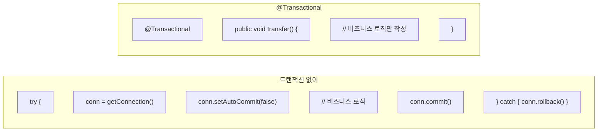
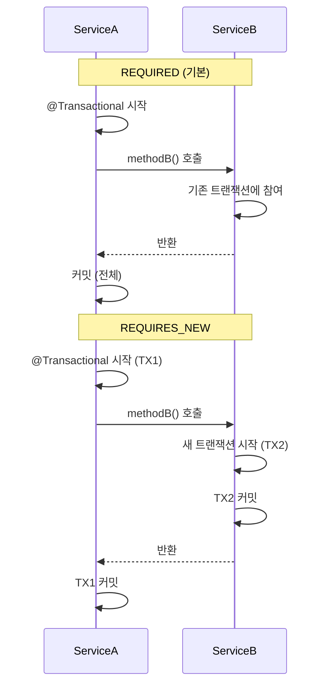

# 💳 Spring Transaction: 트랜잭션 관리의 핵심

> **이 문서의 목표:** @Transactional의 **전파 레벨**과 **격리 수준**을 이해하고, 실무에서 발생하는 트랜잭션 관련 문제를 **원리에 기반하여 해결**할 수 있는 역량을 기른다.

---

## 0. 핵심 질문으로 시작하기

1. **트랜잭션의 ACID 속성은?** → 원자성, 일관성, 격리성, 지속성
2. **@Transactional의 전파 레벨은?** → REQUIRED, REQUIRES_NEW, NESTED 등
3. **격리 수준(Isolation Level)의 종류는?** → READ_UNCOMMITTED ~ SERIALIZABLE
4. **@Transactional이 동작하지 않는 경우는?** → 내부 호출, private 메서드, 예외 처리

---

## 1. 트랜잭션 기초: 왜 필요한가? (Why)

### 1.1 ACID 속성

| 속성 | 설명 | 예시 |
|:---:|:---|:---|
| **Atomicity (원자성)** | 모두 성공하거나 모두 실패 | 송금: 출금+입금 둘 다 성공해야 함 |
| **Consistency (일관성)** | 트랜잭션 전후 데이터 무결성 유지 | 계좌 잔액은 음수가 될 수 없음 |
| **Isolation (격리성)** | 동시 트랜잭션 간 간섭 방지 | 동시 조회 시 일관된 데이터 |
| **Durability (지속성)** | 커밋된 데이터는 영구 저장 | 시스템 장애 후에도 데이터 보존 |

### 1.2 Spring에서 트랜잭션 관리



> [!NOTE]
> **핵심 통찰:** Spring AOP가 트랜잭션 시작/커밋/롤백을 프록시로 처리하여 비즈니스 로직에 집중할 수 있습니다.

---

## 2. @Transactional 전파 레벨: 어떻게 동작하는가? (How)

### 2.1 전파 레벨 (Propagation)

| 전파 레벨 | 동작 | 사용 시기 |
|:---|:---|:---|
| **REQUIRED** (기본) | 기존 트랜잭션 있으면 참여, 없으면 새로 생성 | 대부분의 경우 |
| **REQUIRES_NEW** | 항상 새 트랜잭션 생성 (기존 일시 중지) | 독립적인 커밋 필요 시 (로깅) |
| **NESTED** | 중첩 트랜잭션 생성 (Savepoint) | 부분 롤백 필요 시 |
| **SUPPORTS** | 기존 트랜잭션 있으면 참여, 없으면 없이 실행 | 조회 전용 |
| **NOT_SUPPORTED** | 트랜잭션 없이 실행 (기존 일시 중지) | 트랜잭션 불필요 시 |
| **MANDATORY** | 기존 트랜잭션 필수, 없으면 예외 | 반드시 트랜잭션 내 실행 |
| **NEVER** | 트랜잭션 없어야 함, 있으면 예외 | 트랜잭션 금지 |

### 2.2 전파 레벨 시각화



### 2.3 실전 예시

```java
@Service
@RequiredArgsConstructor
public class OrderService {
    
    private final PaymentService paymentService;
    private final LogService logService;
    
    @Transactional
    public void processOrder(Order order) {
        // 1. 주문 저장 (메인 트랜잭션)
        orderRepository.save(order);
        
        // 2. 결제 처리 (메인 트랜잭션에 참여)
        paymentService.process(order);  // REQUIRED
        
        // 3. 로그 저장 (별도 트랜잭션 - 실패해도 주문은 유지)
        logService.saveLog(order);  // REQUIRES_NEW
    }
}

@Service
public class LogService {
    
    @Transactional(propagation = Propagation.REQUIRES_NEW)
    public void saveLog(Order order) {
        // 별도 트랜잭션으로 실행
        // 실패해도 메인 트랜잭션에 영향 없음
        logRepository.save(new OrderLog(order));
    }
}
```

---

## 3. 격리 수준 (Isolation Level)

### 3.1 격리 수준별 특징

| 격리 수준 | Dirty Read | Non-Repeatable Read | Phantom Read | 성능 |
|:---|:---:|:---:|:---:|:---:|
| **READ_UNCOMMITTED** | ⭕ 발생 | ⭕ 발생 | ⭕ 발생 | 최고 |
| **READ_COMMITTED** | ❌ 방지 | ⭕ 발생 | ⭕ 발생 | 높음 |
| **REPEATABLE_READ** | ❌ 방지 | ❌ 방지 | ⭕ 발생 | 중간 |
| **SERIALIZABLE** | ❌ 방지 | ❌ 방지 | ❌ 방지 | 낮음 |

### 3.2 문제 상황 설명

```java
// Dirty Read: 커밋되지 않은 데이터 읽기
// TX1: UPDATE balance = 0 (아직 커밋 안 함)
// TX2: SELECT balance → 0 반환 (잘못된 값!)
// TX1: ROLLBACK → balance는 원래 값

// Non-Repeatable Read: 같은 쿼리, 다른 결과
// TX1: SELECT balance → 1000
// TX2: UPDATE balance = 500, COMMIT
// TX1: SELECT balance → 500 (값이 바뀜!)

// Phantom Read: 새로운 행 등장
// TX1: SELECT COUNT(*) WHERE status='ACTIVE' → 10
// TX2: INSERT status='ACTIVE', COMMIT
// TX1: SELECT COUNT(*) WHERE status='ACTIVE' → 11 (행 추가!)
```

### 3.3 설정 방법

```java
@Service
public class AccountService {
    
    // 기본값 (DB 기본 격리 수준 사용)
    @Transactional
    public void transfer() { }
    
    // 명시적 격리 수준 설정
    @Transactional(isolation = Isolation.REPEATABLE_READ)
    public BigDecimal getBalance(Long accountId) {
        // 같은 트랜잭션 내에서 일관된 조회 보장
        return accountRepository.findBalance(accountId);
    }
    
    // 읽기 전용 + 격리 수준
    @Transactional(readOnly = true, isolation = Isolation.READ_COMMITTED)
    public Account findAccount(Long id) {
        return accountRepository.findById(id).orElseThrow();
    }
}
```

> [!TIP]
> **실무 권장:**
> - 대부분의 경우 DB 기본값 사용 (MySQL: REPEATABLE_READ)
> - 특별한 요구사항이 있을 때만 명시적 설정

---

## 4. @Transactional 주의사항: 실전 코드 (What)

### 4.1 동작하지 않는 경우

```java
@Service
public class OrderService {
    
    // ❌ Case 1: 내부 호출 (프록시 우회)
    public void process() {
        internalMethod();  // 트랜잭션 적용 안 됨!
    }
    
    @Transactional
    public void internalMethod() {
        // 내부 호출이라 AOP 프록시를 거치지 않음
    }
    
    // ❌ Case 2: private 메서드
    @Transactional  // 무시됨
    private void privateMethod() { }
    
    // ❌ Case 3: Checked Exception (기본 롤백 안 됨)
    @Transactional
    public void checkedExceptionMethod() throws IOException {
        throw new IOException();  // 롤백 안 됨!
    }
    
    // ✅ 해결: rollbackFor 명시
    @Transactional(rollbackFor = Exception.class)
    public void fixedMethod() throws IOException {
        throw new IOException();  // 롤백됨
    }
}
```

### 4.2 내부 호출 해결 방법

```java
// 해결 1: 별도 Bean으로 분리
@Service
@RequiredArgsConstructor
public class OrderService {
    
    private final OrderTransactionService txService;
    
    public void process() {
        txService.internalMethod();  // 프록시 통해 호출
    }
}

@Service
public class OrderTransactionService {
    
    @Transactional
    public void internalMethod() {
        // 트랜잭션 적용됨
    }
}

// 해결 2: Self Injection (비권장)
@Service
public class OrderService {
    
    @Autowired
    private OrderService self;  // 프록시 주입
    
    public void process() {
        self.internalMethod();  // 프록시 통해 호출
    }
    
    @Transactional
    public void internalMethod() { }
}
```

### 4.3 롤백 규칙

```java
@Service
public class PaymentService {
    
    // 기본: RuntimeException만 롤백
    @Transactional
    public void defaultRollback() {
        throw new RuntimeException();  // 롤백 O
        throw new IOException();       // 롤백 X (Checked)
    }
    
    // 모든 예외 롤백
    @Transactional(rollbackFor = Exception.class)
    public void rollbackAll() throws Exception {
        throw new IOException();  // 롤백 O
    }
    
    // 특정 예외는 롤백 제외
    @Transactional(noRollbackFor = BusinessException.class)
    public void selectiveRollback() {
        throw new BusinessException();  // 롤백 X (커밋됨)
    }
}
```

---

## 5. 테스트에서의 @Transactional

```java
@SpringBootTest
@Transactional  // 각 테스트 후 자동 롤백
class OrderServiceTest {
    
    @Autowired
    private OrderService orderService;
    
    @Test
    void createOrder_Success() {
        // given
        OrderRequest request = new OrderRequest("item", 1000);
        
        // when
        Order order = orderService.createOrder(request);
        
        // then
        assertThat(order.getId()).isNotNull();
        // 테스트 종료 후 자동 롤백
    }
    
    @Test
    @Rollback(false)  // 롤백 비활성화 (데이터 확인용)
    void createOrder_WithoutRollback() {
        // 테스트 후에도 데이터 유지
    }
}
```

> [!WARNING]
> **테스트 @Transactional 주의:**
> - 프로덕션과 다른 트랜잭션 경계 형성
> - REQUIRES_NEW 테스트 시 실제 커밋됨
> - 실제 환경과 다르게 동작할 수 있음

---

## 6. 🎯 1분 요약

1. **ACID**: 원자성, 일관성, 격리성, 지속성
2. **전파 레벨**: REQUIRED(기본), REQUIRES_NEW(독립 커밋), NESTED(부분 롤백)
3. **격리 수준**: READ_UNCOMMITTED ~ SERIALIZABLE (높을수록 안전, 성능 저하)
4. **주의사항**: 내부 호출 불가, private 불가, Checked Exception 롤백 안 됨
5. **롤백 규칙**: RuntimeException만 기본 롤백, rollbackFor로 확장

---

## 7. 📝 자가 점검 질문

1. **REQUIRED와 REQUIRES_NEW의 차이는?**
   → REQUIRED: 기존 트랜잭션 참여 / REQUIRES_NEW: 항상 새 트랜잭션 (기존 일시 중지)

2. **@Transactional이 내부 호출에서 동작하지 않는 이유는?**
   → 프록시 기반 AOP라서 내부 호출은 프록시를 거치지 않음

3. **Checked Exception이 기본적으로 롤백되지 않는 이유는?**
   → Spring 설계 철학: Checked Exception은 복구 가능한 예외로 간주

4. **REPEATABLE_READ에서 Phantom Read가 발생하는 이유는?**
   → 기존 행의 변경은 방지하지만, 새 행 삽입은 방지하지 못함

5. **readOnly = true 설정의 효과는?**
   → Dirty Checking 비활성화, 성능 향상, 읽기 전용 DB 연결 사용 가능
