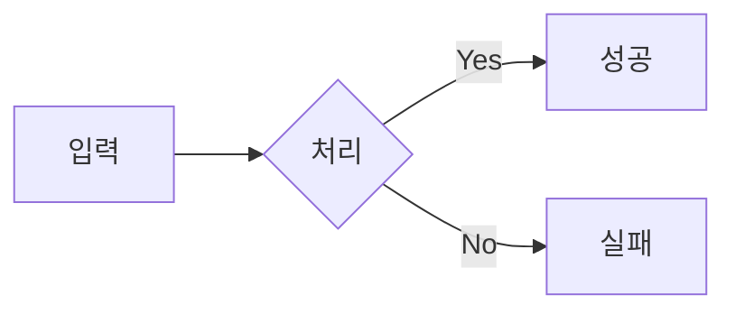

# 📝 학습 노트 작성 가이드 및 템플릿 (TEMPLATE_GUIDE)

이 문서는 프로젝트 내의 모든 Markdown 학습 노트가 따라야 할 공통 양식과 스타일 가이드를 정의합니다. 
일관된 구조는 가독성을 높이고 학습 효율을 극대화합니다.

---

## 1. 파일 명명 및 구조 규칙

1. **파일/폴더명**: 모두 소문자와 하이픈(`-`)을 사용합니다. (kebab-case)
   - 예: `virtual-memory.md`, `01-os/memory-stack-heap/`
2. **README 활용**: 주제가 깊어 하위 파일이 필요하다면 폴더를 만들고 `README.md`를 메인 문서로 둡니다.
3. **이미지**: 외부에 의존하지 않고 Mermaid 다이어그램 사용을 권장합니다.

## 2. 문서 구조 (필수 섹션)

모든 학습 노트는 아래 순서와 섹션을 반드시 포함해야 합니다.

### 2.1 제목 (H1)
- 형식: `# [이모지] [주제]: [부제/슬로건]`
- 예: `# 🔒 HTTPS 완벽 이해: 외우지 말고 원리를 파악하자`

### 2.2 목표 (Intro Blockquote)
- 문서 시작 직후 인용구(`>`)를 사용하여 이 문서를 읽어야 하는 이유와 목표를 명시합니다.

### 2.3 섹션 0: 핵심 질문 (H2)
- 독자가 이 문서를 읽고 답할 수 있어야 하는 핵심 질문 3~4가지를 던집니다.

### 2.4 본문 (H2 ~)
- **개념(Why)** → **원리(How)** → **실전(What/Code)** 흐름으로 작성합니다.
- 긴 줄글보다는 **다이어그램(Mermaid)**, **비교표**, **코드 블록**을 적극 활용합니다.
- 중요한 주의사항이나 팁은 GitHub Alert 문법(`> [!NOTE]`)을 사용합니다.

### 2.5 요약 (H2)
- "1분 요약", "핵심 요약" 등의 제목으로 내용을 압축합니다.

### 2.6 자가 점검 질문 (H2)
- 면접 대비용 질문이나 개념 확인 문제를 3~5개 포함합니다.

---

## 3. 스타일 가이드

### 3.1 GitHub Alert 문법 활용
중요한 내용을 강조할 때 다음 문법을 사용하세요.

```markdown
> [!NOTE]
> 일반적인 참고 사항이나 부연 설명

> [!TIP]
> 실전 팁이나 유용한 트릭

> [!IMPORTANT]
> 핵심 개념이나 반드시 기억해야 할 내용

> [!WARNING]
> 주의해야 할 점이나 흔한 실수

> [!CAUTION]
> 치명적인 오류나 보안 위험
```

### 3.2 다이어그램 (Mermaid)
복잡한 개념은 반드시 시각화합니다.
- 흐름도: `flowchart LR` / `TD`
- 시퀀스: `sequenceDiagram`
- 상태도: `stateDiagram-v2`

### 3.3 코드 블록
반드시 언어를 명시합니다. (`java`, `python`, `go`, `bash` 등)

---

## 4. 복사해서 사용하는 템플릿 (Copy & Paste)

아래 내용을 복사하여 새 `.md` 파일을 시작하세요.

```markdown
# 💡 [주제]: [부제 - 한 문장으로 핵심 요약]

> **이 문서의 목표:** [이 주제]를 단순 암기가 아니라, **[핵심 원리]**를 이해하고 실무에서 **[어떻게 활용하는지]** 파악한다.

---

## 0. 핵심 질문으로 시작하기

1. **[질문 1]**? → [핵심 답변 키워드]
2. **[질문 2]**? → [핵심 답변 키워드]
3. **[질문 3]**? → [핵심 답변 키워드]

---

## 1. [개념 정의]: 왜 필요한가? (Why)

[이 기술/개념]이 등장하게 된 배경이나 해결하려는 문제를 설명합니다.

> [!NOTE]
> **핵심 통찰:** 기존 방식의 문제점은 무엇이고, 이 기술이 그것을 어떻게 해결하는지 설명합니다.

---

## 2. [원리/구조]: 어떻게 동작하는가? (How)

### 2.1 구조도 (Architecture)



### 2.2 [핵심 메커니즘]

글로만 설명하지 말고 도표나 예시를 듭니다.

| 특징 | [기술 A] | [기술 B] |
|:---:|:---:|:---:|
| **장점** | ... | ... |
| **단점** | ... | ... |

---

## 3. [실전/구현]: 코드로 보는 예시 (What)

실제 코드나 설정 예시를 보여줍니다.

```java
// 코드 예시
public void example() {
    // 핵심 로직 주석 필수
}
```

> [!WARNING]
> **흔한 실수:** 실무에서 자주 범하는 실수나 주의사항을 언급합니다.

---

## 4. 🎯 1분 요약

1. **[키워드 1]**: [설명]
2. **[키워드 2]**: [설명]
3. **[결론]**: [한 줄 요약]

---

## 5. 📝 자가 점검 질문

1. **[질문 1]?**
   → [답변]
2. **[질문 2]?**
   → [답변]
3. **[질문 3]?**
   → [답변]
```
