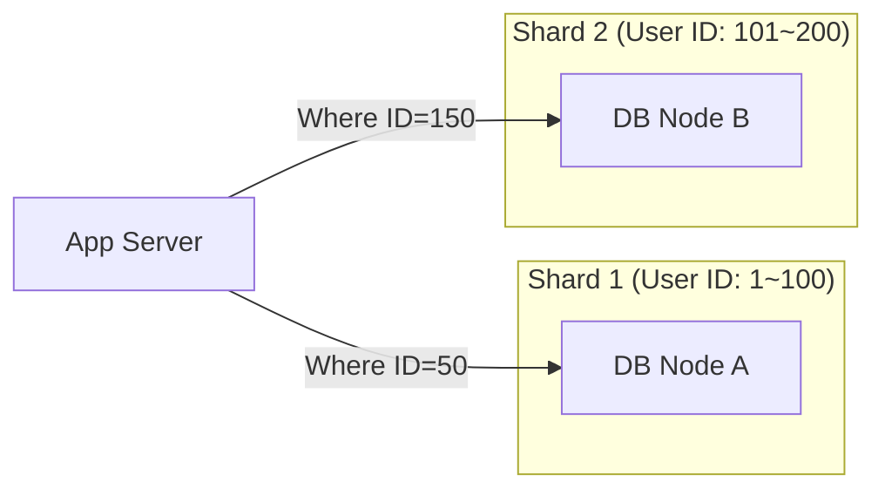

# 데이터베이스 확장 전략: Replication, Sharding, 그리고 CAP 이론

## 1. 핵심 요약 (Executive Summary)

데이터베이스 성능을 높이는 방법은 비싼 장비로 바꾸는 **Scale-up(수직 확장)**과, 여러 대의 장비로 나누는 **Scale-out(수평 확장)**이 있다. 비용과 물리적 한계로 인해 결국 Scale-out을 선택해야 하며, 이때 **읽기 분산은 Replication**, **쓰기 분산은 Sharding**을 사용한다.

> **결론:**
> 1. 대부분의 웹 서비스는 읽기(Read)가 쓰기(Write)보다 8:2 비율로 많다.  **Replication** 먼저 도입.
> 2. 데이터가 너무 많아 한 대에 저장이 안 되거나 쓰기 트래픽이 감당 안 될 때  **Sharding** 도입 (최후의 수단).
> 3. 이 모든 분산 환경에서는 **일관성(Consistency)**과 **가용성(Availability)**을 동시에 100% 만족할 수 없다 (**CAP 이론**).
> 
> 

---

## 2. 읽기 성능 해결: Replication (복제)

가장 보편적인 확장 방식이다. **Master**는 쓰기 전용, **Slave**는 읽기 전용으로 역할을 나눈다.

### 2.1 아키텍처 다이어그램

```mermaid
graph TD
    User[App Server]
    
    subgraph "DB Cluster"
        Master[👑 Master DB <br/> (Write Only)]
        Slave1[Slave DB 1 <br/> (Read Only)]
        Slave2[Slave DB 2 <br/> (Read Only)]
    end
    
    User -- "INSERT / UPDATE / DELETE" --> Master
    User -- "SELECT (Load Balanced)" --> Slave1
    User -- "SELECT (Load Balanced)" --> Slave2
    
    Master -- "Async Replication (Binlog)" --> Slave1
    Master -- "Async Replication (Binlog)" --> Slave2
    
    style Master fill:#ffcc80,stroke:#ef6c00
    style Slave1 fill:#e1f5fe,stroke:#0277bd
    style Slave2 fill:#e1f5fe,stroke:#0277bd

```

### 2.2 핵심 원리 및 문제점

* **원리:** Master에 데이터가 변경되면, 로그(Binlog)를 Slave에 전달하여 똑같이 반영(Replay)한다.
* **Replication Lag (지연):** Master에 썼는데, Slave에 아직 복제되지 않은 찰나의 순간에 조회를 하면 **"방금 쓴 글이 안 보이는"** 정합성 문제가 발생한다.

---

## 3. 쓰기 성능 해결: Sharding (샤딩)

Replication을 해도 Master(쓰기)는 한 대뿐이다. 쓰기 트래픽이 폭주하면 데이터를 여러 DB에 쪼개서 저장해야 한다. 이를 **수평 분할(Horizontal Partitioning)**이라 한다.

### 3.1 샤딩 전략 (Sharding Strategy)

데이터를 나누는 기준(**Shard Key**)이 성능을 좌우한다.

| 방식 | 설명 | 장점 | 단점 |
| --- | --- | --- | --- |
| **Range Sharding** | 숫자의 범위로 나눔 (User ID 1~1000, 1001~2000) | 구현이 쉽고 범위 조회에 유리 | 특정 구간(최신 유저)에 트래픽이 몰리는 **Hot Spot** 발생 |
| **Hash Sharding** | `Hash(ID) % 서버수`로 나눔 | 데이터가 균등하게 분산됨 (Hot Spot 방지) | 서버를 추가/삭제할 때 대대적인 데이터 재배치(Resharding) 필요 |
| **Directory Sharding** | 별도의 조회 테이블(Lookup Table) 사용 | 샤드 위치를 동적으로 변경 가능 | 조회 테이블 자체가 단일 장애점(SPOF)이 될 수 있음 |

### 3.2 아키텍처 다이어그램



---

## 4. 이론적 한계: CAP 이론

분산 데이터베이스 시스템을 구축할 때 마주하는 3가지 속성 중, **현실적으로 2가지만 선택**할 수 있다는 이론이다.

### 4.1 구성 요소

1. **Consistency (일관성):** 모든 노드가 동시에 같은 데이터를 보여주는가? (어느 DB를 찔러도 최신 데이터인가?)
2. **Availability (가용성):** 일부 노드가 죽어도 응답을 받을 수 있는가? (에러 없이 항상 성공하는가?)
3. **Partition Tolerance (분할 내성):** 네트워크 단절로 노드 간 통신이 끊겨도 시스템이 동작하는가?

### 4.2 선택의 기로 (PACELC)

네트워크 장애(P)는 언제든 발생하므로 무조건 안고 가야 한다. 결국 **CP vs AP**의 싸움이다.

| 선택 | 특징 | 사용 사례 | 대표 기술 |
| --- | --- | --- | --- |
| **CP System** | **일관성 우선.** 노드 간 동기화가 깨지면 차라리 에러를 뱉거나 쓰기를 막음. | 은행, 결제, 재고 관리 | Redis, HBase, MongoDB |
| **AP System** | **가용성 우선.** 동기화가 늦어져서 옛날 데이터를 주더라도 일단 응답함. | SNS 피드, 좋아요 수 | Cassandra, DynamoDB |

---

## 5. 전문가적 조언 (Pro Tip)

### 5.1 샤딩은 최후의 수단이다 (Do not Shard Prematurely)

샤딩을 도입하는 순간 시스템 복잡도는 10배 이상 증가합니다.

* **Join 불가:** 서로 다른 샤드에 있는 테이블끼리는 JOIN 연산이 불가능합니다. 앱 레벨에서 데이터를 각각 가져와서 조립해야 합니다.
* **트랜잭션 분산:** Global Transaction(2PC)을 써야 하는데 매우 느리고 실패 확률이 높습니다.
* **조언:** 인덱스 최적화  캐시(Redis) 도입  Replication  그래도 안 되면 그때 샤딩을 고려하십시오.

### 5.2 전역 유일 ID (Global Unique ID)

샤딩 환경에서는 DB의 `Auto Increment`를 사용할 수 없습니다(각 샤드에서 1번이 중복 생성됨).

* **해결책:** 전역적으로 유니크한 ID 생성 전략이 필요합니다.
* **Twitter Snowflake:** 시간+노드ID+시퀀스를 조합해 64비트 정수 ID 생성.
* **UUID:** 유니크하지만 너무 길고 정렬이 안 되어 인덱스 성능에 나쁨. (v7 사용 권장)


### 5.3 CQRS 패턴 (Command Query Responsibility Segregation)

Replication 구조를 앱 레벨에서 세련되게 구현하는 패턴입니다.

* **Command (쓰기):** Master DB로 연결하여 데이터 변경.
* **Query (읽기):** Slave DB로 연결하여 데이터 조회.
* 이를 코드 레벨(Java/Spring 등)에서 어노테이션 등으로 분리하여 관리하는 것이 표준입니다.
